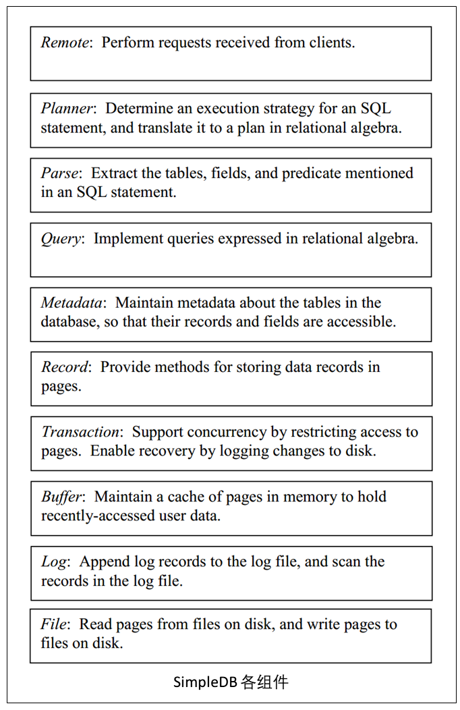

# 1. Overview
This is a simple relational database(named simpleDB) implementation using Java. And this project is a playgorund-level database implementation in the book "Database Design And Implementation" written by Edward Sciore,Boston College.

JUST for educational use, I will follow the author to implemente the simpleDB. I have commented my code in Chinese for convenient reading. But you also need to take a look about this book which is really helpful and easy to understand.

这是一个简单的关系数据库（名为simpleDB）实现，Java语言实现，这是《Database Design And Implementation》作者Edward Sciore在书中提供的一个游乐场级别的数据库实现。 为了方便学习使用，我会跟随作者的脚步去实现这个数据库，并且尝试翻译我所学习的部分。为方便大家阅读代码，我已经将代码中的部分注释修改为中文，但仍然建议配合原书一起使用。

## 2. 整体架构

SimpleDB的整体架构如下图所示，下层组件为上层组件提供服务：

## 3. 特点

### 3.1 磁盘和文件管理
- 将文件块作为磁盘访问的最基本单元，缩短磁盘访问时间。
- 文件块中当前只支持int和string类型的读写。

### 3.2 内存管理
- 通过维护缓冲池来固定最常使用的用户数据块，目前支持Naive缓冲页替换算法。

### 3.3 事务管理
- 支持日志来恢复数据库，采用的是undo-only恢复算法。
- 运用xlock和slock来控制多事务对块的并发访问。
- 事务对锁一直持有，直到事务commit或rollback。

