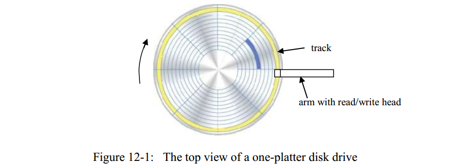
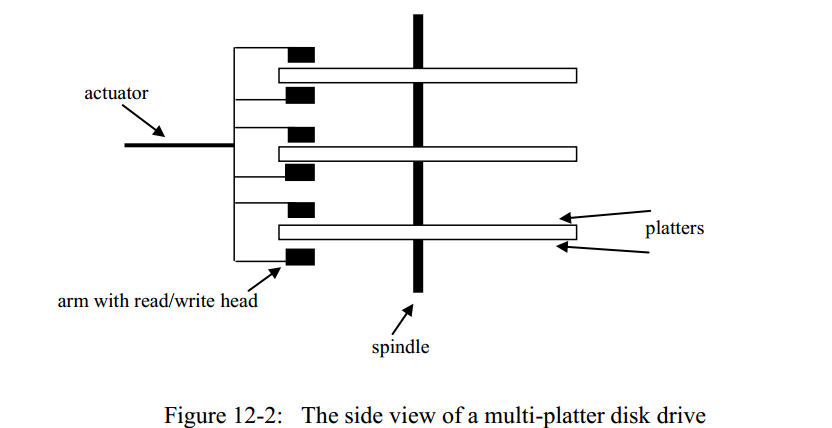
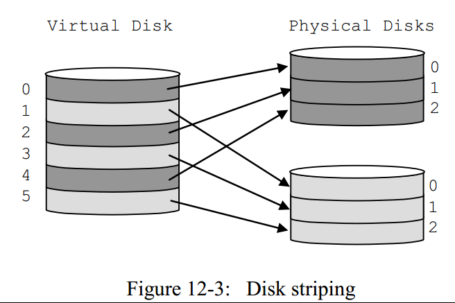
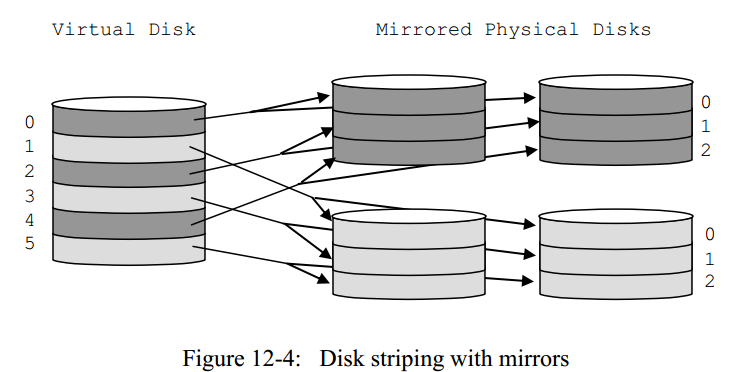
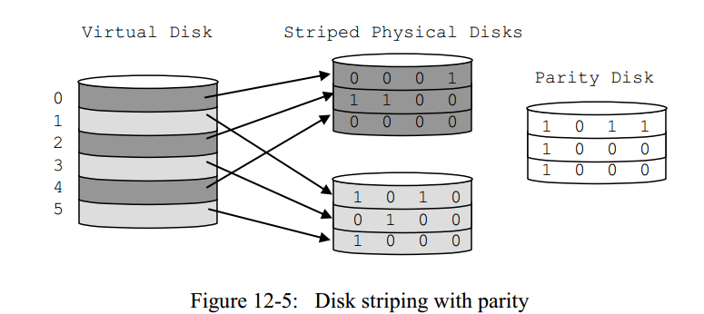
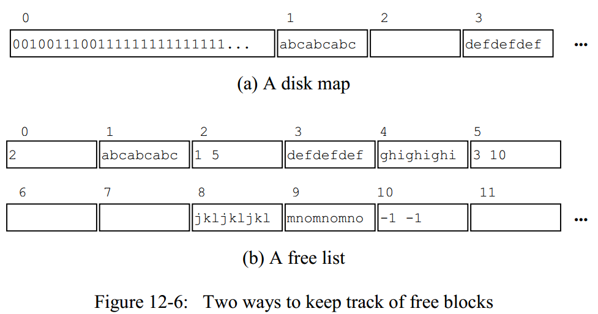
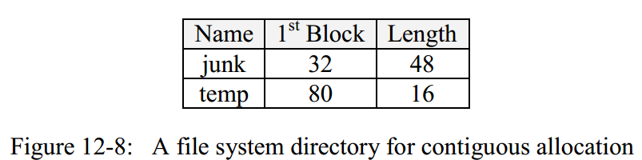
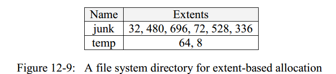
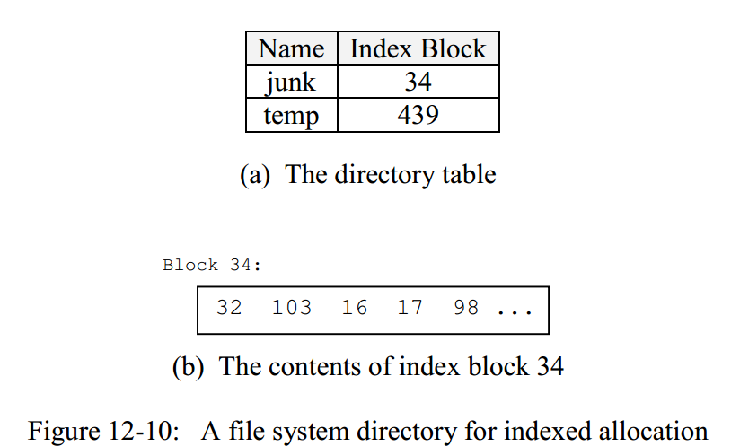

# 第12章 磁盘和文件管理以及`simple.file`包的实现

在本章中，我们研究数据库系统如何将其数据存储在磁盘和闪存驱动器等物理设备上。 我们研究了这些设备的属性，并考虑了可以提高其速度和可靠性的技术（例如RAID）。 我们还将研究操作系统提供的用于与这些设备进行交互的两种接口（块级接口和文件级接口），并讨论哪种接口最适合数据库系统。 最后，我们详细研究`SimpleDB`的文件管理器，研究其API及其实现。

## 12.1 持久化数据存储

数据库的内容必须保持持久性，以便在数据库系统或计算机出现故障时不会丢失数据。本节研究了两种特别有用的硬件技术：`磁盘驱动器(disk drives)`和`闪存驱动器(flash drives)`。

> 磁盘驱动器和闪存驱动器是最常用的持久化存储设备。

闪存驱动器没有磁盘驱动器运用的那么广泛。但是，随着技术的成熟，它们的重要性将会提高。我们从磁盘驱动器开始，然后再考虑闪存驱动器。

### 12.1.1 磁盘驱动器

磁盘驱动器包含一个或多个可旋转的`盘片（platter）`。盘片具有很多同心`磁道（tracks）`，每个磁道由一系列字节组成。通过带有读/写头的可移动磁臂从盘片中读取字节（或者将字节写入盘片）。当磁臂移动至所需的磁道上时，磁头可以读取（或写入）它旋转时位于在其下方的字节。图12-1描绘了一个单盘片驱动器的俯视图。当然，该图不是按比例绘制的，因为典型的盘片具有成千上万的磁道。



现代的磁盘驱动器通常都会有很多盘片，为了空间效率考虑，通常都会将成对的盘片背对背地连接在一起，形成看起来像双面盘片的样子；但从概念上讲，盘片的任一面应该是一个单独的盘片，每个盘片都有自己的读/写头，这些磁头理应是独立移动的；但实际上，它们都连接到一个`致动器（actuator）`，该致动器将它们同时移动到每个盘片上的同一磁道上， 而且，所有磁道中一次只能有一个读/写头处于激活状态，因为到计算机的数据路径（datapath）只有一个。图12-2描绘了多磁盘驱动器的侧视图。



我们现在考虑如何表征一个磁盘驱动器的性能。

> 一个磁盘驱动器的大体上的性能可以通过下面几个量来表示：它的`容量(capacity)`，`转速(rotation speed)`，`传输速率(transfer rate)`和`平均寻道时间(average seek time)`。

驱动器的`容量(capacity)`是可以存储的字节数。该值取决于盘片的数量，每个盘片的磁道数以及每个磁道的字节数。鉴于当前盘片或多或少的尺寸标准，很多磁盘制造商主要通过增加磁盘的的密度来增加磁盘的容量，即将更多的磁道集成在一个盘片上，并且让每个磁道存储更多的字节。现在容量超过40GB的盘片很常见。

`转速(rotation speed)`是盘片旋转的速率，通常表示为每分钟旋转的圈数。典型速度范围为5400rpm至15000rpm不等。

`传输速率(transfer rate)`指的是字节通过磁盘头的读写，从而被传输到内存的速率。例如，整个磁道的字节可以在盘片旋转一周的时间内传输完成，因此，传输速率由盘片的旋转速度和每个磁道上的的字节数共同决定。常见的速率为100MB/秒。

`寻道时间(seek time)`是制动器将磁盘的磁头从当前位置移动到所需轨道所花费的时间。
这个值取决于需要移动多少个磁道，最低可以低至0（如果目标磁道与起始磁道相同），最高可达15-20毫秒（如果目标磁道和起始磁道刚好在一个盘片的最外侧和最内侧）。平均寻道时间通常是对制动器移动速度的合理估计。现代磁盘的平均寻道时间约为5毫秒。

考虑下面的例子：

> 一个拥有4个盘片，转速为10000rpm，且平均寻道时间为5ms的磁盘。每个盘片有10000个磁道，每个磁道上包含50万个字节，我们可以进行以下计算：
磁盘的容量为： 5 x 10^5 字节/磁道 x 10^4磁道/盘片 x 4盘片/磁盘 = 20 x 10^9 字节 （20 GB）
磁盘的传输速率为： 5 x 10^5 字节/转 x 10^4 转/60s = 8.3 x 10^7字节/秒 （83兆字节/秒）

### 12.1.2 访问磁盘驱动器
一次`磁盘访问（disk access）`指的是一次从磁盘到内存的读请求或者内存到磁盘的写请求。这些字节必须在某个盘片的某些磁道上的连续区域。

磁盘驱动器按照以下3个步骤执行一次磁盘访问：
- 首先将磁头移到目标磁道，如图前文所说，这个时间叫寻道时间。
- 再等待盘片旋转，直到磁头下对应的字节为我们期望的的首字节，这个时间被叫做`旋转延时(rotational delay)`
- 盘片继续旋转，磁头不断地将字节读取（或者写入到磁道上），直到最后一个字节。整个这个过程的用时被称为`传输用时(transfer time)`。

> 执行一次磁盘访问的总用时为寻道时间，旋转延时和传输用时的总和。

注意，上述的这些时间都是受到磁盘机械运动(mechanical movement)的限制的，而机械运动又显然比电运动(electrical movement)慢很多,这也是为什么磁盘驱动器会比RAM慢很多的原因。寻道时间和旋转延时特别烦人，它们只不过就是每次磁盘操作前必须等待的时间罢了。

计算一次磁盘访问的准确寻道时间和旋转延时是不实际的，因为它需要知道磁盘的当前状态，相反，我们可以通过使用它们的平均值来估计这些时间。我们已经知道平均寻道时间。 平均旋转延时也很容易计算，旋转延时可以低至0（如果第一个字节恰好位于当前磁头下方），以及高达一次完整的旋转用时（即第一个字节刚刚已经错过了磁头），平均而言，我们将不得不等待1/2次旋转用时，直到盘片旋转到在我们想要的磁道位置，因此，平均旋转延时是旋转时间的一半。

传输用时也可以很容易通过传输速率计算得到，举例来说，如果一个磁盘的传输速率为$$b_1 B/s$$,我们需要传输$$b_2 B$$，则传输时间为$$b_2/b_1 $$秒

继续我们之前的例子，我们可以估计一次磁盘访问的耗时如下：

> 考虑一个10000rpm的磁盘，平均寻道时间为5毫秒，传输速率为83Mb/s
平均旋转延时为： 60 s/min x 1 min/10000 转 x 0.5转= 3 ms
传输1字节用时为： 1 B x 1s/83M B = 1.2 x 10^-5 ms 
传输1000字节用时为： 1000  x 1.2 x 10^-5 ms = 1.2 x 10^-2
1字节的一次磁盘访问估计用时为：5ms（寻道时间） + 3ms（平均旋转延时）+  1.2 x 10^-5 ms （传输用时） = 8.000012 ms
1000字节的一次磁盘访问估计用时为：5ms（寻道时间） + 3ms（平均旋转延时）+  1.2 x 10^-2 ms （传输用时） = 8.012 ms

可以注意到，传输1000字节和传输1字节的整体估计用时几乎是一样的，也就是说，只访问很少字节对磁盘访问读写时间来说没有影响，实际上，如果你真的只想读一个字节，底层也不会有这样的支持。现代的磁盘都会将一个磁道分成很多的`扇区（sectors）`；一次磁盘的读写必须是以整个扇区为最小操作单位的，具体每个扇区的大小由磁盘制造商来决定，在磁盘出厂时就已经被确定了，一个常见的扇区大小为512字节。

### 12.1.3 改进磁盘访问时间

因为磁盘驱动器很慢，有一些技术已经被提出来改进磁盘访问时间，我们将考虑三种技术：`磁盘缓存(disk cache)`，`扇区（cylinder）`和`磁盘分条（disk striping）`

***磁盘缓存（Disk Cache）***

磁盘缓存是与磁盘驱动器绑定在一起的一块内存区域，该缓存区通常足够大从而存储许多磁道数据。每当磁盘驱动器从磁盘读取一个扇区时，它都会将该扇区的内容保存在其高速缓存中。如果缓存已满，则新扇区将替换旧扇区。当请求扇区时，磁盘驱动器将检查缓存，如果该扇区恰好在高速缓存中，则可以将其立即返回计算机，而无需实际的磁盘访问。

假设一个应用程序在相对较短的时间内多次请求相同的扇区。然后，第一个请求会将扇区带入缓存，随后的请求将从缓存中检索该扇区，从而节省磁盘访问时间。然而，这个功能对数据库系统不是特别重要，因为数据库系统已经以相同的方式进行了缓存（我们将在第13章中看到）。如果多次请求一个扇区，则数据库服务器将在其自己的缓存中找到该扇区，甚至不必费心去磁盘。

以下是为什么磁盘缓存很有价值的真正原因。假设磁盘从不一次性读取单个扇区，磁盘驱动器不只是读取请求的扇区，而是将包含该扇区的整个磁道读取到高速缓存中，且认为在不久的将来，该磁道上的其他扇区也会被请求。关键是，读取整个磁道并不会比读取单个扇区浪费很多时间（和我们上述计算时读取一个字节和读取1000个字节的例子类似）。特别地，这种情况将没有旋转延迟，因为磁盘可以从读/写头下方的任何扇区开始读取磁道，并在整个旋转过程中继续读取。以下是两种访问模式的访问用时对比：

> 读一个扇区的时间：寻道时间 + 1/2 旋转用时 + 磁头读取字节时旋转用时
读一个磁道的时间：寻道时间 +  磁头读取字节时旋转用时

也就是说，读单个扇区比一整个磁道所有扇区的时间大约多了二分之一全的旋转用时，所以假如数据库系统刚好像读磁道上的一个扇区，它会将整个磁道的所有扇区都读入到高速缓存中，以便节省时间。

> 磁盘缓存的真正作用其实就是允许磁盘`预提取（pre-fetch）`磁道上的一些扇区。

***柱面（Cylinder）***

数据系统可以通过预提取扇区附近的相关信息从而减少磁盘访问时间，例如，存储文件的理想方法是将其内容放在盘片的同一磁道上。如果磁盘执行基于磁道的缓存，则此策略显然是最好的，因为整个文件将在一次磁盘访问时间内读取到。但是该策略即使没有缓存也很好，因为它消除了寻道时间——每次读取另一个扇区时，磁头都已经位于正确的磁道上了。（注：一个文件中分散在磁盘不同磁道上的内容被称为碎片。许多操作系统（例如Windows）提供了一种碎片整理实用程序，该实用程序通过重新定位每个文件以使其扇区尽可能连续从而缩短磁盘访问时间。）

假设一个文件的内容分布在多个磁道，一个好的办法是将其内容存储在盘片的附近磁道上，以使得磁道之间的寻道时间尽可能短。但是，一个更好的办法是将其内容存储在其他盘片的同一磁道上。由于每个盘片的读/写头都一起移动，因此可以访问具有相同磁道号的所有磁道而无需任何额外的寻道时间。

具有相同磁道号的一组磁道称为柱面，因为如果你查看这些磁道，它们似乎描述了一个柱面的表面。实际上，可以将柱面视为一整条非常大的轨道，因为其中的所有扇区都可以在零附加寻道时间内访问到。

***磁盘分条（Disk Striping）***

减少磁盘访问时间的另一办法是使用多个磁盘驱动器。
> 假设你想存储40GB的数据库，两个20GB的驱动器总是会比一个40GB的驱动器快。
两个20GB的驱动器总是会比一个40GB的驱动器快的原因是因为它们拥有两个独立的制动器，因此可以同时处理两个不同的扇区读写请求。实际上，如果两个20GB的磁盘都总是繁忙，那么该磁盘的性能将是单个40GB磁盘的两倍。这种性能提升可以很好地扩展：通常来说，N个磁盘的速度约为单个磁盘的N倍。（当然，几个较小的驱动器也比单个较大的驱动器昂贵，因此效率的提高是有代价的。）

多个小型磁盘只有保持繁忙状态才会更有效率。例如，假设一个磁盘包含频繁使用的文件，而另一块磁盘包含很少使用的存档文件。然后，第一个磁盘将完成所有工作，而其他磁盘大部分时间都处于空闲状态。因为几乎没有`同时性(simultaneity)`，所以此设置的效率与单个磁盘几乎相同。

因此，问题在于如何在多个磁盘之间均衡负载。数据库管理员可以尝试分析文件使用情况，以便最佳地在每个磁盘上分发文件，但是这种方法不太现实：很难做到，也很难保证，并且随着时间的推移必须不断进行重新评估和修订。幸运的是，有一种更好的方法，称为`磁盘分条(disk striping)`。磁盘条带化策略使用控制器将较小的磁盘在操作系统的层面予以隐藏，从而给人一种单个大磁盘的错觉。控制器将虚拟磁盘上的扇区请求映射到实际磁盘上的扇区请求。映射如下。假设有$$N$$个小磁盘，每个小磁盘有$$k$$个扇区。虚拟磁盘将具有$$N *k$$个扇区；这些扇区以交替方式分配给实际磁盘的扇区。磁盘0将包含虚拟扇区$$0,N,2N$$等。磁盘1将包含虚拟扇区$$1,N + 1,2N + 1$$等。依此类推。术语`磁盘条带化`来自以下想象：如果你想象每个小磁盘都涂上了一种颜色，则虚拟磁盘看起来像有条纹一样，其各个扇区会被涂上交替的颜色（注：大多数控制器允许用户将条带定义为任意大小，而不仅仅是扇区。例如，如果磁盘驱动器执行的是基于磁道的磁盘缓存，则磁道可以构成良好的条带。最佳条带大小取决于许多因素，并且通常由反复试验确定），如图12-3所示：



磁盘分条是有效的，因为它可以将整个数据库均匀地分布在各小磁盘之间。如果一个随机扇区请求来了，那么该请求将以相同的概率被分发到其中一个小磁盘，而且，如果有几个连续扇区的请求到达，它们将被发送到不同的磁盘。因而，确保了各磁盘尽可能均匀地工作。

### 12.1.4 通过镜像提高磁盘可靠性

数据库用户希望其数据在磁盘上保持安全，并且不会丢失或损坏。不幸的是，磁盘驱动器并不完全可靠。盘片上的磁性材料可能退化，导致扇区变得不可读。或者，灰尘或震动可能会导致读/写磁头刮擦磁盘而损坏受影响的扇区（这被称为`磁头碰撞`）。

防止磁盘故障的最明显的方法是保留磁盘内容的副本。例如，我们可以每晚对磁盘进行一次备份。当磁盘出现故障时，我们只需购买一个新磁盘并将备份复制到该磁盘上。该策略的问题在于，会丢失那些发生在上一次备份之后，且先于故障发生之前的所有的数据更改（译者注：举个例子来说明，例如我们每晚11点进行磁盘备份，某一次，在凌晨1点发生了磁盘故障，我们可以买一个新的磁盘把上一次备份的数据进行拷贝，因为上一次拷贝是昨天晚上11点，如果在昨晚11点到今日凌晨1点间，发生了任何数据修改，我们是无论如何都无法恢复数据的）。解决此问题的唯一方法是在发生更改时将每个更改立马复制到备份磁盘。换句话说，我们需要保留两个相同版本的磁盘。这些两个相同内容的磁盘称为彼此的镜像。

与磁盘分条一样，需要一个控制器来管理两个镜像磁盘。当数据库系统请求读取磁盘时，控制器可以选择访问任一磁盘的指定扇区。当请求写磁盘时，控制器对两个磁盘执行相同的写操作。从理论上讲，这两个磁盘写操作可以并行执行，不需要额外的时间。但是，实际上，顺序写入镜像对防止系统崩溃很重要。问题是，如果系统在磁盘写入的过程中崩溃了，则该扇区的内容将丢失。因此，如果两个镜像并行写入，则扇区的两个副本都可能丢失，而如果依次以顺序的方式写入镜像，则至少有一个镜像不会被损坏。

假设镜像对中的一个磁盘发生故障。 数据库管理员可以通过执行以下过程来恢复系统：
- 停止该系统
- 更换新的磁盘替代失效的磁盘
- 将好的磁盘（也就是镜像磁盘）的内容复制到新磁盘
- 重启系统

不幸的是，此过程并非万无一失。如果在将好的磁盘内容复制到新磁盘的过程中发生故障，则数据仍可能丢失。两个磁盘彼此都在几个小时内发生故障的可能性很小（对于今天的磁盘来说，这个概率大约是6万分之一），但是如果数据库很重要，那么这种小风险仍然可能是无法接受的。我们可以通过使用三个而不是两个镜像磁盘来降低风险。在这种情况下，只有在几个小时内所有三个磁盘都发生故障时，数据才会丢失；尽管非零，但这种可能性非常低，乃至于可以轻松地忽略。

磁盘镜像可以与磁盘分条共存，一个通常的做法是对分条的磁盘进行镜像，例如，一个存储40GB数据的系统可以用四个20GB的磁盘来实现：其中两个20G的磁盘作为分条磁盘，另外两个20GB的磁盘作为条带化磁盘的镜像，这样的配置既快速又可靠，如图12-4所示：



### 12.1.5 通过存储奇偶校验码提高磁盘可靠性

镜像的缺点是它需要两倍的磁盘来存储相同数量的数据。当使用磁盘分条时，这种负担特别明显——如果我们要使用15个20GB驱动器存储300GB数据，那么我们将需要购买另外15个驱动器作为它们的镜像。大型数据库安装通过分条许多小磁盘来创建巨大的虚拟磁盘的情况并不罕见，并且购买相同数量的磁盘作为镜像磁盘的前景并不大。于是如何从故障磁盘中恢复而无需使用太多镜像磁盘将是一个很好的选择。

实际上，的确存在一种很好的办法，它可以使用一个磁盘来备份其他所以的磁盘，这种策略通过存储`奇偶校验码(parity)`来恢复磁盘。一串二进制码S的奇偶校验码定义如下：
- 如果S串中包含奇数个1，则奇偶校验码为1.
- 如果S串中包含偶数个1，则奇偶校验码为0.

也就是说，加上奇偶校验码后，S串和奇偶校验码总共包含的1的数量为偶数个。

奇偶校验具有以下有趣且重要的属性：只要我们也知道奇偶校验，就可以从其他位的值确定任意位的值。 例如，假设$$ S = {1,0,1} $$。S的奇偶校验码则为0，因为它有偶数个1。假设现在我们丢失了第一位的值，因为奇偶校验为0，所以集$${?,0,1}$$必须具有偶数1,因此我们可以推断出丢失的位必须为1,可以对其他每个比特（包括奇偶校验比特）进行类似的推论。

奇偶校验的这种使用扩展到了磁盘。假设我们有$$N + 1$$个相同大小的磁盘。我们选择其中一个磁盘作为奇偶校验磁盘，然后让其他N个磁盘保存带化数据。通过查找所有其他磁盘的相应位的奇偶校验来计算奇偶校验磁盘的每一位。如果任何磁盘发生故障（包括奇偶校验磁盘），则可以通过逐点查看其他磁盘的内容来重建该磁盘内容。请参见图12-5:



这些磁盘被控制器管理，读写请求基本和磁盘分条时相同——控制器决定哪个磁盘上包含了被请求的扇区，然后再执行相应的读/写操作。区别在于在写操作是必须更新对应奇偶校验磁盘上的相应扇区，控制器可以通过查看请求扇区被修改后的二进制位来计算出更新后的奇偶校验码，因此控制器实现一次扇区写操作需要4次磁盘请求：首先它必须读取扇区数据和对应的奇偶校验扇区（目的是计算新的奇偶校验位），然后它也必须将新的内容写到扇区和奇偶校验扇区。

一个磁盘居然能够可靠地备份任意数量的其他磁盘，奇偶校验信息的使用有些神奇。但是，这种魔术带来了两个缺点：

1. 扇区写入操作更加耗时，因为它需要从两个磁盘进行读取和写入。经验表明，使用奇偶校验会使磁盘分条效率降低约20％。
2. 数据库更容易遭受不可恢复的多磁盘故障。我们考虑一下磁盘发生故障时会发生什么情况——重建故障磁盘需要所有其他磁盘，并且其中任何一个磁盘的故障都是灾难性的。如果数据库由很多小磁盘组成（例如100个），那么第二次故障的可能性就非常大。将这种情况与镜像进行对比，我们只需要从发生故障的磁盘中恢复数据时，仅要求其镜像磁盘不发生故障即可，这时同时损坏的可能性是很小的。

### 12.1.6 RAID
我们已经知道了3种使用多磁盘的方法：
- 磁盘分条从而加快磁盘访问时间
- 镜像确保磁盘损坏时恢复数据
- 奇偶校验确保磁盘损坏时恢复数据

上述所有的策略都使用了一个控制器从OS的角度来隐藏实际存在的多磁盘，并且给用户提供了一种幻觉——有一个超大容量的虚拟磁盘。控制器将每次虚拟的磁盘读写操作映射到底层实际的磁盘上，控制器可以以软件或硬件的形式实现，但是大多数的控制器还是以硬件的方式实现的。

这些策略是称为RAID的大量策略的一部分，`RAID（Redundant Array of Inexpensive Disks）`代表廉价磁盘冗余阵列，有七个RAID级别：

- `RAID-0`就是磁盘分条，没有任何防止磁盘故障的措施。如果条化磁盘之一发生故障，则整个数据库可能会被破坏。
- `RAID-1`是镜像的磁盘分条。
- `RAID-2`使用的是位条化而不是扇区条化，并使用基于纠错码而不是奇偶校验的冗余机制。事实证明，此策略难以实施且性能不佳，因此不再使用。
- `RAID-3`和`RAID-4`使用磁盘分条和奇偶校验。它们的区别在于`RAID-3`使用字节条化，而`RAID-4`使用扇区条化。通常，扇区条带化往往更有效，因为它对应于磁盘访问的单位。
- `RAID-5`与`RAID-4`相似，不同之处在于RAID奇偶校验信息不是将所有奇偶校验信息存储在单独的磁盘上，而是分布在数据磁盘之间。也就是说，如果有N个数据磁盘，则每个磁盘的第N个扇区都保存奇偶校验信息。这种策略比RAID-4更有效，因为不再有单个奇偶校验磁盘成为瓶颈。参见练习12.5。
- `RAID-6`与`RAID-5`类似，除了它保留两种奇偶校验信息。因此，此策略能够处理两个并发的磁盘故障，但是需要一个以上的磁盘来保存其他奇偶校验信息.

用的最多的RAID级别就是`RAID-1`和`RAID-5`，这两种选择之间的真正区别就是镜像和奇偶校验位之间的区别。在数据库配置中，镜像往往是更可靠的选择，首先是因为它的速度和鲁棒性，其次是因为额外的磁盘驱动器的成本现在已经很低了。

### 12.1.7 闪存
磁盘驱动器在当前的数据库系统中很常见，但是它们有一个无法克服的缺点——它们的操作完全取决于旋转盘片和制动器的机械活动。与电子存储器相比，这个缺点使磁盘驱动器本来就很慢，并且还容易因失效，振动和其他冲击而损坏。

闪存是一种较新的技术，具有替换磁盘驱动器的潜力。它使用类似于RAM的半导体技术，但不需要不间断提供电源。由于其活动完全是电子的，因此有可能访问数据比磁盘驱动器快得多，并且没有活动部件受到损坏。

闪存驱动器当前的寻道时间约为50us，大约为比磁盘驱动器快100倍。当前闪存驱动器的传输速率取决于它连接到的接口总线。通过快速内部总线连接的闪存驱动器和磁盘驱动器的速度相当；但是，外部USB闪存驱动器比磁盘驱动器的传输慢很多。

不过闪存是会耗尽的。每个字节只能重写一定的次数。达到最大值后，闪存驱动器将发生故障。当前，此最大值大约为数百万，但对于大多数数据库应用程序来说，这是相当高的。高端驱动器采用`耗损均衡（wear-leveling）`的技术，该技术可将频繁写入的字节自动移动到写入较少的位置。此技术允许驱动器运行，直到驱动器上的所有字节达到其重写限制，而不仅仅是第一个字节。

闪存驱动器为操作系统提供了基于扇区访问的接口，这意味着闪存驱动器对于操作系统而言就像磁盘驱动器一样。可以将RAID技术用于闪存驱动器，尽管条化的重要性不高，因为闪存驱动器的寻道时间非常短。

采用闪存驱动器的主要障碍是其价格。目前闪存的价格大约是同类磁盘驱动器价格的100倍。尽管闪存和磁盘技术的价格将继续下降，但最终闪存驱动器将便宜到足以被视为主流。到那时，磁盘驱动器可能会被转移到档案存储和超大型数据库的存储中。

闪存还可以通过用作文件持久化的前端来增强磁盘驱动器。如果数据库完全存在于闪存中，则磁盘驱动器将永远不会被使用。但是，随着数据库变大，不常使用的扇区将迁移到磁盘。

就数据库系统而言，闪存驱动器与磁盘驱动器具有相同的属性：它是持久的，缓慢的，并且可以在扇区中进行访问。（它恰好比磁盘驱动器慢。）因此，我们将遵循当前的术语，并在本书的其余部分中将持久性存储器统称为“磁盘”。

## 12.2 磁盘的块级接口
不同的磁盘拥有多种硬件属性，例如，它们不是必须拥有相同的扇区大小，而且它们的扇区可以以不同的方式组织，操作系统负责隐藏这些不同的细节，并且为用户代码的文件读写提供统一的简单的接口。

`块（block)`的概念就是操作系统接口的核心。

> 一个块和一个扇区类似，不过块的大小是由操作系统来决定的，不同磁盘都拥有同样大小的块。

OS维护了块和扇区之间的映射，OS也会给每个磁盘上的每个扇区赋值一个`块号（block number）`;给定一个块号，操作系统知道实际的扇区地址。

不能直接从磁盘访问块的内容。取而代之的是，必须首先将包含该块的扇区读入`内存页(memory page)`中并从那里进行访问。

> 页是内存中一个和块同样大小的区域。

如果一个客户端想要修改一个块中的内容，他必须将这个块先读到页中，然后修改页中的相应字节，然后再将该页写回到磁盘的相应块中。

一个OS必然会提供几种获取到磁盘块的方法，下面有4个示例方法：
- `readblock(n,p)`：将磁盘第n块的字节读到内存的第p页中
- `writeblock(n,p)`：将内存的第p页的字节写到磁盘第n块中
- `allocate(k,n)`：从第n块开始，寻找连续的k个没被使用过的块，并标记为使用过，返回这连续k块的块首的块号。这个块号应该尽量接近n
- `deallocate(k,n)`：从第n块开始，将它后续的k块标记为未使用过（包括第n块）

OS会知道磁盘上的哪些块可以被分配，哪些不可以。这里大概有2中可以采用的策略：`磁盘映射（disk map）`和`空闲列表（free list）`

- 一个disk map是一串连续的二进制位，每一位对应磁盘的一个块。1代表块是空闲的，0代码块是被分配了的。这个disk map也是被保存在磁盘中的，通常被保存在一个磁盘的初始几个块中。OS可以简单地通过将disk map相应块的二进制位从0置为1从而取消分配该块；亦可以从第n块开始将连续k位二进制位置为0从而分配连续的k个磁盘块，当然前提是这k块是连续的并且之前的相应二进制都是1.
- 一个free list是一连串的`块（chunk）`，（注意，这里说的块和磁盘的块不一样），chunk是连续的未被分配的blocks，也就是说，chunk是比block更大一点的单位，每个chunk的第一个block存储了两个值：当前chunk的长度，以及下一个chunk首块的block number，你可以将chunk理解为一个单链表的结点。磁盘的第一个block包含了一个指向第一个chunk的指针（注：一般这里会用数组链表，如果你忘记了这是什么，可以Google一下）。当OS被调用，请求分配k个连续的块时，它会搜索free lsit从而获取一个足够大的chunk，然后它可以将这个chunk从free list中分配掉，或者中切出长度为k的块分配掉；当OS被请求取消分配一些块的时候，OS简单地将这些块插入到free list中。

上面的文字描述可能不是很清晰，不用担心，图12-6示例了这两种不同的策略，此时磁盘的第0,1,3,4,8,9块都已经被分配出去了。图12-6（a）展示了在磁盘的di0块存储的disk map；0代表一个已经被分配的块。图12-6（b）展示了对应的free list状况，Block 0包含一个值2，代表第一个chunk是从第2个block 开始的；Block 2 包含两个值1和5,1代表当前chunk包含1个block，5代表下一个chunk起始block的块号，类似地，第5个block中的内容表示的意思是当前chunk包含3个block，且下一个chunk从第10个block开始；而block 10 上的-1代表这是最后一个块了，包含剩下的所有blocks了。



free list技术需要最小化的额外空间;我们需要的就是在block 0记录一个整数，用来指向列表中的第一个块。另一方面，disk map技术需要空间来维持map映射，图12-6（a）假定这个map可以装进一个块中。通常来说 然而，需要好几个块来保持这个map信息，详情请参见练习12.6。disk map的一个好处就是可以让OS清楚地知道哪里有一个`洞（hole）`,举例来说，如果操作系统需要一次支持分配多个块，则通常选择磁盘映射（disk map）技术作为策略。

## 12.3 磁盘的文件级接口
OS提供了另一种，高层次的磁盘接口，被叫做`文件系统（file system）`。一个客户端将一个文件看做是一系列字节，在这个级别上，用户不知道块这概念，相反，客户端可以读/写文件任何位置开始的任意长度的字节流。

Java中的`RandomAccessFile`提供了一个典型的文件系统API（译者注：说到这里，我不得不说一下，在很多书中，都会将RAM翻译成随机存取存储器，我觉得这种翻译是不恰当的，也是反中文常识的，我觉得应该翻译成任意存取存储器，对应地，在这里我会翻译成任意访问文件。任意和随机显然是两个不同的概念，不是吗？任意是说，我想读哪里就读哪里，是受客户端控制的；而随机首次会被理解成从任意位置开始读取，是不受控制的概念）。每一个`RandomAccessFile`对象都拥有一个`文件指针（file pointer）`,它指明了下一次文件读写操作时开始的字节位置，这个文件指针可以通过方法`seek()`被显式地赋值，一次`readInt()`或者`writeInt()`的调用将会移动文件指针，移动过的数据就是我们读/写操作的数据。

以下是一个示例代码片段，该片段增加了存储在文件`junk`中第7992至7995处字节的整数（注：Java中一个Int整数占4个字节）。对`readInt()`的调用将读取字节7992处的整数，并将文件指针移至字节7996。随后的seek调用会将文件指针设置回字节7992，以便可以覆盖该位置处的整数。

```Java
RandomAccessFile f = new RandomAccessFile("junk","rws");
f.seek(7992);
int n = readInt();
f.seek(7992);
f.writeInt(n + 1);
f.close();
```
注意，`readInt()`和`writeInt()`的调用视磁盘被直接获取，隐藏了磁盘块需要先被读到内存页中的细节。OS通常为这些页保留一些内存，这些内存页称为`I/O缓冲区(I/O buffer)`。打开文件后，OS会从该池中分配一个页面供文件使用，客户端对此不了解，也不需要了解。

通过向用户隐藏其用到的I/O缓冲区，文件系统将掩盖它与磁盘之间的交互。 例如，从上述代码很难明显的看出，方法`writeInt()`比`readInt()`需要更多的磁盘访问。调用`readInt()`要求操作系统将相应的块读入I/O缓冲区，然后在适当的位置返回该值。但是，对`writeInt()`的调用要求操作系统将块读入缓冲区，修改缓冲区中的某个位置，然后将缓冲区重新写回到磁盘。

一个文件可以被看做是一系列的块。例如，假如一个块的大小为4096字节（即4K）,那么第7992个字节就在block 1中（注意，从0开始计数），像“第1块”这样的引用被称为`逻辑（logical）块引用`，因为它们会告诉我们该块相对于文件的位置，而不是该块在磁盘上的位置。

给定一个特定的文件位置，`seek()`方法会决定底层实际是哪一块包含了该位置。
> seek() 方法执行两次转换：
- 它会将指定的字节位置转换为一个逻辑块引用
- 他会将逻辑块引用转换为一个物理块引用

第一个转化相对来说是很简单的——逻辑块号不过就是指定的字节数除以一个块的块大小，举例来说，假设一个块的大小为4K，那么第7992个字节就在第1个块，因为7992/4K=1（整数除法）。

第二个转化就比较难了，而且依赖于当前操作系统下的文件系统是怎么实现的。我们将会看到3种实现方式：`连续分配（contiguous allocation）`，`基于扩展的分配(extent-based allocation）`和`索引分配(index allocation)`。

***连续分配（contiguous allocation）***

连续分配是最简单的了，它将文件按照连续块的方式存储起来。为了实现连续分配，OS只需要维护每个文件的长度和文件起始块的位置。OS会将这些信息存储在文件系统的目录中，图12-8展示了一个文件系统中包含两个文件的目录：一个长为48个块的名为`junk`的文件，它的起始块为block 32，另一个长为16个块的名为`temp`的文件，它的起始块为block 80.



逻辑块引用到物理块引用的映射很容易——如果文件从block b开始，则文件的第N块位于磁盘的块b + N中。这种简单的实现有两个问题：
1. 如果紧随一个文件其后的是另一个文件，则该文件无法扩展文件。图12-8中的`junk`文件就是这类问题的示例。因此，创建文件时必须使用可能需要的最大块数，文件尚未满时，这会导致浪费空间。 
2. 随着磁盘慢慢变满，它可能会有许多未被分配的小chunk，但又没有大的chunk,因此，即使磁盘有很多的空闲空间，也可能无法创建大文件。

第一个问题被称为`内部碎片问题（internal fragmentation）`,第二个问题被称为`外部碎片问题（external fragmentation）`。

> 内部水平是在文件里面浪费的空间，而外部碎片是指在文件外部浪费的空间，或者说文件之间浪费的空间。

*** 基于扩展的分配(extent-based allocation）***

基于拓展的分配策略是连续内存分配的变种，该策略可以减少内部碎片和外部碎片。在这里，OS将文件固定长度的扩展区序列存储在文件中，其中每个扩展区是一块连续的块。文件一次扩展一个范围。对于每个文件，OS会维护一个列表，列表中的每个元素都是每个扩展区的第一个逻辑块号。

举例来说，假如OS以8块的扩展区为单位存储文件，图12-9表示了一个包含2个文件的文件系统目录，这两个文件名为`junk`和`temp`,这两个文件和之前提到的文件大小相同，但是它们是以扩展的形式被存储的，`junk`文件有6个扩展，`temp`文件有2个扩展。



为了找到磁盘上某文件的第N块，OS会首先搜索文件的扩展列表然后确定哪个扩展包含了这个块，然后再执行相应的计算，考虑下面这样一个例子：
> 假设OS的文件系统中有一个如图12-9所示的目录
 为了找到文件`junk`的第21块：
 包含第21块的扩展为`21/8 = 2`（整数除法）
 该扩展区的首个块号为`2*8 = 16`
 所以第21块是第二个扩展区的第`21-16 = 5`块
 而第二个扩展区的首块对应的实际物理块号为 `L[2] = 696`
 所以第21块在磁盘上的实际位置为 `696+5=701块`

现在考虑一下基于扩展的分配方式是怎么消除内部碎片的（译者注：我个人觉得并没有完全消除内部碎片，只是削弱了内部碎片的大小），是的，正是因为现在一个文件最多可以浪费不超过一个扩展的空间。外部空间一样可以类似地被消除，因为只要存在一个扩展区，那么它就可以被利用起来。

***索引分配（index allocation）***

索引分配采取了一个不同的策略——它甚至不会尝试去给文件开辟连续的chunks，相反，磁盘中的每个block都被单独的分配（如果你想这么理解也可以，这就是扩展长度为1的基于扩展的分配），然后OS为了实现这种策略，会为每个文件维持一个`索引块（index block）`，该索引块中保存了这个文件是由那些块组成。也就是说，你可以把索引块中的内容看作是一个整形的数组，`ib[N]`表示的是第N个逻辑块的实际物理块号。

图12-10（a）表示了一个包含2个文件的文件系统目录，这两个文件名为`junk`和`temp`,`junk`文件的索引块号为34，图12-10（b）展示了索引块中的前面部分整数，每个数字代表了该文件的每个块号。我们可以很清楚的看到，`junk`文件的第一个逻辑块对应的物理块号为103.



这种策略的优势是每次只分配一个块，所以出现碎片问题的概率被降到了最低，但是这种方法的主要问题是文件会有一个最大的size，因为我们假定索引信息也是放在一个块内，而块本身也是有大小的，也就是说，索引块中存放的整数个数是有限的。UNIX文件系统通过支持多级索引块来解决这个问题，因此文件的最大size变的很大，详情请参考练习12.12和12.13。

在以上的3种实现策略中，OS需要将文件系统中的目录存在磁盘中，当需要将逻辑块引用转换为物理块引用时，`seek()`方法会访问这些目录块。我们可以将这些磁盘访问视为文件系统的额外“开销”。操作系统试图尽量减少这种开销，但是又无法消除这种开销。因此，每一次`seek()`操作都可能导致一个或多个磁盘访问发生，这在某种程度上是不可预测的。

## 12.4 数据库系统和操作系统
OS提供了两个级别的磁盘访问：`块级支持`和`文件级支持`。我们应该选用哪一种级别来实现数据库呢？

选择使用块级支持的好处是，操作系统对整个磁盘块都有完全的控制权，举例来说，常用的块将被存储在磁盘磁道的中间部分，这样一来，寻道时间就会比较少，类似地，连续的块也可以被存储在附近的区域。使用块级支持另一个好处是，数据库系统没有OS关于文件大小的限制，这样也就是允许数据库表可以比文件系统的最大文件size还要大，或者甚至横跨多个磁盘。

然而，另一方面，使用块级存储又会有如下一些缺点：
这种策略的实现很复杂，要求我们将磁盘看做是一个个raw的disk，而且需要自己来管理挂载和解挂之类的操作——也就是说，磁盘块也不再是文件系统的一部分，需要数据库管理员为了优化（fine-tune）系统，那么他必须对块访问有很深刻的理解。

另一种策略是使用OS提供的基于文件系统的数据库系统实现，例如，每个表都被存放在一个文件中，数据库系统可以使用文件级别的操作来访问记录，这种方式的实现就会简单很多，而且OS将实际的底层磁盘访问隐藏掉，但是这个场景让人不太能接受的原因也有两个：
- 数据库系统需要知道块的边界在哪里，因而它可以更高效地组织和检索数据。
- 数据库系统需要管理它自己的页，因为OS提供的I/O缓冲区可能对于数据库的查询来说不是很合适。

我们将会在后面的章节中遇到这些问题。

一个折中的办法就是数据库系统将所有的数据存储在一个或多个操作系统文件中，但是把这些文件视为raw disks，也就是说，数据库系统通过使用逻辑文件块来访问它的“磁盘”（其实是文件）。OS负责将每个逻辑文件块引用映射到真实的物理磁盘块中，通过`seek()`方法。因为`seek()`方法可能偶尔才会引发磁盘访问，数据库系统将不会完全控制底层的物理磁盘。但是，与数据库实际访问数据时带来的磁盘访问相比，`seek()`方法带来的额外磁盘访问就显得微不足道了。因此，数据库系统不仅能够使用OS的高级接口，同时也能对磁盘访问有一个明显的控制。

这种策略被使用在大量的现代数据库系统中，例如`MS Access`（该系统将所有信息都保存在单个的.mdb文件中）,Oracle的数据库也是如此（不过是放在多个OS级别的文件中）。我们的SimplDB也将使用这种和Oracle类似的折中策略。

## 12.5 SimpleDB的文件管理器
正如我们先前看到的一样，OS为我们的数据库系统提供了服务，如低级别的磁盘处理和文件系统，在一个数据库系统中，与OS交互的部分被称为`文件管理器(file manager)`。

> 文件管理器是数据库中负责与OS进行交互的组件。

在本节中，我们将展示SimpleDB数据库系统中的文件管理器，12.5.1小节将涵盖了文件管理器的API，我们将会看到文件管理器如何允许客户端访问任意文件的任意块，如何允许客户端将一个块读到内存页中，如何允许客户端将一个内存页中的信息写回文件块中。文件管理器也支持客户端在一个页的任意一个位置放置一个值，当然也支持从任意位置开始检索一个值。12.5.2小节将展示文件管理器如何用Java实现。

### 12.5.1 使用文件管理器
SimpleDB数据库将数据存放在几个文件中。对于每个表，会有一个文件；对于每个索引，也会有一个文件；对于日志文件和目录文件也是如此。SimpleDB的文件管理器提供了对于这些文件的块级访问，通过包`simpledb.file`中的方法。这个包内包含了3个类：`Block`,`Page`和`FileMgr`，他们的API如下所示：
```Java
// Blcok.java
public class Block {
    public Block(String fileName, int blkNum);
    public String filename();
    public int number();
}

// Page.java
public class Page {
    public Page();
    public int getInt(int offset);
    public void setInt(int offset,int val);
    
    public int getString(int offset);
    public void setString(int offset,String val);
    
    public void read(Block blk);
    public void write(Block blk);
    public Block append(String fileName);
}

// FileMgr.java
public class FileMgr {
    public FileMgr(String dirname);
    public boolean isNew();
    public int size(String fileName);
}
```
一个`Block`类对象通过给定文件名和逻辑块号唯一标识一个特定的文件块。例如，以下语句
```Java
Block blk = new Blcok("student.tbl",23);
```
它创建了一个新的块对象，引用的是文件`student.tbl`的第23个逻辑块（译者注：这里是逻辑块号，实际的物理磁盘块是由OS来掌管的）。

一个`Page`类对象维持了一个磁盘块的内容，以及对应OS的I/O缓冲区。方法`setInt()`和`setString()`在页的指定起始位置开始设置了一个新的值，方法`getInt()`和`getString()`检索了指定位置开始的已经存储好的值。当前虽然只有Int和String两个数类型被支持，其他的数据类型同样也可以支持，详情请参见联系12.17。一个客户端可以在一个页的任意开始位置存储一个值，但是也必须知道这个位置之前存储的是什么值。从错误的起始位置读取一个值会引发不可预测的结果和错误。

方法`read()`,`write()`和`append()`负责实际的磁盘访问。read()方法将指定块的内容读取到内存页中；write()方法则刚好做相反的事情；append()方法会在指定文件末尾分配一个新的块，并且将该块中的内容初始化为当前页中的内容，并且返回新分配块的逻辑引用。

`FileMgr`类则处理的是实际与OS的交互操作。它的构造函数接受一个string作为参数，该字符串指明了这个数据库文件存放在哪个目录下。假如该目录不存在，则会为创建一个新的数据库从而创建该目录。方法`isNew()`就是判断这个情况的，这个方法被用来正确的初始化数据库服务端。方法`size()`则返回的是指定文件的块数，它将允许客户端直接移动到文件的末尾。

系统的每个实例都会有一个`FileMgr`对象，这会在系统启动时被创建。类`server.SimpleDB`会创建这个`FileMgr`类的实例对象，`server.SimpleDB`类会有一个静态的方法`fileMgr()`返回这个创建的对象。

下面的示例代码演示了如何使用这些代码，这个代码片段有3个小节。第一小节在`studentdb`这个目录下初始化了SimplDB系统，并且获得了一个文件管理器，并确定了`junk`文件的最后一个块，并创建了一个`Block`类的引用指向它；第二小节将3992位置开始的int数加1,然后写回到块中去；第三小节将字符串“hello”存储到了另一个页的第20个字节开始的地方，然后将该页的内容追加到一个新的文件块中。随后，将那个块又重新读到第3个页中，并将“hello”的值提取到变量s中，并且将新块的块号和s打印出来。
```Java
SimpleDB.init("studentdb");
FileMgr fm=SimpleDB.fileMgr();
int fileSize=fm.size("junk");
Block blk =new Block("junk",fileSize-1);

Page p1=new Page();
p1.read(blk);
int n=p1.getInt(3992);
p1.setInt(3992,n+1);
p1.write(blk);

Page p2=new Page();
p2.setString(20,"hello");
blk=p2.append("junk");
Page p3=new Page();
p3.read(blk);
String s=p3.getString(20);
System.out.println("Block: "+blk.number()+" contains "+s);

```

### 12.5.2 实现文件管理器
我们现在考虑如何将文件管理器中的3个类实现一下。

***Block 类***

`Block 类`的代码如下所示。除了直接实现`filename()`和`number()`方法，我们也要实现`equals()`，`hashCode()`和`toString()`方法。
```Java
package simpledb.file;

public class Block {
    private String fileName;
    private int blkNum;

    public Block(String fileName, int blkNum) {
        this.fileName = fileName;
        this.blkNum = blkNum;
    }

    public String filename() {
        return fileName;
    }

    public int number() {
        return blkNum;
    }

    @Override
    public int hashCode() {
        return toString().hashCode();
    }

    @Override
    public boolean equals(Object obj) {
        Block blk = (Block) obj;
        return fileName.equals(blk.fileName) && blkNum == blk.blkNum;
    }

    @Override
    public String toString() {
        return "[File: " + fileName + ", block number: " + blkNum + "]";
    }
}
```
***Page 类***
Page类的实现如下：
```Java
public class Page {
    public static final int BLOCK_SIZE = 400;
    public static final int INT_SIZE = Integer.SIZE / Byte.SIZE;

    public static final int STR_SIZE(int n) {
        float bytesPerChar = Charset.defaultCharset().newEncoder().maxBytesPerChar();
        // 指示字符串长度的整数 + 各字符占的字节数
        return INT_SIZE + n * ((int) bytesPerChar);
    }

    // 页中的内容
    private ByteBuffer contents = ByteBuffer.allocateDirect(BLOCK_SIZE);
    private FileMgr fileMgr = SimpleDB.fileMgr();


    public Page() {
    }

    public synchronized int getInt(int offset) {
        contents.position(offset);
        return contents.getInt();
    }

    public synchronized void setInt(int offset, int val) {
        contents.position(offset);
        contents.putInt(val);
    }

    public synchronized String getString(int offset) {
        contents.position(offset);
        int len = contents.getInt();  // 获取字符串的长度
        byte[] byteVal = new byte[len];
        contents.get(byteVal);
        return new String(byteVal);
    }

    public synchronized void setString(int offset, String val) {
        contents.position(offset);
        byte[] byteVal = val.getBytes();
        int len = byteVal.length;  // 获取字符串的长度

        contents.putInt(len);
        contents.put(byteVal);
    }

    public synchronized void read(Block blk) {
        fileMgr.read(blk, contents);
    }

    public synchronized void write(Block blk) {
        fileMgr.write(blk, contents);
    }

    public synchronized Block append(String fileName) {
        return fileMgr.append(fileName, contents);
    }
}
```
这个类定义了三个public的常量，`BLOCK_SIZE`,`INT_SIZE`和`STR_SIZE`,其中`BLOCK_SIZE`指定了一个块的字节数，在这里被设置成了400，这个值相对来说还是很小的，但我们还是设置成了它，是因为想要模拟更多block的情况。在商用的数据库系统中，这个值通常被设置为和OS块同样的大小，一个典型的值就是4K字节。

`INT_SIZE`和`STR_SIZE`这两个常量指定了一个将要被存储的int整数和字符串的长度，int字节在Java中就是用4个字节来表示，然而，字符串就没有这样的标准了。在我们的SimpleDB中，一个字符串由两个部分共同来表示：第二个部分是字符串的字面量，而第一部分则是这个字符串字面量的长度，所以假如我们假设每个字符占用1个字节（正如英语中的字符一样），因而字符串`joe`将有一个占4字节的int整数和占3字节的字符串`j`,`o`,`e`共同组成。通常来说，`STR_SIZE(n)`返回的值为$$4+(n*k)$$,其中k是在一个字符集中，表示一个字符需要的最大字节数。（译者注：在我的windows机器上，JVM中字符编码格式为UTF-8，一个字符占3个字节，你可以用`Charset.defaultCharset().newEncoder().maxBytesPerChar()`来查看你的机器环境。）

实际上，内存页的内容是由Java中的`ByteBuffer`对象来表示的，和一般的构造函数不太一样，`ByteBuffer`类包含2个工厂方法`allocate()`和`allocateDirect()`。在我们的`Page`类实现中，使用的是`allocateDirect()`方法，它会告诉编译器使用OS I/O缓冲区中的其中一个来维持字节数组。

一个`ByteBuffer`对象会跟踪缓冲区的当前位置指针，可以通过`position()`方法来改变它的位置。`Page`类中的`get/set`方法简单地先将position指针移动到想要的位置，然后再调用`ByteBuffer`类中的相应方法来访问从position位置开始的一些列字节序列。`getString()`方法首先读一个int类型整数，它代表的是这个字符串用字节序列表示时的长度；然后它继续读取后续的字节，并为之构造一个String类对象。`setString()`方法则刚好执行的是差不多相反的操作。

所有`Page`类中的方法都是以`同步(sychronized)`的方式来实现的，这意味着只有1个线程可以在某个时间下执行。同步是当方法被多个可更新对象共享使用时，为了维持数据一致性而必须要实现的方法，例如上述代码中的`contents`变量。举例来说，假如`getInt()`方法没有实现同步，那么以下这种场景可能就会发生：假设有两个JDBC的客户端，每个客户端都运行着他们自己的线程，并且都尝试读不同的整数到一个相同的内存页中。线程A下执行，它开始执行`getInt()`方法，但是在运行完该方法中的第一行后被打断了，也就是说，position已经被设置好了，但是还没开始真正读数据；这个时候线程B紧接着执行，并且也执行了`getInt()`方法，直到这个方法执行完毕，这个时候的position会被指向线程B想指的地方；现在线程A继续执行，可是position位置已经被B改变了，线程A却全然不知，因此线程A继续读出来的数据就会是错的，即从一个错误的起始位置不正确地读取了数据，这种错误是不可预测的。（简单点说，Page对象到时候是一个共享资源，涉及共享资源并发访问，就必须考虑同步问题。）

***FileMgr 类***
`FileMgr`类的实现代码如下所示，它的主要工作就是实现在`Page`类中定义的`read()`,`write()`,`append()`方法。`FileMgr`类中的`read()`和`write()`方法会先将position移动到指定文件的正确位置（译者注：根据文件块的逻辑块号和块大小就可以确定），然后将指定内存页中的内容读/写到块中去。`append()`方法则会先将position移动到文件的末尾去，然后将内存页中的内容追加到文件尾，返回的是一个新的块对象的引用，OS会为我们将文件块到底层磁盘块的细节完成，不需要我们多考虑。
```Java
public class FileMgr {
    private File dbDirectory;
    private boolean isNew;
    private Map<String, FileChannel> openFiles = new HashMap<>();

    public FileMgr(String dbname) {
        // 默认路径为user的home路径
        String homedir = System.getProperty("user.home");
        dbDirectory = new File(homedir, dbname);
        isNew = !dbDirectory.exists();

        // 如果是新的数据库，则创建
        if (isNew && !dbDirectory.mkdir())
            throw new RuntimeException("Cannot create " + dbname);
        // 删除临时表文件
        for (String filename : dbDirectory.list()) {
            if (filename.startsWith("temp"))
                new File(dbDirectory, filename).delete();
        }

    }

    public boolean isNew() {
        return isNew;
    }

    public int size(String fileName) throws IOException {
        FileChannel fc = getFile(fileName);
        return (int) fc.size() / Page.BLOCK_SIZE;
    }

    private synchronized FileChannel getFile(String fileName) throws IOException {
        FileChannel fc = openFiles.get(fileName);
        // 如果map中没打开过
        if (fc == null) {
            File dbTable = new File(dbDirectory, fileName);
            RandomAccessFile f = new RandomAccessFile(dbTable, "rws");
            fc = f.getChannel();
            openFiles.put(fileName, fc);
        }

        return fc;
    }

    synchronized void read(Block block, ByteBuffer buffer) {
        try {
            buffer.clear();
            FileChannel fc = getFile(block.filename());
            fc.read(buffer, block.number() * buffer.capacity());
        } catch (IOException e) {
            throw new RuntimeException("Cannot read block " + block);
        }

    }

    synchronized void write(Block blk, ByteBuffer buffer) {
        try {
            buffer.rewind();
            FileChannel fc = getFile(blk.filename());
            fc.write(buffer, blk.number() * buffer.capacity());
        } catch (IOException e) {
            throw new RuntimeException("Cannot write block " + blk);
        }
    }

    synchronized Block append(String filename, ByteBuffer buffer) {
        try {
            int newBlkNum = size(filename);
            Block newBlk = new Block(filename, newBlkNum);
            write(newBlk, buffer);
            return newBlk;
        } catch (IOException e) {
            throw new RuntimeException("Cannot append block to file " + filename);
        }
    }
}
```
注意，文件管理器总是以一个块大小的字节序列为单位，从相应的文件进行读/写的，而且总是在一个块的边界开始操作。这样做时，文件管理器将确保每次读取、写入或追加调用都只需要一次磁盘访问。

在Java中，一个文件在被使用之前必须被打开，SimpleDB的文件管理器会创建一个`RandomAccessFile`对象，然后再获得该文件的文件通道。方法`getFile()`管理了这些`FileChannel`对象，注意，这些文件是以“rws”的模式打开的，“rw”部分表示这个文件是为了读和写而打开，“s”表示告诉OS不要进行为了优化磁盘性能而作出的磁盘I/O延迟（disk I/O delay）。相反，每一次写操作都会被立即写回磁盘中。这个特点保证了数据库系统总是反映的是磁盘中真正包含的数据，这对于在第14章中会将到的恢复管理（recovery management）尤为重要。

在整个SimpleDB中，总是只有一个`FileMgr`对象会被创建，这是通过包`simpled.server`中的`Simple.init()`方法实现的。`FileMgr`的构造函数会确定指定的数据库文件夹是否存在，如果有必要，则会创建该目录。构造函数也会将所有的临时文件删除（这些临时文件可能由第22章的`物化运算符（materialized operators）`创建）

### 12.5.3 文件管理器单元测试
本章末尾的一些练习要求您修改SimpleDB的`file`包。你如何测试修改后的代码呢？ 一个不好的的测试策略是仅将修改后的代码插入服务器，然后查看JDBC客户端是否可以在该服务器上正常运行。使用这种策略不仅会导致调试困难而且十分乏味（例如，错误信息经常与实际的错误不符），而且我们无法知道JDBC客户端是否会对修改后的代码进行完全的测试。

一个更好的策略是进行`单元测试(unit testing)`，使用这个策略，你将为每个类/包创建一个`测试驱动（test driver）`;这个测试驱动应该测足够多的测试用例从而让你自己信服——修改后的代码正常工作。例如，在12.5.1小节中的代码片段就可以作为一个测试驱动的一部分测试用例，来测试`simpledb.file`包中的代码。

通常来说，一个测试驱动应该在所测试代码的同一个包下，因此这样就可以调用一些包内私有的方法。因此，必须使用完全限定类名来运行代码，例如，`FileTest`类就应该这样调用：
> java simpledb.file.FileTest

以下是`FileTest`测试类代码：
```Java
public class FileTest {

    public static void main(String[] args) {
        try {
            SimpleDB.init("studentdb");

            // 第0块
            Block blk = new Block("junk", 0);
            Page p1 = new Page();
            p1.read(blk);
            // 将第0块的第105字节开始的int整数加1
            int n = p1.getInt(105);
            assert (n == 0);
            p1.setInt(105, n + 1);
            p1.write(blk);

            // 重新读回第0块
            Page p2 = new Page();
            p2.read(blk);
            int added_n = p2.getInt(105);
            assert (added_n == n + 1);

            // 追加另一个block （即 block 1）
            Page p3 = new Page();
            p3.setString(20, "hola");
            blk = p3.append("junk");

            // 再次重新读回追加的block到内存
            Page p4 = new Page();
            p4.read(blk);
            String s = p4.getString(20);
            assert (s.equals("hola"));

        } catch (Exception e) {
            e.printStackTrace();
        }
    }
}
```
## 12.6 本章总结
## 12.7 建议阅读
## 12.8 练习
