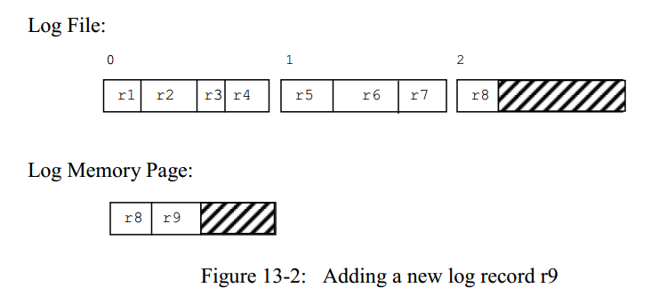
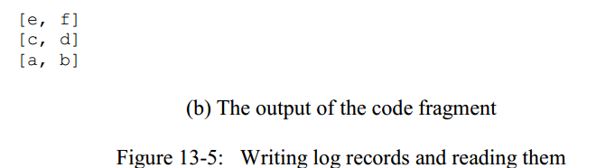
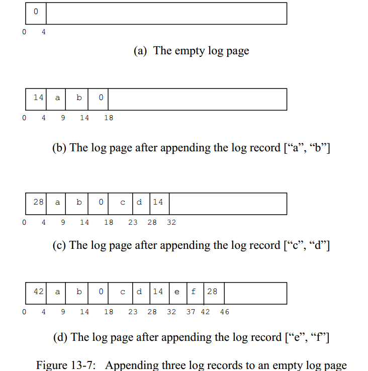
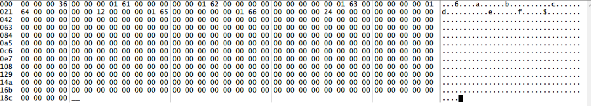
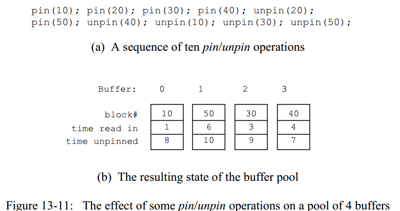

# 第13章 内存管理及包`simpledb.log`和`simpledb.buffer`的实现

在本章中我们将学习数据库中的两个组件:`日志管理器（log manager）`和`缓冲管理器（buffer manager）`,它们各自负责特定的文件：日志管理器负责日志文件，而缓冲管理器负责用户的数据文件。


这两个组件面临的关键问题就是，如何高效地管理驻留在内存中的磁盘块内容，并对它们进行读写。一个数据库中的内容通常要比主存的大小大得多，因此组件可能需要将这些数据内容在磁盘和内存之间来回穿梭。我们将会学习到日志管理器和缓冲管理器的多种内存管理算法。日志管理器管理日志文件采用的是一种简单的，最优的算法；然而缓冲管理器采用的算法只能是一种最近似估计的策略。

## 13.1 数据库内存管理的两大原则

正如我们所看到的，数据库的数据是存储在磁盘块中的。为了获取到想要的块，数据库系统需要将其中的内容读入到内存页中。数据库系统将数据在内存和磁盘之间移动时，会遵循以下两个重要的原则.
> 内存管理的两个基本原则是：
1. 最小化磁盘访问次数
2. 不要依赖于`虚存（virtual memory）`，虚存是操作系统中的概念。

***原则1：最小化磁盘访问次数***

考虑这样一个应用，它从磁盘中读入数据，然后在数据上做搜索，再执行一系列的计算并作出一些改变，最后将数据写回磁盘。我们怎样可以估计这些操作的执行用耗时？回想一下，RAM读写的速度大概比闪存块1000倍，比磁盘大约快10万倍，这意味着在绝大多数的实际场景下，将读/写数据块的用时，最少会比在RAM中处理数据的用时还要多。因此，数据库系统可以做的事情就是最小化磁盘访问次数。

最小化磁盘访问次数的一个办法是避免重复的磁盘访问，这种问题在多种计算场合都会出现，且差不多有一个标准的解决方案——那就是`缓存(caching)`。举例来说，CPU中有一个局部的硬件缓存单元用来缓存一些先前执行过的指令；假设下一条将要执行的指令在cache中，那么CPU不会从RAM中把这条指令load进来，而是从cache中直接获取到（译者注：CPU的执行速度和RAM的执行速度又差了好几个数量级，所以在CPU内部会存在cache，现在的CPU也包含多级cache）。再举一个例子，一个浏览器也会将之前访问过的web页面缓存起来，下次用户请求相同的页面时（例如，点击回退上一个页面的按钮），浏览器会从缓存中得到网页内容而避免了再次通过网络请求内容。

数据系统会将磁盘块中的内容缓存在内存页中，它会跟踪哪些页包含了哪些块中的内容；通过这种方法，通过使用以及存在的内存页，就有可能可以满足客户端的请求，却避免了磁盘读写。类似地，数据库系统也只会在必要的时候将页中的内容写回到磁盘，希望可以通过单次的磁盘写入对页面的多次更改进行保存。

最小化磁盘访问非常重要以至于遍布在数据库系统的整个工作流程中。举例来说，数据库系统中选择的数据检索算法是特别选择的，因为数据库系统想要最小化磁盘访问。当一条SQL语句有多种可能的检索策略时，`planner`会选择那个需要最少磁盘访问次数的策略。

***原则2：不要依赖于虚存***

现代操作系统支持`虚存(virtual memory)`,操作系统会给每个进程一个错觉，即它拥有大量的内存来存储其代码和数据。一个进程可以在其虚拟内存空间中任意分配对象；OS会负责将每个虚拟页面映射到实际的物理内存页面。

OS支持的虚存空间通常来说都远远大于一个计算机的物理内存空间。因为不一定实际的物理内存空间能放得下当前所有的虚存页，所以OS必须将一些虚存页暂时放到磁盘中。当一个进程访问一个不在主存中的虚存页时，一次`页换入换出（page swap）`会被执行：具体来说，OS会选择一个物理页面，将该物理页面中的内容写入到磁盘中（如果有必要的话），然后将磁盘上对应的该虚存页的内容读入物理页中。

数据库系统管理磁盘块的最直接的办法就是给每个块一个它自己的页，例如，数据库系统可以为每个文件维护一个页数组，并为文件的每个块维护一个`槽（slot）`，这些页数组可能很大，但它们都是被放在虚存中的。当数据库系统需要相应的页时，OS的虚存管理机制会按照需求，在磁盘和内存中进行换入换出，这是一个很简单，且很容易实现的策略，不幸的是，这种策略有一个严重的问题：现在控制什么时候将页写回到磁盘的是OS，而不是数据库系统，这会引发两个危险的问题：

- 第一个问题是操作系统的页面交换可能会损害数据库系统在系统崩溃后恢复的能力。 正如我们将在第14章中看到的那样，原因是被修改的页会有一个相关的日志记录，这些日志记录*必须*被在页被保存之前写回到磁盘（否则，在数据库系统崩溃后想要恢复时，就会找不到日志记录）。因为OS不知道这是日志，它可能将修改后的页换出而没有写写日志记录，因此破坏了恢复机制。
- 第二个问题是，OS不知道哪些页正在被使用，哪些页数据库系统根本不在意。OS可以作出有根据的猜测，例如LRU（Latest Recent Used）置换算法，但是假如OS猜错了，它可能会将一些再次需要的页换出，从而带来了两次不必要的磁盘访问。另一方面，一个数据库系统，对哪些页需要使用，有一个更明智的猜测。

因此，数据库系统必须管理它自己的页。通过分配相对少的可以完全装进物理内存的页，数据库系统就可以很好地管理页；这些页被称为数据库的`缓冲池（buffer pool）`。数据库系统会跟踪哪些页可以被换入换出。当一个块需要被读入页中时，数据库系统（而不是OS）会从缓存池在选择一个合适的页，如果有必要（译者注：什么是有必要？就是当页中的内容被修改了后），然后将该页中的内容（以及相应的日志记录）保存到磁盘，只有当这些工作完成了以后，才会将指定的块中的内容读到页中。（你可以看作是完成了一次数据库系统级别的swap）。

## 13.2 管理日志信息
无论什么时候用户对数据库系统进行修改时，数据库系统必须对这些更改进行跟踪，以防需要对这些操作进行撤回。描述一次修改的值被保存在一条`日志记录（log record）`中，而日志记录又被保存在`日志文件（log file）`中，新的日志记录总是被追加在日志文件的末尾。
> 日志管理器正是数据库系统中负责将日志记录写到日志文件中的那个部分。

日志管理器不知道日志记录中的内容——那是由`恢复管理器(recovery manager)`负责的部分（参见第14章）。相反，日志管理器将日志视为一个只会增加的日志记录序列。

在本节中，我们将会学习日志管理器在将日志记录写到日志文件时是怎样管理内存的。文明将最开始考虑下述的算法，这是将日志记录追加到日志中的最直接的办法。
```
1. 在内存中分配页。

2. 将日志文件的最后一块读入该页中。

3.     
    a)如果有页中有空间剩余，则将当前的日志记录追加到已有的所有日志记录之后，并将该页写回到磁盘中。
    b)如果页中没有空间剩余，则分配一个新的空页，将当前日志记录放到这个新分配的页中，并将将该页的追加到日志文件的最后一个块的后面。
```
该算法每追加一条日志记录，需要一次磁盘读操作和一次磁盘写操作。这是非常简单的策略，但不是那么高效。

图13-2示例了日志管理器在上述3a过程中的执行流程。日志文件包含3个块，总共包含8条日志记录，用$$r_1$$到$$r_8$$进行了标识。每条日志记录可以有不同的大小，在block 0中包含4条日志记录，但在block 1中只装下了3条日志记录，block 2中则还没满，只包含了1条日志记录。内存页中对应的是block 2中的内容，除了$$r_8$$以外，内存页中还将一条新的日志记录$$r_9$$放在了该页中。



现在假设日志管理器将内存页写回到文件的block 2中，从而完成以上算法。当日志管理器最终请求添加一条新的日志记录到日志文件时，它会执行步骤1和步骤2并且将block 2 读入到内存页中。但是，请注意，**这个磁盘读操作是不必要的**，因为当前的日志页已经包含了日志文件block 2中的内容！（译者注：请思考下为什么？因为日志页是专门为日志管理器开辟的一系列内存页，而我们当前日志页中的内容肯定是上一次保存日志记录到文件后的样子啊！并没有人规定说，将日志页中的内容写回到日志文件后，必须把内存页中的内容也清空一遍，对吧？）因此，步骤1和步骤2都是不必要的，日志管理器只需要永久分配一个内存也，来保留上一次日志块中的内容即可。这样的结果是，所有的文件读操作全部都不再需要了，真的是妙~

其实，文件写操作也是有可能减少次数的，在上述的算法中，文件管理器在每次添加一条新的日志记录时，都会将日志页中的内容写回到磁盘，再看下图13-2，我们可以发现其实并不必要在$$r_9$$被添加时立马将日志页写回到磁盘。只要日志页中还有空间剩余，每条新的日志记录可以被很简单地被加入到页中；当页满了的时候，日志管理器可以将页写回到磁盘中，然后再清除日志页中的内容，准备下一次开始添加新的日志记录。这个新的算法，对于日志文件中的每个块会相应进行一次磁盘写操作，而不是之前的每条日志记录，这明显更优。

我们的新算法有一个小问题：可能会出现某种突发情况，超出了日志管理器的控制范围（比方说，在日志页还没写满前，突然停电了，导致日志页中的某些日志记录可能还没写回到磁盘上），因此，在类似这种情况下，我们是反而需要在日志页满之前将日志页写回磁盘。出了停电这种突发情况，其实还有一种情况，也需要我们提前将日志页写回磁盘。回想一下，在相关的日志记录被写入磁盘之前，缓冲管理器是不能将已修改的数据页写入磁盘（这是为了可以确保到数据库的数据可以被恢复）。如果这些日志记录之一恰好位于日志页中但尚未持久化到磁盘上，则无论页面是否已满，日志管理器都必须将其页面写入磁盘。（译者注：这就类似于文件操作中的`flush()`，提供给了用户强制写回磁盘的权限，反正就是提前进行磁盘写操作。）

上述讨论产生了以下新的算法执行流程：
```
1. 分配一块永久的内存页来维持日志文件中最后一个块中的日志信息，把这个页称为P.

2. 当有一个新的日志记录到来时：
    a)如果P中没有空间剩余，则将P写入磁盘并清空P中的内容。
    b)将新的日志记录添加到P中。

3. 当数据库系统请求一个特殊的日志记录写操作时：
    a)确定该记录是否驻留在P中。
    b)如果在，将P写回磁盘。
```
换句话说，有2种原因导致内存页写回到磁盘：
- 日志记录强制被写回到磁盘
- 当日志页满了

因此，一个内存页可能被写回到同一个日志块中多次，但是因为文件写操作不可能被完全地避免，我们可以认为当前的这个算法是最优的。

## 13.3 SimpleDB的日志管理器

在本节中，我们将学习SimpleDB数据库系统的日志管理器。第13.3.1节介绍了日志管理器的API，这些API包括了将日志记录追加到日志文件的方法，以及读取日志文件中记录的方法。然后13.3.2小节显示了如何用Java来实现这个日志管理器。

### 13.3.1 日志管理器的API
SimpleDB日志管理器的实现在包`simpledb.log`中，这个包有两个类：`LogMgr`类和`BasicLogRecord`类；他们的API如下代码所示。
```Java
// LogMgr.java
public class LogMgr {
    public LogMgr(String logfile);

    public int append(Object[] rec);

    public void flush(int lsn);

    public Iterator<BasicLogRecord> iterator();

}

// BasicLogRecord.java
public class BasicLogRecord {

    public BasicLogRecord(Page logPage, int pos);

    public int nextInt();

    public String nextString();
}
```
数据库系统在启动时，会创建一个`LogMgr`类的对象，类`server.SimpeDB`会负责创建该对象时传入日志文件名给构造函数；并且有一个`logMgr()`方法返回该创建的对象。

方法`append()`会追加一条日志记录到日志文件，并返回一个整数。就日志管理器而言，一条日志记录只不过是一个任意长度的一系列值的数组，只不过每个值必须是整数或string类型，并且我们假设一条日志记录必须可以在一个内存页中放的下。`append()`返回的整数标识了新的日志记录，这个标识符被称为`日志序列号（Log Sequence Number，LSN）`。

> 一个LSN标识了日志文件中的一条日志记录。

追加一条日志记录后并不会保证这条记录会立马被写入到磁盘中；相反，日志管理器会决定什么时候将日志记录写回到磁盘，正如13.2小节末尾概括的算法一样。一个客户端可以强制将一个指定的日志记录写回到磁盘，通过调用`flush()`方法，该方法的参数是日志记录的日志序列号；这个方法确保这条记录（准确地说，也包含追加这条记录之前的其他记录），会被写回到磁盘中。

一个客户端可以通过`iterator()`方法来读取日志文件中的所有日志记录，该方法返回的是一个Java的迭代器。每次调用迭代器的`next()`方法会返回一个对应的`BasicLogRecord `对象。一条基本的日志记录其实就是在页中的一系列的字节，调用者负责知道记录中有多少值，并且它们的具体取值是什么，读取一条日志记录中的唯一选择就是通过调用`nextInt()`和`nextString()`方法，`nextString()`假设日志记录中下一个值为string类型的值，然后读取到该字符串并返回，`nextInt()`也是类似。

`iterator()`方法返回的所有日志记录刚好是一个反的顺序，从最近的日志记录开始，不断往前移动，之所以以这样的顺序读取，是因为恢复管理器（后续章节会提到）希望这样查看日志记录。

```Java
SimpleDB.init("studentdb");
LogMgr logMgr = SimpleDB.logMgr();
int lsn1 = logMgr.append(new Object[]{"a", "b"});
int lsn2 = logMgr.append(new Object[]{"c", "d"});
int lsn3 = logMgr.append(new Object[]{"e", "f"});
logMgr.flush(lsn3);

Iterator<BasicLogRecord> iter = logMgr.iterator();
while (iter.hasNext()) {
    BasicLogRecord rec = iter.next();
    String v1 = rec.nextString();
    String v2 = rec.nextString();
    System.out.println("[" + v1 + ", " + v2 + "]");
}
```
上面的代码片段提供了一个如何使用上述API的示例，前半段代码将3条日日志记录追加到日志文件，每天日志记录包含两个字符串，第一条记录是`["a","b"]`,第二条记录是`["c","d"]`，第三条记录是`["e","f"]` ，接下来通过调用`flush()`方法，传递第三条日志记录的LSN进去，这次调用会确保3条日志记录都被写回到磁盘上；后半段的代码则迭代访问日志文件中的所有日志记录，以一种逆序的方式，然后打印出相应的字符串，最终的输出如图13-5（b）所示。



### 13.3.2 实现日志管理器
***LogMgr 类***

`LogMgr`类的代码如下所示，它的构造函数传入的是日志文件的文件名，如果该文件为空，则创建一个新的空文件，并且追加一个新的日志块。构造函数也会分配专门来保存日志记录的一个日志页（取名为`mypage`）,并且初始化该页中的内容为日志文件的最后一块的内容。
```Java
public class LogMgr {
    // 标识最后一条日志记录的结束位置的指针，它本身也是在页中的内容
    // 即[LAST_POS...LAST_POS+3]这4个字节代表的整数标识了最后一条日志记录的结束位置
    public static final int LAST_POS = 0;

    private String logfile;
    // 日志页
    private Page mypage = new Page();
    private Block currentBlk;
    private int currentPos;

    public LogMgr(String logfile) throws IOException {
        this.logfile = logfile;
        int logSize = SimpleDB.fileMgr().size(logfile);
        // 如果日志文件为空，则为日志文件追加一个新的空块
        if (0 == logSize)
            appendNewBlock();
        else {
            // 否则先读入最后一块.
            // 注意，块号的下标从0开始，所以要减去1
            currentBlk = new Block(logfile, logSize - 1);
            mypage.read(currentBlk);
            currentPos = getLastRecordPosition();
        }

    }

    public synchronized int append(Object[] rec) {
        int recSize = INT_SIZE; // 一条记录的字节数
        for (Object obj : rec) {
            recSize += size(obj);
        }
        // 如果追加一条日志记录后，当前页放不下
        if (currentPos + recSize >= BLOCK_SIZE) {
            flush();
            appendNewBlock();
        }
        // 把当前这条日志记录中的值全部依次放入日志页中
        for (Object o : rec) {
            appendVal(o);
        }
        finalizeRecord();

        return currentLSN();
    }

    public void flush(int lsn) {
        if (lsn >= currentLSN())
            flush();
    }

    public Iterator<BasicLogRecord> iterator() {
        flush();
        return new LogIterator(currentBlk);
    }

    /**
     * 返回当前LSN
     *
     * @return 即返回当前块的块号。
     */
    private int currentLSN() {
        return currentBlk.number();
    }

    /**
     * 处理追加完日志记录后的动作。
     * <p>
     * 也就是:
     * 1. 先在当前日志记录后面加上一个整数，用来标识上一条日志记录的起始位置。
     * 2. 再改变日志页的最开始的4个字节，用来直接标识最后一条日志记录的结束位置。
     * <p>
     * 这一部分类似一个逆着的数组链表，务必理清其中的逻辑
     */
    private void finalizeRecord() {
        mypage.setInt(currentPos, getLastRecordPosition());
        setLastRecordPosition(currentPos);

        currentPos += INT_SIZE;
    }

    /**
     * 将日志记录中的值追加到日志页mypage中
     * <p>
     * TODO: 目前该数据库系统只支持int和string类型，以后扩展后次方法也要对应扩展
     *
     * @param obj 追加的值
     */
    private void appendVal(Object obj) {
        if (obj instanceof String) {
            mypage.setString(currentPos, (String) obj);
        } else {
            mypage.setInt(currentPos, (Integer) obj);
        }
        currentPos += size(obj);
    }

    /**
     * 将当前页中的内容强制持久化到磁盘中
     */
    private void flush() {
        mypage.write(currentBlk);
    }

    /**
     * 计算一个obj的字节需要使用的字节数
     * <p>
     * TODO: 目前该数据库系统只支持int和string类型，以后扩展后次方法也要对应扩展
     *
     * @param obj 待统计的对象
     * @return 字节数
     */
    private int size(Object obj) {
        if (obj instanceof String) {
            String strVal = (String) obj;
            return STR_SIZE(strVal.length());
        } else {
            return INT_SIZE;
        }
    }

    /**
     * 追加一个新的空块到日志文件
     */
    private void appendNewBlock() {
        // 设置上一条日志记录的开始位置为0
        setLastRecordPosition(0);
        currentBlk = mypage.append(logfile);
        // 新分配的日志块肯定只有一个INT，也就是4个字节
        // 该INT表示的是上一条日志记录的起始位置，在这里为0
        currentPos = INT_SIZE;
    }

    private void setLastRecordPosition(int pos) {
        // 第一个参数为offset，第二个参数为具体的值
        mypage.setInt(LAST_POS, pos);
    }

    private int getLastRecordPosition() {
        return mypage.getInt(LAST_POS);
    }
}
```
回顾一下，LSN是用来标识一条日志记录的，例如，一个典型的LSN可能包含当前块号以及当前日志记录在该块的起始位置。然而，SimpleDB把事情简化了，而是只用一个块的块号来唯一标识当前日志记录，也就是说，一个块中的所有日志记录会有相同的LSN，这种简化丝毫不会降低程序的正确性，但的确会降低那么一些些的效率。

方法`flush()`会比较当前的块号和指定的LSN，如果指定的LSN更小，那对应的日志记录肯定已经被写回到了磁盘中；否则，`mypage`会执行一次磁盘写操作。

`append()`方法则会先一下计算当前待写入的日志记录需要用多少个字节来存储，从而确定当前日志页是否能够容纳下。如果容纳不下，它会首先将当前页中的内容写回到磁盘，然后调用一次`appendNewBlock()`方法来清除当前日志页，最后将新的日志记录写进去。这种策略和13.2小节末尾提到的算法有那么一丢丢不一样；那就是日志管理器通过追加一个空页来扩展日志文件，而不是追加一个满的页。这种策略更容易实现，因为它允许`flush()`方法假设这个块已经在磁盘中了。

一旦`append()`方法确保当前日志记录可以可以装进当前的日志页，那么它会依次将日志记录中的每个值都装到日志页中，最后执行`finalizeRecord()‘方法。该方法会在新的记录后面再写一个int整数，用来标识上一条日志记录的其实位置，这样一来，页中的所有记录就像是一个倒着的链表一样。另外，页的第一个int，标识的是这个链表的头指针——在这里，因为链表是逆序的，也就是最后一条日志记录的起始位置。



为了演示这个链表是怎样实现的，请参阅图13-7。这个图演示了4次对日志页的操作：当页被初始化的时候的状态，以及3次添加日志记录后的状态。图13-7（a）只有一个值0，这个值表示的是页中的最后一条记录在0位置结束（也就是指向了自己），以为者当前页中根本没有日志记录。

图13-7（b）示例了当添加了日志记录`["a","b"]`后页中的内容，回想与喜爱，一个只包含1个字符的字符串占用的字节数为5：即4个字节来表示字符串长度（当然，这里就是1了），另外一个字节表示字符串的字面量。这条日志记录后面的0表示链表中的下一条记录在0的位置结束，其实也就是说，这条记录是链中的最后一条记录。页首的值14表示链表的第一条记录（其实是最后一条，因为是逆的链表）结束与14位置。

图13-7（c）和图13-7（d）演示了添加另外两条日志记录后的情况，和图13-7（b）类似。

***LogIterator 类***

`LogMgr`类中的`iterator()`方法会先flush一下日志文件（从而确保整各日志是在磁盘上），然后再返回一个`LogIterator`对象。`LogIterator`类实现了这个迭代器,其代码如下所示。一个`LogIterator`对象分配一个内存页用来容纳日志文件的块，构造器会将迭代器的初始位置指向日志文件最后一块的最后一条记录。`next()`方法使用相应的指针来往之前的日志记录不断迭代，最后返回一个当前位置对应的`BasicLogRecord`对象。
```Java
public class LogIterator implements Iterator<BasicLogRecord> {

    private Block blk;
    private Page page = new Page();
    private int currentRec;

    public LogIterator(Block blk) {
        this.blk = blk;
        page.read(blk);
        currentRec = page.getInt(LAST_POS);
    }

    @Override
    public boolean hasNext() {
        return currentRec > 0 || blk.number() > 0;
    }

    @Override
    public BasicLogRecord next() {
        if (0 == currentRec)
            moveToNextBlock();
        // 继续往回迭代上一条
        currentRec = page.getInt(currentRec);
        return new BasicLogRecord(page, currentRec + INT_SIZE);
    }

    @Override
    public void remove() {
        throw new UnsupportedOperationException("Remove operation is not supported in LogIterator！");
    }

    private void moveToNextBlock() {
        // 上一个块
        blk = new Block(blk.filename(), blk.number() - 1);
        page.read(blk);
        currentRec = page.getInt(LAST_POS);
    }
}
```
***BasicLogRecord 类***

`BasicLogRecord`类的代码如下所示，构造函数接受一个日志页中指示一条日志记录的其实位置，会使用`nextInt()`和`nextString()`方法来读取后续的数据，然后在读的过程中会移动位置指针。
```
public class BasicLogRecord {

    private Page logPage;
    private int pos;


    public BasicLogRecord(Page logPage, int pos) {
        this.logPage = logPage;
        this.pos = pos;
    }

    public int nextInt() {
        int intVal = logPage.getInt(pos);
        pos += INT_SIZE;
        return intVal;
    }

    public String nextString() {
        String stringVal = logPage.getString(pos);
        pos += STR_SIZE(stringVal.length());
        return stringVal;
    }
}
```
### 13.3.3 日志管理器测试结果（译者添加）
和之前类似，我们将测试代码写入一个`LogTest`类中，然后相应地修改一下`server.SimpleDB`中的初始化代码，最后执行之前提到的测试代码，运行后，用二进制文件编辑器打开日志文件，我的结果如下：



在这里我们简单分析一下这个二进制文件中的内容，最开始的4个字节为`00 00 00 36`也就是十进制的54，对应的是图中第二行的`00 00 00 24`的第一个00，而`00 00 00 24`对应的十进制又为36，也就是说最后一条日志记录的结束位置为第36个字节；而第36个字节又对应的是图中第二行的`00 00 00 12`的第一个00，`00 00 00 12`又代表的是十进制的18，这里我们可以知道，从紧接着`00 00 00 12`后面的第一个00开始，一直到`00 00 00 24`前面的最后一个00，就是日志文件中的最后一条记录，也就是`00 00 00 01 65 00 00,00 00 00 01 66 00 00`。看到我在这里特意打的逗号，想必你也肯定知道是什么意思了！00 00 00 01就是十进制中的1，也就是我们底层表示一个字符串时的长度标识，而后面的3个字节，65 00 00就是‘e’的字面量，在我的机器上，Java用3个字节来表示一个英文字符。前面的两条记录信息可以用类似的方法解析出来，就不再赘述了。

## 13.4 管理用户数据

日志文件以一种有限的、便于理解的方式被组织，日志管理器因此必须非常小心地调整其管理内存的方式；以simpleDB为例，日志管理器只需要一个专用的内存也就可以最佳地完成工作。

另一方面，JDBC应用程序完全不可预测地访问其数据。我们无法知道应用程序接下来要请求哪个块，以及是否会再次访问前一个块。即使在一个应用程序完全完成其块之后，我们也不知道另一个应用程序是否会在不久的将来访问这些块中的任何一个。本节将介绍在这种情况下，数据库系统如何有效地管理内存。

### 13.4.1 缓冲管理器

> 缓冲管理器是数据库系统中负责管理那些持有用户数据的内存页。

缓冲管理器维持着一系列固定数量的内存页，被称为`缓冲池（buffer pool)`，正如在本章的开头所提及的意义，缓冲池需要能在计算机的物理内存中装下，并且这些也应该来自OS维持的I/O buffer。

为了访问一个块，一个客户端会按照以下的协议与缓冲管理器进行交互：
1. 客户端请求缓冲管理器从缓冲池中`固定(pin)`一个页，用来维持块中的内容。
2. 客户端按照相应的逻辑，操作页中的内容。
3. 当客户端完成页的操作后，它告诉缓冲管理器`取消固定(unpin)`那个页。

当一个客户端正在pinning一个页时，我们称这个页是被`固定(pinned)`的状态；否则称这个页为`非固定(unpinned)`的状态。当一个页被客户端固定了后，缓冲管理器有义务确保该页一直可用；相反，一旦取消固定某个页，则允许缓冲区管理器将其分配给另一个块。

> 一个被固定的缓冲页的使用者为客户端。
    一个没被固定的缓冲页的使用者为缓冲管理器。

当一个客户端请求缓冲管理器为某个块而固定一个页时，缓冲管理器将会遇到以下可能的4种情况之一：

- 块中的内容已经在缓存中，而且：
    1. 这个页是被固定的，或者
    2. 这个页没被固定
- 块中的内容不在缓存中，而且：
    1. 缓冲池中至少有一个没被固定的页，或者
    2. 缓冲池中所有的页都被固定了

第一种情况会发生在，当一个或多个客户端正在访问某个块中内容的时候。由于一个页可以由多个客户端固定，因此缓冲管理器只需向该页面添加另一个引脚，然后将该页返回给客户端即可。正在固定该页的每个客户端都可以并发地同时读取和修改其值。缓冲管理器并不担心可能发生的潜在冲突；相反，这是并发管理器的工作（我们将在第14章中看到）。

第二种情况会发生在，当客户端使用完了缓冲区内容，但是还尚未重新使用这个缓冲区给另一个用户的时候，由于块中的内容仍然在缓冲页中，缓冲管理器可以通过简单地固定该页给客户端的方式，重用这个缓冲页。

第三种情况要求缓冲管理器将磁盘块中的内容读到内存缓存页中，这里有几个相关的步骤。缓冲管理器必须首先选择一个页来重新使用，这个页必须是没被固定的（因为被固定的页还在被客户端使用着）；其次，如果被选中的页被修改过，缓冲管理器必选先将该页中的内容写回到磁盘，这个操作被称为页的`flushing`操作；最后，块的内容可以被读到选中的页中，并且这个页可以被固定。

第四中情况会发生在，当缓冲区都大量被使用的适合，例如在23章将会说的的查询处理算法，在这种情况下，缓冲管理器无法满足客户端的请求。此时最好的解决办法就是缓冲管理器将这个客户端放在一个等待队列中。当一个缓冲页变成取消固定的时候，缓冲管理器可以将磁盘块中的内容读到页中，并固定，客户端就可以继续做后续的操作了。

### 13.4.2 缓冲区
缓冲池中的每个页都有一个相关的状态信息，例如这个页是否被固定，如果被固定了，固定的是哪个块上的内容，一个`缓冲区（buffer）`就是包含这些信息的对象。缓冲池中的每个页都有自己的缓冲区。

每个缓冲区都会观察对页所作出的修改，并且对修改后的页写回磁盘负责。就像和日志一样，如果采用延迟写回磁盘的策略，缓冲区可以减少磁盘访问数，例如，如果一个页被修改了好几次，于是在所有的修改做完之后再将内存页写回磁盘，效率就会高的多。因此，一个合理的策略就是使缓冲区延迟将其页面写入磁盘，直到取消固定页面为止。

实际上，缓冲区可以甚至等更长的视觉。假设一个修改后的页变成了非固定状态，但是没有写入磁盘。假如页再次被固定到相同的块（正如和第2种情况中所说的一样），客户端将会看到这些修改后的内容，正如被遗留的一样。这时，其实和这个页被写回磁盘，然后再读取回页中的情况，是一样的效果，但是没有磁盘访问。从某种意义上来讲，缓冲区的也有点像是在内存中的磁盘块。任意一个想要使用块的客户端，将会被简单地带到缓存页中，然后客户端可以实现无需任何磁盘访问，从而读取或修改数据的操作。缓冲区需要将修改的页写回磁盘的原因只有两个：
- 要么缓冲区因为固定另外一个页面而被替换
- 要么恢复管理器需要将内容写回到磁盘，从而防止可能的系统崩溃发生。

### 13.4.3 缓存置换策略
缓冲区中的页最开始是没被分配的。一旦一个固定请求到来，缓冲管理器通过将被请求的块赋值到未分配的页上，从而填充缓冲池。一旦所有的页都被分配，缓冲管理器将会开始替换页，缓冲管理器可以选择缓冲池中的任意页，前提是该页面未被固定。

如果缓冲管理器需要替换一个页，而所有的缓存又被固定了，那么这个请求的客户端必须等待。因而，每个客户端有责任成为一个“好公民”，并且一旦不需要某个缓存页后，立马将该缓存释放掉。一个恶意的客户端可能可以简单地通过固定所有的缓存并且让它们保持固定状态，从而使系统崩溃。

如果超过1个缓冲页是未固定的状态，于是缓冲管理器必须觉得替换哪一个。这个选择会影响到后续执行的磁盘访问次数，例如，最糟糕的选择就是替换掉接下来将被访问的页，因为缓冲管理器将不得不又替换其他页。事实证明，最好的选择就是总是替换那些最长时间不会被使用的页。

既然缓冲管理器无法预测接下来哪些页将会被访问，于是它不得不被迫进行猜测。在这里，缓冲管理器几乎是和OS在swap虚存时的场景一样，但是，也有一个很大的区别：不像在OS中，缓冲管理器确确实实知道一个页当前是否被使用，因为没被使用的页正是没被固定的页。事实证明，无法替换一个固定页的负担反而是一种幸运。客户端会通过负责任地固定页，从而不需要缓冲管理器真的去做一些糟糕的猜测。缓存替换策略只需要从哪些当前不需要的页中作出选择，这也显得不是那么关键。

给定一系列没被固定的页，缓冲管理器需要决定，在这些页中的哪一个将会是那个最长时间不会被用到的页，例如，一个数据库通常有很多这样的页（例如16章会说到的目录文件），它们会在数据库的整个生命周期中时不时地被访问。缓冲管理器需要避免替换这些页因为它们将会在相对很短的时间之内被重新固定。

和OS的虚存管理中一样，存在着一些尝试近似最好猜测的替换策略，我们将主要考虑4种替换策略：`Naive`，`FIFO`，`LRU`和`Clock`

图13-11介绍了我们将用来比较这几种替换算法的例子，（a）部分给出了一系列固定和取消固定一个文件中5个块的操作；（b）部分展示了缓冲池的结果状态，假设在这里只有4个缓冲区，只有当地5个块被固定时才需要替换页。然而，因为那时只有1个缓冲区是没被固定，缓冲管理器别无选择，也就是说，缓冲池将会和图13-11（b）所示的一样，无论采用什么页置换算法。



图13-11（b）中的每个缓冲区都有3个信息：块号，读入缓冲区的视觉，已经被取消固定的时间，图中的时间对于的是图13-11（a）中操作的位置。

图13-11（b）中的缓冲区全是被取消固定的状态，假设现在缓冲管理器收到了两个固定请求：`pin(60)`和`pin(70)`

缓冲管理器将需要替换两个缓冲区，所有的缓冲区都可以替换，那它替换哪个呢？接下来的每个替换算法都有一个不同的回答

***Naive 策略***

最简单的替换策略是依次遍历缓冲池，替换找到的第一个未固定的缓冲区。使用图13-11的示例，将块60分配给缓冲区0，将块70分配给缓冲区1。

此策略实现起来比较简单，但几乎没有其他建议。例如，再次考虑图13-11的缓冲区，并假设客户端反复固定和取消固定块60和70，如下所示：

`pin(60); unpin(60); pin(70); unpin(70);pin(60); unpin(60); pin(70); unpin(70)...`

Naive替换策略将对这两个块使用只缓冲区0，这意味着每次固定块时都需要从磁盘中读取它们。这样带来的问题是缓冲池根本没有被完全利用起来，如果替换策略为块60和70选择了两个不同的缓冲区，则每个块可以只从磁盘读取一次——这是效率的巨大提高。

***FIFO 策略***

Naive策略仅基于选择的便利性来选择一个缓冲区。FIFO策略则试图通过选择最近被替换最少的缓冲区（即，待在缓冲池中时间最长的页面，从而最早被固定的页面也会最早被替换，也就是先进先出的意思），从而变得更加智能。此策略通常比Naive策略更好，因为与最近获取的页相比，那些很早之前的页再次被使用到的可能性较小。在图13-11中，最早的页面是“读入时间”值最小的页面。因此，将块60分配给缓冲区0，将块70分配给缓冲区2。

FIFO是一个合理的策略，但是它也并不总是作出正确的决定，例如，一个数据库通常有一些进程使用的页，例如目录页，由于几乎每个客户端都会用到这些页面，因此，不要替换这些页才更有意义。然而，这些页最终将成为缓冲池中最早的页面，并且FIFO策略会选择替换它们。

FIFO策略的替换策略可以以两种方式来实现。第一种方式就是如图13-11（b）中所演示的那样，在每个缓冲页中维持一个当前页被替换的时间，替换算法到时候可以扫描一遍缓冲池，在那些没被固定的页中，选择最早的页来换掉。第二种更加高效的实现方法是，缓冲管理器维持一个指向缓冲区的列表，而这个列表又是以置换的时间为顺序进行排序的。置换算法会搜索列表，列表中第一个没被固定的页将会被置换，然后指针移向列表的尾部。

***LRU 策略***

FIFO策略是基于`一个页是什么时候被添加到缓冲池`的方法来进行置换的，一个和FIFO类似的策略是基于`一个页是最后一次被访问的时间是什么时候`的原则，这样的策略的缘由是惊奇不会被使用的页面在不久的将来也不会被使用。，而这个策略就被叫做`LRU策略（Latest Recent Used ）`。在图13-11中，“取消固定时间”对应着该页最后被访问的时间，因此，block 60将会被赋值到缓冲池3中，block 70 将会被赋值到缓冲池0中。

LRU策略似乎是一个更高效的通用的策略，并且避免了替换一些经常被使用的页，并且FIFO的两种实现策略也可以适用于LRU算法中，唯一的变化就是，在LRU策略实现的时候，每次取消固定页面时（而不是在替换页面时），缓冲区管理器必须更新时间戳（对于第一种实现策略）或更新列表（对于第二种实现策略）。

***Clock 策略***

时钟策略其实是上述几个策略的一个有趣组合，并且有一个简单直接的实现。正如和Naive策略中一样，该置换算法会扫描一遍缓冲池，选择第一个找到的未被固定的页，但区别就是，该算法在扫描时，总是以上一次置换的页为起点开始扫描，假如你把整个缓冲池看成是一个圈的话，那么该置换算法就像一个钟的指针一样在一个圈中打转，当发现一个可以置换的页面时时钟的指针停止转动，当下一次替换请求到来时，则又继续旋转。

图13-11（b）中的示例没有显示时钟的位置，但是它上一次置换的缓冲页为buffer 1，这一位置时钟的指针指向该缓冲页紧跟的后面。

时钟策略企图尽可能均匀地使用所有缓冲区。如果将页面是被固定了的，则时钟策略将会跳过该页，并且在检查了缓冲池中的所有其他缓冲区之前不会再考虑它。此功能使该策略具有LRU的风格，这个想法是，如果一个页被经常使用，则当一个替换请求到来时，很有可能这个页是被固定的，如果真是这样，则将其跳过该经常被使用的页，并给予它另一个不被替换的机会（译者注：因为此时时钟的指针指向它的下一个，需要再转一圈才有可能再考虑是否置换这个页）。

## 13.5 SimpleDB的缓冲管理器
在这一节中，我们将介绍SimpleDB数据库系统中的缓冲管理器，在13.5.1小节中将涵盖缓冲管理器的API，并且提供一个使用的用例，在13.5.2小节中将展示如何用Java来实现这些类。

### 13.5.1 缓冲管理器的API
SimpleDB缓冲管理器的实现在包`simpledb.buffer`中，这个包包含了两个类，`BufferMgr`和`Buffer`,以及一个接口`PageFormatter`，如下所示：
```Java
// Buffer.java
public class Buffer {

    public int getInt(int offset);
    public String getString(int offset);
    public void setInt(int offset,int val,int txNum,int LSN);
    public void setString(int offset,String val,int txNum,int LSN);
    public Block block();
}


// BufferMgr.java
public class BufferMgr {

    public BufferMgr(int numBuffers);
    public Buffer pin(Block blk);
    public void unpin(Buffer buffer);
    public Buffer pinNew(String fileName, PageFormatter pageFormatter);
    public void  flushAll(int txNum);
    public int available();
}

// PageFormatter.java
interface PageFormatter {
    public void format(Page p);
}
}
```
在数据库系统被启动时，会创建一个`BufferMgr`对象，`simpledb.server`包中的`SimpleDB`类会创建一个该对象，并传入一个缓冲池的大小给它的构造函数，有一个静态方法`bufferMgr()`会返回这个创建的对象。

一个`BufferMgr`对象拥有固定页面和取消固定页面的方法，`pin()`方法返回一个固定到指定块的缓冲区，`unpin()`方法则会取消固定这个缓冲区。一个客户端可以堆区固定的缓冲区中的具体内容，通过的是调用`getInt()`和`getString()`方法，下述的代码片段提供了一个使用缓冲区的例子，代码中先把文件`junk`的第3个块中的内容固定到缓冲区中，得到第392个字节和第20个字节开始的位置，然后取消固定该页。
```Java
SimpleDB.init("studentdb");
BufferMgr bufferMgr = SimpleDB.bufferMgr();
Block blk = new Block("junk", 3);
Buffer buffer = bufferMgr.pin(blk);
int n = buffer.getInt(392);
String str = buffer.getString(20);
// 客户端代码需要对unpin负责
bufferMgr.unpin(buffer);
System.out.println("Values are: " + n + ", " + str);
```
一个客户端可以通过调用缓冲区的`setInt()`和`setString()`方法，来修改块的值。然而，在修改之前，客户端必须首先将合适的日志急了写到日志文件中，并且获得其LSN（译者注：忘了LSN是什么？就是一个日志的序列号，在我们现在的实现中，就简单地用块号来标识）。客户端将LSN（和一个事务标识符）作为参数传入`setInt()`和`setString()`方法的。缓冲区会保存这些值，并在需要将日志记录强制写回到磁盘时使用它们。

下面的代码展示了缓冲区修改的例子，增加了第392个字节开始的整数，在调用`setInt()`方法之前，代码会创建一条日志记录，并且追加到日志文件，这条日志记录的LSN将传到`setInt()`方法中。
```Java
SimpleDB.init("studentdb");
BufferMgr bufferMgr = SimpleDB.bufferMgr();
Block blk = new Block("junk", 3);
Buffer buffer = bufferMgr.pin(blk);
int n = buffer.getInt(392);

LogMgr logMgr = SimpleDB.logMgr();
int myTxNum = 1; // 假设这里有个事务标识符1
Object[] logRec = new Object[]{"junk", 3, 392, n};
int LSN=logMgr.append(logRec);

buffer.setInt(392,n+1,myTxNum,LSN);
// 客户端代码需要对unpin负责
bufferMgr.unpin(buffer);
```
缓冲管理器并不介意具体创建的是一条怎样的日志记录，所以上述代码中的日志记录其实可以是任何东西，你想让它是什么，那它就是什么。但只是出于娱乐的目的，代码创建了一条和SimpleDB到时候真的日志记录格式差不多的日志记录。日志记录包含了4个值：`文件名`,`块号`,`修改的值的位置（也就是起始字节数）`和`修改之前的值`，如果到时候真的想要回撤所做出的修改，这些信息足够了！

`setInt()`和`setString()`方法修改块中已经存在的值所以这些值创建的时候怎么初始化呢？SimpleDB假设每个块在被追加到文件时，都会被`格式化(formatted)`，格式化这个操作，是通过一个实现了`PageFormatter`接口对象的`format()`方法来完成的。下面的代码片段演示了一个实现了`PageFormatter`接口的类例子，它会将在一个块中填满了一连串的“abc”字符串。这个formatter的代码本身倒没什么稀奇的，一个更有用且更加实际的实现会在后面具体实现的小节中给出。
```Java
public class ABCStringFormatter implements PageFormatter {
    @Override
    public void format(Page p) {
        int recSize = STR_SIZE("abc".length());
        for (int i = 0; i + recSize <= BLOCK_SIZE; i += recSize) {
            p.setString(i, "abc");
        }
    }
}
```
`BufferMgr`类中的`pinNew()`方法负责创建新的文件块，这个方法接受2个参数作为输入：`文件名`和`一个页格式化器`。这个方法会为这个新的块分配一个新的缓冲页，固定这个页，并且格式化好，随后将这个格式化好的页追加到文件后，并返回这个缓冲区给客户端。下面的代码展示了`pinNew()`方法是怎么使用的。代码现添加一个新的块到文件`junk`中（填满了字符串“abc”），随后又读取第一个值，从缓存页中获得该块的块号。
```Java
SimpleDB.init("studentdb");
BufferMgr bufferMgr = SimpleDB.bufferMgr();
PageFormatter pf=new ABCStringFormatter();
Buffer buffer = bufferMgr.pinNew("junk",pf);

String str=buffer.getString(0);
assert (str.equals("abc"));

int blkNum=buffer.block().number();
System.out.println("Appended block number: "+blkNum);
```
`BufferMgr`类也包含了另外两个方法，方法`flushAll()`是用来清理一个指定事务的，它将flush该事务修改的每个缓冲区，从而使其更改永久生效。方法`available()`返回当前未被固定的缓冲区数量，该值会由第23章中将会提到的查询评估算法使用。

注意一下缓冲管理器是怎样把实际底层的磁盘访问细节向客户端忽略掉的，现在，客户端根本不知道它的行为（即代码调用）将引发多少次的磁盘访问，也不知道什么时候将发生磁盘访问。读磁盘的操作只有在调用`pin()`方法时才会发生，更具体地说，应该是一个客户端请求了一个不在缓冲区中的块时，读磁盘的操作才会发生。而写磁盘的操作会在调用`pin()`和`pinNew()`方法时才会发生（假设替换的缓冲页已经被修改了），以及会在调用`flushAll()`方法时发生（如果对应的事务修改了任何一个缓冲页）。

假设数据库系统有很多客户端，所有的客户端都使用很多的缓冲页。有可能缓冲池中的所有缓冲区都将被固定，在这种情况下，缓冲管理器不能立马满足一个`pin()`或者`pinNew()`请求，相反，它会将当前的调用线程放在一个等待队列上，知道有一个缓冲区可用，然后再返回该缓冲区。也就是说，客户端根本意识不到有这种缓冲连接，客户端只会发现程变慢了一些。

这种缓冲连接的方式，在有一种情况下会引发严重的问题（译者注：偷偷提前透露一下，等待有可能会产生什么问题？有可能死锁吗？）。考虑下面这样一个场景，客户端A和客户端B都需要2个缓冲页，但是只有2个缓冲页可用。假设客户端A固定了第一个缓冲页，然后B被添加到了等待队列，现在第二个缓冲页开始供A和B竞争（race）。假如客户端A先抢占到，A会接下来固定第二个缓冲页（这个时候B肯定还在等），然后在执行完自己的操作后，正常地把两个缓冲页全部取消固定，客户端B又可以固定、操作、取消固定，恩，这是一个没问题的场景。可是现在又假设，A和B在竞争时，B先抢占到，B嘛，想要2个缓冲页，而实际上只有1个，怎么办？等A用完。假设整个系统就2个客户端，于是A等B，B等A，此时A和B就产生了死锁现象。

在真实的数据库系统中，通常拥有几千个缓冲页并且好几百个客户端，这种死锁的情况很大概率不会发生，然而，缓冲管理器必须有处理这个可能的能力，SimpleDB采取的解决方案是最终每个客户端等缓冲页的时间（就是等了多久），如果某个客户端等了很久（比方说，10秒），那么缓冲管理器假设这个客户端处于死锁状态，并且排除一个`BufferAbortException`。客户端需要为处理这些异常负责，很典型的一个处理方案就是通过事务回滚，并且重新执行客户端的请求。

### 13.5.2 实现缓冲管理器
***Buffer 类***

下面的代码包含了`Buffer`类的实现。
```Java
public class Buffer {
    private Page contents = new Page();
    private Block blk = null;
    // 当前缓冲页固定的次数，有点多线程中ReentranLock的味道
    private int pins = 0;
    // 和事务相关 TODO
    private int modifiedBy = -1;
    private int logSequenceNum = -1;

    public int getInt(int offset) {
        return contents.getInt(offset);
    }

    public String getString(int offset) {
        return contents.getString(offset);
    }

    public void setInt(int offset, int val, int txNum, int LSN) {
        // 和事务相关 TODO
        modifiedBy = txNum;
        // LSN的当前实现就是日志文件块的块号
        if (LSN >= 0)
            logSequenceNum = LSN;
        contents.setInt(offset, val);
    }

    public void setString(int offset, String val, int txNum, int LSN) {
        // 和事务相关 TODO
        modifiedBy = txNum;
        // LSN的当前实现就是日志文件块的块号
        if (LSN >= 0)
            logSequenceNum = LSN;
        contents.setString(offset, val);
    }

    public Block block() {
        return blk;
    }

    /**
     * 将缓冲页中的内容写回到磁盘，且在写回数据到磁盘前，追加一条日志记录。
     * <p>
     * 此方法有点类似OS中处理内存的脏读位（dirty-read）的行为，当脏读位为1，即发生了时，
     * OS会先将内存中的值写回文件块，再执行后续的磁盘文件读入内存的操作。
     */
    void flush() {
        // 如果有修改页中内容：
        // 1. 先flush一下日志记录,
        // 2. 再将内存页的内容写回磁盘
        if (modifiedBy >= 0) {
            SimpleDB.logMgr().flush(logSequenceNum);
            contents.write(blk);
        }
    }

    void pin() {
        pins++;
    }

    void unpin() {
        pins--;
    }

    boolean isPinned() {
        return pins > 0;
    }

    boolean isModifyiedBy(int txNum) {
        return txNum == modifiedBy;
    }

    /**
     * 将缓冲页中的内容写回磁盘。
     * <p>
     * 注意，在写回磁盘前，要检查下当前页的内容是否被修改过！
     * 如果被修改过，必须先在写回磁盘前写一条日志记录，然后再执行磁盘写操作。
     * <p>
     * 有点类似Buffer类的构造函数。
     *
     * @param b 待写回的块
     */
    void assignToBlock(Block b) {
        flush();
        blk = b;
        contents.read(blk);
        pins = 0;
    }

    /**
     * 将缓冲页的内容格式化，再追加到文件块
     * <p>
     * 注意，在追加磁盘块前，也要检查下当前页的内容是否被修改过！
     * 如果被修改过，必须先在写回磁盘前写一条日志记录，
     * 然后再执行缓冲页的格式化操作，再追加回磁盘块中。
     *
     * @param fileName
     * @param pfm
     */
    void assignToNew(String fileName, PageFormatter pfm) {
        flush();
        pfm.format(contents);
        blk = contents.append(fileName);
        pins = 0;
    }
}
```
一个缓冲页对象追踪了关于这个页的以下4种信息：
- 一个赋值到内容到该页上的逻辑引用。假如没有块被赋值，这个值为null。
- 这个缓冲页被固定的次数。每固定一次，该值加1；每取消固定一次，该值减1。
- 一个表示当前缓冲页内容是否被修改的整数。-1表示没被修改，否则标识的是使得作出该修改的事务号。
- 日志信息。如果当前缓冲页被修改，于是会持有一个最近的日志记录的序列化，即`LSN`,LSN是非负的。如果一个客户端调用`Buffer`类的`setInt()`或`setString()`方法时，传入了一个负的LSN，那意味着将不生成一条对应这次修改的日志记录。

`flush()`方法确保缓冲区的页中的内容和所赋值的块中的内容一致。如果缓冲区没被修改，那么这个方法什么也不干；如果被修改过，那么这个方法会先调用`LogMgr.flush()`方法确保对应的日志记录被写到文件上，随后再将缓冲页中的内容写回到磁盘上。

`assignToBlock()`和`assignToNew()`方法将缓冲区和一个磁盘块联系起来。在这两个方法中，缓冲区首先都会被flush一下，从而确保之前块的任何修改都被持久化到磁盘上了。`assignToBlock()`方法通过把块中的内容读取到缓冲页中，从而实现缓冲区和块的联系；而`assignToBlock()`方法则通过执行页格式化操作，然后把这个页追加到文件尾部，并且将追加的块和当前缓冲页联系起来。

***BasicBufferMgr 类***

在SimpleDB中，缓冲管理器被分成了两个类来实现：`BufferMgr`和`BasicBufferMgr`类。BasicBufferMgr`类管理缓冲池，`BufferMgr`则管理等待队列，`BasicBufferMgr`类的实现如下。
```Java
public class BasicBufferMgr {

    private Buffer[] bufferPool;
    private int numAvailable;

    public BasicBufferMgr(int numBuffers) {
        this.numAvailable = numBuffers;
        bufferPool = new Buffer[numAvailable];
        for (int i = 0; i < numBuffers; i++) {
            bufferPool[i] = new Buffer();
        }
    }
    
    synchronized void flushAll(int txNum) {
        for (Buffer buffer : bufferPool) {
            if (buffer.isModifyiedBy(txNum)) {
                buffer.flush();
            }
        }
    }
    /**
     * 固定一个块的内容到一个缓冲区中
     *
     * @param blk 待固定的块
     * @return 固定成功的缓冲区对象 或 null（表示需要等待）
     */
    synchronized Buffer pin(Block blk) {
        Buffer buff = findExistingBuffer(blk);
        // 1. 如果没有缓冲区的内容就是待关联的块,则找一个没被固定的缓冲区
        if (null == buff) {
            buff = chooseUnpinnedBuffer();
            // 1.1 如果不存在没被固定的缓冲区，则返回null
            if (null == buff)
                return null;
            // 1.2 找到了一个没被固定的块，则将块的值赋上
            buff.assignToBlock(blk);
        }
        // 2. 如果存在一个缓冲区的内容就是待关联的块
        // 2.1 如果该缓冲区没被固定,则需要先固定一下，其实就是减少一下
        if (!buff.isPinned())
            numAvailable--;
        // 2.1 固定的次数自增1  && 2.2 如果已经固定了，则固定的次数自增1
        buff.pin();

        return buff;
    }

    /**
     * 以指定的格式化器，格式化缓冲区中页的内容，并将内容追加一个新块到文件末尾。
     *
     * @param fileName 文件名
     * @param pfmt     指定的格式化器
     * @return 固定成功的缓冲区对象 或 null（表示需要等待）
     */
    synchronized Buffer pinNew(String fileName, PageFormatter pfmt) {
        Buffer buff = chooseUnpinnedBuffer();
        if (null == buff)
            return null;
        buff.assignToNew(fileName, pfmt);
        numAvailable--;
        buff.pin();

        return buff;
    }

    /**
     * 减少一个缓冲区的固定次数
     * <p>
     * 注意，减少一次后不一定这个页就“自由了”
     *
     * @param buff 待取消固定的缓冲区
     */
    synchronized void unpin(Buffer buff) {
        buff.unpin();
        if (!buff.isPinned())
            numAvailable++;

    }

    /**
     * 得到“自由的”缓冲区数量
     *
     * @return int
     */
    int available() {
        return numAvailable;
    }

    /**
     * 查找是否存在一个缓冲区，其内容块引用与待查找的一致。
     * Naive策略
     *
     * @param block 待查找的块引用
     * @return 如果存在，就返回那个缓冲区；否则返回null
     */
    private Buffer findExistingBuffer(Block block) {
        for (Buffer buff : bufferPool) {
            Block blkInBuffer = buff.block();
            if (blkInBuffer != null && blkInBuffer.equals(block)) {
                return buff;
            }
        }
        return null;
    }

    /**
     * 在缓冲池中找一个没被固定的页
     *
     * @return 如果存在，就返回那个缓冲区；否则返回null
     */
    private Buffer chooseUnpinnedBuffer() {
        for (Buffer buff : bufferPool) {
            if (!buff.isPinned()) {
                return buff;
            }
        }
        return null;
    }
}
```
方法`pin()`的功能是将指定块的内容赋值到一个缓冲区上，这个算法有两部分（可以回顾一下13.4.1小节）。第一部分，`findExistingBuffer()`，这个方法会尝试去寻找一个已经被赋值为指定块内容的缓冲区，如果找到了,就返回这个缓冲区；然后算法的第二部分，`chooseUnpinnedBuffer()`方法，使用Naive策略来准备置换一个未固定的页，随后再使用那个缓冲区的`assignToBlock()`方法，把块的内容赋值到缓冲区上。注意，如果找不到一个没被固定的缓冲区（也就是即将进入等待队列），那么该方法返回null。

方法`pinNew()`的功能是将缓冲区上的内容追加到一个指定的文件尾部，这个方法和`pin()`方法很类似，但是这个方法会直接调用`chooseUnpinnedBuffer()`方法。（这里没必要调用`findExistingBuffer()`方法，因为块中的内容实际上还没存在，这也是为什么我们这里传递了一个格式化器进来，用以格式化块的初始内容）。然后再调用`assignToNew()`方法，会相应的创建一个新块。注意，如果找不到一个没被固定的缓冲区（也就是即将进入等待队列），那么该方法返回null。

***BufferMgr 类***

`BasicBufferMgr`类其实就完成了缓冲管理器的基本上所有功能，只有一个没实现：那就是当找一个未固定的缓冲池返回为null的情况，即上述`synchronized Buffer pin(Block blk)`方法返回null的情况。`BufferMgr`类包装了`BasicBufferMgr`类，重新定义了`pin()`和`pinNew()`方法，具体代码如下所示。
```Java
public class BufferMgr {

    // 最长等待时间
    private static final long MAX_TIME = 10000;

    private BasicBufferMgr basicBufferMgr;

    public BufferMgr(int numBuffers) {
        basicBufferMgr = new BasicBufferMgr(numBuffers);
    }

    /**
     * 对BasicBufferMgr类中pin方法的包装
     *
     * @param blk
     * @return
     */
    public synchronized Buffer pin(Block blk) {
        try {
            Buffer buff = basicBufferMgr.pin(blk);
            while (null == buff && !waitTooLong(System.currentTimeMillis())) {
                // this.wait()，等待的对象是当前这个缓冲管理器，
                // 等待的目标是有一个未被固定的缓冲区
                wait(MAX_TIME);
                buff = basicBufferMgr.pin(blk);
            }
            // TODO 这里非常重要
            // 如果发生了死锁
            if (null == buff)
                throw new BufferAbortException();

            return buff;
        } catch (InterruptedException e) {
            throw new BufferAbortException();
        }
    }

    public synchronized void unpin(Buffer buffer) {
        basicBufferMgr.unpin(buffer);
        // 一旦有一个缓冲区“自由”，通知其他等待线程
        if (!buffer.isPinned())
            notifyAll();
    }

    /**
     * 对BasicBufferMgr类中pinNew方法的包装
     *
     * @param fileName
     * @param pageFormatter
     * @return
     */
    public synchronized Buffer pinNew(String fileName, PageFormatter pageFormatter) {
        try {
            Buffer buff = basicBufferMgr.pinNew(fileName, pageFormatter);
            while (null == buff && !waitTooLong(System.currentTimeMillis())) {
                // this.wait()，等待的对象是当前这个缓冲管理器，
                // 等待的目标是有一个未被固定的缓冲区
                wait(MAX_TIME);
                buff = basicBufferMgr.pinNew(fileName, pageFormatter);
            }
            // TODO 这里非常重要
            // 如果发生了死锁
            if (null == buff)
                throw new BufferAbortException();

            return buff;
        } catch (InterruptedException e) {
            throw new BufferAbortException();
        }
    }

    public void flushAll(int txNum) {
        basicBufferMgr.flushAll(txNum);
    }

    public int available() {
        return basicBufferMgr.available();
    }


    private boolean waitTooLong(long startTime) {
        return System.currentTimeMillis() - startTime > MAX_TIME;
    }
}
```
在包装后的方法中，如果找不到一个未被固定的缓冲区，方法不会返回一个null，相反，会调用Java中的`wait()`方法。在Java中，每个对象都有一个等待队列，对象的`wait()`方法会打断当前正在执行的线程，并将它放到这个对象的等待队列中去。在上述代码中，只有当以下的两种情况之一发生时，线程才会被从等待队列中移除并且准备继续执行：
- 另外一个线程调用了`notifyAll()`方法（即当有一个unpin操作发生时）
- `MAX_TIME`的时间到了，也就意味着等了很长时间。

当一个等待的线程恢复执行时，它会继续打转，尝试找到一个缓冲区。也就是说，一个等待线程将会被重新被放到等待队列上，除非等待的时间超过了一个预定的阈值或者有缓冲区变成了未固定状态。

方法`unpin()`会调用BasicBufferMgr类对象的`unpin()`对减少指定缓冲区的固定次数，随后会检查该缓冲区是否“自由”（译者注：即被固定的次数为1），如果减少一次后，缓冲区变得“自由”了，那就会随之调用`notifyAll()`方法来将所有的等待线程全部唤醒，这些线程被唤醒后将抢占缓冲区，谁先抢到谁得，如果一个线程抢到后，又没有没被固定的缓冲区，那么其他线程又必须再次等待，再次等待被唤醒....一直这样下去。

## 13.6 章末总结
- 数据库系统必须努力最小化磁盘访问次数。因此，它仔细管理用于保存磁盘块的内存页。管理这些页的数据库组件是`日志管理器（log manager）`和`缓冲管理器（buffer manager）`。

- 日志管理器负责将日志记录保存在日志文件中。由于日志记录始终附加在日志文件中，并且从未修改，因此日志管理器可以非常高效。它只需要分配一个页，并且具有一种简单的算法，可以将该页写入磁盘的次数最少。

- 缓冲管理器分配一些页，称为`缓冲池（buffer pool）`，以用来处理用户数据。缓冲管理器应客户端的请求将缓冲区固定和取消固定到磁盘块。固定后，客户端访问缓冲区的页面，并在完成后取消固定缓冲区。

- 在两种情况下，修改后的缓冲区将被写入磁盘：①替换页时，②恢复管理器需要将页存储在磁盘上时。

- 当客户端要求将缓冲区固定到块时，缓冲管理器选择适当的缓冲区。如果该块已经在缓冲区中，则使用该缓冲区；否则，缓冲管理器将替换现有缓冲区的内容。

- 确定替换哪个缓冲区的算法称为缓冲区替换策略。 四种有趣的替换策略是：
①FIFO：选择最近一段时间内，被替换次数最少的未固定缓冲区。
②LRU：选择最近一段时间内，被取消固定次数最少的未固定缓冲区。
③时钟：从最后替换的缓冲区开始顺序扫描，选择的第一个未固定的缓冲区。

## 13.7 建议阅读

## 13.8 练习