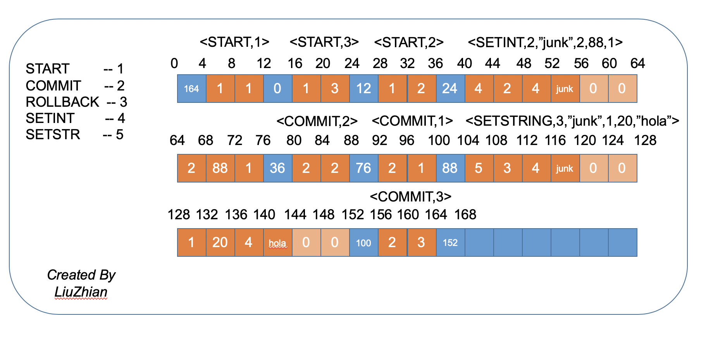

# 第14章 事务管理和包`simpledb.tx`

缓冲管理器允许多个客户端同时访问同一缓冲区，从中任意读取和写入值。这样的造成结果可能是混乱的：每次客户端查看页面时，页面可能具有不同（甚至不一致）的值，从而使客户端无法获得准确的数据库视图。或两个客户端可以在不经意间覆盖彼此的值，从而破坏数据库。

在本章中，我们将学习`恢复管理器（recovery manager）`和`并发管理器（concurrency manager）`,它们的任务是为何数据库的秩序和数据的一致性。每个客户端程序都按照一系列事务而组织，并发管理器调节这些事务的执行以使得它们的行为保持一致。恢复管理器从日志文件中读/写日志记录，以便于在必要的适合，可以`撤销(undo)`未提交事务所作出的更改。本章介绍了这两个管理器的功能以及实现它们的技术。

## 14.1 事务
### 14.1.1 正确的代码执行结果却不正确
考虑一个航班预定数据库，有2个数据库表，它们的schema如下：
```mysql
SEATS(FlightId, NumAvailable, Price)

Cust(CustId, BalanceDue)
```

下面的代码包含了为指定的客户购买一张指定航班机票的JDBC代码、虽然代码本身没有bug，但是当多个客户端并发执行或者服务器崩溃的时候，很多问题都有可能产生。
```Java
public void reserveSeat(Connection conn, int custId, int flightId) throws SQLException{

    Statement stmt= conn.createStatement();
    String s;
    
    // 步骤1：获取剩余票数和价格
    s="SELECT NumAvailable, Price FROM SEATS "+
        " WHERE FlightId= "+flightId;
    ResultSet rs= stmt.executeQuery(s);
    if(!rs.next()){
        System.out.println("Flight doesn't exist!");
        return;
    }
    int numAvailable = rs.getInt("NumAvailable");
    int price = rs.getInt("Price");
    rs.close();
    
    if(numAvailable==0){
        System.out.println("Flight is full!");
        return;
    }
    
    // 步骤2：更新剩余票数
    int newNumAvailable = numAvailable - 1;
    s="UPDATE SEATS set NumAvailable =" +newNumAvailable+
        " WHERE FlightId= "+flightId;
    stmt.executeUpdate(s);
    
    // 步骤3：获取并更新用欠款
    s="SELECT BalanceDue FROM CUST " +
        " WHERE CustId= "+custId;
    rs=stmt.executeQuery(s);
    int newBalance = rs.getInt("BalanceDue")+ price;
    rs.close();
    
    s="UPDATE CUST set BalanceDue =" +newBalance+
        " WHERE CustId= "+custId;
    stmt.executeUpdate(s);
}
```

下述的3个场景示例了这些问题。

①第一个场景，假设两个客户端A、B都并发地运行上述JDBC代码，具体的执行序列如下所示：
- 客户端A执行完步骤1的所有步骤后被打断
- 客户端B执行，直到完成
- 客户端A完成剩余操作

在这个例子中，两个线程都会使用相同的变量值`numAvailable`,这样一来的结果是，两个座位都会被卖出，但是数据库中的剩余座位数只会被减少1次。

②第二个场景，假设线程C正在运行代码，然后再执行完步骤2后，系统崩溃了。在这种情况下，座位将被预定，但是顾客不会被收钱。

③第三个场景，假设一个客户端执行代码直到完成，但是被修改的页没有立即被写回磁盘因为缓冲的原因。假如服务器崩溃了，然后就再也没有办法知道哪个页最终需要写回到磁盘。如果上述代码中的第一次更新写回了磁盘（即剩余机票数），却第二次没有（即更新用户欠费），那么顾客得到了一张免费机票；如果第二次更新写回到了磁盘，第一次却没有，那么客户为一张根本系统中不存在的机票记录买了单；假如两次更新都没写回磁盘，这个情况到还好，就是整个交互记录丢失了，系统根本感受不到用户曾经买过票。

### 14.1.2 事务的属性
在上述的场景说明，如果客户端代码随意运行，那么数据就可能丢掉或损坏。数据库系统通过强制客户端程序包含事务来解决这些问题。

> 事务是一组操作，它们的行为被看做一整个操作来看待。一个事务必须满足`ACID`属性。

“一整个操作”的可以被概括为所谓的ACID属性：`原子性(Atomicity)`,`一致性(Consistency)`,`独立性(Isolation)`和`持久性(Durability)`。
- 原子性的意思是，一个事务要么做完，要么就不做。也就是说，要么事务中的所有操作都执行成功（事务commit了），要么事务执行失败（事务rollback了）
- 一致性的意思是，每个事务都会使得数据库系统处于一个一致性的状态。这意味着每个事务都是可以执行的完整工作单元，且独立于其他事务。
- 独立性的意思是，一个事务的行为在自己看来，就好像整个数据库只在执行当前这个事务。也就是说，如果多个事务并发执行，它们的结果应该和这些事务顺序执行的结果一样，不会因为并发而相互影响。
- 持久性的意思是，提交了的事务修改必须保证持久化到磁盘上。

14.1.1小节中示例的每一个问题都或多或少地违反了上述ACID原则。第一个场景违反了独立性原则，因为每个客户端都读到了相同的`numAvailable`变量值，然而顺序执行两个客户端的代码将导致第二个执行的客户端读到第一个用户修改后的数据；第二个场景违反了原子性原则；第三个场景违反了持久化原则。

> 原子性和持久性描述了commit操作和rollback操作的正确行为。

特别是，已提交的事务必须是持久的，而未提交的事务（由于显式回滚或系统崩溃）必须完全撤消其更改。这些功能是恢复管理器的责任，那是14.3节的主题。
> 一致性和独立性描述了客户端并发操作的正确行为。

特别是，数据库服务器必须防止客户端之前发生冲突，一个典型策略的就是检测何时冲突可能发生，然后让一个客户端等待，直到冲突不再可能发生为止。这些功能都是并发管理器的职责，是14.4节的主题。

## 14.2 在SimpleDB中使用事务
在我们深入到恢复管理器和并发管理器的细节之前，对客户端如何使用事务有个初步的了解，会帮助我们更好地理解。在SimpleDB中，每个JDBC事务都有一个`Transaction`对象，它的API如下所示：
```Java
public class Transaction {

    public Transaction();
    public void commit();
    public void rollback();
    public void recover();

    public void pin(Block blk);
    public void unpin(Block blk);
    public int getInt(Block blk,int offset);
    public String getString(Block blk,int offset);
    public void setInt(Block blk,int offset,int val);
    public void setString(Block blk,int offset,String val);

    public int size(String fileName);
    public Block append(String fileName, PageFormatter pfmt);

}
```
`Transaction`类的方法被分为3大类别，第一类包含了事务生命周期的方法，构造函数开始一个新事务，`commit()`和`rollback()`方法结束一个事务，`recover()`方法会为所有没提交的事务执行回滚方法。

第二类包含了访问磁盘块的方法，这些方法和缓冲管理器中的方法很类似，但一个重要的区别就是，一个事务会将中间存在的缓冲区向客户端隐藏掉，并且不会返回给客户端缓冲区。当客户端执行`getInt()`方法时，传入的是一个块的引用，事务会相应地寻找缓冲区，调用缓冲区的`getInt()`方法，然后把结果传递回客户端。事务把缓冲区的细节向客户端隐藏掉，因此可以对并发管理器和恢复管理器进行必要的调用。例如，`setInt()`方法代码会获得适当的锁（并发控制锁），然后会在修改缓冲区之前，将缓冲区中当前的值写入日志文件（用于恢复）。

第三类包含了和文件管理器相关的两个方法。方法`size()`会读取文件的末尾，方法`append()`会修改它；这些方法会被并发管理器调用从而避免潜在的冲突。

下面的代码片段演示了对事务类的简单实用：
```Java
public class TransactionTest {

    public static void main(String[] args) {
        SimpleDB.init("studentdb");
        Transaction tx = new Transaction();
        Block blk = new Block("junk", 3);
        tx.pin(blk);
        int n = tx.getInt(blk, 392);
        String str = tx.getString(blk, 20);
        tx.unpin(blk);
        System.out.println("Values are " + n + " and " + str);

        tx.pin(blk);
        n = tx.getInt(blk, 392); // 在同一事务内，这条语句必要吗？？？
        tx.setInt(blk, 392, n + 1);
        tx.unpin(blk);

        PageFormatter pfmt = new ABCStringFormatter();
        Block newBlk = tx.append("junk", pfmt);
        tx.pin(newBlk);
        String s = tx.getString(newBlk, 0);
        assert (s.equals("abc"));
        tx.unpin(newBlk);
        int newBlkNum = newBlk.number();
        System.out.println("The first string in block "
                + newBlkNum + " is" + newBlkNum);
        
        tx.commit();
    }
}
```
该代码由三部分组成，它们和第13章的测试用例执行相同的任务。第一部分将文件`junk`的block 3固定，并从中读取两个值：偏移量为392的整数和偏移量为20的字符串。第二部分把该块的偏移量392处的整数自增1。第三部分则格式化一个新页，将其附加到文件`junk`中，并读取存储在偏移量0中的值；最后，事务提交。

这个示例代码比第13章中对应的示例代码更简洁一些，主要是因为事务对象会负责管理缓冲和日志，其实同样重要的是，事务对象也会管理并发客户端相关的问题。

例如，观察代码我们可以发现，第一部分和第二部分都对`getInt()`方法进行了的调用，我们需要调用两次吗？第二次调用是否总是返回与第一次调用完全相同的值？在没有并发控制的情况下，答案是“否”。假定此代码在执行第一次调用之后，但又在执行第二次调用之前被中断，并且另一个客户端在此中断期间执行并修改了偏移量392的值。然后，第二个调用实际上将返回与第一个调用不同的东西。（这是第8.2.3节中提到的“不可重复读取”）此方案违反了事务的独立性原则，因此Transaction对象需要对此负责，并确保这种情况不会发生。换句话说，由于并发控制的存在，我们的确不需要第二次调用`getInt()`。

## 14.3 恢复管理器
恢复管理器是数据库服务端负责读取并且处理日志信息的部分。它主要有三大功能：`写日志记录`、`回滚事务`和`数据库系统崩溃后恢复`。这一节中我们将研究这些功能的细节。

### 14.3.1 日志记录
为了能够回滚事务，恢复管理器将有关事务活动的信息保存在日志中。特别是，在每次发生一个loggable的事件时，它会将一条相关的`日志记录(log record)`写入日志文件中。日志记录有四种基本类型：`开始日志记录（start log record）`，`提交日志记录（commit log record）`，`回滚日志记录（rollback log record）`和`更新日志记录（update log record）`。我们将遵循SimpleDB中的设定并假设有两种更新日志记录：一种用于更新整数，另一种用于更新字符串。

> 三种可以引发日志记录写入的事件为：
- 事务开始时的开始日志记录
- 事务完成时的提交日志记录或回滚日志记录
- 当事务修改某个值时的修改日志记录

另一个潜在的loggable的事件是在文件末尾附加一个块。然后，如果事务回滚，则可以从文件中释放由`append()`方法分配的新块。另一方面，让新块保留在那不做任何修改也不会有任何危害，因为它不会影响其他的事务。为了简单起见，我们将忽略追加`日志记录(log append record)`的可能性。 练习14.48解决了这个问题

作为示例，再次考虑上述使用事务的代码片段，该片段在文件`junk`的block3,偏移量为392处的整数进行了自增1。假设事务的ID为27，并且该偏移处的旧值为整数542。下面的序列中包含了从此代码生成的日志记录：
```
<START, 27>
<SETINT, 27, junk, 3, 392, 542, 543>
<COMMIT, 27>
```
请注意，每条日志记录都包含有关该记录的类型描述（START，SETINT，SETSTRING，COMMIT或ROLLBACK）及其事务的ID。更新日志记录包含五项其他内容：修改的文件名、块号、进行修改的位置的偏移量、该偏移量处的旧值，以及该偏移量处的新值。

通常，多个事务将并发地写入日志，因此给定事务的日志记录将被分散在整个日志中。

### 14.3.2 回滚
日志的一个作用是帮助恢复管理器`回滚（roll back）`一个指定的事务。
> 恢复管理器通过撤销修改来回滚一个事务。

由于这些修改已列在更新日志记录中，因此扫描日志，查找每个更新记录并将每个修改后值恢复到原始内容是相对简单的事情。算法14-5给出了该算法的描述。

```
Algorithm 14-5 事务T的回滚算法

1. 把最近的日志记录作为当前日志记录;
2. while(当前日志记录 != 事务T的开始日志记录){
        if(当前日志记录 == 事务T的更新日志记录)
            在指定位置写入修改前的old value;
        else
           当前日志记录 = 上一条日志记录; 
    }
3. 追加一条回滚日志记录到日志文件;
```
为什么此算法从日志文件末尾开始向前读取，而不是从开始位置向后读取？有两个原因：

- 第一个原因是，日志文件的开头部分一般已经完成的事务的日志记录，而且这些事务一般离现在都很久远，我们正在寻找的日志记录最有可能在日志的末尾，因此从末尾读取效率更高；
- 第二个更重要的原因是要确保正确性。假设某个位置的值被修改多次，然后日志文件中将有对应该位置的多个日志记录，每个都有不同的值。 要恢复的值应该来自这些日志记录中最早的那个，如果我们以相反的顺序处理日志记录，则刚好对应这种情况发生。

### 14.3.3 恢复
日志的另一个作用是恢复数据库。
> 系统恢复会在每次数据库系统开启时执行，它的作用是将数据库恢复至一个合理的状态。

合理的状态有两层意思，即：
- 未提交的事务都回滚好了。
- 提交了的事务都持久化到磁盘了。

当数据库系统先启动，再正常关闭后，数据库应该已经处于合理的状态，因为正常的关闭过程是会等到现有事务完成后再flush所有的缓冲区。但是，如果意外导致意外崩溃，则可能有未完成的事务丢失了中间某些执行步骤，由于系统无法完成它们，因此必须undo其作出的修改；也可能有已经提交了的事务，但是其修改尚未刷新到磁盘，这些修改必须redo。

> 在数据库恢复的过程中，由于未提交事务而带来的修改必须被undo，由于已经提交事务而带来的修改（即页中的内容没有flush到磁盘上去）必须redo。

恢复管理器假设，如果一个事务是提交了的事务，当且仅当该事务存在一条对应的提交日志记录或回滚日志记录。所以，如果一个事务在系统崩溃前已经提交了，但是它所创建的提交日志记录并没有写回到日志文件，那么恢复管理器会将这个事务看作是一个实际上并没有完成的事务。这个场景看起来好像不是那么公平，但是如果没有日志记录的存在，恢复管理器也真的没法做出其他的一些什么事情来。所有知道的事情全部在日志文件中，因为有关事务的所有其他信息在系统崩溃时被清除了。

实际上，回滚一个已经提交的事务不仅是不公平的，它也违反了ACID原则中的持久化原则，恢复管理器必须确保这个场景不会发生。

> 恢复管理器必须在完成一个事务提交操作前，将提交日志记录flush到日志文件上去。

回想一下，flush一条日志记录也会flush所有之前的日志记录（当然，所有之前的日志记录指的是在同一个日志页中的之前所有日志记录）。所有当恢复管理器在日志文件中发现一条日志提交记录时，它会知道该事务的之前的更新日志记录（如果存在的话）也肯定在日志文件中。

每条更新日志记录包含了修改前的old value和修改后的new value。其中old value用在undo的时候使用，而new value用在redo的时候使用，算法14-6展示了恢复算法。
```
Algorithm 14-6 恢复算法

// undo 步骤 （负责处理那些未提交的事务，这些事务有可能已经将数据flush到磁盘上）
1. 对于每条日志记录(从日志文件尾部一直往前读){
    if(当前日志记录 instanceof 提交日志记录)
        将该事务添加到提交事务列表中
    if(当前日志记录 instanceof 回滚日志记录)
        将该事务添加到回滚事务列表中
    if( (当前日志记录 instanceof 更新日志记录) && 
        !提交事务列表.contains(当前事务) && 
        !回滚事务列表.contains(当前事务)  )
        在指定的位置的数据恢复成old value
}
     
// redo 步骤 （负责处理那些已经提交了，但未flush数据到磁盘的事务）
2. 对于每条日志记录(从日志文件头部一直往后读){
    if( (当前日志记录 instanceof 更新日志记录) && 
        提交事务列表.contains(当前事务) )
        在指定的位置的数据恢复成new value
}

```
阶段1 undo了未提交的事务，正如算法中描述的意义，我们必须从后往前读日志文件来确保正确性。从后往前读也意味着，如果某个事务已经提交，那么在读取到该事务的某条update log record之前肯定会先读到该事务的commit log record；所以当算法遇到任意一条update log record记录时，算法会知道是否需要做undo操作。

注意到，阶段1必须读取整个日志文件，例如，某个事务在进入无限循环之前可能已经对数据库进行了更改，因此，除非我们阅读日志的开头，否则将找不到该条更新记录。

阶段2 redo了已经提交的事务，由于恢复管理器不知道哪些缓冲区flush了，哪些没有flush，它会redo所有由提交事务带来的数据更改。

恢复管理器在执行阶段2时是从前往后读取日志文件的，恢复管理器知道哪些update log record需要被redo，因为在步骤1中我们已经得到了提交事务列表。注意，在redo的步骤中，我们也*_必须_*从后往前读取日志文件，假如一个提交的事务刚好修改了某个相同的值多次，那么最后一次恢复到的记录才应该对应是最后一次的修改的值。

请注意，恢复算法不需要考虑数据库的当前状态。恢复管理器将旧值或新值写入数据库，而无需查看这些位置的当前值，因为日志文件中的每条记录会准确地告诉恢复管理器，数据库中的内容是什么。此功能有两个后果：
- 恢复是幂等的。
- 恢复可能导致不必要的磁盘写入。

幂等是指执行恢复算法几次与执行一次恢复的效果相同。实际上，即使只运行了一部分恢复算法，此时立即再次重新运行恢复算法，你仍然会得到相同的结果。此属性对于算法的正确性至关重要。例如，假设数据库处于恢复算法中间时，系统崩溃，当数据库系统重新启动时，它将从头开始再次运行恢复算法。如果该算法不是幂等的，则重新运行恢复算法可能会损坏数据库。

由于此算法不会查看数据库的当前内容，因此可能会进行不必要的更改。例如，假定已提交事务所做的修改已写入磁盘；然后在阶段2中redo这些更改，将修改后的值设置为它们已经具有的值。你可以对算法进行修改，以使其不会进行这些不必要的磁盘写入。详情请参阅练习14.44。

### 14.3.4 Undo-only 和redo-only 恢复
上一节的恢复算法执行undo和redo操作。一些数据库系统选择简化算法，以便仅执行undo操作或仅执行redo操作。也就是说，它执行算法的阶段1或阶段2，但不能同时执行。

***Undo-only 恢复***

如果恢复管理器确定所有提交的修改都已写入磁盘，则可以省略阶段2。恢复管理器可以通过在将提交记录写入日志之前将缓冲区强制到磁盘来达到这一目的。算法14-7将这种方法表示为一种算法，恢复管理器必须严格按照给定的顺序执行此算法的步骤：
```
Algorithm 14-7 Undo-only恢复下的事务提交算法

1. 将事务修改的页中的内容flush到磁盘上。
2. 写一条commit log record。
3. 将包含日志记录的日志页flush到日志文件上。
```
让我们将Undo-only恢复与Undo-redo恢复进行一个比较。Undo-only恢复的速度更快，因为仅需要一次遍历日志文件，而不是两次。日志也较小，因为更新日志记录不再需要包含新的修改值；但另一方面，提交操作会慢很多，因为它必须刷新修改后的缓冲区。如果我们假设系统崩溃很少发生，那么Undo-redo恢复就是最好的选择。事务不仅提交速度更快，而且由于延迟了缓冲区刷新，因此总的磁盘写次数应该更少。

***redo-only  恢复***

如果恢复管理器确定所有未提交事务对应修改的缓冲区内容尚未写入磁盘，则可以省略阶段1。恢复管理器可以通过使每个事务保持其缓冲区固定，直到事务完成，来实现这一目的。因为固定的缓冲区将不会被选择替换，因此其内容也不会被flush到磁盘上（译者注：忘记了吗？在第13中有讲解道，我们在替换一个缓冲页前，必须flush一下之前的内容）。但是，当事务回滚时，我们需要“擦除”该事务对缓冲区做出的修改。算法14-8对回滚算法进行了必要的修订：
```
Algorithm 14-8 redo-only恢复下的事务回滚算法

对于每个事务修改的缓冲区：
    a) 将缓冲区标记为未分配的。（在SimpleD中，将缓冲区的块号设置为-1即可）
    b) 将缓冲区标记为未修改的。
    c) 将缓冲区取消固定。
    
```
redo-only恢复比Undo-redo恢复执行要快，因为可以忽略未提交的事务。但是，它要求为每个事务保证有1个缓冲区，用来固定它将修改的每个块，这增加了系统中缓冲区的争用。在大型数据库中，此争用会严重影响所有事务的性能，这使得redo-only恢复是一个冒险的选择。

考虑是否可以将Undo-only和redo-only技术相结合，来创建不需要阶段1或阶段2的恢复算法是很有趣的。详情请参阅练习14.19。

### 14.3.5 预写日志
我们需要更详细地检查一下恢复算法14-6的阶段1。回想一下，此步骤遍历日志，对未完成的事务中的每个更新记录执行undo操作。为了证明这一步骤的正确性，我们做出以下假设：**未完成事务的所有更新记录都将在日志文件中**，未持久化到磁盘的更新日志记录无法被undo，这意味着数据库将变得失效。

由于系统随时可能崩溃，万一日志管理器在将日志页flush到磁盘的过程中，系统崩溃了怎么办？因此，能满足此假设的唯一方法是：在每次完成某个更新数据操作后，立马让日志管理器在写入一个对应的更新日志记录，并flush到磁盘上。但是正如我们在13.2节中看到的一样，这种策略效率不太高，我们需要一个更好的方法。

让我们一起来分析一下各种可能出现问题的情况。假设一个未提交的事务修改了一个页，并且创建了一条更新日志记录，假如系统崩溃了，可能有以下的四种情况发生：
1. 修改的页和日志记录都被写入了磁盘。
2. 只有修改的页被写入了磁盘。
3. 只有日志记录被写入了磁盘。
4. 两个都没被写入磁盘。

我们一个个来分析：

- 如果第1种情况发生了，于是恢复算法将会找到对应的日志记录并且undo，把old value写回到磁盘的数据块中，这不会产生什么问题；
- 如果第2种情况发生了，于是恢复算法将找不到日志记录，所以它不会undo，它也不知道怎么undo，这是一个很严重的问题；
- 假如第3种情况发生了，于是恢复算法将会找到日志记录，然后执行undo操作，只不过这里和第1种情况的区别是，现在数据块中的数据其实根本不是new value，而是old value，但是恢复算法会认为是new value，于是把数据替换成old value，只不过现在就是给一个值再次赋予它本身，并不是什么错误，只是稍微有点浪费时间而已，反正是没错误的；
- 如果第4种情况发生，恢复算法找不到日志记录，但是数据也反正没写到磁盘上，没有发生实际的更改，也没有什么影响，没问题。

所以，第2种情况才是真正的问题所在，这个情况可以避免发生，只要恢复管理器确保一条更新记录总是会在修改相应的缓冲区页前被写入到磁盘上，这个策略被称为`预写日志（write-ahead log）`。注意，一条更新日志可能描述的是一个实际上根本没发生的数据修改情况，但一旦数据库发生了某些修改，我们总是可以在日志中找到相应的更新日志记录，从而找到相应的修改情况。（译者注：注意，这和我们在Algorithm 14-7 Undo-only恢复下的事务提交算法是不一样的）

> 在预写日志的策略中，只有在相应的更新日志记录全部被写回到文件后，一个修改的缓冲区才能被写回磁盘。

实施预写日志的标准方法是让每个缓冲区保存与其最近修改相对应的日志记录的LSN。在替换修改后的缓冲区页面之前，缓冲区告诉日志管理器将日志刷新到其LSN。LSN较高的日志记录不会受到影响，也不会被刷新。

### 14.3.6 静态检查点
日志包含对数据库的每次修改的历史记录。随着时间的流逝，日志文件的大小可能会变得非常大——在某些情况下可能甚至会大于数据文件。而我们在恢复期间又必须读取整个日志并undo/redo操作，因此，对数据库的更改是一项可怕的事。因此，存仅读取部分日志文件，从而对数据库进行恢复的恢复算法已经被提出。基本思想如下：
> 恢复算法可以停止搜索日志文件，当：
    - 所有的更早的日志记录都是被已经完成的事务所创建的；并且
    - 事务对应的缓冲区都被flush到了磁盘上。

第一个要点适用于恢复算法的undo阶段，它确保没有更多未提交的事务要回滚。第二个要点适用于redo阶段，并确保不需要重做所有先前提交的事务。请注意，如果恢复管理器实施的是undo-only恢复算法，则第二个要点永远是正确的。

恢复管理器可以在任何时间执行静态检查点操作，如算法14-9所示。该算法的步骤2确保满足第一个要点，步骤3确保满足第二个要点。
```
Algorithm 14-9 执行一次静态检查算法

1. 停止接受新的事务。
2. 等待存在的事务完成。
3. flush所有修改的缓冲区到磁盘。
4. 追加一条静态检查点日志记录，并且flush到日志文件中。
5. 开始接受新的事务。

```
静态检查点日志记录就是日志文件中的一个标记记录而已。当恢复算法14-6的阶段1在不断从后往前访问日志记录，直到遇到静态检查点日志记录时，算法就会知道更早的日志记录可以被忽略；于是它开始执行算法的阶段2，并且是从静态检查点日志记录开始，从前往后扫描日志记录。

> 恢复管理器不需要检查静态检查点日志记录之前的所有日志记录。

进行静态检查点的最好时机是在系统启动期间，并且是在恢复算法完成之后以及新事务开始之前。由于恢复算法刚刚完成了日志的处理，因此恢复管理器将不再需要再次检查那些日志记录。

例如，请考虑下面所示的日志文件，此示例说明了三件事：首先，一旦检查过程开始了，就无法启动任何新事务；第二，最后一个事务完成并且缓冲区被flush后，立即写入检查点记录日志记录；第三，其他事务可能会在写入检查点记录后立即开始。
```
<START, 0>
<SETINT, 0, junk, 33, 8, 542, 543>
<START, 1>
<START, 2>
<COMMIT, 1>
<SETSTRING, 2, junk, 44, 20, hello, ciao>
    //The quiescent checkpoint procedure starts here
<SETSTRING, 0, junk, 33, 12, joe, joseph>
<COMMIT, 0>
    //tx 3 wants to start here, but must wait
<SETINT, 2, junk, 66, 8, 0, 116>
<COMMIT, 2>
<CHECKPOINT>
<START, 3>
<SETINT, 3, junk, 33, 8, 543, 120>
```
### 14.3.7 非静态检查点

### 14.3.8 数据项的粒度

本节的恢复管理算法记录并还原值。即，每次修改值时都会创建一条更新日志记录，该日志记录包含该值的先前和新版本，我们称日志记录中的数据单元为`恢复数据项（recovery data item）`。

> 恢复数据项是被恢复管理器使用，位于一条更新日志记录中的数据部分的单元,这个数据项的大小被称为`粒度(granularity)`。

恢复管理器可以选择使用块或文件，而不是使用单个的值作为数据项。例如，假设选择块作为数据项。在这种情况下，每次修改块时都将创建一条更新日志记录，并将该块的先前值和新值存储在日志记录中。

每次记录一个块的优点是，如果使用undo-only恢复，则需要的日志记录会更少。 假设一个事务固定一个块，修改几个值，然后取消固定它，我们可以将块的原始内容保存在单个日志记录中，而不必为每个修改后的值编写一个日志记录。当然，缺点就是更新日志记录本身将变得很大，无论块实际更改多少，都将保存该块的全部内容到日志记录中。因此，仅当事务倾向于对每个块进行大量修改时，日志记录整个块才有意义。

现在考虑一下如果将文件用作数据项的意义。一个事务将为它更改的每个文件生成一个更新日志记录，每条日志记录将包含该文件的全部原始内容。要回滚事务，我们只需要将现有文件替换为其原始版本即可。几乎可以肯定，这种方法不如使用值或块作为数据项实用，因为无论更改多少值，每个事务都必须复制整个文件。

尽管文件粒度数据项对于数据库系统不太切合实际，但非数据库应用程序经常使用它们。例如，假设您在编辑文件时系统崩溃，系统重新启动后，某些文字处理程序（例如Word）可以为您显示文件的两个版本：您最近保存的版本以及崩溃时已存在的版本。原因是那些文字处理程序不会将您的修改直接写到原始文件，而是直接写到副本。保存时，修改后的文件将被复制到原始文件中。此策略是基于文件的日志记录的粗略版本。

### 14.3.9 SimpleDB的恢复管理器
SimpleDB的恢复管理器的实现在包`simpledb.tx.recovery`中，类`RecoveryMgr`的API如下所示：
```Java
public class RecoveryMgr {
    public RecoveryMgr(int txNum);
    public void commit();
    public void  rollback();
    public void recover();
    public int setInt(Buffer buffer,int offset,int newVal);
    public int setString(Buffer buffer,int offset,String newStr);
}
```
**每个事务都会创建其自己的恢复管理器**，恢复管理器中含有写入对应该事务某些日志记录的方法。例如，构造函数中会写一条开始日志记录到日志文件中；`commit()`方法和`rollback()`方法也会将相应的提交日志记录或回滚日志记录写到日志文件中去；`setInt()`和`setString()`方法中则会先将指定位置的old value先提取出来，再写一条对应的更新日志记录。`commit()`方法和`rollback()`方法也会执行相应的回滚（或恢复）算法。

SimpleDB的代码实现遵从了下述的原则：
> SimpleDB的恢复管理器使用的是Undo-only恢复算法，并且数据项的粒度是一个个的值。

_正因为SimpleDB的恢复管理器使用的是Undo-only恢复算法，也就是说不需要执行redo操作，这进一步可以简化我们的日志记录，即现在在SETINT和SETSTRING日志记录中，不再需要保留new value，只保留一个old value即可。例如，原来的`<SETSTRING, 2, junk, 44, 20, hello, hola>`现在换成`<SETSTRING, 2, junk, 44, 20, hello>`即可。_

> 不再需要保留new value，只保留一个old value即可。
不再需要保留new value，只保留一个old value即可。
不再需要保留new value，只保留一个old value即可。

重要的事情说3遍！！！因为你接下来将会看到，我们的代码就是这样实现的！

SimpleDB恢复管理器的实现代码主要可以分为3个关注点：
- 实现日志记录的代码
- 迭代日志文件的代码
- 实现回滚和恢复算法的代码

***LogRecord 接口***

一条日志记录其实就是通过一系列字节数组来实现的。日志记录的第一个值是一个标识日志记录操作类型的整数，操作类型可能是`CHECKPOINT`, `START`, `COMMIT`, `ROLLBACK`, `SETINT`, `SETSTRING`其中的一种，剩下的值就和具体的操作类型有关了——一条静态检查日志记录没有其他的值，而一条更新日志记录有5个另外的值，其他的日志记录又有其他自己的值。每种日志记录都实现了`LogRecord`接口，代码如下:
```Java
public interface LogRecord {

    static final int CHECKPOINT = 0, START = 1,
            COMMIT = 2, ROLLBACK = 3,
            SETINT = 4, SETSTRING = 5;
    int writeToLog();
    int op();
    int txNumber();
    void undo();
}
```
接口定义了方法`writeToLog()`，该方法将记录追加到日志并返回其LSN。该接口还定义了三种方法来提取日志记录的组件。方法`op()`返回记录的操作类型，方法`txNumber()`返回写入日志记录的事务的ID，除了静态检查记录以外，此方法对于其他所有日志记录都有意义（静态检查记录会返回一个虚拟ID值）。`undo()`方法将还原存储在该记录中的所有更改。仅`setint`和`setstring`的日志记录将具有非空的undo方法，这些记录的方法会将缓冲区固定指定的块，将指定的值写入指定的偏移量，然后取消固定缓冲区。

每一种日志记录都会有相似的代码实现，我们看一下其中一种类型的实现就够了，例如`SetStringRecord`类，如下所示：
```Java
public class SetStringRecord implements LogRecord {
    private int myTxNum;
    private int offset;

    private String val;
    private Block blk;

    public SetStringRecord(int myTxNum, Block blk, int offset, String val) {
        this.myTxNum = myTxNum;
        this.offset = offset;
        this.blk = blk;
        this.val = val;
    }

    /**
     * 根据一条BasicLogRecord来构造一条SetStringRecord。
     * 该构造函数是为了给 恢复/回滚 算法调用
     * <p>
     * 注意，一条更新日志记录的格式为：
     * <p>
     * <SETxxx,txNum,fileName,blkNum,offset,old value,new value>
     *
     * @param blr
     */
    public SetStringRecord(BasicLogRecord blr) {
        myTxNum = blr.nextInt();
        String fileName = blr.nextString();
        int blkNum = blr.nextInt();
        blk = new Block(fileName, blkNum);
        offset = blr.nextInt();
        val = blr.nextString();
    }

    /**
     * 将一条日志记录写入日志文件，返回LSN
     *
     * @return
     */
    @Override
    public int writeToLog() {
        Object[] rec = new Object[]{SETSTRING, myTxNum,
                blk.filename(), offset, val};

        LogMgr logMgr = SimpleDB.logMgr();
        return logMgr.append(rec);
    }

    /**
     * 返回日志记录的操作符。
     * <p>
     * CHECKPOINT = 0, START = 1,
     * COMMIT = 2, ROLLBACK = 3,
     * SETINT = 4, SETSTRING = 5;
     *
     * @return integer
     */
    @Override
    public int op() {
        return SETSTRING;
    }

    @Override
    public int txNumber() {
        return myTxNum;
    }

    @Override
    public void undo() {
        BufferMgr bufferMgr = SimpleDB.bufferMgr();
        Buffer buff = bufferMgr.pin(blk);
        buff.setString(offset, val, myTxNum, -1);
        bufferMgr.unpin(buff);
    }

    public String toString() {
        return "<SETSTRING " + myTxNum + " " + blk + " " + offset
               + " " + val + ">";
    }
    
}
```
该类有2个构造函数，第一个有日志记录属性的一些参数，并且简单地存储了一下它们而已，这个构造函数在每次将日志记录写回到磁盘前会被正确调用；另外一个构造函数是被回滚和恢复算法调用的方法，传入的是一个`BasicLogRecord`类的对象，然后我们可以通过这个对象来不断提取出相应的int或string类型的值。

`undo()`方法则会将一个缓冲区与一个修改过的块固定起来，恢复存储的值，然后取消固定。`undo()`方法实现中的一个小故障是：`setString()`方法期待获得与当前修改相对应的日志记录的LSN。当然，在这种情况下，再次记录恢复的值是没意义的，所有在这里我们传入了一个dummy的LSN，即-1。

***迭代日志文件***

`LogRecordIterator`类允许客户端从后往前遍历日志文件，每次迭代一条日志记录，代码如下：
```Java
public class LogRecordIterator implements Iterator<LogRecord> {
    // 先获得一个BasicLogRecord迭代器
    // 此迭代器迭代得到结果是一条条raw的日志记录
    private Iterator<BasicLogRecord> iter = SimpleDB.logMgr().iterator();


    @Override
    public boolean hasNext() {
        return iter.hasNext();
    }

    @Override
    public LogRecord next() {
        BasicLogRecord blr = iter.next();
        int op = blr.nextInt();
        switch (op) {
            case CHECKPOINT:
                return new CheckpointRecord(blr);
            case START:
                return new StartRecord(blr);
            case COMMIT:
                return new CommitRecord(blr);
            case ROLLBACK:
                return new RollBackRecord(blr);
            case SETINT:
                return new SetIntRecord(blr);
            case SETSTRING:
                return new SetStringRecord(blr);
            default:
                return null;
        }

    }

    public void remove() {
        throw new UnsupportedOperationException();
    }
}
```
上述代码比较简单直接，构造函数调用了日志管理器的获得`BasicLogIterator`迭代器的方法，`BasicLogIterator`迭代器迭代得到结果是一条条raw的日志记录。所以在`LogRecordIterator`迭代器里的`next()`方法中，需要解析每条记录具体是什么类型的。首先，我们先读取每条日志记录最开头的4个字节，也就是日志记录的类型操作符，然后再根据具体的类型来构造不同类型的日志记录对象。

下面的代码片段演示了如何使用`LogRecordIterator`迭代器来逆序迭代访问日志文件：
```Java
Iterator<LogRecord> iter = new LogRecordIterator();
while (iter.hasNext()) {
    LogRecord rec = iter.next();
    System.out.println(rec.toString());
}
```
***回滚和恢复***

`RecoveryMgr`类实现了恢复管理器的API，它的具体实现代码如下所示。代码中的每个方法实现的都是前面小节中提到的undo-only恢复算法。特别是，`commit()`方法和`rollback()`方法会在写入日志文件之前，将该事务对应的缓冲区flush到磁盘上去；`doRollback()`方法和`doRecover()`方法会从后往前遍历一遍日志文件。

```Java
public class RecoveryMgr {

    private int txNum;

    /**
     * 为指定的事务创建一个恢复管理器
     *
     * @param txNum 指定事务的ID
     */
    public RecoveryMgr(int txNum) {
        this.txNum = txNum;
        new StartRecord(txNum).writeToLog();
    }

    /**
     * 写入一条提交日志记录,并将日志记录flush到日志文件
     * <p>
     * 注意，在SimpleDB中，采用的是undo-only恢复算法，
     * 因此在提交日志记录被写入前，必须将，当前事务对应的，并且是修改过的缓冲区，
     * flush到磁盘上。
     * <p>
     * 详情参阅第14章中的算法14-7
     */
    public void commit() {
        SimpleDB.bufferMgr().flushAll(txNum);
        int lsn = new CommitRecord(txNum).writeToLog();
        SimpleDB.logMgr().flush(lsn);
    }

    public void rollback() {
        SimpleDB.bufferMgr().flushAll(txNum);
        doRollback();  // 把修改后的值，再改回来
        int lsn = new RollBackRecord(txNum).writeToLog();
        SimpleDB.logMgr().flush(lsn);
    }

    public void recover() {
        SimpleDB.bufferMgr().flushAll(txNum);
        doRecover();  // 把修改后的值，再改回来
        int lsn = new CheckpointRecord().writeToLog();
        SimpleDB.logMgr().flush(lsn);
    }

    /**
     * 写一条SetInt日志记录到日志文件, 并返回其LSN
     * <p>
     * 对临时文件作的修改将不被保存，此时返回的LSN是一个负值，没有意义。
     *
     * @param buffer
     * @param offset
     * @param newVal
     * @return
     */
    public int setInt(Buffer buffer, int offset, int newVal) {
        int oldVal = buffer.getInt(offset);
        Block blk = buffer.block();

        if (isTemporaryBlock(blk))
            return -1;
        else
            return new SetIntRecord(txNum, blk, offset, oldVal).writeToLog();

    }

    /**
     * 写一条SetString日志记录到日志文件, 并返回其LSN
     * <p>
     * 对临时文件作的修改将不被保存，此时返回的LSN是一个负值，没有意义。
     *
     * @param buffer
     * @param offset
     * @param newStr
     * @return
     */
    public int setString(Buffer buffer, int offset, String newStr) {
        String oldVal = buffer.getString(offset);
        Block blk = buffer.block();

        if (isTemporaryBlock(blk))
            return -1;
        else
            return new SetStringRecord(txNum, blk, offset, oldVal).writeToLog();

    }

    /**
     * 回滚事务。
     * <p>
     * 该方法会遍历日志记录，调用遍历到的每条日志记录的undo()方法，
     * 直到该事务的START日志记录为止。
     */
    private void doRollback() {
        Iterator<LogRecord> iter = new LogRecordIterator();
        while (iter.hasNext()) {
            LogRecord rec = iter.next();
            if (rec.txNumber() == this.txNum) {
                if (rec.op() == LogRecord.START)
                    return;
                else
                    // 其实只有SetIntRecord和SetStringRecord
                    // 的undo()方法才有具体的实现，其他日志记录类
                    // 的undo()方法都是空方法。
                    rec.undo();
            }
        }

    }

    /**
     * 执行一次数据库恢复操作。
     * <p>
     * 该方法会遍历日志记录，无论何时它发现一个未完成事务的日志记录，
     * 它都会调用该日志记录的undo()方法。
     * <p>
     * 当遇到一个CHECKPOINT日志记录或日志文件尾时（从后往前读，所以实际上是文件头），
     * 恢复算法停止。
     */
    private void doRecover() {
        // 已经提交事务的ID集合
        Collection<Integer> committedTxs = new ArrayList<>();
        Iterator<LogRecord> iter = new LogRecordIterator();
        while (iter.hasNext()) {
            LogRecord rec = iter.next();
            if (rec.op() == LogRecord.CHECKPOINT)
                return;
            // TODO: 这个地方和作者提供的原始代码不太一样
            // TODO: 译者认为，已经提交的事务应该包括已经commit和rollback的事务，这样更好理解
            // TODO: 当然，按照作者提供的原始代码在执行效果上和当前是等价的
            // TODO: 因为，rollback日志记录的undo()方法为空！
            if (rec.op() == LogRecord.COMMIT || rec.op()==LogRecord.ROLLBACK)
                committedTxs.add(rec.txNumber());
            else if (!committedTxs.contains(rec.txNumber()))
                // 其实只有SetIntRecord和SetStringRecord
                // 的undo()方法才有具体的实现，其他日志记录类
                // 的undo()方法都是空方法。
                rec.undo();
        }
    }

    private boolean isTemporaryBlock(Block blk) {
        return blk.filename().startsWith("temp");
    }
}
```
`doRollback()`方法会读取指定事务的日志记录直到遇到START日志记录，每次它找到一个该事务的日志记录，都会调用该日志记录的`undo()`方法，当遇到该事务的START日志记录时，就会停止迭代。（译者注：其实只有SetIntRecord和SetStringRecord的undo()方法才有具体的实现，其他日志记录类的undo()方法都是空方法，所以实际上，只有SetIntRecord和SetStringRecord类型的日志记录才会执行对应的回滚操作，这也十分合乎逻辑，之所以给其他日志记录也加上`undo()`方法是为了方便用一个统一的接口来管理代码）。

`doRecover()`方法有差不多的实现，它读取整个日志文件的日志记录，直到遇到Checkpoint日志记录或者日志文件尾部（实际上是日志文件的头部），和`doRollback()`方法中一样，会undo那些没提交事务而造成的更新，区别就是，在处理的过程中，会维护一个已经提交的事务的ID集合。这个方法和算法14-6中的步骤有一些不同，区别在于代码实现中，对应那些已经回滚的事务，也会执行undo操作，虽然说这样的实现在最终的效果来看不会产生什么影响（具体可以参考代码中的注释），只是有点效率低。（译者注：上述实现是作者提供原始代码的修改版本，即已经提交的事务应该包括已经commit和rollback的事务，即已经rollback的事务不再进行回滚操作）

该代码中的另一个详细信息是`setInt()`和`setString()`方法不会undo临时文件中的修改（即以“temp”名字开头的文件）。临时文件是在`物化查询处理（materialized query processing）`过程中创建的（请参见第22章），它们之后会被删除，因此恢复其中的更改没有任何意义。

## 14.4 并发管理器
*声明：14.4小节翻译的并不很好，甚至有时会让你觉得翻译的很僵硬，让人没有头绪。是的，请毫不犹豫地怀疑我的水平并对照英文版查看，如果你有更好的翻译见解，请email联系。*

并发管理器是数据库服务器中负责正确执行并发事务的部分。在本节中，我们将研究执行“正确”意味着什么，并研究用于确保正确性的并发相关的算法。

### 14.4.1 顺序化调度(Serializable schedules)
*译者注:我个人感觉把schedules翻译成调度不是特别的合适，无奈又感觉很难用一个中文词语来描述，这里的调度指的就是一系列按照一定顺序组织起来的操作。*

我们把一个事务的`访问历史(history)`定义为一系列因数据库文件访问而引发的方法调用——即，`getXXX/setXXX()`方法。例如，回顾一下14.2小节中的示例代码，并且在这里只讨论代码前两段的事务，该事务对应的访问历史如下，有点乏味：
```
int n = tx.getInt(new Block("junk", 3), 392);
String str = tx.getString(new Block("junk", 3), 20);
tx.setInt(new Block("junk", 3), 392, n+1);
```
实际上，表达一个事务的访问历史的更简单的方式是，只对受影响的块进行描述：
```
tx: R(junk,3); R(junk,3); W(junk,3);
```
也就是说，该事务的历史访问表明，该事务从文件`junk`的第3块中读取了2次，并且写入了该块1次。
> 一个事务的历史访问描述了该事务对应的数据库操作序列。

在这里，我们说的术语“数据库操作”是一种有意的含糊表达。上面的示例首先将数据库操作视为块中某个值的修改（int或string类型），然后视为对磁盘块的读/写。其他粒度也是可能的，我们将在14.4.8小节中讨论。在此之前，我们将假定数据库操作是对磁盘块的读取或写入。

当多个事务并发执行时，数据库系统将交错执行其线程，即周期性第中断一个线程，然后恢复另一个线程（在SimpleDB中，Java运行时环境会为我们自动地处理交错执行线程）。因此，并发管理器的实际数据库操作将会是一个，不可预测的，交替执行着的历史访问，我们称这种交替执行序列为一个`调度（schedule）`
> 一个`调度（schedule）`是指一个事务对应的历史访问在数据库系统底层实际交错执行的序列。

并发控制的目的就是为了确保只有正确的调度被执行。但是，怎样的顺序才是“正确的”呢？好，我们考虑一个最简单的调度——所有的事务一个个顺序地执行。这个调度中的操作不会交错地执行；也就是说，该调度就是简单地将每个事务的历史访问一个接一个第顺序执行，我们称这种调度为一个`顺序调度（serial schedule）`。
> 一个`顺序调度（serial schedule）`是各事务访问历史不会交错执行的调度。

并发控制正是基于`顺序调度的结果是正确的`假设的，实际上，顺序调度也没有并发。

使用顺序调度的结果来定义正确的结果，会引发一个有趣的事情，那就是：相同事务的不同的顺序调度可能会产生不同的结果。例如，考虑下述的两个事务$$T_1$$和$$T_2$$，它们有如下相同的历史访问：
```
T1: W(b1); W(b2);
T2: W(b1); W(b2);
```
虽然这两个事务有相同的历史访问（即，它们都先对块$$b_1$$进行一次写操作，然后再对块$$b_2$$进行一次写操作），但是从事务的概念上将，它们又不是相等的——例如，事务1可能在每个块的块首部写入一个值X，然而事务2在首部写入Y，如果事务1在事务2之前执行，那么块中最后的值将会保留事务2写入的值，也就是Y；如果反过来，事务2先执行，那么块中最后的值将会保留事务2写入的值，也就是X。

在这个例子中，事务1和事务2对块进行的修改不一样。并且，对于数据库系统的眼中看来，所有的事务都是平等的，没有说哪个最终结果比另外一个更正确。因此，我们必须承认，上述例子中的每个顺序调度都是正确的，也就是说，可能有好几个正确的结果。

给定一个`非顺序调度（non-serial schedule）`，如果它的执行结果和某个顺序调度的结果相同，我们称它是可顺序化的。因为顺序调度的结果是正确的，因此，可顺序化调度的结果也是正确的。
> 可顺序化的调度是一种和顺序调度产生相同结果的一个调度。

注意，我故意在这里将Serializable翻译成顺序化而不是序列化，原因之一是在这里本身强调的是顺序执行的意思，原因之二是在Java语言中也有一个Serializable标记接口，在Java中应翻译成序列化，这里是为了与之区别开。

同样对于上述两个事务$$T_1$$和$$T_2$$，但是一个非顺序化调度：
```
W1(b1); W2(b1); W1(b2); W2(b2);
```
在这里，我们使用$$W_1(b_1)$$来标识事务$$T_1$$对块$$b_1$$的写操作，其他的也类似。在该调度中，先执行事务1的前半部分，然后执行事务2的前半部分，再执行事务1的后半部分，最后执行事务2的后半部分。我们说这个调度是可顺序化的因为它和先执行事务1直到事务1完成，再执行事务2直到事务2完成的最后结果是一样的。另一方法，考虑下述另一个调度的情况：
```
W1(b1); W2(b1); W2(b2); W1(b2);
```
在该调度中，先执行事务1的前半部分，然后执行事务2的前半部分，再执行事务2的后半部分，最后执行事务1的后半部分。该调度的结果是，块$$b_1$$最后会保留事务2写入的值，而块$$b_2$$最后会保留事务1写入的值，这和上述任意一个顺序调度产生的结果都不一样，于是我们称，这个调度是`不可顺序化的（non-serializable）`。

回顾一下ACID原则中的独立性原则，它的意思是说，每个事务执行时，应该就好像整个系统中只有一个事务在执行，一个非顺序化调度是没有这个属性的。因此，我们也更加必须承认非顺序化执行的调度是不正确的，这个分析可表达为如下的原则：
> 一个调度是正确的，当且仅当它是可顺序化的。

### 14.4.2 锁表
数据库系统负责确保所有的调度都是可顺序化的。一个常用的技术是使用`锁（locking）`来推迟事务的执行。在14.4.3小节我们将会看到锁机制是如何被使用，从而确保顺序化的，在本节中，我们将简单介绍一下基本的锁机制是怎样工作的。

每个块有2种锁——`共享锁shared lock(slock)`和`互斥锁exclusive lock(xlock)`。如果一个事务拥有某个块的互斥锁，那么不允许其他的任何事务来对该块请求任何锁（共享锁和互斥锁都不能被满足）；如果一个事务拥有某个块的共享锁，那么允许其他事务来对该块请求共享锁，而不允许其他事务来对该块请求互斥锁。


锁表是系统中负责向事务授权锁的部分，在SimpleDB中，锁表是通过类`LockTable`来实现的，它的API如下所示：
```
public class LockTable {
    public void sLock(Block blk);
    public void xLock(Block blk);
    public void unLock(Block blk);
}
```
方法`sLock()`请求一个指定块的共享锁，如果该块的一个互斥锁已经分配给了另外一个事务，那么这个方法必须等待，直到互斥锁被释放了。方法`xLock()`请求一个指定块的互斥锁，如果该块的任意一个锁已经被其他事务持有，那么该方法会一直等待，直到两种锁都被释放。方法`unlock()`则会释放一个已经持有的锁。

下面展示了一个示例，演示了锁请求之间的交互。3个线程对于块$$b_1$$和$$b_2$$的请求如下：
```
Thread A: sLock(b1); sLock(b2); unlock(b1); unlock(b2);
Thread B: xLock(b2); sLock(b1); unlock(b1); unlock(b2);
Thread C: xLock(b1); sLock(b2); unlock(b1); unlock(b2);
```
假设线程之间的实际运行顺序是，每个线程执行一条语句后，都被打断，然后继续下一个线程，于是：

1. 线程A获得块$$b_1$$的共享锁。
2. 线程B获得块$$b_2$$的互斥锁。
3. 线程C请求块$$b_1$$的互斥锁,但不能满足，因为已经有线程A持有了块$$b_1$$的共享锁，因此线程C必须等待。
4. 线程A请求块$$b_2$$的共享锁,但不能满足，因为已经有线程B持有了块$$b_2$$的互斥锁，因此线程A必须等待。
5. 线程B请求块$$b_1$$的共享锁，可以被满足，因为没有其他人当前持有块$$b_1$$的互斥锁。（线程C在等待块$$b_1$$的互斥锁对此没有影响）
6. 线程B释放块$$b_1$$的锁，但这个操作对等待的进程没什么影响，因为释放块$$b_1$$的共享锁并不会让整个锁处于空闲状态，因为线程A也持有块$$b_1$$的共享锁。
7. 线程B释放块$$b_2$$的锁，通知其他等待块$$b_2$$相关锁的线程。
8. 线程A因线程B发来的通知，从而继续执行，获得块$$b_2$$的共享锁。
9. 线程A释放块$$b_1$$的锁，通知其他等待块$$b_1$$相关锁的线程。
10. 线程C最终获得块$$b_1$$的互斥锁。
11. 线程A和线程C随便以某种交替执行的方式执行下去，直到线程都结束。

### 14.4.3 锁协议
现在我们来考虑一下如何用锁机制来保证所有的调度都是可顺序化的。考虑下述拥有如下历史访问的两个事务：
```
T1: R(b1); W(b2);
T2: W(b1); W(b2);
```
是什么导致他们的顺序调度有不一样的结果？事务1和事务2都对同一个块执行了写操作，那就意味着这两个事务对该块的操作顺序是有影响的——即谁最后运行，谁就是这个块的“赢家”，于是，我们称操作$$\{W_1(b_1),W_2(b_2)\}$$有冲突。通常来讲，如果两个操作的顺序会产生不一样的结果，那么这两个操作就是有冲突的。如果两个事务有冲突的操作，那么他们顺序化调度就可能有不同的结果（但是都是正确的结果）。

上述的两个冲突是`写写冲突(write-write conflict)`。第二种冲突是`读写冲突(read-write conflict)`，例如，操作$$\{R_1(b_1),W_2(b_1)\}$$就有冲突——如果事务1先执行，那么事务1读到的是块$$b_1$$以前的数据，然后事务2再对块$$b_1$$进行写操作；如果事务2先执行，那么事务2先对块$$b_1$$进行写操作，然后事务1再执行读操作，所以读到的实际上是事务2作出的修改。

注意，是永远不可能发生`读读冲突(read-read conflict)`的，而且，值得肯定的是，对不同块的操作也是不会发生冲突的，这也是显然的。

之所以我们关心这些冲突的原因是，它们会影响一个调度的可顺序化性。
> 有冲突的操作在非顺序化调度下的执行顺序决定了等效的顺序化调度。The order in which conflicting operations are executed in a non-serial schedule determines the equivalent serial schedule.

在上述的例子中，如果$$W_2(b_1)$$先于$$R_1(b_1)$$执行，那么任何等效的顺序调度都必须是事务2先于事务1执行的。这意味着，如果你考虑事务1中所有与事务2有冲突的操作，要么它们必须先于事务2中存在冲突的所有操作前执行，要么它们必须全后于事务2中存在冲突的所有操作前执行，没有冲突的操作可以按任意顺序执行。

锁可以用来避免读读冲突和读写冲突，我们要求所有的事务都按照下述锁协议来使用锁：
```
14-20 锁协议 

1. 在读某个块前，请求获得该块的共享锁。
2. 在写某个块前，请求获得该块的互斥锁。
3. 在提交或回滚后释放所有获得的锁。
```

从该锁协议中，我们可以推断出两个重要的事实：
- 首先，如果一个事务获得了某个块的共享锁，那么将没有其他活动的事务写入该块（否则，一些事务在该块上仍将持有互斥锁）。
- 其次，如果一个事务获得了某个块的互斥锁，那么任何其他活动的事务都不会以任何方式访问该块（否则，一些事务仍将对该块持有锁）。

这些事实意味着由事务执行的操作将永远不会与另一个活动事务的先前操作冲突。换句话说，我们说明了以下事实：
> 如果所有的事务都遵循锁协议，那么：
- 调度总是都是可顺序化的（因此也是正确的）。
- 等效的顺序调度由事务提交的顺序而确定。

锁协议强制事务持有锁，直到事务完成，这样一来，会一定程度上限制系统的并发性。如果一个事务可以在不再需要某个块时释放它的锁，那就太好了，这样其他事务也就不必等待那么久了。但是，事务在完成前释放锁，会引发两个严重的问题：
> 如果事务提早释放锁，可能会发生两个问题：
- 它可能不再是可顺序化的了。
- 其他事务可以读到未提交的修改。

***可顺序化问题***

一旦一个事务释放了某个块的锁，那么它就不可能在不影响整个调度可顺序化性的前提下，持有其他块的锁。为了了解原因，请考虑这样一个例子：事务$$T_1$$在获得块y的锁前释放了块x，即：
```
T1: ... R(x); UL(x); SL(y); R(y); ...
```
假设事务1在释放块x的锁和请求块y的共享锁之间被打断，也就是上述`UL(x)`操作之后，`SL(y)`操作之前。在这个时候，事务1是易损的，因为块x和块y都是没被上锁的状态，假设这时另一个事务$$T_2$$到来，对块x和块y进行读写，然后提交，并随后释放块。我们于是就来到了这样一个情景：事务1必须先于事务2顺序执行，因为事务1读取的是块x的上一个版本（即事务2写操作前的值）；另一方面，事务1又必须后于事务2顺序执行，因为事务1读取到块y的内容是事务2修改后的值。因此，生成的调度是不可顺序化的。

反过来同样正确——也就是说，如果一个事务在释放任何一个锁前，持有了所有的锁，那么产生的调度确保是可顺序化的（请参阅练习14.27）。这个变种被称为`二段锁(two-phase locking)`，它个名字的由来是因为在这个锁协议下，一个事务有两个阶段——不断获得锁的阶段和释放锁的阶段。
> 二段锁只允许事务在获得了所有锁之后，才能开始释放锁。（译者注：在有的资料中也可能这样表述二段锁：一旦一个事务释放了它持有的任意锁，那么该事务就再也不能获得其他锁了。）

虽然理论上来说，二段锁是一个更通用的锁协议，但是一个数据库系统很难轻易利用它。通常，当事务完成它的最后一个块访问后（也就是锁即将准备被释放的时候），无论如何它都会准备提交，因此，完全通用的二段锁协议很少在实践中有效。

***读到未提交数据***

过早释放锁可能带来的另一个问题是事务可能会读到了未提交的数据，考虑下面这样一部分调度：

`... W1(b); UL1(b); SL2(b); R2(b); ...`

在这个调度中，事务1对块b进行写操作，然后再释放块；事务2 随后请求块b的共享锁，并读取了块b中的内容。如果事务1最终提交了，那没什么问题；但是假如事务1执行了一次回滚操作，那么事务2也必须回滚，因为事务2的执行是基于一个不存在的修改，并且如果事务2回滚了，那么类似也可能造成其他的事务3、事务4...也回滚。这个现象被称为`级联回滚（cascading rollback）`。

当数据库系统允许一个事务读取到未提交的数据时，它将提高系统的并发性，但是必须承受写数据的事务不会提交的风险。当然，回滚是一种不是很频繁发生的时间，于是级联回滚也对应发生的不是那么频繁。问题就在于，数据库系统是否要承担可能不必要的回滚事务带来的风险。大多数商业数据库系统都不会冒这个险，因此总是等到事务完成后才释放其互斥锁。

### 14.4.4 死锁
虽然锁协议确保了调度将是可顺序化的，但是没有保证所有的事务都会提交。特别是，事务之间很有可能造成死锁。

我们已经在12.4.3小节中学习了死锁的例子，其中两个客户端线程相互等待另一个线程释放缓冲区，一个类似的问题也会在锁中出现。当有一圈环形的事务存在，并且第一个事务在等待第二个事务持有的锁，第二个事务在等待第三个事务持有的锁，按照这样的规律一直传递下去，直到最后一个事务等待第一个事务持有的锁时，死锁问题就出现了。在这样的场景下，没有一个等待着的事务可以继续，并且所有事务都会无限等待。为了简单起见，考虑下面这样一个历史访问，其中两个事务对相同的块进行写操作，但是顺序不一样：
```
T1: W(b1); W(b2);
T2: W(b2); W(b1);
```
假设事务1先获得了块$$b_1$$的锁，于是现在事务1和事务2在块$$b_2$$的锁上存在着竞争，如果事务1先得到锁，那么事务2会等待，事务1会最终指向完毕并且提交，然后释放所有的锁，随后事务2执行直到完毕，这种情况没什么问题；但是假如事务2先得到块$$b_2$$的锁，那么死锁就会发生——事务1将等待事务2释放块$$b_2$$的锁，而事务2又在等待事务1释放块$$b_1$$的锁，没有人可以继续，它们会一直等下去。

通过维护一个`wait-for`图，并发管理器可以检测到死锁的发生与否。在这个图中，每个事务对应图中一个结点；如果事务1在等待事务2持有的锁，那么结点1就存在一个到结点2的边，边上的值就是等待的对象。每次请求一个锁或释放一个锁时，该图都会更新。例如，上述死锁场景的`wait-for`图如下图所示：


很容易证明，当且仅当图中存在环时，死锁就会发生，详情请参阅练习14.28.当事务管理器检测到死锁发生是，它会通过汇总回滚环中的任何事务来打破死锁现象。一个合理的策略是回滚那些“造成”环发生的锁请求对应的事务，尽管说也有很多其他可能的策略，详情请参阅练习14.29.

如果我们同时考虑等待缓冲区的线程和等待锁的线程，那么检测死锁将变得更复杂。例如，假设缓冲池只包含两个缓冲区，并考虑下述的场景:
```
T1: xlock(b1); pin(b4);
T2: pin(b2); pin(b3); xlock(b1);
```
假设事务1在获得块$$b_1$$的锁后被打断了，然后事务2固定了块$$b_2$$和$$b_3$$，随后事务2会等待事务1释放块$$b_1$$的锁，而事务1又在等待事务2取消固定某个块从而释放出一个缓冲区来，这样一来，死锁又发生了，但是`wait-for`图却是没有环的。

为了检测到上述的死锁场景，锁管理器必须不仅维持一个`wait-for`图，而且需要知道哪些事务在等待什么缓冲区。将这种额外的考虑因素纳入死锁检测算法中是相当困难的。有深入兴趣的读者可以尝试练习14.38。

使用`wait-for`图检测死锁的问题在于，该图在某种程度上难以维护，并且在图中检测环的过程非常耗时。因此，已经开发出了更简单的策略来近似死锁检测。这些策略是保守的，从某种意义上说，它们始终会检测到死锁，但也可能会将非死锁情况视为死锁。我们将考虑两种可能的策略，练习14.33中考虑了另一个。

第一个近似策略被称为`wait-die`策略，如算法14-22所示：
```
Algorithm 14-22 wait-die死锁检测策略

假设事务T1请求一个被事务T2持有的锁。
if(T1 is older than T2)
    T1等待该锁;
else if(T1 is newer than T2)
    T1回滚;（即die）
```
该策略确保死锁都会被检测出，因为`wait-for`图将只包含从older事务到newer事务的边。但是这个策略会将每个潜在的死锁都看做是回滚的原因，例如，假设事务$$T_1$$比事务$$T_2$$老，并且事务$$T_2$$请求一个已经被$$T_1$$持有的锁，虽然说这时不一定立马会产生死锁，但是有存在死锁的可能，因为在不久的将来某个点，事务$$T_1$$肯恩会请求一个被事务$$T_2$$持有的锁，因此该策略会抢先回滚事务$$T_2$$。（也就是抢先回滚那个更新的事务）

第二个近似策略是使用时间限制来检测一个可能的死锁。如果一个事务已经等了一个预先设定好的时间阈值，则事务管理器可以假设它是死锁的，并且会将之回滚，如算法14-23所示：
```
Algorithm 14-23 基于时间限制的死锁检测策略

假设事务T1请求一个被事务T2持有的锁。
1. 事务T1等待该锁。
2. 如果事务T1待在等待队列上太久，则回滚事务T1。
```
不管死锁检测策略如何，并发管理器都必须通过回滚活动事务来打破死锁。希望通过释放该事务的锁，剩余的事务将能够完成。事务回滚后，并发管理器将抛出一个异常。在SimpleDB中，此异常称为`LockAbortException`。与第13章的`BufferAbortException`一样，该异常会由终止的事务的JDBC客户端捕获，然后由客户端决定如何处理它。例如，客户端可以选择简单地退出，或者可以尝试再次运行事务。


### 14.4.5 文件级冲突和幻象
到目前为止，我们已经考虑了由于读取和写入块而引起的冲突。另一类冲突涉及方法`size()`和`append()`，它们分别会读取和写入文件的结束标记符。显然，这两种方法相互冲突：假设事务$$T_1$$首先调用`append()`，然后事务$$T_2$$调用`size()`方法，那么$$T_1$$必须在$$T_2$$之前顺序执行。

这种冲突的后果之一被称为`幻象问题(phantom problem)`。假设$$T_2$$必须多次读取文件的全部内容，并且它在每次迭代之前调用`size()`方法来确定要读取的块数。此外，假设在$$T_2$$第一次读取文件之后，事务$$T_1$$将一些附加值追加到文件中并提交。下次浏览文件时，$$T_2$$将看到这些附加值，这违反了ACID原则中的独立性原则。这些附加值称为`幻象(phantom)`，因为它们在$$T_2$$中已经神秘地出现了。

并发管理器如何避免这种冲突？我们看到的避免读写冲突的方法是让$$T_2$$在它读取的每个块上获得一个共享锁。这样，$$T_1$$将无法向这些块写入新值。但是，这种方法在这里行不通，因为它将需要$$T_2$$获取一个尚不存在的块的共享锁！（因为这个块是由事务$$T_1$$新创建出来的块）

解决方案是允许事务给文件的结束标记符上锁（end-of-file marker）。
> 如果并发管理器允许事务给结束标记符上锁，那么幻象问题可以被避免。

特别地，一个事务需要对end-of-file marker获得互斥锁后才能调用块的`append()`方法，并且它需要对end-of-file marker获得共享锁才能调用`size()`方法。在我们上面的场景中，如果$$T_1$$首先调用`append()`，则$$T_2$$将无法确定文件大小，直到$$T_1$$完成为止;相反，如果$$T_2$$已确定文件大小，则将阻止$$T_1$$追加，直到提交$$T_2$$。无论哪种情况，都不会发生幻像。

### 14.4.6 多版本锁定
大多数数据库应用程序中的事务主要是只读的。只读事务在数据库系统中可以很好地共存，因为它们共享锁，而不必彼此等待。但是，它们与更新事务共存性不好。假设一个更新事务正在写入一个块，然后，所有想要读取该块的只读事务都必须等待，不仅要等到写入该块，还要等到更新事务完成为止；相反，如果更新事务要写入一个块，则需要等待，直到读取该块的所有只读事务都已完成。

换句话说，当只读事务和更新事务冲突时，无论哪个事务首先获得锁定，都会发生大量等待。鉴于这种情况很普遍，研究人员已经制定了可以减少这种等待的策略。 一种这样的策略称为`多版本锁定(multiversion locking)`。

***多版本锁定的原则***

正如名字所展示的那样，多版本锁定通过存储每个块的多个版本来完成供，它的基本思想如下：
- 块的每个版本都会附有写入该块的事务提交时间的时间戳。
- 当只读事务请求来自块的值时，并发管理器将使用离只读事务开始时最近的那次提交所对应块的版本。

换句话说，只读事务将看到已提交数据的快照，就像在事务开始时所看到的那样。 注意术语“已提交的数据”，事务将看到在本事务开始之前，那些提交事务写入的数据，而看不到以后的提交事务所写入的数据。

下面将展示一个多版本锁定的一个例子。

考虑4个事务拥有如下的历史访问：
```
T1: W(b1); W(b2);
T2: W(b1); W(b2);
T3: R(b1); R(b2);
T4: W(b2);
```
假设这些事务都按照下述的调度执行：
```
W1(b1); W1(b2); C1; W2(b1); R3(b1); W4(b2); C4; R3(b2); C3; W2(b2); C2;
```
在这个调度中，我们假设事务都是从它的第一个操作开始，并且使用$$C_i$$来表示事务$$T_i$$的提交。更新事务$$T_1,T_2,T_4$$遵循锁机制，你可以自己验证一下。事务$$T_3$$是只读事务，且不遵循锁机制。

并发管理器存有的每个更新事务对应块的版本。因此，将有块$$b_1$$的两个版本和块$$b_2$$的三个版本，如下图所示：


每个版本上的时间戳是事务提交的时间，而不是写操作发生的时间。我们假设每个操作都耗费一整个时间单位，因此事务$$T_1$$的提交时间为3，事务$$T_4$$的提交时间为7，事务$$T_3$$的提交时间为9，事务$$T_2$$的提交时间为11。

现在考虑一下只读事务$$T_3$$，它的开始时间为5，意味着它应该看到的是这个时候对应已经提交了的值——即，只能看到事务$$T_1$$作出的修改，而事务$$T_2$$和$$T_4$$作出的修改，通通看不到。因此，它只会看到块$$b_1$$和$$b_2$$在时间戳为3的值。请注意，即使时间戳为7时块$$b_2$$的版本已经被记录下了，但事务$$T_3$$在读取块$$b_2$$的内容，仍将看不到时间戳为7时对应版本的内容，而看到的是时间戳为3时对应版本的内容，因为我们只以事务$$T_3$$的开始时间为依据（也就是5，即读取块$$b_1$$内容对应的时间），离时间戳5最近的一个版本是时间戳3，所以事务$$T_3$$只能看到时间戳3时对应的内容。

多版本锁定的优点在于，只读事务不需要获取锁定，因此不必等待。并发管理器根据事务的开始时间选择请求的块的适当版本。更新事务可以同时对同一块进行更改，但是只读事务将不在乎，因为它看到该块的不同版本。

多版本锁定仅适用于只读事务。更新事务需要遵循锁定协议，并根据需要获取slock和xlocks。原因是每个更新事务都读取和写入数据的当前版本（而不是以前的版本），因此可能发生冲突。但是请记住，这些冲突仅发生在更新事务之间，而不是只读事务之间。因此，假设更新事务相对较少，则多版本锁定的等待频率将大大降低。

***实现多版本锁定***

现在，我们已经了解了多版本锁定应该如何工作，让我们看一下并发管理器如何执行所需的操作。最基本问题是如何维护每个块的版本，一种简单但有些困难的方法是将每个版本显式地保存在专用的“版本文件”中。取而代之的是，我们将使用一种不同的方法，在该方法中，日志可用于重构块的任何所需版本，该实现工作流程如下。

更新事务的提交过程，以包括以下操作：
- 为此事务选择一个时间戳。
- 恢复管理器将时间戳作为事务提交日志记录的一部分。
- 对于事务持有的每个互斥锁，并发管理器固定该块，将时间戳写入该块的开头，然后取消固定该缓冲区。

每个只读事务在启动时都会被赋予一个时间戳。假设具有时间戳$$t$$的事务请求块$$b$$。并发管理器采取以下步骤来重建适当的版本：
1. 拷贝块b的当前版本到一个新的页中。
2. 从后往前读取日志文件，遍历3次
   
    2.1 构造一个在时间$$t$$之后的事务列表。由于事务是以按照时间顺序提交的，所有当发现一条时间戳小于$$t$$的提交日志记录时，停止往前读日志记录。
    2.2 构造一个未提交的事务列表，即寻找那些没有提交日志记录或回滚日志记录的事务。当遇到一个静态检查点日志记录是，可以停止往前读取日志记录。
    2.3 使用那些更新日志记录来撤销更改，是的拷贝块b中的值为old values。
3. 修改后的拷贝块返回给只读事务。

也就是说，通过undo那些时间$$t$$以后的修改，并发管理器会构造时间戳$$t$$时各块的版本。实际上，可以重写上述算法，从而使得并发管理器在一次遍历就完成上述功能，而不是3遍，详细请参阅练习14.39

最后，我们注意到，一个事务需要指明它是否是只读事务，因为并发管理器对两种类型的事务（即`更新事务`和`只读事务`）有不同的处理。在JDBC中，此规范由`Connection`接口的`setReadOnly()`方法来指明，例如：
```Java
Connection conn = ... // obtain the connection
conn.setReadOnly(true);
```
对`setReadOnly()`方法的调用被看作是对数据库系统的“提示”。如果系统不支持多版本锁定，则可以选择忽略该调用。

### 14.4.7 事务隔离级别
正如我们所看到的，强制顺序化会导致大量等待，因为锁协议要求事务持有其锁定直到事务完成。因此，如果事务$$T_1$$恰好需要一个与$$T_2$$持有的锁发生冲突的锁，则$$T_1$$在$$T_2$$完成之前不能做任何其他事情。

多版本锁定非常吸引人，因为它允许只读事务在没有锁定的情况下执行，因此不必等待。但是，多版本锁定的实现有些复杂，并且需要其他磁盘访问来重新创建不同版本。此外，多版本锁定不适用于更新数据库的事务。

事务还有另一种减少等待锁的时间的方法——可以指定它确实需要完整的可顺序化性。在第8章中，我们看到了JDBC定义了四个事务隔离级别，图14-25总结了这些级别及其属性。


第8章将这些隔离级别与可能发生的各种问题相关联。图14-25的不同之处在于，还将这些级别与使用锁的方式相关联。Serializable隔离级别要求严格的共享锁定，而read-uncommited隔离级别甚至不使用锁。显然，锁定的限制越少，等待的时间就越少。但是限制较少的锁定也会在查询结果中引入更多的不准确性：事务可能会看到`幻象(phantom)`，或者它可能会在不同时间在某个位置看到两个不同的值,或者可能会看到未提交的事务写入的值。

同样重要的是要注意，这些隔离级别仅适用于数据读取。所有事务，无论其隔离级别如何，在写入数据方面均表现正常。他们必须获取适当的xlock（包括eof标记上的xlock）并一直持有它们直到事务完成。原因是单个事务在执行某次查询时，可能可以容忍结果的不准确，但是不正确的更新会影响整个数据库系统，这是绝对不能容忍的。我们接下来简要讨论一下这些隔离级别。

***serializable 级别***

这个隔离级别对应锁机制，并且是唯一确保ACID原则中`独立性原则(isolation)`的级别。理论上，每个事务应该使用serializable级别的隔离，但是在实际上，serializable级别的隔离对一些高性能应用来说速度太慢了。选择`非顺序化(non-serializable)`隔离级别的开发人员必须仔细考量可能出现的不准确结果的程度，以及这些不准确结果的可容忍程度。

***repeatable read 级别***

减少使用共享锁的第一种方法是不对文件的eof标记符进行共享锁定。在这种情况下，当有另一个事务在对文件追加一个块时，该事务将会发现，因此在每次检查文件时会看到新的幻象值。

***read committed 级别***

事务可以通过提前释放锁来进一步减少共享锁的影响。在讨论锁定协议时，我们检查了由于过早释放共享锁导致的问题。基本问题是：假设事务$$T_1$$在获得另一个共享锁之前释放了一个共享锁，并且在此间隔内事务$$T_2$$修改了两个未锁定的块。此次修改有效地将事务$$T_1$$分为两半——在$$T_2$$之前读取的值是一致的，在$$T_2$$之后读取的值是一致的，但是任一半上的值彼此不一致。

虽然一个JDBC事务可以指明为read committed 级别的事务，但是她无法告诉并发管理器什么时候释放共享锁。该具体决定留给各个数据库系统。Oracle做出了一个有趣并且很有用的选择，Oracle选择在事务中的每个SQL语句之后释放共享锁。因此，每个SQL语句的结果是一致的，但是结果不必彼此保持一致。从某种意义上说，每个语句的行为都类似于在一个单独的事务中。

如果事务包含多个活动，且这些活动在概念上是彼此独立的，则事务将选择read committed 级别的隔离。这样的事务几乎与一系列较小的事务相同。不同之处就在于，由事务执行的更新将表现为原子的，即一个“all or nothing”的单元。

***read uncommitted 级别***

最小限制地使用共享锁的方法是根本不使用锁。因此，使用read uncommitted隔离级别的的事务执行非常快，但也遭受严重的一致性问题。除了上述的隔离级别产生的问题之外，该事务还可能带来读取未提交的事务所做的修改（称为“脏读取”）的问题，因此无法获取数据库的准确快照。

如果一个只读事务正在计算可接受近似答案的某种信息（例如计算统计信息的某次查询），则它将使用此级别的隔离。这样的查询的一个例子是是“每年，计算该年给定的所有成绩的平均值”。计算结果可能会错过一些更新或新成绩，但结果相对来说还是较为准确的。

### 14.4.8 数据项的粒度
我们已经从锁定块的角度讨论了并发管理，但是和在恢复过程中一样，其他粒度的锁也是可能的：并发管理器可以锁定一个值，文件，甚至整个数据库，我们称一个被锁定的单元为`并发数据项（concurrency data item）`。
> 一个并发数据项是并发管理器锁定对象的单元。

并发控制的原则并不随着并发数据项的粒度变化而变化，我们上述所有的定义，协议和算法，都适用于任何粒度的并发数据项。因此，粒度的选择是一种实际的选择，它需要在效率和灵活性之间取得平衡，本节研究了一些折中方案。

并发管理器对每个数据项都维护了一把锁，更小的粒度很有用，因为它将允许更大程度的并发。例如，假设两个事务希望并发地修改相同块的不同部分，这些并发修改在值粒度下的锁定时可以实现，而在块粒度下的锁定是就无法实现。

然而，小的粒度需要更多的锁。值粒度往往会使得数据项变得不切实际，因为它们需要大量的锁。在另一种极端情况下，将文件用作数据项的粒度将需要很少的锁定，但也会显著地影响系统的并发性——客户端需要获得整个文件的互斥锁，从而更新该文件中的任何部分。将块用作数据项的粒度是一个合理的折中方案。

顺便说一句，我们注意到某些操作系统（例如MacOS和Windows）使用文件粒度锁定来实现原始形式的并发控制。特别是，应用程序无法在没有持有某个文件的互斥锁的情况下写入该文件，并且如果该文件当前正被另一个应用程序使用，则它无法获得该文件的互斥锁。

有些并发管理器同时支持多个粒度的数据项，例如同时支持块和文件的粒度。一个只访问某个文件中一小部分块的事务可以以块的粒度为数据项来并发控制；而假如另一个事务会访问文件中的绝大部分，那么它可以使用文件粒度。这种方法将小粒度的灵活性与大粒度的便利性有机结合了在一起。

另一种可能的粒度是使用`数据记录(data record)`来控制并发。数据记录是由记录管理器来维护的部分，是下一章的主题。在本书中，我们已经把并发管理器作为是记录管理器的下层组件，可以参考Part 3的开头回忆一下。因此，并发管理器无法理解数据记录，因而也就无法给他们上锁。然而，在一些商用的数据库系统（例如Oracle）正是基于这样一种架构的，即并发管理器是位于记录管理器之上的组件，因此并发管理器可以调用记录管理器的相应方法，在这些商业系统中，数据记录就是那些最自然的并发数据项。

虽然说数据记录粒度看起来非常吸引人，但是它会引入幻象的问题。由于新的数据记录可以被插入到一个已经存在的块中，因此从一个块中读取所有记录的事务需要引入一种方法来防止其他事务将记录插入该块中。解决方案是让并发管理器还支持粒度更大的数据项，例如块或文件。实际上，某些商业系统通过简单地强制事务在执行任何插入之前在文件上获取互斥锁来避免产生幻象问题。

### 14.4.9 SimpleDB的并发管理器
SimpleDB的并发管理器是通过`ConcurrencyMgr`类来实现的，在包`simpledb.tx.cconcurrency`包中。这个并发管理器实现了锁协议，使用的是块级的并发数据项粒度，其API如下所示：
```Java
public class ConcurrencyMgr {
    public ConcurrencyMgr(int txnum);
    public void sLock(Block blk);
    public void xLock(Block blk);
    public void release();
}
```
每个事务都会创建其自己的并发管理器，并发管理器的方法和锁表有点相似，但是是transaction-specific的。每个`ConcurrencyMgr`对象维护了其对应事务的持有的锁，如果事务还没有持有相应的锁，则方法`sLock()`和`xLock()`会从锁表中请求持有对应的锁。方法`release()`在事务的最后释放持有的锁。

`ConcurrencyMgr`类会使用`LockTable`类，它是SimpleDB的锁表，本节的其余部分将研究这两个类的实现。

***LockTable 类***

`LockTable`类的实现如下所示：
```Java
public class LockTable {

    private static final long MAX_TIME = 10000; // 10 s
    private Map<Block, Integer> locks = new HashMap<>();

    /**
     * 请求持有指定块的 共享锁
     *
     * @param blk 指定的块
     */
    public synchronized void sLock(Block blk) {
        try {
            long timestamp = System.currentTimeMillis();
            // 当该块的互斥锁已经被持有时，线程等待
            while (hasXLock(blk) && !waitTooLong(timestamp))
                // this.wait()，等待的对象是当前这个锁表，
                // 等待的目标是该块的互斥锁被释放
                wait(MAX_TIME);

            // 死锁发生了
            if (hasXLock(blk))
                throw new LockAbortException();

            int val = getLockVal(blk);  // 这个val肯定是个非负的值
            locks.put(blk, val + 1);
        } catch (InterruptedException e) {
            throw new LockAbortException();
        }
    }

    /**
     * 请求持有指定块的 互斥锁
     * <p>
     * 我们假定事务已经获取了指定块的 共享锁。（即locks对应 blk的entry值至少为1）
     *
     * @param blk 指定的块
     */
    public synchronized void xLock(Block blk) {
        try {
            long timestamp = System.currentTimeMillis();
            // 当该块的共享锁已经被其他事务持有时，线程等待
            while (hasOtherSLocks(blk) && !waitTooLong(timestamp))
                // this.wait()，等待的对象是当前这个锁表，
                // 等待的目标是该块的共享锁被释放
                wait(MAX_TIME);

            // 死锁
            if (hasOtherSLocks(blk))
                throw new LockAbortException();

            locks.put(blk, -1); // 获得互斥锁，把锁表置为-1
        } catch (InterruptedException e) {
            throw new LockAbortException();
        }
    }


    public synchronized void unLock(Block blk) {
        int val = getLockVal(blk);
        if (val > 1)
            locks.put(blk, val - 1);
        else {
            locks.remove(blk);
            // 该块变得空闲，通知所有等待线程竞争
            notifyAll();
        }
    }

    /**
     * 判断指定块的互斥锁是否已经被占用。
     * <p>
     * getLockVal(block) 为 -1 时表示互斥锁被占用。
     *
     * @param block
     * @return
     */
    private boolean hasXLock(Block block) {
        return getLockVal(block) < 0;
    }


    /**
     * 判断指定块的共享锁是否已经被持有。
     * <p>
     * getLockVal(block) 为 被持有的次数。
     *
     * @param block
     * @return
     */
    private boolean hasOtherSLocks(Block block) {
        return getLockVal(block) > 1;
    }

    private int getLockVal(Block block) {
        Integer val = locks.get(block);
        if (null == val)
            return 0;
        return val;
    }

    private boolean waitTooLong(long startTime) {
        return System.currentTimeMillis() - startTime > MAX_TIME;
    }
}
```
`LockTable`对象会维护一个名为`locks`的map，这个map中每个enry为已经分配锁的块，每个entry的值是一个Integer对象，值为-1时表示互斥锁已经被分配，一个正数表示当前分配的共享锁数量。

`sLock()`方法和`xLock()`方法和`BufferMgr`类中的`pin()`和`pinNew()`方法很类似，每个方法都包含一个循环，循环中会调用Java里的`wait()`方法来等待获取相应的锁。`sLock()`会调用`hasXLock()`方法来判断请求共享锁的块对应的互斥锁是否已经被持有，`hasXLock()`方法在对应的entry值为-1时返回true；类似地，`xLock()`会调用`hasOtherLocks()`方法来判断请求互斥锁的块对应的互共享锁是否已经被持有，`hasOtherSLocks()`方法在对应的entry值大于1时返回true。

注意！注意！注意！这里有一个非常重要的trick：并发管理器在获取到一个块的xlock前总是会先请求该块的slock，所以，当锁表中的某个entry值大于1时，表示有其他的事务也对该块持有一个共享锁。

`unlock()`方法要么从locks从移除一个entry（当该块的互斥锁或共享锁只被1个事务持有时），要么将一个共享锁entry的值减1。当从locks中移除一个entry后，会调用Java中的`notifyAll()`方法来唤醒那些等待锁的线程准备竞争CPU的调度，Java内部的线程调度器会选择一个线程抢占到相应锁。当一个线程被分配到一个锁后，刚才都被唤醒的线程中的某些可能发现自己又需要等待...一直这样下去。

其实上述的代码在处理线程通知的时候并不高效，`notifyAll()`方法会唤醒所有的线程。举例来说，如果线程A在等待锁表中块1的锁，而线程B在等待锁表中块2的锁，当线程C释放块2的锁时，线程A和线程B都会被唤醒，但是线程A又会发现自己需要等待，这其实是不太高效的。一方面，如果有相对较少的冲突的数据库线程同时运行，则此策略不是那么的costly；另一方面，数据库系统应该比这更复杂。练习14.50-14.51会让你改善当前的这种等待/通知机制。

***ConcurrencyMgr 类***

`ConcurrencyMgr`类的代码如下：
```Java
public class ConcurrencyMgr {
    // 全局锁表，所有的事务共享锁表
    private static LockTable lockTbl = new LockTable();
    // 当前事务的持有锁情况
    private Map<Block, String> locks = new HashMap<>();


    /**
     * 为当前事务请求指定块的共享锁。
     * <p>
     * 如果当前事务未持有共享锁，才会去为此事务请求对应块的共享锁
     *
     * @param blk 指定的块
     */
    public void sLock(Block blk) {
        if (null == locks.get(blk)) {
            lockTbl.sLock(blk);
            locks.put(blk, "S");
        }
    }

    /**
     * 为当前事务请求指定块的互斥锁。
     * <p>
     * 如果当前事务未持有共享锁，才会去为此事务请求对应块的共享锁
     * <p>
     * 假设，事务在获取到一个块的xlock前总是会先请求该块的slock
     *
     * @param blk 指定的块
     */
    public void xLock(Block blk) {
        if (!hasXLock(blk)) {
            sLock(blk);
            lockTbl.xLock(blk);
            locks.put(blk, "X");
        }

    }

    public void release() {
        for (Block blk : locks.keySet())
            lockTbl.unLock(blk);
        locks.clear();
    }

    private boolean hasXLock(Block blk) {
        String lockType = locks.get(blk);
        return (lockType != null && lockType.equals("X"));
    }
}
```
虽然说对于每个事务都有一个并发管理器，但是所有的事务都共享一个锁表，这个是通过`ConcurrencyMgr`类中的静态成员`lockTbl`来实现的。而对于每个事务独有的锁，则由名为`locks`的map维护，对于该事务持有锁的每个块，该map中都会有一个对应的entry，entry的值为S或X，分别标识slock或xlock。

方法`sLock()`首先会检查一下当前事务是否已经对块持有锁，如果已经持有锁，也就没有必要去操作锁表了；否则，就会调用锁表的`sLock()`方法，并且等待直到锁被赋予。如果当前事务已经对指定块持有互斥锁，那么方法`xLock()`什么也不做；如果没持有互斥锁的话，那么会先调用`sLock()`方法获得该块的slock，然后再获得xlock。（回忆一下，我们在前面已经说到，锁表的`xLock()`方法会假设当前事务已经持有了指定块的slock）

## 14.5 实现SimpleDB的事务
14.2小节介绍了`Transaction`类的API，我们现在终于来到了讨论其实现的时间点了。

`Transaction`类使用到了`BufferLsit`类，该类管理了该事务固定的缓冲区。我们将逐个讨论他们的实现。

***Transaction 类***

`Transaction`类的实现如下，每个`Transaction`类的对象会创造它自己的恢复管理器和并发管理器，它也会创建一个`BufferLsit`类的对象来管理当前固定的缓冲区。
```Java
public class Transaction {
    private static int nextTxNum = 0;
    private RecoveryMgr recoveryMgr;
    private ConcurrencyMgr concurMgr;
    private int txNum;
    private BufferList myBuffers = new BufferList();

    public Transaction() {
        txNum = nextTxNumber();
        recoveryMgr = new RecoveryMgr(txNum);
        concurMgr = new ConcurrencyMgr();

    }

    public int getTxNum() {
        return txNum;
    }

    public void commit() {
        myBuffers.unpinAll();
        recoveryMgr.commit();
        concurMgr.release();
        System.out.println("transaction " + txNum + " committed");
    }

    public void rollback() {
        myBuffers.unpinAll();
        recoveryMgr.rollback();
        concurMgr.release();
        System.out.println("transaction " + txNum + " rolled back");
    }

    public void recover(){
        SimpleDB.bufferMgr().flushAll(txNum);
        recoveryMgr.recover();
    }

    public void pin(Block blk) {
        myBuffers.pin(blk);
    }

    public void unpin(Block blk) {
        myBuffers.unpin(blk);
    }

    public int getInt(Block blk, int offset) {
        concurMgr.sLock(blk);
        Buffer buff = myBuffers.getBuffer(blk);
        return buff.getInt(offset);
    }

    public String getString(Block blk, int offset) {
        concurMgr.sLock(blk);
        Buffer buff = myBuffers.getBuffer(blk);
        return buff.getString(offset);
    }

    public void setInt(Block blk, int offset, int val) {
        concurMgr.xLock(blk);
        Buffer buff = myBuffers.getBuffer(blk);
        // 返回追加一条日志记录后的LSN
        int lsn = recoveryMgr.setInt(buff, offset, val);
        buff.setInt(offset, val, txNum, lsn);
    }

    public void setString(Block blk, int offset, String val) {
        concurMgr.xLock(blk);
        Buffer buff = myBuffers.getBuffer(blk);
        // 返回追加一条日志记录后的LSN
        int lsn = recoveryMgr.setString(buff, offset, val);
        buff.setString(offset, val, txNum, lsn);
    }

    /**
     * 获取文件的大小，即块的数量
     *
     * @param fileName 指定文件名
     * @return 快数
     * @throws IOException
     */
    public int size(String fileName) throws IOException {
        // 模拟的文件EOF
        Block dummyBlk = new Block(fileName, -1);
        concurMgr.sLock(dummyBlk);
        return SimpleDB.fileMgr().size(fileName);
    }

    public Block append(String fileName, PageFormatter pfmt) {
        // 模拟的文件EOF
        Block dummyBlk = new Block(fileName, -1);
        concurMgr.xLock(dummyBlk);

        Block blk = myBuffers.pinNew(fileName, pfmt);
        unpin(blk);
        return blk;
    }

    private static synchronized int nextTxNumber() {
        nextTxNum++;
        System.out.println("new transaction: " + nextTxNum);
        return nextTxNum;
    }

}
```
`commit()`方法和`rollback()`方法执行了下面的事件：
- 调用恢复管理器相应的提交/回滚事务的方法。
- 调用并发管理器，释放当前事务持有的所有锁。
- 调用BufferList类的`unpinAll()`方法取消固定所有的缓冲区。

方法`getInt()`和`getString()`首先会获取到相应块的共享锁，然后从指定offset读取需要的值。方法`setInt()`和`setString()`则首先会获取到相应块的互斥锁，然后调用恢复管理器的相应方法来构造一条更新日志记录，并获取到该日志记录的LSN，这个LSN随后被作为入参传给缓冲区的`setInt()`或`setString()`方法。

方法`size()`和`append()`视文件EOF为块号为-1的dummy block，`size()`会先获取到该块的共享锁，而`append()`则会获取到该块的互斥锁，这两个方法解决的是我们之前提到的幻象问题(phantom)。

***BufferLsit 类***

`BufferLsit`类管理了该事务当前固定的缓冲区，实现代码如下：
```Java
public class BufferList {

    private Map<Block, Buffer> buffers = new HashMap<>();
    // 已经的所有块
    private List<Block> pins = new ArrayList<>();
    private BufferMgr bufferMgr = SimpleDB.bufferMgr();

    Buffer getBuffer(Block blk) {
        return buffers.get(blk);
    }

    void pin(Block blk) {
        Buffer buff = bufferMgr.pin(blk);
        buffers.put(blk, buff);
        pins.add(blk);
    }

    Block pinNew(String fileName, PageFormatter pfmt) {
        Buffer buff = bufferMgr.pinNew(fileName, pfmt);
        Block blk = buff.block();
        buffers.put(blk, buff);
        pins.add(blk);
        return blk;
    }

    void unpin(Block blk) {
        Buffer buff = buffers.get(blk);
        bufferMgr.unpin(buff);
        pins.remove(blk);

        if (!pins.contains(blk))
            buffers.remove(blk);
    }

    void unpinAll() {
        for (Block blk : pins) {
            Buffer buff = buffers.get(blk);
            bufferMgr.unpin(buff);
        }

        buffers.clear();
        pins.clear();
    }
}
```
`BufferLsit`类的对象需要知道两个事情：
- 哪些缓冲区已经被赋值到了指定的块。
- 每个块固定了多少次。

代码中使用了一个map来维护缓冲区，并用了一个list来维护固定的次数，该列表中包含了和固定次数相同多的Block对象（比如说，固定了块$$b_1$$两次，那么list中就包含两个块$$b_1$$对象），每次取消固定该块时，都会从列表中删除该块的一个副本。

方法`unpinAll()`执行事务提交或回滚时所需的与缓冲区相关的事件——它会让缓冲区管理器flush该事务修改的所有缓冲区，并取消固定所有仍被固定的缓冲区。

## 14.6 测试事务
为了做事务相关的单元测试，我们必须让几个事务并发地运行起来。Java中的`Thread`类让运行多线程变得很方便。例如，下述的示例代码创建了3个线程，它们模仿的是14.4.2小节中的线程ABC的执行场景。该程序的输出显示了尝试和授予锁的顺序。练习14.58包含了恢复管理器和并发管理器其他部分的测试驱动程序。
```Java
public class TransactionTest {

    public static void main(String[] args) {
        SimpleDB.init("studentdb");
        TestA tA = new TestA();new Thread(tA).start();
        TestB tB = new TestB();new Thread(tB).start();
        TestC tC = new TestC();new Thread(tC).start();
    }
}

class TestA implements Runnable {
    @Override
    public void run() {
        try {
            Transaction tx = new Transaction();
            System.out.println("Tx A --> TxNum: "+tx.getTxNum());
            Block blk1 = new Block("junk", 1);
            Block blk2 = new Block("junk", 2);
            tx.pin(blk1);
            tx.pin(blk2);
            System.out.println("Tx A: read block 1 start");
            String blk_1_pos_20_val = tx.getString(blk1, 20);
            System.out.println("Tx A  read block 1 at pos 20: "+blk_1_pos_20_val);
            System.out.println("Tx A: read block 1 end");

            Thread.sleep(1000);

            System.out.println("Tx A: read block 2 start");
            int blk_2_pos_88_val = tx.getInt(blk2, 88);
            System.out.println("Tx A  read block 2 at pos 88: "+blk_2_pos_88_val);
            System.out.println("Tx A: read block 2 end");

            tx.commit();
        } catch (InterruptedException e) {
            e.printStackTrace();
        }
    }
}

class TestB implements Runnable {
    @Override
    public void run() {
        try {
            Transaction tx = new Transaction();
            System.out.println("Tx B --> TxNum: "+tx.getTxNum());
            Block blk1 = new Block("junk", 1);
            Block blk2 = new Block("junk", 2);
            tx.pin(blk1);
            tx.pin(blk2);

            System.out.println("Tx B: write block 2 start");
            tx.setInt(blk2, 88, 2);
            System.out.println("Tx B write block 2 at pos 88 with value \'2\' success!");
            System.out.println("Tx B: write block 2 end");

            Thread.sleep(1000);

            System.out.println("Tx B: read block 1 start");
            String blk_1_pos_20_val = tx.getString(blk1, 20);
            System.out.println("Tx B  read block 1 at pos 20: "+blk_1_pos_20_val);
            System.out.println("Tx B: read block 1 end");

            tx.commit();
        } catch (InterruptedException e) {
            e.printStackTrace();
        }
    }
}

class TestC implements Runnable {
    @Override
    public void run() {
        try {
            Transaction tx = new Transaction();
            System.out.println("Tx C --> TxNum: "+tx.getTxNum());
            Block blk1 = new Block("junk", 1);
            Block blk2 = new Block("junk", 2);
            tx.pin(blk1);
            tx.pin(blk2);

            System.out.println("Tx C: write block 1 start");
            tx.setString(blk1, 20, "hello");
            System.out.println("Tx C write block 1 at pos 20 with value \'hello\' success!");
            System.out.println("Tx C: write block 1 end");

            Thread.sleep(1000);

            System.out.println("Tx C: read block 2 start");
            int blk_2_pos_88_val = tx.getInt(blk2, 88);
            System.out.println("Tx C  read block 2 at pos 88: "+blk_2_pos_88_val);
            System.out.println("Tx C: read block 2 end");

            tx.commit();
        } catch (InterruptedException e) {
            e.printStackTrace();
        }
    }
}
```
上述测试代码的功能是，事务1读取块$$b_1$$中offset 20处的字符串，也读取块$$b_2$$中offset 88处的整数；事务2读取块$$b_1$$中offset 20处的字符串，修改块$$b_2$$中offset 88处的整数为2；事务3修改块$$b_1$$中offset 20处的字符串为hello，读取块$$b_2$$中offset 88处的整数。

### 14.6.1 如何运行测试代码

译者注：这一小节在原书中并没有提供，为了更好地方便读者测试，以下是我的测试方案。

因为现在整个系统的代码都是一个半成品，我们可以尽最大的可能将其按照我们想要测试的行为进行相应修改和测试。首先，为了完成上述测试用例，我们必须先创建一个包含3个块的`junk`文件，其实这也就是第12章中的测试代码，稍作修改如下:
```Java
public class FileTest {

    public static void main(String[] args) {
        try {
            SimpleDB.init("studentdb");

            // 第0块
            Block blk = new Block("junk", 0);
            Page p1 = new Page();
            p1.read(blk);
            // 将第0块的第105字节开始的int整数加1
            int n = p1.getInt(105);
            assert (n == 0);
            p1.setInt(105, n + 1);
            p1.write(blk);

            // 重新读回第0块
            Page p2 = new Page();
            p2.read(blk);
            int added_n = p2.getInt(105);
            assert (added_n == n + 1);

            // 追加另一个block （即 block 1）
            Page p3 = new Page();
            p3.setString(20, "hola");
            blk = p3.append("junk");

            // 再次重新读回追加的block到内存
            Page p4 = new Page();
            p4.read(blk);
            String s = p4.getString(20);
            assert (s.equals("hola"));

            // 追加另一个block （即 block 2）
            Page p5 = new Page();
            p5.setInt(88, 1);
            blk = p5.append("junk");
            assert (p5.getInt(88) == 1);


        } catch (Exception e) {
            e.printStackTrace();
        }
    }
}
```
在上述代码中，我们创建了3个块$$b_0,b_1,b_2$$,其中$$b_1$$的内容全为0，$$b_1$$的offset为20的位置有一个字面量为`hola`的字符串，$$b_2$$的offset为88的位置有一个值为1的整数。

务必注意！！！在创建测试数据块时，我们先将`server.SimpleDB`类中`init()`方法的初始化日志管理器开关语句注释掉,即：
```Java
public static void init(String dirName) {
    // 初始化文件管理器
    initFileMgr(dirName);
    // 初始化日志管理器  TODO
    // initLogMgr("testLog.log");
    // 初始化缓冲管理器
    initBufferMgr(10);

    boolean isNew = fm.isNew();
    if (isNew) {
        System.out.println("creating a new database");
    } else {
        System.out.println("recovering the existing database");
    }
}
```
运行上述`FileTest`类的main方法后，我们再将`server.SimpleDB`类中`init()`方法的初始化日志管理器开关打开，并运行`TransactionTest`类的main方法，运行后控制台输出如下：
```Java
recovering the existing database
new transaction: 1
new transaction: 2
new transaction: 3
Tx A --> TxNum: 1
Tx B --> TxNum: 2
Tx C --> TxNum: 3
Tx A: read block 1 start   // 事务1请求b1的slock
Tx A  read block 1 at pos 20: hola  // 事务1成功得到b1的slock，并读取相应值
Tx A: read block 1 end
Tx B: write block 2 start   // 事务2请求b2的xlock
Tx B write block 2 at pos 88 with value '2' success! // 事务2成功得到b2的xlock，并修改相应值
Tx B: write block 2 end
Tx C: write block 1 start   // 事务3请求b1的xlock, 此时线程开始等待
Tx A: read block 2 start    // 事务1请求b2的slock, 此时线程开始等待
Tx B: read block 1 start    // 事务2请求b1的slock
Tx B  read block 1 at pos 20: hola  // 事务2成功得到b1的slock，并读取相应值
Tx B: read block 1 end
transaction 2 committed // 事务2释放掉b1,b2的锁，通知其他线程
Tx A  read block 2 at pos 88: 2     // 事务1成功得到b2的slock，并读取相应值（会读取到事务2修改后的值）
Tx A: read block 2 end
transaction 1 committed // 事务2释放掉b1,b2的锁，通知其他线程
Tx C write block 1 at pos 20 with value 'hello' success!    // 事务3成功得到b1的xlock，并修改相应值
Tx C: write block 1 end
Tx C: read block 2 start     // 事务3请求b2的slock
Tx C  read block 2 at pos 88: 2 // 事务3成功得到b2的slock，并读取相应值
Tx C: read block 2 end
transaction 3 committed // 事务3释放掉b1,b2的锁，通知其他线程
```
如果你仔细研究一下上述的运行结果，你会发现这和当时我们在14.4.2小节最后的分析结果完全一致。最后，我还想在这里简单讨论一下生成的日志，用一个二进制文件编辑器打开日志文件，并严格按照我们之前定义日志记录的方式，可以解析得到如下图所示的日志:




你的控制台打印输出可能和上述不太一样（主要是事务对应的txNum不一样，事务请求锁的语句对应的位置不一样），但日志记录的顺序肯定是和上述一样的。BTW，通过解析以上日志文件，我发现我的机器在写入一个字符串时，总会在字面量的最后多写两个字节`00 00`，我猜测这可能和底层文件读写时使用到的`FileChannel`有关。

```
public static final int STR_SIZE(int n) {
    float bytesPerChar = Charset.defaultCharset().newEncoder().maxBytesPerChar();
    // 指示字符串长度的整数 + 各字符占的字节数
    return INT_SIZE + n * ((int) bytesPerChar);
}
```
还记得这个函数吗？在我的机器中，bytesPerChar是3，也就是说，字符串“hola”到时候会占用3*4+4=16个字节（即开头4个字节表示字符串长度，后12个字节表示字符串字面量，而实际上只会用到12个字节中的前4个），所以后8个字节全为0补齐。

其实再仔细研究一下14.4.2小节中的线程ABC的执行场景，就算我们把并发控制实现好了，但的的确确还是有可能出现死锁的。假设，线程B先得到块$$b_2$$的xlock，然后线程C先得到块$$b_1$$的xlock，随后线程A尝试获得块$$b_1$$的slock时开始等待，随后线程B尝试获得块$$b_1$$的slock时也开始等待线程C持有的锁，随后线程C尝试获得块$$b_2$$的slock时也开始等待线程B持有的锁，这样就死锁了。如果出现了这种情况，你再运行一次上述的测试过程即可。

## 14.7 章末总结
- 当客户端程序能够随意运行时，数据可能会丢失或损坏。数据库系统强制客户端程序使用事务。
- 事务是被看做为一整个造作的数据库操作集合，满足ACID原则，即原子性(atomicity),一致性(consistency),独立性(isolation),持久性(durability)。
- 恢复管理器是确保原子性和持久性的部分，它辅助读取并处理数据库的日志文件，它的功能有3个：①写日志记录 ②回滚事务 ③系统崩溃后恢复数据库。
- 每个事务在开始时会有一个开始日志记录，在修改数据时会有一个更新日志记录，在事务完成时会有一个提交日志记录或混回滚日志记录。此外，恢复管理器可以写入一个检查点日志记录，来提高下次读取日志文件时的效率。
- 恢复管理器通过从后往前读日志记录来回滚事务，使用的是事务对应的更新日志记录来撤销相应的修改。
- 恢复管理器会在系统崩溃后恢复系统。
- undo-redo恢复算法会undo那些未提交事务所作出的修改，会redo那些已经提交但是没有持久化到磁盘的修改。
- undo-only恢复算法假设已经提交的事务所作出的修改，在事务提交前已经被flush到磁盘上，因此只需undo那些未提交事务所作出的修改。
- redo-only算法假设修改过的缓冲区直到事务提交后才会flush到磁盘。该算法需要事务保持修改后的缓冲区固定，直到完成为止，但是避免了undo那些未提交事务所作出的修改。
- `预写日志(write-ahead logging)`策略要求在修改数据页前把更新日志记录flush到磁盘上，预写日志保证对数据库的修改总是存在于日志文件中，因此也总是可以undo。
- 将检查点记录添加到日志中，以减少恢复算法中需要考虑的日志记录数。
- 恢复管理器可以选择不同粒度的日志数据项，如值、记录、块、文件等，具体粒度的选择需要权衡，大粒度会导致更少的日志记录数，但是单个日志记录的大小会很大。对应地，并发控制器可以选择不同粒度的并发数据项，大粒度会更导致维护更少的锁，小粒度会增强系统的并发性。

## 14.8 建议阅读
## 14.9 练习