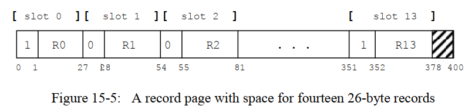
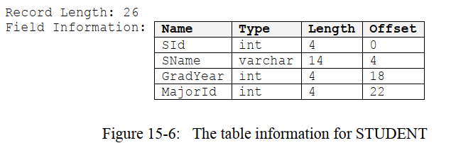
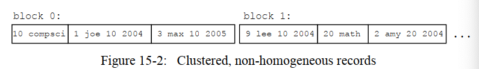

# 第15 章


## 15.2 实现保存记录的文件
现在我们已经知道了记录管理器必须解决的一些问题，以及相应可选的策略。现在我们来决定一下具体怎么实现，我们从最简单直接的实现开始讨论：即文件中的记录是同类的，非跨块的，并且是固定长度的。我们随后考虑其他的一些实现。

### 15.2.1 最直接的实现
假设我们现在想要创建一个同类的，非跨块的，并且长度固定的记录。非跨块也就是是说我吗可以把文件看做是一系列的文件块，其中每个块上都包含了每个块自己的记录；此外记录是同类的并且长度固定的特点意味着我们可以在每个块中开辟相同数量的数据记录，也就是说，我们可以把每个块看成是一个包含许多记录的数组，我们称这样的块在内存中对应的页为一个`记录页(record page)`。
> 一个记录页指的是包含定长记录数组的页。

记录管理器可以这样来实现记录页。先将整个页分为很多的`槽(slots)`，其中每个槽中含有一条记录和一个额外的字节，这个额外的字节是一个标志位，用来表示这个槽是空的还是在被使用，我们假设0代表空的，1代表在使用（其实我们可以用一个bit来设置标志位，详细请看练习15.8）。

举例来说，假设块的大小是400字节，并且一条记录的大小的26字节；于是每个槽的大小就是27字节，于是每个块可以容纳14个槽，伴随着22字节的浪费空间，图15-5展示了这个场景，图中只展示了4个槽，其中第0个槽和第13个槽当前已经包含有记录，而槽1和槽2是空的。



记录管理器需要可以插入、删除、修改一个记录页中的记录，为了完成这些功能，记录管理器会用到下面的信息：
- 一条记录的长度
- 一条记录中各个字段的名称、类型、长度和偏移量

我们把这些值称为`表信息(table information)`。

例如，考虑一下STUDENT这个表，其定义和第2章中一样。一个学生记录包含3个整数和一个10字节的varchar字段。如果我们使用SimpleDB中的存储策略，那么每个整数需要4个字节，一个长度为10字符的字符串需要14个字节(译者注：中文字符另当别论，在我的机器中，每个中文需要3个字节来维护)。并且我们假设不需要padding，且varchar字段的实现策略是，开辟可能最长字符串的空间，从而长度是固定的。于是图15-6给出了这个学生表的表信息，注意，`SName`字段的长度该字段存储需要的字节数，而不是这个字段的最大字符数。



这个表信息将允许记录管理器来决定这个记录中哪个地方有什么值，例如：
- 第k个槽的空/使用中标志位的位置是`(RL+1)*K`,其中RL是一条记录的长度。
- 第k条记录中字段F的位置是`(RL+1)*K + 1 + OFF`,其中RL是一条记录的长度，而OFF是字段F在一条记录中的偏移量。

记录管理器因此可以很简答地完成插入、删除和修改记录的过程：
- 为了插入一个记录，记录管理器需要先检查一下记录页中的所有标志位，直到找到第一个0；随后将这个标志位设置为1，并且返回该槽的槽号。如果所有的槽当前的标志位都是1，也就是说当前块是满的，无法插入新的记录。
- 为了删除第k个槽中的记录，记录管理器只需要简单第将该槽的标志位设置为0，其他的什么都不用干。
- 为了修改第k个槽中的记录的某个字段（或者是初始化一个新的记录中的某个字段），记录管理器会先判断一下这个字段的位置，然后在那个位置写入相应的值。

记录管理器也可以很简单第执行检索记录的操作：
- 为了遍历一个块上的所有记录，记录管理器只需要先查看每个槽的标志位，每次标志位是1，记录管理器就知道这个槽是包含记录的。
- 为了检索第k个槽上的记录的某个字段的值，记录管理器先判断一下每个字段的位置，然后从相应的位置读出字段的具体值即可。

正如上面所述的操作一样，记录管理器需要一种方法来识别每一条记录。当记录是定长的时候，最简单直接的记录标识符就是它对应的槽号。
> 记录页中的每个记录都有一个ID，当记录是定长时，ID可以是槽号。

### 15.2.2 实现变长字段
定长字段的实现非常简单，在本小节中，我们将考虑一下如果加入了变长的字段，那么记录的实现会有怎样的变化。

我们首先会发现的问题就是一个记录中每个字段的偏移量将不再固定。特别地，含有变长字段的记录，记录中每个字段的偏移量可能都是随记录的不同而不同的。判断字段偏移量的唯一办法就是读出前一个字段，然后看下前面的字段在哪里技术的。如果记录中的第1个字段是变长字段，那么为了读第$$n$$个字段，我们必须先读前$$n-1$$个字段。因此，记录管理器通常会把那些定长字段防止在每条记录的开头，以便于可以尽可能多地直接根据偏移量来读取字段的值；而那些变长的字段被放置在记录的后边儿，这样一来，前面的字段会有确定的偏移量，而后面的那些变长字段就没有固定的偏移量 了。

其实，我们也会注意到这样一个问题，每个记录的长度也因此会变得不同，这样会带来两个很重要的结果：
- 通过用槽号乘上槽长度的方式来定位块中具体某个记录的方法将不再可能。现在，为了读取到某条记录的开始位置，我们必须获取到它上一条位置的结束位置。
- 修改某个字段的值将可能使得整个记录的长度都变化。在这种情况下，块中所有那些原来在修改的字段右边的字节全部要右移，更糟糕的是，如果修改后的字段值很长，那么这个修改后记录加上原来的记录长度总和可能会顶出整个块的长度，这种情况必须通过开辟一个`溢出块(overflow block)`来解决。

一个溢出块指的是从`溢出区(overflow area)`申请的新块。那些顶出到块外面的记录都将被放在溢出块中。如果我们非常不幸于，一个客户端修改了很多记录中的很多变长字段的值，并且修改后的值都是很长很长的，那么就有可能很多记录都要被放到溢出块中去，所以，很可能我们需要多个溢出块来hold它们，于是，溢出块就可能是一个链式的结构。每个块（包括原始块）都会有一个指向下一个溢出块的引用，那么从概念上来说，原始块加上所有的溢出块才构成了我们所有的记录。

例如，考虑一下COURSE表，并且假设这个表中的title字段是以变成字符串形式存储的，图15-7（a）展示了这个表中当前包含的3条记录（其中title字段被放在了记录的结尾，因为其他字段都是定长的），图15-7（b）展示了将“DBSy”修改成“Database System Implementation”后的情况，假设一个块的大小是80字节，那么低3个记录将在这个块中装不下，于是它被放在了一个溢出块中，原始块会有一个指向溢出块的引用。

除了需要溢出块这个“缺点”，定长字段引入的复杂性其实并不会对整个系统的效率产生什么影响，当然，记录管理器现在需要做更多的事情：它需要每次在修改了某个字段的值后移动其他的记录，并且为了读取某个记录它必须读取前面的记录。然而，这些操作实际上不会引入额外的块引用，因此不是很耗时，但是，的确有一种常用的改进策略。

考虑一个删除记录的操作，在图15-8（a）展示了一个包含3个课程记录的块，和图15-7（a）中一样。现在，删除第22号课程记录，我们需要将标志位置为0，但是让记录中的数据原封不动地保留在那，如图15-8（b）所示的那样。由于新的记录不一定适合该记录所留下的空白空间，因此我们想通过从记录块中物理移除该记录，并将记录后面的那些记录左移。 但是，这里存在一个问题：记录管理器使用记录的槽号作为其ID，因此消除已删除的记录将导致块中的后续记录具有错误的ID。

该问题的解决办法是把记录的ID和槽号不再关联，也就是说，我们将一系列的整型数组到块中，称之为`ID表(ID-table)`。数组中的每个entry表示的是一个ID，每个entry的值表示的是该ID对应的记录的起始地址；如果没有该记录，则这个entry的值为0，图15-8（c）展示了和图15-8（b）中相同的数据情况，但是用了ID表。当前ID表中包含3个entry，其中两个分别指向第43字节起始和第63字节起始的记录，另外一个记录是空的。

ID表提供了一个间接的方式，指导记录管理器如何在块内部移动记。 如果记录移动，则相应地调整其在ID表中的entry； 如果将记录删除，则将其entry设置为0。插入新记录时，记录管理器在ID表中找到可用的entry并将其分配为新记录的ID。
> ID表的存在，允许变长记录在一个块内移动，同时给每个记录都提供了一个定长的标识符。

注意，ID表会随着块中记录数的增加而扩张，ID表的数组大小因此必须是开放的，因为一个块可以装下的变长记录数是不定的。通常，ID表被放在块的一端，而那些记录被放在另一端，它们都各自朝着对方增长，这个情形可以在图15-8（c）中观察到，其中第一个记录在最右边。

此外也请注意一下ID表，现在就没必要设置空/使用中的标志位，如果一个记录存在，那么在ID表中必定存在一个指向该记录起始地址的entry，而空的记录肯定是有一个值为0的enrty（实际上不存在）。ID表同样也帮助记录管理器很快地找到下一个记录。为了移动到一个给定ID的记录，记录管理器只需很简单地使用ID表中存储着的偏移量；而移动至下一条记录，记录管理器只需要往下访问ID表，直到它找到下一个非0的entry。

### 15.2.3 实现跨块的记录
我们接下来考虑一下为了实现跨块的记录，我们要做出那些变化。

当记录不是跨块的时候，一个块中的第一条记录总是会在相同的位置开始（例如，从第0号字节开始）。而在跨块的时候，情况就不是这样了。于是记录管理器必须在每个块中存储一些信息，用来判断记录在哪里。

这里有好几种可能的实现策略：
- 第一种策略就是让记录管理器在每个块的开始存一个整数，这个整数表示的是==块中第一条记录的偏移量==。例如，考虑一下图15-9（a）中的情况，block 0的第一个整数是4，表示第一条记录的起始位置是4（也就是说，紧接着该整数就是第一条记录的起始位置），记录R2跨越了block 0和block 1，因此block 1中的第一条记录是R3，其起始位置是60。记录R3也是跨块的，跨越了block 1、block 2和block 3，因此记录R4是block 3中的第一条记录，偏移量为30.注意，block 2的第一个整数是0，表示在该块中没有记录在该块中开头。
- 第二种策略也是在每个块的开始存一个整数，但是这个整数的意思不太一样，即，这个整数表示的是==最开始的数据对应于该记录的第多少个字节==。如果第一条记录是非跨块的，那么这个整数就是0（即从这条记录的第0个字节开始），否则，这个整数将会是该记录在前面块中的字节数。例如，考虑图15-9（b）中的情况，block 0中的值0表示的是记录R1是非跨块的，而block 1中的值24表示的意思是记录R2的前24个字节都在前面的块中，也就是说该块的第1个字节将是这条记录的第25个字节，而block 3中的值436表示的是记录R3的前436个字节都在前序块中（注意，前序块可能不知一个块，可能是多个块）。在这里，我们假设每个块的大小是400字节，由于记录管理器知道块的大小，于是它可以计算出当前记录是由几个块来装的。

除了上述的实现方案，记录管理器还可以选择以不同的方式来分割一个跨块的记录。
- 第一种方法就是尽可能地填充块，一旦到了块的边界，那就把记录分割开来，剩下的字节就装在文件的下一个块中。
- 第二种方法就是value-by-value地将记录保存在块中，当一个value写不下时，就把这个value写在下一个块中，因此，会有很少很少的字节变得浪费。

第一种方法的有点就是完全没有一点儿浪费空间，但是缺点就是可能将一个value的值分布在两个块中（比如，一个int的前3个字节在block 1中，而第4个字节在block 2上），这样会给我们到时候读取值又带来一定困难，记录管理器必须把这些分散的字节给concat起来。

### 15.2.4  实现非同类记录
假如记录管理器支持非同类记录，那么它也将需要支持变长记录，因为不同表中的不同记录不一定非要是相同长度的，也肯定不能规定是相同长度的。

在块中保存非同类记录将会带来两个相关的问题：
- 记录管理器需要知道块中每种记录的表信息。
- 给定一条记录，记录管理器需要知道它来自哪一个表。

记录管理器可以通过保存一个表信息数组来解决第一个问题，数组中的每个item都是一个表信息；记录管理器可以通过给每个槽添加一个额外的值来解决第二个问题，这个额外的值有时候被称为一个`标签值(tag value)`，改值就是表信息数组的索引，指示了这条记录属于哪个表。



例如，再次考虑一下图15-2中的例子，该图展示的是一个非同类块的例子，其中的记录来自DEPT表和STUDENT表。记录管理器将会维护一个数组，来保存每个表的表信息，让我们假设DEPT表在数组的第0个item，STUDENT表在第1个item。于是每条DEPT记录对应的槽将有一个标签值0，每条STUDENT记录对应的槽将有一个标签值1。

记录管理器不需要改变太多的行为，当记录管理器访问一条记录时，它会从标签值来判断使用哪一个表信息。它然后可以使用该表信息来读/写任意字段，和在同类文件中的操作一样。

SimpleDB中的日志管理器其实就是一个非同类记录的很好的例子，还记得吗？我们在每种不同的日志记录最开始部分，都用了一个值来指示这是什么日志记录，到底是START Log Record，还是Update Log Record，还是COMMIT Log Record等等。日志管理器在遍历日志文件的时候将会根据这个标签值来决定怎么解析日志记录中的值。

## 15.3 SimpleDB的记录管理器
现在我们已经在概念上知道了记录管理器是怎么工作的，现在我们可以来实现这些具体的需求了，在本节中我们将研究一下SimpleDB的记录管理器是怎么实现的，而实现策略则是15.2.1小节中最简单的那个策略，本章末尾的一些练习将会要求你扩展成其他的实现策略。

### 15.3.1 管理表信息
SimpleDB的记录管理器使用类`Schema`和类`TableInfo`来管理记录的表信息，其API如下所示：
```Java
// Schema.java
public class Schema {
    public Schema();

    public void addField(String fldName,int type,int length);
    public void addIntField(String fldName);
    public void addStringFiled(String fldName,int length);
    public void add(String fldName,Schema schema);
    public void addAll(Schema schema);

    public Collection<String> fileds();
    public boolean hasFiled(String fldName);
    public int type(String fldName);
    public int length(String fldName);

}

// TableInfo.java
public class TableInfo {
    public TableInfo(String tblName,Schema schema);
    public TableInfo(String tblName,Schema schema,
                    Map<String,Integer>offsets,int recordLen);

    public String fileName();
    public Schema schema();
    public int offset(String fldname);
    public int recordLength();
}
```
一个`Schema`对象会维持的是一张表的schema，即，每个字段的名称、类型以及长度，这些信息对应的是用户在创建一个表示会指明的信息，并且不包含实际的物理存储信息。例如，string的length指的是最大允许的字符数，而不是实际物理存储一个字符串时用到的字节数。

一个schema可以看做是三元组`[fieldName, type, length]`的集合。类`Schema`包含5个方法来添加一个三元组到该元组集合中。方法`addField()`显式地添加一个三元组，而其他4个方法则是一些更加方便的方法，例如方法`addIntField()`和方法`addStringField()`则会直接添加指定类型的三元组，而`add()`和`addAll()`方法则会从一个现有的schema中复制某个三元组。`Schema`类也包含一些方法来检索字段集合中的所有名字、判断一个指定的字段是否在集合中、检索一个指定字段的类型和长度。

类`ClassInfo`则包含了一个表的物理信息，以及表对应的schema。它会计算字段和记录的大小、一条记录中字段的偏移量、以及存储记录的文件对应的文件名。该类有两个构造函数，对应两种不同的创建`TableInfo`类对象的方法。
- 第一个构造函数会在创建一个表的时候被调用，该构造函数接受表名和对应的schema作为参数，并且会计算出相应字段的物理大小和偏移量。
- 第二个构造函数是会在检索一个已经创建好的表的信息时被调用，调用者会提供已经计算好的值。

该类同样也包含一些方法返回每个字段的名称、每条记录的长度、以及每个字段的偏移量。

下面包含了如何使用这个两个类的示例代码片段。代码中的第一部分创建了一个包含3个字段的COURSE表，然后创建了一个对应的`TableInfo`对象；第二部分则表里了schema中的每个字段，打印字段名称和偏移量。
```Java
Schema sch = new Schema();
sch.addIntField("cid");
sch.addStringField("title", 20);
sch.addIntField("deptid");
TableInfo ti = new TableInfo("course", sch);

for (String fldname : ti.schema().fields()) {
    int offset = ti.offset(fldname);
    System.out.println(fldname + " has offset " + offset);
}
```
### 15.3.2 实现Schema类和TableInfo类
实现上述两个类很简单，如下所示：
```Java
public class Schema {
    public static final int INTEGER = 0;
    public static final int VARCHAR = 1;

    private Map<String, FieldInfo> info = new HashMap<>();

    public Schema() {

    }

    public void addField(String fldName, int type, int length) {
        info.put(fldName, new FieldInfo(type, length));
    }

    public void addIntField(String fldName) {
        // int类型的长度设置为0，这里指的是逻辑长度
        // 而不是实际物理存储所需字节长度
        addField(fldName, INTEGER, 0);
    }

    public void addStringField(String fldName, int length) {
        addField(fldName, VARCHAR, length);
    }

    /**
     * 从一个已有的schema中添加一个字段到该schema中
     *
     * @param fldName 字段名
     * @param schema  源schema
     */
    public void add(String fldName, Schema schema) {
        int type = schema.type(fldName);
        int length = schema.length(fldName);
        addField(fldName, type, length);
    }

    /**
     * 将已有的schema中的所有字段到该schema中
     *
     * @param schema 源schema
     */
    public void addAll(Schema schema) {
        info.putAll(schema.info);
    }

    public Collection<String> fields() {
        return this.info.keySet();
    }

    public boolean hasFiled(String fldName) {
        return this.info.keySet().contains(fldName);
    }

    public int type(String fldName) {
        return this.info.get(fldName).type;
    }

    public int length(String fldName) {
        return this.info.get(fldName).length;
    }

    private class FieldInfo {
        int type;
        int length;

        public FieldInfo(int type, int length) {
            this.type = type;
            this.length = length;
        }
    }
}
```
在`Schema`类中，使用了一个内部类`FieldInfo`来维护字段三元组信息，`FieldInfo`对象包含字段的长度和类型信息。

类型由常数INTEGER和VARCHAR来表示，和JDBC中的类型一样。一个字段的长度信息只有对字符串类型的字段才有意义，因为这代表的是字符数，而不是实际存储该字段所需的字节数，方法`addIntField()`会将int类型数据的type设置为0，这个0其实没什么意义，你也可以设置成-1或者其他的，因为这个值不会被用到。

类`TableInfo`的实现如下所示，第一个构造函数中会计算每个字段的时间偏移量，所有的字段都是按找到来的顺序存储在哈希map中，实际上顺序会是随机的，该方法也会计算每个字段所需的字节数，于是整条记录的长度就是所有字段的长度和，并且每个字段的起始位置就是上一个字段的结束位置，也就是说，这里没考虑padding。
```Java
public class TableInfo {
    private Schema schema;
    private Map<String, Integer> offsets;
    private int recordLen;
    private String tblName;

    public TableInfo(String tblName, Schema schema) {
        this.tblName = tblName;
        this.schema = schema;
        offsets = new HashMap<>();
        int pos = 0;
        for (String fieldName : schema.fileds()) {
            offsets.put(fieldName, pos);
            // 每个字段需要的字节数
            // TODO 
            // 1. 这里没考虑字段的padding（即字节对齐）
            pos += lengthInBytes(fieldName);
        }
        recordLen = pos;
    }

    public TableInfo(String tblName, Schema schema,
                     Map<String, Integer> offsets, int recordLen) {
        this.tblName = tblName;
        this.schema = schema;
        this.offsets = offsets;
        this.recordLen = recordLen;
    }

    /**
     * 返回保存该类型记录的文件名
     *
     * @return 文件名（包含后缀）
     */
    public String fileName() {
        return tblName + ".tbl";
    }

    public Schema schema() {
        return schema;
    }

    public int offset(String fldname) {
        return offsets.get(fldname);
    }

    public int recordLength() {
        return recordLen;
    }

    private int lengthInBytes(String fldName) {
        int fldType = schema.type(fldName);
        if (fldType == INTEGER) {
            return INT_SIZE;
        }
        else
            return STR_SIZE(schema.length(fldName));
    }
}
```
### 15.3.3 管理记录
SimpleDB中的类`RecordPage`管理一个页中的记录，其API如下所示：
```Java
public class RecordPage {
    public RecordPage(Block blk, TableInfo tableInfo, Transaction tx) ;

    public boolean next();
    public int getInt(String fieldName);
    public String getString(String fieldName);
    public void setInt(String fileName,int newVal);
    public void setString(String fieldName,String newVal);
    
    public  void delete();
    public boolean insert();
    
    public void moveToID(int id);
    public int currentID();    
}
```
这些方法和JDBC中`ResultSet`中的接口很相似，特别地，每个`RecordPage`对象维护了一个“当前对象”，方法`next()`就是移动到下一条记录，当页中不存在下一条记录时，返回false。方法`getXXX()/setXXX()`则是访问当前记录中相应字段的方法，`delete()`方法则是删除当前记录。为了和JDBC中保持一致，被删除的记录仍保留在当前记录中，客户端代码必须显式地调用`next()`方法来移动至下一条记录。

`insert()`方法不会在当前记录上进行操作，相反，它会在页中某个位置插入一条空的记录，如果没有足够的空间来插入一条新记录，该方法返回false，新的记录对应的位置变成了当前记录。

`RecordPage`的构造函数接受3个参数：对应的块、`TableInfo`对象、以及一个`Transaction`对象，记录页会使用`Transaction`对象来固定和取消固定一个块，并且从中get/set相应的值。

记录页中的每条记录在插入的时候都有一个标识符，直到被删除前，都始终不会变。标识符对于我们将在第21章中讨论到的索引息息相关。`RecordPage`类提供了2个和标识符交互的方法：方法`moveToID()`把当前记录设置成指定标识符对应的记录；方法`currentID()`则返回当前记录的标识符。

下面的代码片段继续了15.3.1小节中的测试代码，测试了COURSE表对应文件的block 3的记录。第一部分的代码插入了一条新的记录，其ID为82，title为“OO Design”,学院ID为20；第二部分的代码把所以title为“OO Design”的课程全部改成了“Java programming”,并且删除了由学院30开设的课程；(译者注：这部分和原书有点出入，只是为了更方便地执行测试，逻辑上没什么差别)
```Java
public class RecordTest {
    public static void main(String[] args) {

        Schema sch = new Schema();
        sch.addIntField("cid");
        sch.addStringField("title", 20);
        sch.addIntField("deptid");
        TableInfo ti = new TableInfo("course", sch);

        SimpleDB.init("liuzhian/studentdb");
        Transaction tx = new Transaction();
        Block blk = new Block(ti.fileName(), 3);
        RecordPage rp = new RecordPage(blk, ti, tx);

        // Part 1
        boolean ok = rp.insert();
        if (ok) {
            rp.setInt("cid", 82);
            rp.setString("title", "OO design");
            rp.setInt("deptid", 20);
        }
        ok = rp.insert();
        if (ok) {
            rp.setInt("cid", 80);
            rp.setString("title", "Java programming");
            rp.setInt("deptid", 30);
        }
        
        // Part 2 移到上第一条记录的前面，准备遍历
        // 这里一定要移到-1而不是0，因为searchFor()方法会先将currentSlot++
        rp.moveToID(-1);
        while (rp.next()) {
            int dept = rp.getInt("deptid");
            if (dept == 30)
                rp.delete();
            else if (rp.getString("title").equals("OO design"))
                rp.setString("title", "Object-Oriented");
        }

        tx.commit();
    }
}
```
### 15.3.4 实现记录页
SimpleDB实现的是基于槽结构的记录页，且空/使用中的标志位用的是一个4字节的int值，而不是一个bit，因为我们当前的SimpleDB不支持基于位的读写（当然，你可以进行相应的改写从而支持），`RecordPage`类的具体实现如下：
```Java
public class RecordPage {
    public static final int EMPTY = 0, INUSE = 1;

    private Block blk;
    private TableInfo tableInfo;
    private Transaction tx;
    private int slotSize;
    private int currentSlot = -1;

    public RecordPage(Block blk, TableInfo tableInfo, Transaction tx) {
        this.blk = blk;
        this.tableInfo = tableInfo;
        this.tx = tx;
        tx.pin(blk);    // 固定页
        slotSize = tableInfo.recordLength() + INT_SIZE; // 记录长度 + 标志字节
    }


    public int getInt(String fieldName) {
        int fieldPos = fieldPos(fieldName);
        return tx.getInt(blk, fieldPos);  // 会获得块粒度的共享锁
    }

    public String getString(String fieldName) {
        int fieldPos = fieldPos(fieldName);
        return tx.getString(blk, fieldPos);  // 会获得块粒度的共享锁
    }

    public void setInt(String fieldName, int newVal) {
        int fieldPos = fieldPos(fieldName);
        tx.setInt(blk, fieldPos, newVal);  // 会获得块粒度的互斥锁
    }

    public void setString(String fieldName, String newVal) {
        int fieldPos = fieldPos(fieldName);
        tx.setString(blk, fieldPos, newVal);
    }

    public boolean next() {
        return searchFor(INUSE);
    }

    public void delete() {
        int flagPos = currentPos();
        tx.setInt(blk, flagPos, EMPTY);
        // 被删除的记录仍保留在当前记录中，
        // 客户端代码必须显式地调用next()方法来移动至下一条记录。
    }
		
		/**
     * 主动释放已经固定的块，这个方法主要是给RecordFile类对象
     * moveTo()时调用，主动unpin掉已经固定的块。
     */
    public void close() {
        if (blk != null)
            tx.unpin(blk);
        blk = null;
    }

    /**
     * 插入一条新的记录。
     * <p>
     * 首先会从头开始找到一个空的槽。
     * 1. 如果存在，则将该槽的标志字节设置为INUSE，且currentSlot为插入的槽
     * 2. 如果不存在，返回false
     *
     * @return
     */
    public boolean insert() {
        currentSlot = -1;
        // 找到第一个空的槽
        boolean found = searchFor(EMPTY);
        if (found) {
            int foundSlotStartPos = currentPos();
            tx.setInt(blk, foundSlotStartPos, INUSE);
            // 这里只是将标志位进行了设置，并没有填充插入的记录的具体值
        }
        return found;
    }

    /**
     * 移动到指定ID的槽
     *
     * @param id
     */
    public void moveToID(int id) {
        currentSlot = id;
    }

    public int currentID() {
        return currentSlot;
    }

    /**
     * 获得当前槽的开始位置
     *
     * @return
     */
    private int currentPos() {
        return currentSlot * slotSize;
    }

    /**
     * 获取指定字段的offset，该计算公式为（RL+ 4）* k + 4 + off
     * <p>
     * 其中，RL为一条记录的长度，4为标志字节的Int长度，k为当前槽号，
     * off为指定字段在一条记录中的偏移量
     *
     * @param fileName
     * @return
     */
    private int fieldPos(String fileName) {
        int off = tableInfo.offset(fileName);
        return currentPos() + INT_SIZE + off;
    }

    /**
     * 检查如果以当前位置为新槽的起始位置，解析一个槽，是否会顶出一个块的大小
     *
     * @return true--不会超出，即有效 false--超出，必然无效
     */
    private boolean isValidSlot() {
        return currentPos() + slotSize <= BLOCK_SIZE;
    }

    /**
     * 找到下一个标志字节为指定值的槽
     *
     * @param flag 标志字节的具体取值
     * @return true--找到了，currentSlot为找到槽的槽号 false--找不到
     */
    private boolean searchFor(int flag) {
        currentSlot++;
        while (isValidSlot()) {
            int stepSlotStartPos = currentPos();
            // 检查标志字节
            if (flag == tx.getInt(blk, stepSlotStartPos))
                return true;
            currentSlot++;
        }
        return false;
    }
}
```
构造函数会把当前槽号`currentSlot`初始化为-1，`next()`方法和`insert()`方法都会调用一个私有的`searchFor()`方法来找到一个指定flag的槽，`next()`方法会找下一个flag为INUSE的槽，而`insert()`方法会从头开始遍历，找到第一个flag为EMPTY的槽；`searchFor()`方法则会不断地增加当前槽号（也就是向下遍历），知道找到一个指定flag的槽，或者超出了块（即`isValidSlot()`方法的功能）。

`getXXX()/setXXX()`方法则会相应地调用事务类中的方法，两套方法的区别就是参数不太一样，事务的`getXXX()/setXXX()`方法接受的参数是页的指定偏移量，而`RecordPage`类中的`getXXX()/setXXX()`方法接受的参数则是字段的名称，且这些方法中会负责从字段名到字段偏移量的转化，用到的是tableInfo对象中的信息，和前面的解释完全一样，就不再赘述了。

`delete()`方法则会简单地将某条记录所在槽的标志字节设置为EMPTY即可，注意被删除的记录仍保留在当前记录中，客户端代码必须显式地调用`next()`方法来移动至下一条记录。

运行上一节中的测试代码后，我们再次遍历一下日志记录，你的结果应该和我的结果差不多，遍历日志记录的代码也很简单。
```
// 遍历日志文件代码
Iterator<LogRecord> iter= new LogRecordIterator();
while (iter.hasNext())
{
    LogRecord record=iter.next();
    System.out.println(record);
}

// 遍历结果
<COMMIT 1>
<SETINT 1 [File: course.tbl, block number: 3] 76 1>
<SETSTRING 1 [File: course.tbl, block number: 3] 8 OO design>
<SETINT 1 [File: course.tbl, block number: 3] 80 0>
<SETSTRING 1 [File: course.tbl, block number: 3] 84 >
<SETINT 1 [File: course.tbl, block number: 3] 148 0>
<SETINT 1 [File: course.tbl, block number: 3] 76 0>
<SETINT 1 [File: course.tbl, block number: 3] 4 0>
<SETSTRING 1 [File: course.tbl, block number: 3] 8 >
<SETINT 1 [File: course.tbl, block number: 3] 72 0>
<SETINT 1 [File: course.tbl, block number: 3] 0 0>
<START 1>
```
至于每条日志记录代表什么意思，你自己稍微分析一下就知道了。从下往上数第1-4条是第一次插入的数据记录；而第5-8条日志记录对应第二次插入数据记录；第9-10条则对应的是part 2的相应修改了。

译者注：细心的你可能会发现，我们在定义Schema的时候不是按照cid、title、deptid的顺序定义的吗？为什么从日志记录来看，好像实际存储时是按照deptid、title、cid的顺序来存储的。是的！因为我们在TableInfo类中求各字段的offset时，会遍历schema中三元组字典的所有key，而遍历key的顺序是按照hash值而定的，所以这里可能会发生变化，当然，这种变化对我们毫无影响也必然不会有影响，因为无论什么时候我们找一个字段的值时，都是会按照字段名先去三元组字典中先查找一遍！

### 15.3.5 格式化记录页
一个记录页有一个指定的结构，即，它被分成了多个槽，其实每个槽的第一个整数表示该槽中是否有记录存在，因此一个记录页在被使用前，需要被正确地格式化。类`RecordFormatter`提供了这个服务，通过`format()`方法，代码如下:
```Java
public class RecordFormatter implements PageFormatter {

    private TableInfo tableInfo;

    public RecordFormatter(TableInfo tableInfo) {
        this.tableInfo = tableInfo;
    }

    @Override
    public void format(Page p) {
        int recordSize = tableInfo.recordLength() + INT_SIZE;
        for (int pos = 0; pos + recordSize <= BLOCK_SIZE; pos += recordSize) {
            // 1. 先设置标志位为空
            p.setInt(pos, EMPTY);
            // 2. 再添加默认的记录值
            makeDefaultRecord(p, pos);
        }
    }

    private void makeDefaultRecord(Page page, int position) {
        for (String fldName : tableInfo.schema().fields()) {
            // 每个字段在一条记录内的offset
            int offset = tableInfo.offset(fldName);
            // int的默认值为0
            if (tableInfo.schema().type(fldName) == Schema.INTEGER)
                page.setInt(position + INT_SIZE + offset, 0);
            // string的默认值为""，即空串
            else
                page.setString(position + INT_SIZE + offset, "");
        }
    }
}
```
`format()`方法会遍历页中的所有槽，对每个槽，方法会先把flag设置为EMPTY，并且将每个字段都初始化为默认值：整数的默认值为0，字符串的默认值为空串。注意，`RecordFormatter`对象必须知道相应的`TableInfo`对象，这样才可以判断每个槽和记录中每个字段的偏移量。

无论何时一个新的记录块append到文件尾部，都需要一个`RecordFormatter`对象，下面的示例代码演示了如何使用这个格式化器。代码的功能是追加一个新的块到COURSE表记录文件中，并且插入一条新的记录。注意，`insert()`方法只是简单第将flag设置为INUSE，槽中记录具体的取值并没有修改。
```Java
SimpleDB.init("studentdb");
TableInfo ti = ... //info for the COURSE table

Transaction tx2 = new Transaction();

RecordFormatter recordFormatter = new RecordFormatter(ti);
Block blk2 = tx2.append(ti.fileName(), recordFormatter);
RecordPage rp2 = new RecordPage(blk2, ti, tx2);
rp2.insert();

tx2.commit();
```
测试代码执行的结果和上一小节中类似，就不再赘述了。需要注意的是，必须将上述事务2紧接着事务1执行，因为系统中只有一个事务管理器，如果分两次执行（也就是run两次），那么会导致两个事务的ID都是1，造成日志记录事务ID的不一致，会引发严重的不可预测的后果！

### 15.3.6 管理文件中的记录
一个记录页只能维持相对来说很少数量的记录，而一个`记录文件(record file)`则可以在一个文件中维持很多数量的记录，其API如下所示：
```Java
// RecordFile.java
public class RecordFile {
    public RecordFile(TableInfo tableInfo, Transaction tx);

    // 涉及移动当前记录位置的操作
    public void beforeFirst();
    public boolean next();
    public void moveToRID(RID rid);
    public void insert();
    public void close();

    // 访问当前记录具体数据的方法
    public int getInt(String fldname);
    public String getString(String fldname);
    public void setInt(String fldname, int newVal);
    public void setString(String fldname, String newVal);
    public RID currentRID();
    public void delete();
}

// RID.java
public class RID {
    public RID(int blkNum,int id);
    public int blockNumber();
    public int id();
}
```
和记录页中一样，记录文件也会维持一个当前记录，并且API中包含移动当前记录位置的方法，和访问当前记录具体数据的方法。方法`next()`会将当前记录指向记录文件中的下一条记录。如果当前块中没有下一条记录了，呢么会继续访问文件的后续块，知道找到另一条记录。方法`beforeFirst()`将当前记录指向文件中第一条记录的最前面，当客户端需要遍历记录文件时，在遍历前总是需要调用一次该方法。

`getXXX()和setXXX()`方法则是读/写当前记录的相应的字段值，`insert()`方法会在文件中的某个地方插入一条新的记录，和`RecordPage`中不一样，这个插入方法总是会成功，如果在已经存在的块中找不到一个可以插入的地方，那么该方法会append一个新的块来放置新的记录。

文件中的一条记录可以用一对值来标识，即块号+块内的记录ID，这两个值通常被称为`RID记录标识符`（是Record Identifier的缩写），记录标识符是通过类`RID`来实现的，该类的构造函数会保存块引用和一个快中的记录标识符，也有相应的访问方法。

`RecordFile`类中包含两个和rid有关的方法，其中方法`moveToRID()`会将当前的记录指向rid对应的记录，该方法假设这个rid执行的记录的确是存在的，方法`currentRID()`返回当前记录的rid。

`RecordFile`类提供的抽象级别与到目前为止我们所看到的其他类有明显不同的。 也就是说，`Page`，`Buffer`，`Transaction`和`RecordPage`这些类的的方法都适用于特定的块。 而`RecordFile`类向其客户端隐藏掉了块结构的存在。 通常，客户端将不知道（或不在乎）当前正在访问哪个块。 它只需要在完成操作后关闭记录文件就OK了。

下面的代码展示了如何使用记录文件，代码假设记录文件`junk`中包含的是只有一个int字段A的记录，代码中插入了10000条记录到文件中，每条记录都有一个随机的整数值。然后从记录文件的头部开始遍历所有的记录，删除掉那些值小于100的记录。注意，对`rf.insert()`的调用将根据需要分配尽可能多的新块来保存记录； 但是，客户端代码不知道这种情况正在发生。
```Java
public class RecordFileTest {
    public static void main(String[] args) throws IOException {
        SimpleDB.init("liuzhian/simpledb");
        Transaction tx = new Transaction();
        Schema schema = new Schema();
        schema.addIntField("A");
        TableInfo tableInfo = new TableInfo("junk", schema);

        RecordFile recordFile = new RecordFile(tableInfo, tx);
        for (int i = 0; i < 10000; i++) {
            recordFile.insert();
            int n = (int) Math.round(Math.random() * 200);
            recordFile.setInt("A", n);
        }

        int cnt = 0;
        recordFile.beforeFirst();
        while (recordFile.next()) {
            if (recordFile.getInt("A") < 100) {
                recordFile.delete();
                cnt++;
            }
        }
        System.out.println("删除的记录数：" + cnt);
        // recordFile.close();
        tx.commit();
    }
}
```
### 15.3.7 实现记录文件
`RecordFile`类的实现如下：
```Java
public class RecordFile {
    private TableInfo tableInfo;
    private Transaction tx;
    private String fileName;
    private RecordPage recordPage;
    private int currentBlkNum;

    public RecordFile(TableInfo tableInfo, Transaction tx) throws IOException {
        this.tableInfo = tableInfo;
        this.tx = tx;
        this.fileName = tableInfo.fileName();
        // 如果记录文件当前为空，则新追加一个块
        if (tx.size(fileName) == 0)
            appendBlock();
        moveTo(0);  // 移动到第0个块
    }

    public void close() {
        recordPage.close();
    }

    // 涉及移动当前记录位置的操作
    public void beforeFirst() {
        moveTo(0);
    }

    /**
     * 判断是否存在下一条记录
     *
     * @return
     * @throws IOException
     */
    public boolean next() throws IOException {
        while (true) {
            // 有下一条记录
            if (recordPage.next())
                return true;
            // 没有下一条记录，并且是在最后一个块
            if (atLastBlock())
                return false;
            // 没有下一条记录，但是不是最后一个块
            moveTo(currentBlkNum + 1); // 移动到下一块
        }
    }

    public void moveToRID(RID rid) {
        moveTo(rid.blockNumber()); // 先移到指定块
        recordPage.moveToID(rid.id()); // 再移到块内指定ID的记录处
    }

    /**
     * 插入一个记录。
     * <p>
     * 注意，插入总是成功的。
     * 1. 要么是在已有的块中找到一个空位置
     * 2. 要么是追加了一个新的块
     * <p>
     * 新记录的起始位置都可以由recordPage.currentPos()方法获取到。
     * <p>
     * 此外，这里的插入其实只修改了记录的 EMPTY/INUSE 标志字节，
     * 客户端代码需要紧接着修改实际的值。
     * @throws IOException
     */
    public void insert() throws IOException {
        // 当始终找不到一个插入的位置时
        while (!recordPage.insert()) {
            // 如果现在是在最后一个块，那肯定是要追加一个新块了
            if (atLastBlock())
                appendBlock();
            // 否则不断往后面的块里面找
            moveTo(currentBlkNum + 1);
        }
    }

    // 访问当前记录具体数据的方法
    public int getInt(String fldname) {
        return recordPage.getInt(fldname);
    }

    public String getString(String fldname) {
        return recordPage.getString(fldname);
    }

    public void setInt(String fldname, int newVal) {
        recordPage.setInt(fldname, newVal);
    }

    public void setString(String fldname, String newVal) {
        recordPage.setString(fldname, newVal);
    }

    public RID currentRID() {
        return new RID(currentBlkNum, recordPage.currentID());
    }

    public void delete() {
        recordPage.delete();
    }

    /**
     * 移动至指定块
     *
     * @param specificBlkNum 指定的块
     */
    private void moveTo(int specificBlkNum) {
        // 主动释放掉缓冲区中已经固定的，对应当前记录块的缓冲区
        if (recordPage != null) {
            recordPage.close();
        }
        currentBlkNum = specificBlkNum;
        Block blk = new Block(fileName, currentBlkNum);
        recordPage = new RecordPage(blk, tableInfo, tx);
    }

    /**
     * 追加一个新的记录块
     */
    private Block appendBlock() {
        RecordFormatter recordFormatter = new RecordFormatter(tableInfo);
        return tx.append(fileName, recordFormatter);
    }

    /**
     * 判断当前是否在记录文件的最后一块
     *
     * @return
     * @throws IOException
     */
    private boolean atLastBlock() throws IOException {
        return currentBlkNum == tx.size(fileName) - 1;
    }
}
```
一个`RecordFile`对象会为当前的块维护一个记录页，`getXXX()/ setXXX()/delete()`方法只需调用记录页的相应方法。 当前块更改时，将调用私有方法`moveTo()`, 该方法关闭当前记录页，然后为指定的块打开另一个记录页。

`next()`方法的算法如下：
- 移动至当前记录页中的下一条记录。
- 如果当前记录页中没有下一条记录了，那么久移动至下一个记录块，并从块的第一条记录开始读起。
- 直到遇到文件的结尾（即最后一块也没有下一条记录了），结束。

一个文件的多个块可能为空（请参阅练习15.2），因此可能有必要循环浏览多个块。

`insert()`方法尝试从当前块开始插入一条新记录，并在文件中移动直到找到一个不是满的块。 如果所有块都已满，则它将新块追加到文件中并将记录插入该文件中。

而`RID`类的实现就很简单了，如下所示：
```Java
public class RID {
    private int blkNum;
    private int id;

    public RID(int blkNum, int id) {
        this.blkNum = blkNum;
        this.id = id;
    }

    public int blockNumber() {
        return blkNum;
    }

    public int id() {
        return id;
    }

    @Override
    public boolean equals(Object obj) {
        RID rid = (RID) obj;
        return blkNum == rid.blkNum && id == rid.id;
    }
}
```
## 15.4 章末总结
- 记录管理器是数据库系统中负责将记录存储到文件中的部分，它至少有以下的指责：
  1. 在一条记录中修改某些字段。
  2. 在一个记录块中修改某些记录。
  3. 提供面向记录文件的记录访问方法。
- 很关键的一个问题是是否支持变长的字段。定长记录可以比较容易地实现，因为每条记录的每个字段都会在相同的位置出现，而更新一个变长的字段就可能导致记录的长度顶出一个块的长度，因此需要`溢出块（overflow block）`,在simpleDB中，我们还是选取了定长记录的实现策略。
- SQL有3中不同类型的字符串：char、varchar和clob：
	1. char类型最自然地可以用一个定长的字段来实现。
	2. varchar类型最自然地可以用一个变长的字段来实现。
	3. clob类型最自然地可以用一个定长的字段来实现，只不过这个字符串的字面量会保存在另一个辅助文件中。
- 实现变长记录的一个很常用的技术就是构造一个ID表，ID表中的每个entry都指向一条记录的起始位置，一条记录可以通过只改变ID表中entry的值来实现在页中移动。
- 变长记录带来的另一个问题就是是否支持跨块（spanned record）的记录，跨块记录可以避免浪费空间（记录之间的外部碎片），但是跨块记录比较难实现。
- 另一个需要考虑的问题就是在记录文件中是否支持非同类记录，非同类记录允许将来自不同表的记录聚集在同一个块上。 群集可以导致联结查询更加高效，但往往会使单表查询变得代价更高。 记录管理器可以通过在每个记录的开头存储一个标识字段来实现非同类记录， 标识表示该记录所属的表。
- 第四个问题是如何确定记录中每个字段的偏移量。 记录管理器可能需要填充字段，以便它们在适当的字节边界上对齐。 定长记录中的字段对于每个记录具来说有相同的偏移量。而在可变长度记录中，可能需要遍历待搜索字段前面的那些字段。

## 15.5 建议阅读
## 15.6 练习

