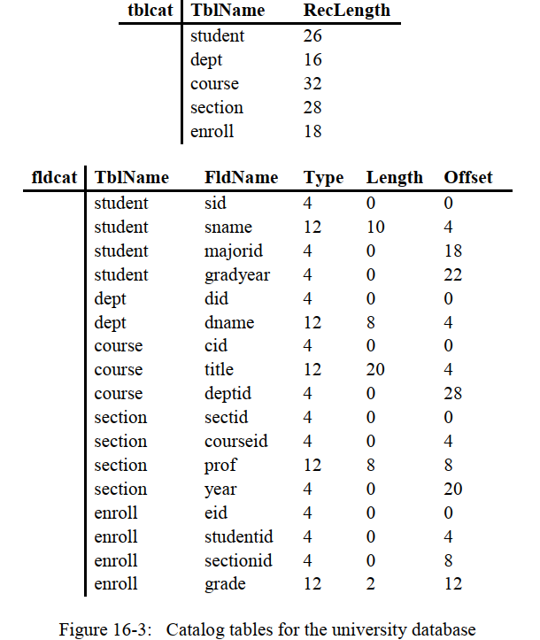
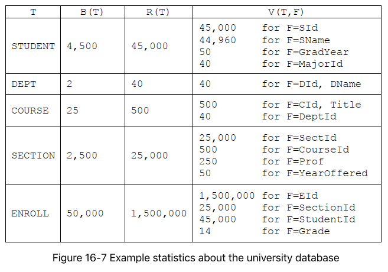

# 第16章 元数据管理和包`simpledb.metadata`
上一章中，我们研究了记录管理器是怎么在文件中存储记录的，然而，正如我们所看到的，一个文件如果仅仅是存储在那里，是没什么作用 的，虽然我们在上一章中的相关测试代码中，每次运行程序前都会创建一个Schema对象和对应的TableInfo对象，但是程序运行完，这些保存在内存中的东西就会丢失，因此，我们必须存储记录所在表的信息，从而下次从记录文件中解码出一条条数据，而所有表的表信息被统称为`元数据(meta data)`。在本章中，我们将会研究一下一个数据库系统中支持的几种元数据，以及它们各自的目的和功能，以及数据库系统中是怎么存储这些元数据的。

## 16.1 元数据管理器
> 元数据是关于数据库的信息，但不包括具体的记录内容。

数据库系统会维护一系列的元数据，例如：
- `表(table)`的元数据，描述的是表的记录的结果，例如记录的长度，各字段的类型和偏移量，记录管理器使用的TableInfo类对象其实就是这种元数据的例子。
- `视图(view)`的元数据，描述的是每个视图的属性，例如视图的定义和创建者。
- `索引(index)`的元数据，描述的是某个表已经创建的索引，query planner会使用这个元数据来判断一个query是否可以用索引来评估。
- `数据统计(statistical)`的元数据，描述的是表的大小，以及表中每个字段的统计信息（例如字段的最大值，平均值等等），这类元数据对估计一个查询的用时很有用。

前3类的元数据是在表、视图和索引创建时生成的，而数据统计信息会在数据库每次更新后都会变化。
> 元数据管理器是数据库系统中负责存储和检索元数据的部分。

元数据管理器会将元数据保存在系统的目录中`(system catalog)`，它也为客户端提供了检索相应元数据的方法。SimpleDB的元数据管理器是在类`MetadataMgr`中实现的，其API如下所示：
```Java
public class MetadataMgr {

    public void createTable(String tblName, Schema schema, Transaction tx);
    public TableInfo getTableInfo(String tblName,Transaction tx);

    public void createView(String viewName,String viewDef,Transaction tx);
    public String getViewDef(String viewName,Transaction tx);

    public void createIndex(String indexName,String tblName,
                            String fieldName,Transaction tx);
    public Map<String,IndexInfo> getIndexInfo(String tblName,Transaction tx);

    public StatInfo getStatInfo(String tblName,Transaction tx);
    
}
```
API中为每种类型的元数据提供了两个方法—一个用来生成和保存元数据，另一个用来检索元数据。但是数据统计的元数据有点例外，生成数据统计元数据的方法会被系统内部调用，因此是私有的，在上述API中没有列出来。

SimpleDB会在启动时创建一个元数据管理器对象，该对象只有从SimpleDB类的`metadataMgr()`静态方法获取到。

## 16.2 表的元数据
### 16.2.1 使用表的元数据
为了创建一个表，客户端会调用`createTable()`方法，传入表名和该表的schema，该方法会计算出该表的其他的元数据(例如，每条记录中各字段的偏移量、存储该表记录的文件名等)，并且将这些信息保存在catalog中。方法`getTableInfo()`会查询catalog，提取出指定表的元数据，并构造出一个TableInfo类对象，把这个对象返回给客户端。

下述的代码片段演示了这些方法的使用，第1部分创建了一个DEPT表，这个表中包含2个字段：一个整型的`Did`，以及一个varchar(8)的字符串字段`DName`;第2部分（通常来说会在另一个不同的程序中运行）会检索出这张表的元数据，得到一个TableInfo类对象，然后打开相应的记录文件，打印出每个学院的名称。
```Java
SimpleDB.init("studentdb");
MetadataMgr mdMgr = SimpleDB.mdMgr();

// Part 1: Create the DEPT table
Transaction tx1 = new Transaction();
Schema sch = new Schema();
sch.addIntField("did");
sch.addStringField("dname", 8);
mdMgr.createTable("dept", sch, tx1);
tx1.commit();

// Part 2: Print the name of each department
Transaction tx2 = new Transaction();
TableInfo ti = mdMgr.getTableInfo("dept", tx2);
RecordFile rf = new RecordFile(ti, tx2);
while (rf.next())
System.out.println(rf.getString("dname"));
rf.close();
tx2.commit();
```
## 16.2.2 实现表的元数据
元数据管理器将元数据保存在数据的`目录(catalog)`中，但是，怎么实现这个catalog呢？通常来说，数据库系统中采用的策略是，使用数据库表来保存catalog，也就是说，catalog其实也就是数据库中的一张表，只不过这是一张描述其他表的元数据的表。
> 数据库系统会把元数据存储在catalog表中。

SimpleDB会把表的信息维护在两张目录表中，表`tblcat`存储的是关于表粒度的信息，而表`fldcat`存储的是表中每个字段粒度的信息。这两张表的schema如下，其中下划线共同组成了表的主键：

tblcat ( $$\underline{TblName}$$, RecLength )

fldcat ($$\underline{TblName}$$, $$\underline{FldName}$$, Type, Length, Offset)

对于数据库中的每张表都会在tblcat表中存在一条对于的记录，而对于数据库中每张表中的每个字段，则都会在fldcat表中存在一条对于的记录。`RecLength`字段表示的是存储一条记录所需的字节数(不包括 empty/inuse标志位)，该值会由对应的TableInfo对象指出，`Length`字段则表示的是表中某个字符串类型字段的最大字符数，正如第15章中Schema类中定义的一样。例如，下图表示的一个大学数据库的catalog表情形，注意一下数据库表的schema信息是怎么被保存到fldcat表中的，图中`Type`字段的中的4和12分别表示的是INTEGER和VARCHAR类型，这只是JDBC中定义的值，而我们的SimpleDB中分别用0和1来代表，这都只是一个约定而已，没什么太多的特殊意义。



Note that the constant „student‟ is in lower case, even though the table was defined in upper case. The reason is that all table and field names in SimpleDB are stored in lower case, and constants in SQL statements are case-sensitive.

catlog表其实和数据库中的其他表没什么不一样，因此，可以像访问任何用户创建的表一样进行访问。 例如，下面SQL查询可以检索出STUDENT表中所有字段的名称和长度：
```SQL
SELECT FldName,Length
FROM fldcat
WHERE TblName="student";
```

细心的你可能会发现这里其实是由一个问题的，这也是在前面我故意隐瞒了一段时间的问题——就是——catalog表既然和普通表没什么区别，那catlog表的schema信息也要存在catlog表中呀，但是在上面的catlog表图示中，我们并没有找到这些记录！是的，这就有点类似一个递归的操作了！别担心，这是一个trick，看看`TableMgr`类的代码是怎么实现的吧！
```Java
public class TableMgr {
    // 表名和字段名最大长度
    public static final int TABLE_AND_FIELD_NAME_MAX_LEN = 20;
    // tblcat表和fldcat表
    private TableInfo tblCatInfo, fldCatInfo;

    public TableMgr(boolean isNew, Transaction tx) throws IOException {
        // tblcat表
        Schema tblCatSchema = new Schema();
        tblCatSchema.addStringField("tblname", TABLE_AND_FIELD_NAME_MAX_LEN);
        tblCatSchema.addIntField("reclength");
        tblCatInfo = new TableInfo("tblcat", tblCatSchema);

        // fldcat表
        Schema fldCatSchema = new Schema();
        fldCatSchema.addStringField("tblname", TABLE_AND_FIELD_NAME_MAX_LEN);
        fldCatSchema.addStringField("fldname", TABLE_AND_FIELD_NAME_MAX_LEN);
        fldCatSchema.addIntField("type"); // 字段类型
        fldCatSchema.addIntField("length"); // 对于非字符串字段没什么意义
        fldCatSchema.addIntField("offset"); // 各字段偏移量
        fldCatInfo = new TableInfo("fldcat", fldCatSchema);

        // catalog表tblcat和fldcat自身的schema信息也被存入元数据表中
        if (isNew) {
            createTable("tblcat", tblCatSchema, tx);
            createTable("fldcat", fldCatSchema, tx);
        }
    }

    /**
     * 将一个新表的元数据到相应catalog表中。
     * <p>
     * 会在元数据表tblcat和fldcat中插入相应的记录。
     *
     * @param tblName
     * @param tblSchema
     * @param tx
     * @throws IOException
     */
    public void createTable(String tblName, Schema tblSchema, Transaction tx) throws IOException {
        TableInfo tableInfo = new TableInfo(tblName, tblSchema);

        // 插入一条记录到tblcat表中
        RecordFile tblCatRecordFile = new RecordFile(this.tblCatInfo, tx);
        tblCatRecordFile.insert(); // 找到一个插入位置
        tblCatRecordFile.setString("tblname", tblName);
        tblCatRecordFile.setInt("reclength", tableInfo.recordLength());
        tblCatRecordFile.close();

        // 为新建表的每个字段相应地插入一条记录到fldcat表中
        RecordFile fldCatRecordFile = new RecordFile(this.fldCatInfo, tx);
        for (String fieldName : tblSchema.fields()) {
            fldCatRecordFile.insert(); // 找到一个插入位置
            fldCatRecordFile.setString("tblname", tblName);
            fldCatRecordFile.setString("fldname", fieldName);
            fldCatRecordFile.setInt("type", tblSchema.type(fieldName));
            fldCatRecordFile.setInt("length", tblSchema.length(fieldName));
            fldCatRecordFile.setInt("offset", tableInfo.offset(fieldName));
        }
        fldCatRecordFile.close();
    }

    /**
     * 从元数据表中，构造一个已创建表的TableInfo对象。
     *
     * @param tblName
     * @param tx
     * @return
     * @throws IOException
     */
    public TableInfo getTableInfo(String tblName, Transaction tx) throws IOException {
        // 1. 先得到表粒度的信息
        RecordFile tblCatRecordFile = new RecordFile(this.tblCatInfo, tx);
        int recordLen = -1;
        // 从最前面开始搜索
        // TODO
        tblCatRecordFile.beforeFirst(); 
        // TODO
        while (tblCatRecordFile.next()) {
            if (tblCatRecordFile.getString("tblname").equals(tblName)) {
                recordLen = tblCatRecordFile.getInt("reclength");
                break;
            }
        }
        tblCatRecordFile.close();

        // 2. 再得到字段粒度的信息
        RecordFile fldCatRecordFile = new RecordFile(this.fldCatInfo, tx);
        Schema schema = new Schema();
        Map<String, Integer> offsets = new HashMap<>();
        // 从最前面开始搜索
        // TODO
        fldCatRecordFile.beforeFirst();
        // TODO
        while (fldCatRecordFile.next()) {
            if (fldCatRecordFile.getString("tblname").equals(tblName)) {
                String fieldName = fldCatRecordFile.getString("fldname");
                int filedType = fldCatRecordFile.getInt("type");
                int filedLength = fldCatRecordFile.getInt("length");
                int filedOffset = fldCatRecordFile.getInt("offset");

                // 将各字段的偏移量，准备添加到TableInfo对象中去
                offsets.put(fieldName, filedOffset);
                // 将各字段，添加到schema对象中去
                schema.addField(fieldName, filedType, filedLength);
            }
        }
        fldCatRecordFile.close();

        return new TableInfo(tblName, schema, offsets, recordLen);
    }
}
```
该类的构造函数会在系统启动的时候被调用，该构造函数会创建`tblcat`和`fldcat`表的schema，并且构造出相应的TableInfo类对象，如果该数据是新创建的，则会创建这两个表。

`createTable()`方法的作用则是将一个新创建出来的表的相关shcema信息插入到元数据表中，具体来说，会为每张表插入一条相应的记录到`tblcat`表中，也会为每张表的每个字段插入一条相应的记录到`fldcat`表中。

方法`getTableInfo()`则会从`tblcat`和`fldcat`表中去检索信息，遍历得到指定表的记录长度、各字段的offset等信息，并构造一个TableInfo对象返回。（译者注：注意，如果数据库表中不存在指定表名所对应的表，方法不会返回一个null对象，而是一个内容为一些“代表空值”的TableInfo对象，具体来说就是，schema为一个成员对象什么都没有的对象，offsets也是一个空的map，recLen为-1）。

## 16.3 视图的元数据
`视图`是一个动态地从一个query得到的虚拟表。比方说，有一张STUDENT表，表里有包含学生信息的各个字段，假设现在你只想要学生的姓名和电话，通过一个SQL查询可以很容易得到。现在你可以将查询结果对应的结构看做是一个虚拟的“表”，下次你再想查询学生的电话，你就可以直接把这个定义的视图作为新的SQL查询的WHERE部分。

译者注：打个不是很恰当的比方，现在有一本书，书的目录有几十章，每章又有很多节，节下面又有小节，这样目录太多了对我们也不是很方便。假设你对本书第5章的第1节的第3小节（即5.1.3）你总是看了很多遍都看不懂，每次都一级一级找下了不太方便，于是你想了一个办法，自己定义了一个新的目录，目录中就是有2个条目：看不懂的，页码范围为35-50页；看了总是会忘的，页码范围为67—90页。视图就好比这个新的目录，你下次只要查你自己自定义的目录就可以很快地找到想看的内容，而不需要去原始目录中一级一级找下来。

OK，视图也是靠一个SQL语句来定义的，那么这个定义视图的SQL我们称职为视图的`定义(definition)`，元数据管理器会在每次新建视图时存储其定义，并且在需要的时候检索出来。

SimpleDB的类`ViewMgr`就是为此负责的类，其代码如下：
```Java
public class ViewMgr {
    // 视图定义的最长字符串为150字节
    private static final int VIEW_DEF_MAX_LEN = 150;

    TableMgr tableMgr;

    public ViewMgr(boolean isNew, TableMgr tableMgr, Transaction tx) throws IOException {
        this.tableMgr = tableMgr;

        // 如果是新创建的数据库，则会创建一个viewcat元数据表
        if (isNew) {
            Schema schema = new Schema();
            // 视图名、表名、字段名 的最大长度都是一样的，为20个字符
            schema.addStringField("viewname", TableMgr.TABLE_AND_FIELD_NAME_MAX_LEN);
            schema.addStringField("viewdef", VIEW_DEF_MAX_LEN);
            tableMgr.createTable("viewcat", schema, tx);
        }
    }

    /**
     * 将一个新视图的元数据插入viewcat表中
     *
     * @param viewName
     * @param viewDef
     * @param tx
     */
    public void createView(String viewName, String viewDef, Transaction tx) throws IOException {
        TableInfo viewCatTableInfo = this.tableMgr.getTableInfo("viewcat", tx);

        RecordFile viewCatRecordFile = new RecordFile(viewCatTableInfo, tx);
        viewCatRecordFile.insert(); // 找到一个插入的位置
        viewCatRecordFile.setString("viewname", viewName);
        viewCatRecordFile.setString("viewdef", viewDef);
        viewCatRecordFile.close();

    }

    /**
     * 检索某个视图的定义
     *
     * @param viewName 指定视图名
     * @param tx
     * @return
     */
    public String getViewDef(String viewName, Transaction tx) throws IOException {
        String result = null;
        TableInfo viewCatTableInfo = this.tableMgr.getTableInfo("viewcat", tx);
        RecordFile viewCatRecordFile = new RecordFile(viewCatTableInfo, tx);
        // 遍历各个视图元数据
        viewCatRecordFile.beforeFirst();
        while (viewCatRecordFile.next()) {
            if (viewCatRecordFile.getString("viewname").equals(viewName)) {
                result = viewCatRecordFile.getString("viewdef");
                break;
            }
        }
        viewCatRecordFile.close();
        return result;
    }
}
```
`ViewMgr`类会把视图的元数据存储在表`viewcat`中，每行记录对应一个视图，表`viewcat`的schema如下（下划线是主键）：

viewcat ($$\underline{ViewName}$$ , ViewDef )

构造函数也是在系统启动的时候会被调用，如果创建的数据库是新的，那么则会创建相应的viewcat元数据表，方法`createView()`和`getViewDef()`都会使用一个`RecordFile`对象来访问viewcat表。注意，视图的定义我们用的是一个varchar字符串来表示，也就是说，我们把视图定义的SQL语句最大长度限定在一个较小的长度，我们目前限定在150字符。当然，这种限制有点不是很合乎真实的情况，一个视图的定义可能很长，我们可以定义成一个clob类型的字符串，例如clob(9999)，不过我们的simpleDB目前只采用的是定长记录的实现策略，所以设置成太大可能会浪费较多空间。（译者注：还记得什么是clob吗？character large object，就是很长的文本串，一般会存放在另一个文件中）。

## 16.4 数据统计的元数据
### 16.4.1 `StatInfo` API
另一种数据库管理的元数据是关于每个表的数据统计信息，例如一张表中有多少条记录、每个字段值得分布情况。这些统计信息会被query planner使用，从而估计一次查询的大概耗时。实验依据证明，一组好的数据统计信息可以明显地改善查询的执行时间，于是，很多商业数据库的元数据管理器会维持很多更细节、更有综合性的数据统计情况，例如表中各字段的值和范围的直方图统计情况，以及不同表之前字段值的相关性，等等。

为了简单，我们只考下面的3种统计信息：
- 表T占用的块数
- 表T的记录条数
- 表T中字段F的不同值的数量。

我们将以上3种统计信息分别用$$B(T),R(T),V(T,F)$$来表示。

图16-7展示了一个学生数据库的数据统计情况，这些数据来自于一个每年接受900名学生的大学，并且每年开500节课，这个数据库中维护了该大学过去50年的数据。



上图中的数据是真实的数据，并且假设STUDENT记录文件的一个块可以容纳10条数据，DEPT记录文件的一个块可以容纳20条数据。

我们看下STUDENT表的$$V(T, F)$$。 因为`SId`是STUDENT表的主键，所以$$V(STUDENT, SId) = 45,000 $$; 而$$V(STUDENT,SName)= 44,960 $$，表示45,000名学生中有40名重名的。；$$V(STUDENT, GradYear)= 50$$表示最近50年以来，每一年至少有一名学生毕业。 $$V(STUDENT, MajorId)= 40$$意味着40个学院中，每个学院在某个时候至少拥有一个专业。

在SimpleDB中，我们分别用`StatInfo`类中的方法`blocksAccessed()`,`recordsOutput()`和` distinctValues()`来实现$$B(T), R(T), V(T,F)$$。其API如下：
```Java
public class StatInfo {
    public int blockAccessed();
    public int recordOutputs();
    public int distinctValues(String filedName);
}
```
元数据管理器（即`MetadataMgr`类）的`getStatInfo()`方法会返回一个指定的表的StatInfo对象，例如，考虑下面的代码片段，代码的功能是获得STUDENT表的数据统计信息，并且打印出B(STUDENT), R(STUDENT)和V(STUDENT, MajorId)的值。
```Java
public class StatInfo {
    public int blocksAccessed();
    public int recordOutput();
    public int distinctValues(String filedName);
}
```
### 16.4.2 实现数据统计的元数据
数据库系统可以以两种不同的方式来管理数据统计的元数据：
- 第一种是将这些信息存储在数据库的catalog中，无论何时数据库发生改变时，元数据都会更新。
- 另一种是把这些信息存储在内存中，当数据库服务器初始化时，则会更新这些元数据。

第一种方法会对应两张表，我们分别取名为`tblstats`和`fldstats`,它们的schema如下：

tblstats ($$\underline{TblName}$$, NumBlocks, NumRecords)

fldstats($$\underline{TblName}$$,$$\underline{FldName}$$, NumValues)

`tblstats`表将会对每张表T维护一条记录，包含的是B(T)和R(T)信息。`fldstats`表将会对每张表中的每个字段维护一条记录，包含的的是V(T, F)信息。这种方法存在的一个问题就是实时地维护数据统计信息的代价，每次调用`insert()`、`delete()`、`setInt()`和`setString()`方法时，都将需要更新这两张表，而且，既然涉及到更新到修改持久化的信息，那必然会涉及到额外的磁盘访问、写日志等操作，并且，整个数据库系统的并发性也会下降，试想一下，每次更新表T中的记录时，都将先获得包含表T数据统计信息块的xlock（互斥锁），这样也就会迫使那些需要读取表T数据统计信息的事务等待；此外，还可能会迫使那些表T的数据统计信息在同一个块上的其他表T‘也等待，这显然会降低系统的整体并发性。

解决上述问题的一个策略是让事务在读到数据统计块前，不需要获取到slock，正如14.4.7小节中的read-uncommitted级别。该策略的可能会带来数据统计信息的不准确，但是这种不准确往往是可以接受的，因为毕竟这些统计信息是用来评估许多query计划的执行用时的，因此也不必要那么准确。

而第二种实现数据统计的元数据的策略则是完全放弃catalog表，把这些信息直接存储在内存中，这些统计信息相对来说还是数据量很小的，所以存放在主存中问题不大。但该策略的问题就是，每次服务区启动的时候，这些统计信息都要再算一遍，例如统计一下一个表记录占用的文件块数、每个字段值得分布等等。如果数据库不太大的话，这些计算倒不太怎么会影响服务区启动的耗时。

这种基于主存的策略在面对数据库表更新是有两种选择：①第一种和之前说的一样，就是在每次更新完数据库后，都更新一下这些数据统计信息 ②第二种则是让这些数据统计信息不更新，但要每隔一段时间都要重新计算一次。第二种方法也依赖于这样一个事实，即统计信息不是那么地精确，因此可以允许在刷新统计信息之前，让这些统计信息有点儿过时。

SimpleDB采取的就是上述的第二种数据统计元数据实现策略中的第二种更新方法，类`StatMrg`维护了一个变量（名为`tableStats`）来保存每个表的信息。该类有一个共有的方法`statInfo()`返回具体表的信息，私有方法`refreshStatistics()`和`refreshTableStats ()`则会重新计算这些数据。具体实现如下：
```Java
public class StatMgr {

    // 每执行100次检索表的数据统计元数据后，刷新一次数据库统计信息
    public static final int REFRESH_EVERY_CALLS = 100;
    private Map<String, StatInfo> tableStats;
    private int numCalls;
    private TableMgr tableMgr;


    public StatMgr(TableMgr tableMgr, Transaction tx) throws IOException {
        this.tableMgr = tableMgr;
        // 新建对象时统计一次
        refreshStatistics(tx);
    }

    public synchronized StatInfo getStatInfo(String tableName, Transaction tx) throws IOException {
        this.numCalls++;
        if (numCalls > REFRESH_EVERY_CALLS)
            refreshStatistics(tx);
        StatInfo statInfo = tableStats.get(tableName);

        // 如果某个客户端在刚好完成上一次所有表的数据统计后，创建了一个新的表
        // 而这时所有表的数据统计信息又还没到下一次重新计算的时候，那么可能会暂时查不到结果

        // 这时，我们再显示地执行一次查询指定表的数据统计元数据操作。
        if (null == statInfo) {
            refreshTableStats(tableName, tx);
            statInfo = tableStats.get(tableName);
        }
        return statInfo;
    }

    /**
     * 更新所有表的数据统计信息
     *
     * @param tx
     * @throws IOException
     */
    public synchronized void refreshStatistics(Transaction tx) throws IOException {
        tableStats = new HashMap<>();
        this.numCalls = 0;
        // 先获得tblcat表，获取各表的信息
        TableInfo tblCatTableInfo = tableMgr.getTableInfo("tblcat", tx);
        RecordFile tblCatRecordFile = new RecordFile(tblCatTableInfo, tx);

        // 更新每张表的数据统计信息
        tblCatRecordFile.beforeFirst();
        while (tblCatRecordFile.next()) {
            String tblName = tblCatRecordFile.getString("tblname");
            // 更新具体的某张表的统计信息
            refreshTableStats(tblName, tx);
        }
        tblCatRecordFile.close();
    }

    /**
     * 更新指定表的数据统计信息
     *
     * @param tblName
     * @param tx
     * @throws IOException
     */
    private synchronized void refreshTableStats(String tblName, Transaction tx) throws IOException {
        int numRecords = 0;
        TableInfo tableInfo = tableMgr.getTableInfo(tblName, tx);
        RecordFile recordFile = new RecordFile(tableInfo, tx);

        recordFile.beforeFirst();
        while (recordFile.next()) {
            numRecords++;
        }
        // 这个时候，recordFile肯定遍历到了表记录文件的最后一块，
        // 因此可以求得总块号（块号是从0开始的）
        int numBlocks = recordFile.currentRID().blockNumber() + 1;
        recordFile.close();

        // 新建出表的数据统计信息，即块数+ 记录条数
        StatInfo statInfo = new StatInfo(numBlocks, numRecords);
        this.tableStats.put(tblName, statInfo);

    }

}
```
类`StatMgr`维护了一个计数器，用来统计`statInfo()`方法的调用次数，如果调用次数大于一个给定值（这里是100），那么方法`refreshStatistics()`会被调用，来更新所有表的数据统计信息，从而使得query planner估计某个query更准确。注意，当查询某张表的数据统计信息时，我们调用了`getStatInfo()`，但有的时候，这个方法会返回一个null，这是为什么呢？试想一下这样一个场景：

如果某个客户端在刚好完成上一次所有表的数据统计后，创建了一个新的表， 而这时所有表的数据统计信息又还没到下一次重新计算的时候，那么可能会暂时查不到结果。 这时，我们再显示地执行一次查询指定表的数据统计元数据操作。也即再调用一次`refreshTableStats()`方法即可。

`refreshStatistics()`方法会遍历`tblcat`表中所有的表记录，循环的中则会调用`refreshTableStats()`方法为每张表统计一下它的信息。而`refreshTableStats()`方法的流程的话，也就很简单了，遍历表中的每个字段，统计记录的条数，并且文件的块数；至于每个字段的值分布情况，我们在这里暂时没有真的去统计，相反，我们会根据表中记录的条数来模拟字段值的数量，这里的模拟策略是 1/3的记录数，这个模拟策略应该是很糟糕的，练习16.22会要求你纠正这个问题。

## 16.5 索引的元数据
NOTE: 这一节没太看懂，以后需要重新审阅后修改！！！

### 16.5.1 使用索引的元数据
所有的元数据包含索引名、索引的表名、以及索引的各字段名。索引管理器是数据库系统中负责存储和检索索引元数据的部分，索引管理器支持两个方法：当索引创建时，`createIndex()`方法会将索引的信息存储在catalog中；当需要检索索引时，`getIndexInfo()`方法会从catalog中检索出来。

译者注：还记得我们之前在视图中举的看书的例子吗？而索引则可以看作是书的目录（即目录到实际页的映射），而视图则是新建的那张目录。

在SimpleDB中，`getIndexInfo()`方法会返回一个包含`IndexInfo`对象的map，map的key是索引的字段。一个`IndexInfo`对象维护的是单个索引的元数据，其API如下：
```Java
public class IndexInfo {
    pulic IndexInfo(String idxName, String tblName, String fieldName, Transaction tx);
    public int blockAccessed();
    public int recordsOutput();
    public int distinctValues(String fieldName);
    public Index open();   
}
```
构造函数会接受索引的元数据信息，SimpleDB中的索引只能索引一个字段，这也就是为什么构造函数的第3个参数是一个string，而不是list的原因。方法`blockAccessed()`、`recordsOutput()`和`distinctValues()`则会给出索引的数据统计信息，和`StatInfo`类的操作类似。方法`blockAccessed()`返回的是搜索索引而需要访问的文件块数，方法`recordsOutput()`和`distinctValues()`分别返回的是索引中记录的条数和索引字段所有可能取值的数量。

一个`IndexInfo`对象也有一个`open()`方法，该方法使用这些元数据去打开一个银锁，返回一个`Index`对象，`Index`对象包含搜索索引的方法，我们将在第21章中讨论。

下面的代码演示了索引管理器如何使用，代码的功能是返回STUDENT表中的所有索引信息，然后遍历所有，打印出索引名和搜索的带来，最后，打开MajorID这个索引。

### 16.5.2 实现索引的元数据
`IndexInfo`类的实现如下：
```Java
public class IndexInfo {
    private String idxName;
    private String fieldName;
    private Transaction tx;
    private TableInfo tableInfo;
    private StatInfo statInfo;

    /**
     * 创建一个索引
     *
     * @param idxName   索引名
     * @param tblName   被索引的表名
     * @param fieldName 被索引的字段名，当前只支持单字段索引
     * @param tx
     */
    public IndexInfo(String idxName, String tblName, String fieldName, Transaction tx) {
        this.idxName = idxName;
        this.fieldName = fieldName;
        this.tx = tx;
        tableInfo = SimpleDB.metadataMgr().getTableInfo(tblName, tx);
        statInfo = SimpleDB.metadataMgr().getStatInfo(tblName, tableInfo, tx);
    }

    /**
     * 搜索索引所需访问的块数。
     * <p>
     * 注意，在SimpleDB中只支持一个字段的索引
     * 不像在表记录文件中，索引不需要一个 EMPTY/INUSE flag
     *
     * @return
     */
    public int blocksAccessed() {
        // 被索引的记录，每条的长度
        int recordLen = tableInfo.recordLength();
        // 一个块可以存储多少条索引
        int recordNumPerBlock = BLOCK_SIZE / recordLen;
        // 总块数
        int numBlocks = statInfo.recordsOutput() / recordNumPerBlock;

        return BTreeIndex.searchCost(numBlocks, recordNumPerBlock);
    }

    public int recordsOutput() {
        return statInfo.recordsOutput()
                / statInfo.distinctValues(fieldName);
    }

    public int distinctValues(String fieldName) {
        if (fieldName.equals(this.fieldName))
            return 1;
        else
            return Math.min(statInfo.distinctValues(fieldName), recordsOutput());
    }

    public Index open() {
        Schema sch = schema();
        return new BTreeIndex(idxName, sch, tx);
    }

    /**
     * 构造索引的schema，如下：
     * <p>
     * (block, id, dataval)
     *
     * @return
     */
    private Schema schema() {
        Schema sch = new Schema();
        sch.addIntField("block");
        sch.addIntField("id");
        // 索引字段是 int 类型字段
        if (tableInfo.schema().type(fieldName) == Schema.INTEGER)
            sch.addIntField("dataval");
            // 索引字段是 string 类型字段
        else {
            int fieldLen = tableInfo.schema().length(fieldName);
            sch.addStringField("dataval", fieldLen);
        }
        return sch;
    }
}
```
`IndexInfo`的构造函数接受索引名、被索引的表名、以及被索引的字段名。除了这些显式的元数据，一个`IndexInfo`对象也会持有被索引表的`TableInfo`对象和数据统计对象`StatInfo`,这些元数据允许`IndexInfo`对象来构造索引的schema，并且估计索引文件的大小。

方法`open()`的功能是打开一个索引，传入索引名和该索引的schema，构造一个`BTreeIndex`对象，我们将会在第21章中讨论用B树来创建索引的内容。方法`blocksAccessed()`估计了索引的搜索代价，它首先会使用被索引表的`TableInfo`信息来判断每条被索引的记录的长度，并估计一个块中可以存放多少条索引记录(records per block, RPB)和索引文件的大小,并随后调用`BTreeIndex.searchCost()`来计算对于该类索引需要的块访问次数。方法`recordsOutput()`方法则会估计每个search key对映的索引记录数，方法`distinctValues()`返回的结果和被索引表的结果一样。

SimpleDB中的`IndexMgr`类实现了索引管理器。在simpleDB中，索引管理器会把信息存储在catalog表`idxcat`中，该表对每个索引都会包含一条相应的记录，并且包含3个字段：索引名、被索引的表名、和被索引的字段名。代码如下：
```Java
public class IndexMgr {

    private TableInfo tableInfo;

    /**
     * 创建IndexMgr对象。
     * <p>
     * IndexMgr会把索引的信息存储在表idxcat中，该表的schema如下：
     * (indexname, tablename, fieldname)
     * <p>
     * 分别代表索引名、被索引的表名、被索引的字段名
     *
     * @param isNew
     * @param tableMgr
     * @param tx
     */
    public IndexMgr(boolean isNew, TableMgr tableMgr, Transaction tx) throws IOException {

        if (isNew) {
            Schema schema = new Schema();
            schema.addStringField("indexname", TABLE_AND_FIELD_NAME_MAX_LEN);
            schema.addStringField("tablename", TABLE_AND_FIELD_NAME_MAX_LEN);
            schema.addStringField("fieldname", TABLE_AND_FIELD_NAME_MAX_LEN);
            tableMgr.createTable("idxcat", schema, tx);
        }
        tableInfo = tableMgr.getTableInfo("idxcat", tx);
    }

    /**
     * 创建一个索引
     *
     * @param idxName 索引名
     * @param tblName 被索引的表名
     * @param fldName 被索引的字段名
     * @param tx
     * @throws IOException
     */
    public void createIndex(String idxName, String tblName,
                            String fldName, Transaction tx) throws IOException {
        RecordFile idxCatRecordFile = new RecordFile(tableInfo, tx);
        idxCatRecordFile.insert(); // 找到一个插入位置
        idxCatRecordFile.setString("indexname", idxName);
        idxCatRecordFile.setString("tablename", tblName);
        idxCatRecordFile.setString("fieldname", fldName);
        idxCatRecordFile.close();
    }

    /**
     * 获取到指定表的所有索引信息
     *
     * @param tblName 被索引的表
     * @param tx
     * @return
     */
    public Map<String, IndexInfo> getIndexInfo(String tblName, Transaction tx) throws IOException {
        Map<String, IndexInfo> result = new HashMap<>();
        RecordFile idxCatRecordFile = new RecordFile(tableInfo, tx);
        idxCatRecordFile.beforeFirst();
        while (idxCatRecordFile.next()) {
            if (idxCatRecordFile.getString("tablename").equals(tblName)) {
                String idxName = idxCatRecordFile.getString("indexname");
                String fldName = idxCatRecordFile.getString("fieldname");

                IndexInfo indexInfo = new IndexInfo(idxName, tblName, fldName, tx);
                result.put(tblName, indexInfo);
            }
        }
        idxCatRecordFile.close();

        return result;
    }
}
```
## 16.6 实现元数据管理器
SimpleDB中的元数据管理器是通过4种元数据管理器类`TableMgr`,` ViewMgr`,`StatMgr`,`IndexMgr`来实现的。`MetadataMgr`类隐藏了这种区别，因此客户端只可以从一个地方来获取到元数据， 这就是在我们平时说到的`门面设计模式(façade pattern)`。它的构造函数创建了四个私有的不同的元数据管理器对象，它的各个方法只不过是复制了一下单个管理器的公共方法，当到时候客户端通过`MetadataMgr`对象来调用相关方法时，将调用适当的私有管理器来完成工作。代码如下：
```Java
public class MetadataMgr {
    private static TableMgr tableMgr;
    private static ViewMgr viewMgr;
    private static StatMgr statMgr;
    private static IndexMgr indexMgr;

    public MetadataMgr(boolean isNew, Transaction tx) throws IOException {
        tableMgr = new TableMgr(isNew, tx);
        viewMgr = new ViewMgr(isNew, tableMgr, tx);
        statMgr = new StatMgr(tableMgr, tx);
        indexMgr = new IndexMgr(isNew, tableMgr, tx);

    }

    public void createTable(String tblName, Schema schema, Transaction tx) throws IOException {
        tableMgr.createTable(tblName, schema, tx);
    }

    public TableInfo getTableInfo(String tblName, Transaction tx) throws IOException {
        return tableMgr.getTableInfo(tblName, tx);
    }

    public void createView(String viewName, String viewDef, Transaction tx) throws IOException {
        viewMgr.createView(viewName, viewDef, tx);
    }

    public String getViewDef(String viewName, Transaction tx) throws IOException {
        return viewMgr.getViewDef(viewName, tx);
    }

    public void createIndex(String indexName, String tblName,
                            String fieldName, Transaction tx) throws IOException {
        indexMgr.createIndex(indexName,tblName,fieldName,tx);
    }

    public Map<String, IndexInfo> getIndexInfo(String tblName, Transaction tx) throws IOException {
        return indexMgr.getIndexInfo(tblName,tx);
    }

    public StatInfo getStatInfo(String tblName, Transaction tx) throws IOException {
        return statMgr.getStatInfo(tblName,tx);
    }
```
## 16.7 章末总结
- 元数据是关于数据库的信息，但是不包括表中的具体数据内容。
- 元数据管理器负责存储和检测数据库的元数据。
- SimpleDB实现了4类元数据：
	1. 表的元数据，描述的是某张表的信息，例如该表每条记录的长度，每个字段的偏移量，类型等等。
	2. 视图的元数据，描述的是每个视图的属性，例如视图的名称和定义。
	3. 索引的元数据，描述的是每个索引的信息，包含索引名、被索引的表名、被索引的字段名。
	4. 数据统计的元数据，描述的是每张表的占用块数，已经各字段的值分布情况。
- 元数据管理器会把元数据存放在系统的catalog中，其实也就是几张表，这些表和普通表一样，也可以被查询。
- 表的元数据被存放在两张catalog表中，一张来存放表粒度的信息（例如记录长度），另一种表来存放表中各字段信息（例如字段名、字段长度、字段的类型）。
- 视图元数据也被存放在一张catalog表中，在simpleDB中，视图的定义最长字符数我们限定成了150。
- 数据统计元数据描述的是每张表的占用块数，已经各字段的值分布情况。很多商业数据库的元数据管理器会维持很多更细节、更有综合性的数据统计情况，例如表中各字段的值和范围的直方图统计情况，以及不同表之前字段值的相关性，等等。
- 最基本的数据统计信息包含下面这3个功能：
  1. 表T占用的块数
  2. 表T的记录条数
  3. 表T中字段F的不同值的数量。
- 数据统计元数据也可以存放在catalog表中，或者可以每次在系统启动时重新计算出。第一种方法避免了因为统计时间过长而影响系统启动时间，但是第一种方法可能会降低系统的并发性。
- 索引元数据，描述的是每个索引的信息，包含索引名、被索引的表名、被索引的字段名。

## 16.8 建议阅读
## 16.9 练习


