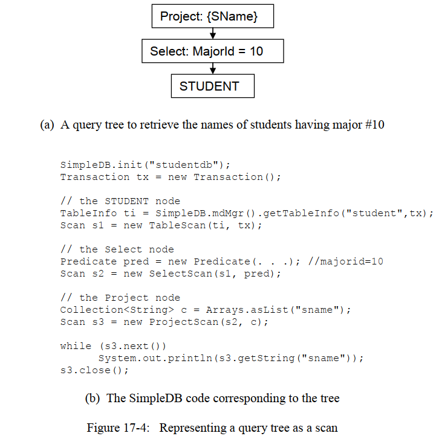
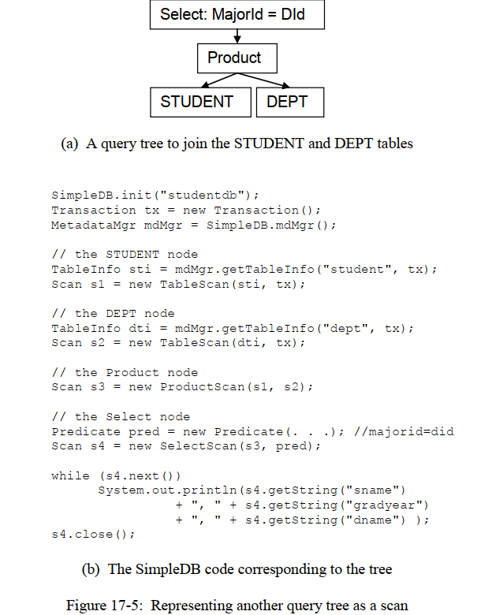
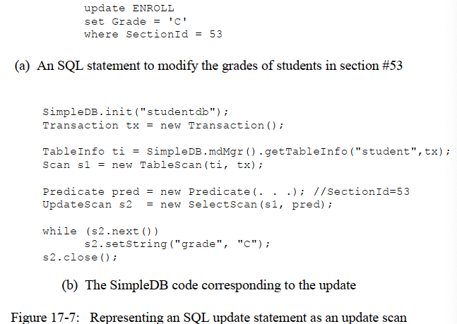
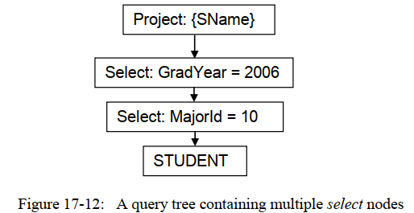
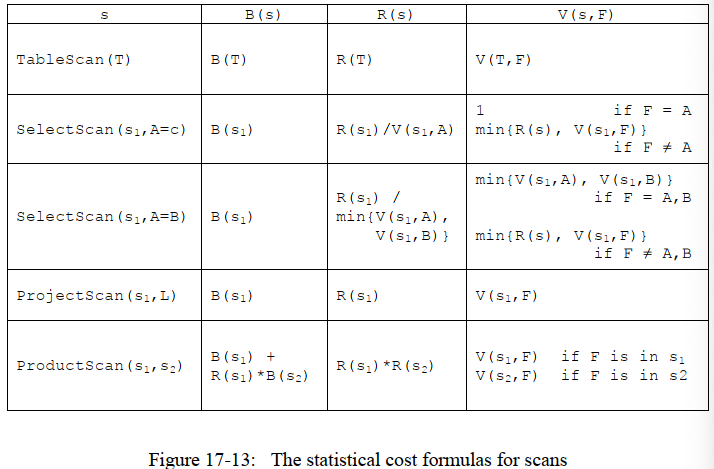
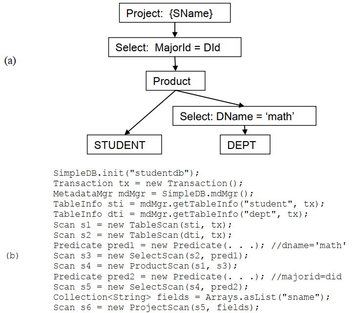
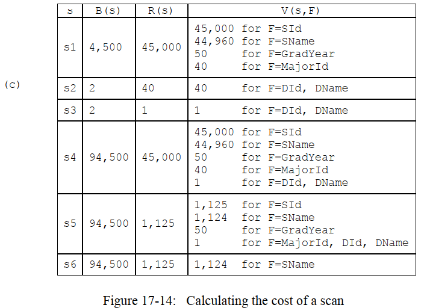
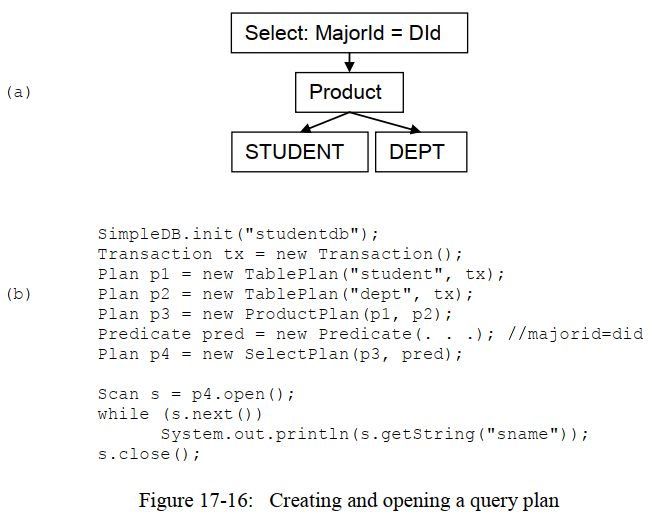

# 第17章 查询处理和包`simpledb.query`

译者注：这一章中有些名词不是很好翻译，例如scan，对于这些不好翻译的词，将直接采用英文。

在前面的两章中，我没已经看到了表中的记录是怎么用记录文件来实现的，也知道了表的元数据是怎么被组织起来的，从而方便以后的记录访问。接下来的三章，我没将会考虑一下数据库系统怎么支持对表的查询。

第4章中介绍了两种查询语言：`关系代数(relational algebra)`和`SQL`。关系代数相对来说比较容易实现，因为每个操作都是一个很小的、且定义好的小任务，然而SQL比较难直接去实现，因为一个SQL查询可以嵌入许多的任务和逻辑。事实上，我们在第4章中已经看到了，一个SQL查询语句可以被表达成一个关系代数查询树，这种对应关系提供了实现SQL的关键—数据库系统首先将SQL查询转换为关系代数，然后执行关系代数查询树。

在这章中，我们将研究一下关于如何执行关系代数的问题，而后续的两章将研究如何将SQL翻译成关系代数。

## 17.1 Scan
一个`Scan`就是代表一个关系代数查询的对象，`Scan`在SimpleDB中是通过接口`Scan`来实现的，接口`Scan`的方法和`RecordFile`类中的方法很相似，客户端可以遍历一个scan，移动到下一条记录，并且检索相应的字段的值。代码如下：
```Java

public interface Scan {
    // 移动到第一条记录之前
    public void beforeFirst();

    // 移动到下一条记录，如果没有下一条记录，返回false
    public boolean next();

    // 关闭scan，如果有subScan，也会相应关闭
    public void close();

    // 获取当前记录指定字段的值，被抽象成了一个Constant对象
    public Constant getVal(String fieldName);

    // 获取当前字段指定int字段的值
    public int getInt(String fieldName);

    // 获取当前字段指定string字段的值
    public String getString(String fieldName);

    // 判断是否有指定字段
    public boolean hasField(String fieldName);

}
```
下面的代码演示了如何使用一个scan，方法`printNameAndGradYear()`会遍历输入的scan，打印出每条记录的字段`sname`和`gradyear`取值。因为`Scan`是一个借口，这个方法其实并不知道这个scan是怎么构造的或者说这个scan代表的具体是哪种查询，凡是输出包含学生名字和毕业年份的查询，其实都是可以成功执行的。
```Java
public static void printNameAndGradyear(Scan s) {
    while (s.next()) {
    String sname = s.getString("sname");
    String gradyr = s.getInt("gradyear");
    System.out.println(sname + "\t" + gradyr);
    }
    s.close();
}
```

`Scan`接口和`RecordFile`类主要在下面的3个方面有所不同：
- `RecordFile`类中包含读/写的方法，而`Scan`中的方法只支持读，只有Update Scan才有写方法，我们将在17.2小节中讨论。
- `RecordFile`类需要知道表的schema信息(`RecordFile`类的构造函数需要提供一个`TableInfo`对象)，但是在`Scan`中不需要。相反，在`Scan`中有一个`hasField()`方法来判断指定的字段是否被包含在scan的输出中。
- `Scan`中除了`getInt()`和`getString()`之外还包含一个`getVal()`方法，其返回的是一个`Constant`类型的对象(详情见17.7小节)，这个类型是对int和string的抽象，这个方法的目的就是允许查询处理器在无需知道具体类型，就可以对字段的值进行比较。

每个Scan对象对应一个查询树中的一个节点，对于每一种关系代数中的操作，都对应有一个具体的Scan接口实现类，而对于查询树中的叶子节点，必定是对一个表的scan，下面的代码中展示了SimpleDB中支持的4种不同的Scan以及它们的构造函数：
```Java
public SelectScan(Scan s, Predicate pred);
public ProjectScan(Scan s, Collection<String> fldlist);
public ProductScan(Scan s1, Scan s2);
public TableScan(TableInfo ti, Transaction tx);
```
考虑一下`SelectScan`类的构造函数，它接受两个输入，一个Scan对象和一个谓词对象（译者注：这里所的谓词，指的是离散数学中的谓词的概念，如果你有学过，可能会觉得很耳熟）。Scan对象表示的是输入给select运算的表。回想一下，关系运算的输入可以是任何表或查询的结果，这刚好用一个类型为Scan的对象来表示。 由于`Scan`是一个接口，因此，无论具体是一个实际存储的表还是其他查询的结果，SelectScan对象可以对输入的表做同样的操作。

第二个谓词对象是一个`Predicate`类型的对象，我们将在17.7小节中讨论SimpleDB是怎么实现select运算中的select谓词的，在那之前，我们对谓词的讨论都会比较含糊，不过你可以暂时理解成一个高层次的抽象的概念，即对scan的结果进行比较筛选。

> 一个查询树可以用许多Scan对象来表示，树上的每个节点代表一个Scan对象。

图17-4和图17-5给出了两个示例，演示了查询树是怎么用scan对象组织起来的。



图17-4（a）展示了一个查询树的情况，该查询的功能是返回所有专业id为10的学生姓名，图17-4（b）则给出了构造这个查询树的具体代码（暂时忽略select谓词的具体实现）。其中Scan类型的变量s1、s2和s3分别对应查询树中的一个节点，并且这个树是自底向上构建的（也就是说，s1对应的是STUDENT结点，s2对应的是Select结点，s3对应的是Project结点），s3是整个查询树的入口，遍历s3，则可以打印出每个专业id为10的学生姓名。



图17-5（a）则展示了另一个查询树的情况，该查询的功能是返回所有的学生信息以及对应的学院。图17-5（b）给出了构造这个查询树的具体代码，和图17-4中的例子很相似。在这个例子中，代码中包含4个scan，因为这个查询树有4个节点，变量s4是整个查询树的入口，然后也和之前一样遍历打印结果。在这里为了节约篇幅，只打印了3个字段，如果你想的话，肯定也是可以打印出两张表join之后的所有字段信息的。

## 17.2 Update scan
一个query定义了一张虚拟表，而Scan接口给客户端提供了读取这些虚拟表的相关方法，但是无法修改虚拟表。在4.5.3小节中，我们已经讨论了更新一个虚拟表的问题，并且得出了这样的结论：只有对于那些可更新的查询`(updatable query)`所创建的虚拟表，更新虚拟表才是有意义的。这个结论在这里同样也成立。

当一个scan中的每条记录$$r$$都在某个数据库表中存在一条对应的$$r'$$记录时，我们称这个scan是可更新的。可更新的scan是通过接口`UpdateScan`来实现的，代码如下所示：
```Java
public interface UpdateScan extends Scan {
    public void setVal(String fieldName,Constant newVal);
    public void setInt(String fieldName,int newVal);
    public void setString(String fieldName,String newVal);
    public void insert();
    public void delete();
    
    public RID getRID();
    public void moveToRId(RID rid);
}
```
前5个方法对应的是一些修改操作，而最后两个方法运行客户端获取到当前记录的rid或者将当前记录移动到指定rid对应的记录。（注意，rid对于非可更新的scan是没什么意义的，因为一个非可更新的scan中的一条记录可能对应的是底层多张表中的多个记录）

SimpleDB中实现了`UpdateScan`接口的两个类是`TableScan`和`SelectScan`，至于如何使用它们，请看下面图17-7中的例子，图17-7（a）中给出了一个SQL语句，该SQL语句的功能是把id为53的那堂课中的所有学生成绩全部改成C，图17-7（b）中给出了实现这个SQL的代码，代码首先创建了一个tableScan对象，随后创建了一个SelectScan对象，最后遍历该SelectScan对象，遍历的过程中会修改每个学生的成绩为C。



注意，变量s2必须被声明成一个update scan，因为遍历的时候回调用`setString()`方法。此外，`SelectScan`构造函数的第一个参数是`Scan`类型的，也就是说，s1不需要被声明为一个update scan；相反，因为有`s2.setString()`方法的存在，因此会将s1强转为一个update scan，如果这个s1实际上不是一个实现了UpdateScan的对象，那么会抛出一个`ClassCastException`异常。

## 17.3 实现Scan接口
SimpleDB中包含4个实现了Scan接口的类，分别是：`TableScan`、`SelectScan`、`ProjectScan`、和`ProductScan`。下面我们将以此来讨论一下关于这些类的实现细节。
### 17.3.1 Table Scan
`TableScan`类的代码如下所示，TableScan是可更新的scan，因此实现的是`UpdateScan`接口(`UpdateScan`接口是`Scan`接口的子类)。
```Java
public class TableScan implements UpdateScan {
    private RecordFile recordFile;
    private Schema schema;

    public TableScan(TableInfo tableInfo, Transaction tx) throws IOException {
        recordFile = new RecordFile(tableInfo, tx);
        schema = tableInfo.schema();
    }
    //================Scan 接口中的方法实现===================
    @Override
    public void beforeFirst() {
        recordFile.beforeFirst();
    }

    @Override
    public boolean next() throws IOException {
       return recordFile.next();
    }

    @Override
    public void close() {
        recordFile.close();
    }

    @Override
    public Constant getVal(String fieldName) {
        if (schema.type(fieldName)==Schema.VARCHAR)
            return new StringConstant(recordFile.getString(fieldName));
        else
            return new IntConstant(recordFile.getInt(fieldName));
    }

    @Override
    public int getInt(String fieldName) {
        return recordFile.getInt(fieldName);
    }

    @Override
    public String getString(String fieldName) {
        return recordFile.getString(fieldName);
    }

    @Override
    public boolean hasField(String fieldName) {
        return schema.hasFiled(fieldName);
    }

    //================UpdateScan 接口中额外的方法实现===================

    @Override
    public void setVal(String fieldName, Constant newVal) {
        if (schema.type(fieldName)==Schema.VARCHAR)
            recordFile.setString(fieldName,(String) newVal.asJavaVal());
        else
            recordFile.setInt(fieldName,(Integer)newVal.asJavaVal());

    }

    @Override
    public void setInt(String fieldName, int newVal) {
        recordFile.setInt(fieldName,newVal);
    }

    @Override
    public void setString(String fieldName, String newVal) {
        recordFile.setString(fieldName,newVal);
    }

    @Override
    public void insert() throws IOException {
        recordFile.insert();
    }

    @Override
    public void delete() {
        recordFile.delete();
    }

    @Override
    public RID getRID() {
        return recordFile.currentRID();
    }

    @Override
    public void moveToRId(RID rid) {
        recordFile.moveToRID(rid);
    }
}
```
代码相对来说还是很直观的，构造函数会根据传入的`TableInfo`对象创造这张`RecordFile`对象，方法`getVal()`则会基于具体的字段，创建合适的`Constant`对象，方法`setVal()`则刚好执行相反的操作。方法`hasField()`则会查看一下表的schema，其他的方法则都是通过`RecordFile`对象提供的方法来完成的。
### 17.3.2 Select Scan
`SelectScan`类的代码如下，构造函数也会传入一个实现了Scan接口的对象，该对象可以是一个输入表（即TableScan），一个SelectScan对象的当前记录就是构造函数中传入的Scan对象的当前记录，这也就是说，SelectScan中许多方法的实现都可以通过直接调用传入Scan对象的相关方法来完成。
```Java
public class SelectScan implements UpdateScan {

    private Scan scan;
    private Predicate predicate;

    public SelectScan(Scan scan, Predicate predicate) {
        this.scan = scan;
        this.predicate = predicate;
    }

    //================Scan 接口中的方法实现===================

    @Override
    public void beforeFirst() {
        scan.beforeFirst();
    }

    @Override
    public boolean next() throws IOException {
        while (scan.next())
            if (predicate.isSatisified(scan))
                return true;
        return false;
    }

    @Override
    public void close() {
        scan.close();
    }

    @Override
    public Constant getVal(String fieldName) {
        return scan.getVal(fieldName);
    }

    @Override
    public int getInt(String fieldName) {
        return scan.getInt(fieldName);
    }

    @Override
    public String getString(String fieldName) {
        return scan.getString(fieldName);
    }

    @Override
    public boolean hasField(String fieldName) {
        return scan.hasField(fieldName);
    }

    //================UpdateScan 接口中额外的方法实现===================

    @Override
    public void setVal(String fieldName, Constant newVal) {
        // 这里必须把scan强转为UpdateScan类型
        // 也只有UpdateScan类型的对象才有setXXX()方法
        // 如果scan不是一个实现了UpdateScan接口的对象，运行时则会抛出ClassCastException异常
        UpdateScan updateScan = (UpdateScan) scan;
        updateScan.setVal(fieldName,newVal);
    }

    @Override
    public void setInt(String fieldName, int newVal) {
        UpdateScan updateScan = (UpdateScan) scan;
        updateScan.setInt(fieldName, newVal);
    }

    @Override
    public void setString(String fieldName, String newVal) {
        UpdateScan updateScan = (UpdateScan) scan;
        updateScan.setString(fieldName, newVal);
    }

    @Override
    public void insert() throws IOException {
        UpdateScan updateScan = (UpdateScan) scan;
        updateScan.insert();
    }

    @Override
    public void delete() {
        UpdateScan updateScan = (UpdateScan) scan;
        updateScan.delete();
    }

    @Override
    public RID getRID() {
        UpdateScan updateScan = (UpdateScan) scan;
        return updateScan.getRID();
    }

    @Override
    public void moveToRId(RID rid) {
        UpdateScan updateScan = (UpdateScan) scan;
        updateScan.moveToRId(rid);
    }
}
```
唯一一个需要特别注意的地方就是`next()`方法，`next()`方法的作用实际上是判断是否存在下一条记录，而在这里我们又要加上对记录的谓词判断。在代码中，我们必须使用`while(scan.next())`而不是`if(scan.next())`，因为，假如当前记录后面还存在3条记录r1、r2和r3，而r1又不满足预定义的谓词，在SelectScan中的`next()`方法的功能是判断是否存在满足谓词的下一条记录，因此必须找到r2并将之设置为当前记录，然后返回true。

Select scan是updatable的，所以在`SelectScan`中有关`UpdateScan`接口中的方法，都会先将scan强转为`UpdateScan`类型的，然后再调用相关的方法。在SimpleDB中，query planner（后续章节中的内容）只会对table scan和select scan创建updatable scan对象，所以，一旦发现抛出了`ClassCaseException`异常，肯定是代码中出现了bug。

### 17.3.3 Project scan
`ProjectScan`类的实现如下，想要输出的字段列表会通过构造函数传入，随后会判断这些字段是否存在，其他方法的实现也很直接，只要调用scan对象的相关方法即可。
```Java
public class ProjectScan implements Scan {
    private Scan scan;
    private Collection<String> fieldList;

    public ProjectScan(Scan scan, Collection<String> fieldList) {
        this.scan = scan;
        this.fieldList = fieldList;
    }

    // ============Scan 接口中相关方法的实现==============

    @Override
    public void beforeFirst() {
        scan.beforeFirst();
    }

    @Override
    public boolean next() throws IOException {
        return scan.next();
    }

    @Override
    public void close() {
        scan.close();
    }

    @Override
    public Constant getVal(String fieldName) {
        if (hasField(fieldName))
            return scan.getVal(fieldName);
        else
            throw new RuntimeException("Field "+fieldName+" is not found!");
    }

    @Override
    public int getInt(String fieldName) {
        if (hasField(fieldName))
            return scan.getInt(fieldName);
        else
            throw new RuntimeException("Field "+fieldName+" is not found!");
    }

    @Override
    public String getString(String fieldName) {
        if (hasField(fieldName))
            return scan.getString(fieldName);
        else
            throw new RuntimeException("Field "+fieldName+" is not found!");
    }

    @Override
    public boolean hasField(String fieldName) {
        return fieldList.contains(fieldName);
    }
}
```
注意，在SimpleDB中Project Scan被设计成了不可更新的（实际上，是可以设计成可更新的），因此也没必要也不能去实现`UpdateScan`接口，练习17.16有相关的讨论。

### 17.3.4 Product scan
`ProductScan`类的实现代码如下：
```Java
public class ProductScan implements Scan {
    private Scan scan1,scan2;

    public ProductScan(Scan scan1, Scan scan2) throws IOException {
        this.scan1 = scan1;
        this.scan2 = scan2;
        scan1.next();
    }

    // ============Scan 接口中相关方法的实现==============

    @Override
    public void beforeFirst() throws IOException {
        scan1.beforeFirst();
        scan1.next();
        scan2.beforeFirst();
    }

    @Override
    public boolean next() throws IOException {
        if (scan2.next())
            return true;
        else {
            scan2.beforeFirst();
            return scan1.next() && scan2.next();
        }
    }

    @Override
    public void close() throws IOException {
        scan1.next();
        scan2.next();
    }

    @Override
    public Constant getVal(String fieldName) {
        if(scan1.hasField(fieldName))
            return scan1.getVal(fieldName);
        else
            return scan2.getVal(fieldName);
    }

    @Override
    public int getInt(String fieldName) {
        if(scan1.hasField(fieldName))
            return scan1.getInt(fieldName);
        else
            return scan2.getInt(fieldName);
    }

    @Override
    public String getString(String fieldName) {
        if(scan1.hasField(fieldName))
            return scan1.getString(fieldName);
        else
            return scan2.getString(fieldName);
    }

    @Override
    public boolean hasField(String fieldName) {
        return scan1.hasField(fieldName) || scan2.hasField(fieldName);
    }
}
```
product操作对应的是大多数中文数据库书中的联结操作，也就是对两个表中的记录求一个笛卡尔积。在代码中，我们先开始遍历scan1中的所有记录作为笛卡尔积的左侧元素，然后再遍历scan2中所有的记录作为笛卡尔积的右侧元素；也就是类似一个嵌套的循环，scan1为外层循环，scan2为内层性循环。

`next()`方法是这样实现这个嵌套循环的：每次都调用内层scan2循环的next()，如果scan2有下一条记录，则返回true；如果scan2没有下一条记录，则肯定是内层循环到了底，此时必须调用外层循环的next()方法，于是返回scan1的下一条记录，并且把scan2移动到第一条记录，然后返回true；否则其他情况，返回false。

`getXXX()`方法则很简单了，只不过多了一个判断指定字段是来自于哪个scan的操作。

## 17.4 流水线式的查询处理
我们已经知道了simpleDB中几种基本的关系代数操作是如何实现的，实际上，这些实现被称为`流水线式的(pipelined)`,它们有下面的两个特点。
- 按照客户端的需要，每次只会输出一条记录
- 实现中不会保存输出记录，也不会保存任何中间的计算结果。

我们在这里只分析`TableScan`和`SelectScan`的特点，`ProductScan`和`ProjectScan`的分析则类似。

假设有一个`TableScan`类型的对象，它的实现中是维护了一个record file的，这个record file又是维护了一个record page的，这个record page又是持有了一个buffer的，buffer中又持有一个页，而这个页中包含的是对应块中的实际内容的。当前记录只是在这个页中的一个位置，每当客户端请求访问一个字段的具体取值时，记录管理器只会提取出这个字段的值而已，随后返回这个值可客户端；而每次调用`next()`方法后则会将当前记录移动至下一条，这个操作有可能会引发一次缓冲区的换入换出（swapping）。

现在我们继续考虑有一个`SelectScan`类型的对象，没次调用该对象的`next()`方法实际上调用的是一个underlying的Scan类型对象的`next()`方法，直到找到一个满足谓词的记录。但是实际上，这个`SelectScan`类型的对象根本没有什么“当前记录”——如果这个对象的underlying的Scan类型对象是一个Table Scan, 那么这个当前记录只不过是在页中的一个位置而已了，对吧？也就是说，根本没有一个实际的变量保存了当前记录所有值。每次select scan调用`next()`方法，实际上都是从上一次的位置往下搜索的。

最后，很重要的一点，一个select scan不会追踪已经选择了的记录，也就是说，如果一个客户端需要连续2次请求同一个记录，select scan必须遍历两次。

术语"流水线"代表的是查询树自顶向下的方法调用流，以及自底向上的结果返回流。举例来说，假如查询树中的某个结点调用了`getInt()`方法，那么这个结点会一直往下调用它的子结点的方法，直到访问到了叶子节点，叶子节点随后将提取出来的值又一直往它的父结点抛上去。在比如，假如调用`next()`方法，它可能会调用它的子节点的`next()`方法多次直到找到了满足条件的下一条记录，这个例子其实就是select scan对table scan的调用，随后也会同样地返回结果。

流水线式的实现是非常高效的，例如，请看图17-12中的查询树的例子，我们可以发现，project结点和select结点的cost实际上是0。



方法调用流程是这样的：
- 我们先考虑最顶层的project结点，每次调用`next()`方法，都会简单地调用第一个select结点（也就是Select: GradYear=2006结点）的`next()`方法；
- 第一个select结点又会继续往下调用第二个select结点的`next()`方法；
- 第二个select结点又会继续往下调用table scan结点的`next()`方法。

结果返回的流程又是这样的：
- table scan结点会遍历record file，判断是否存在下一条记录，并返回给第二个select结点（返回的是布尔值）；
- 如果子节点抛来的布尔值是true，则第二个select结点会判断当前这条记录是否满足谓词，随后把判断结果也往上抛；
- 如果第二个select结点往上抛出的布尔值是false，那肯定第一个select结点也无需再去做谓词判断了，随后继续把这个值抛给父结点；
- project结点也肯定会接受到这个false值，又重新执行下一轮调用流程了。

这么一分析，project结点和select结点的cost真的是0，只有叶子结点会执行具体的底层遍历逻辑。虽然说，这种流水线的实现方式在某些场合下很高效，但是在某些场合下也不是那么好（译者注：常言道，Every coin has two sides，但是既然有两面，那肯定有Edge，我们站在Edge上同时看两个sides就好了，对吧？）。这种不太好的场合的一个例子是，当一个select scan结点是在一个product scan结点的右边时，会执行很多轮的方法调用（很难用语言描述，看下代码分析一下就可以）。在这种情况下，为了避免一遍又一遍地遍历，选用一种可以将输出记录`具体化(materialize)`到一个临时表中的实现会更好。这中实现将在第22章中讨论。

## 估计Scan的代价
数据库系统的一个职责是对于一个给定的SQL查询，创建一个最高效的scan。于是系统必须去估计一个scan的执行用时大概是多少。由于一个scan所需执行的文件块访问数，是评估执行代价的最关键因素，因此估计所需的块访问次数就足够了。 在本节中，我们将考虑如何估算一个scan的代价，而 在第24章中，我们将了解数据库系统如何利用这些信息。

一个scan的代价可以用类似16.4小节中的数据统计信息术语来评估：
>假设有某个scan，记为s，并记s中的某个字段为F。
> $$B(s)$$表示构造s的输出所需的块访问数量。
> $$R(s)$$表示s输出的记录条数。
> $$V(s, F)$$表示s输出的所有记录中，F字段的所有可能取值数。

图17-13包含了每个关系代数操作的代价公式，这些公式的推导我们将一一道来。



### 17.5.1 Table scan的代价
每个table scan都维护了一个record file，record file又维护了一个当前的record page，record page实际上又是一个buffer中的page，page又实际对应了底层的一个文件块。当某个page上对应的记录全部被读取完毕后，该page所在的缓冲区会被取消固定(unppin)，并且记录文件中的下一个页（说准确点，应该是下一个块）又被读。因此，table scan只需一次遍历就可以访问所有的记录，因此$$B(s)$$、$$R(s)$$和$$V(s, F)$$则很容易计算，和一个表的数据统计信息几乎一样，如17-13中公式所示。

### 17.5.2 Select scan的代价
一个select scan有一个underlying的scan，我们用$$s_1$$来表示，每次select scan调用`next()`方法，则都会相应调用$$s_1$$的`next()`方法一次或多次，每次select scan调用`getXXX()`方法都会执行$$s_1$$的相应get方法，这些get方法是无需块访问的，于是一个select scan的块访问数和它所拥有的underlying的scan的块访问数是一样的，即$$ B(s) = B(s_1) $$。

至于$$R(s)$$和$$V(s, F)$$的计算，则取决于相应具体的谓词了，例如我们先分析一个常见的情况，谓词的判断逻辑是一个字段的取值是一个具体的值，或者一个字段的取值和另一字段的取值相等。

***Selection on a constant***

假设谓词是形如“A = c”的形式，如果我们假设A字段的所有取值全是均匀的分布（这个假设其实很常见），那么匹配该谓词的所有记录数量则为$$R(s_1)/ V(s_1, A)$$

在均匀分布的假设下，也意味着输出中的其他字段的取值也是均匀分布的，因此有：
$$
V(s, A)=1
V(s, F)=min{R(s), V(s_1,F)} for all other fields F
$$

***Selection on a field***

现在我们假设谓词的形式是“A = B”，在这种情况下，字段A和字段B肯定是存在某种关系的，尤其是，如果我们假设B字段的所有可能取值数比A多（即$$V(s_1, A)<V(s_1, B) $$），那么A字段的每个取值必然能在B字段中找到一个对应相等的值，这种情况其实就是B字段是某张表的主键，而字段A是另一张表中外键的情况了！在这种情况下，A字段的每个取值在匹配B字段中取值的概率为$$1/ V(s_1, B)$$；当然如果我们的假设刚好相反，即B字段的所有可能取值数比A少（即$$V(s_1, A) > V(s_1, B) $$）,概率值则为$$1/ V(s_1, A)$$。

无论是上述的哪一种情况，反正概率总是取值数多的的那个字段的倒数，因此$$ R(s) = R(s_1) / max\{V(s_1, A) , V(s_1, B) \}$$。

在均匀分布的假设下，也意味着每个A字段的值也是有相同的概率匹配B字段的值，所以有：
$$
V(s, F) = min \{V(s_1,A), V(s_1,B)\} for F=A or B
V(s, F) = min \{R(s), V(s_1,F)\} for all fields F other than A or B
$$

### 17.5.3 Project scan的代价
和select scan一样，project scan也有一个underlying的scan（记作$$s_1$$）,这3个值可以很快地算出来，有：
$$
B(s) = B(s1)
R(s) = R(s1)
V(s, F) = V(s1, F) for all fields F
$$

### 17.5.4 Product scan的代价
一个product scan有两个underlying的scan，记作$$s_1$$和$$s_2$$，和之前小节中分析的一样，遍历一次product scan，需要遍历一遍$$s_1$$，并对于$$s_1$$中的每一条记录，都要遍历一遍$$s_2$$，因此有下列的公式：
$$
B(s) = B(s1) + (R(s1) * B(s2))
R(s) = R(s1) * R(s2)
V(s, F) = V(s1, F) or V(s2, F), depending on which table F comes from.
$$
这里非常有趣的一点是，$$B(s)$$这个公式不是关于$$s_1$$和$$s_2$$对称的，也就是说，从逻辑上讲，语句`Scan s3 = new ProductScan(s1, s2);`和`Scan s3 = new ProductScan(s2, s1);`的结果是一样的，但是访问代价是不一样的。

差了多少呢？我们现在定义$$RPB(s) =R(s) / B(s) $$，即scan结果每个块上的记录数，于是上面的公式可以改写为$$B(s) = B(s_1) + ( RPB(s_1) * B(s_1) * B(s_2) )$$，这个公式的关键项其实就是$$RPB(s_1) * B(s_1) * B(s_2)$$，而决定该项大小的关键就是$$RPB(s_1) $$，所以，把RPB小的那个scan放在product scan的左边是会让$$B(s)$$整体取得最小！

举个例子来说，假设$$s_1$$是学生表STUDENT，$$s_1$$是学院表DEPT，因为学生的记录数肯定远大于学院的记录数，并且一条学生的信息一般都比一条学院信息大，也就是说学生表的PRB更小，所以把学生表放在product的左边会更好。

译者注：其实我个人感觉这个推导不完全正确，因为还和$$B(s_1)$$有关，如果你真的要仔细推导的话，你会发现除了RPB这个因素之外，其实还和$$R(s_1)$$、$$R(s_2)$$的具体取值有关，我只能说作者给出的上述结论在大多数情况下是成立的。

### 17.5.5 一个具体的例子
现在考虑一个SQL查询，其功能是返回所有数学专业的学生名字，图17-14（a）展示了这个query，图17-14（b）给出了相应的SimpleDB代码，图17-14（c）给出了这些scan的数据统计信息，我们假设底层实际表的存储和16章中的图16-7一样。




$$s_1$$和$$s_2$$和学生表、学院表的数据统计信息一样，而$$s_3$$这个select scan只返回1条记录，但需要访问的块数则是所有块；$$s_4$$这个product scan返回45000条学生记录和一条专业记录的笛卡尔积，输出自然也是45000条记录，但是这个笛卡尔积的操作会需要94500次块访问，因为每个学生记录都会遍历一遍DEPT表，这需要$$45000 x 2 = 90000$$次块访问，再加上STUDENT表也要遍历一遍，所以就是$$90000 +4500 =94500 $$次块访问。而至于$$s_5$$这个select scan的话会把笛卡尔积的45000条记录除以40（假设学生的专业是均匀分布的），得到1125条记录，但是需要访问的块数丝毫不会减少。project scan的话，不会改变任何一个值。

数据库系统重新计算数学学院这条记录45,000次，而且代价很高，这似乎很奇怪，我们查看一下STUDENT表和s3的RPB取值，我们会发RPB（STUDENT）= 10，而RPB（s3）= 0.5， 由于把较小RPB的scan放在product scan的左侧时效代价更低，因此将s4定义为以下会更有效：
```
s4 = new ProductScan(s3, STUDENT)
```
练习17.7要求您证明在这种情况下，该操作仅需要4502次块访问。

## 17.6 Plan
一个SQL查询可能对应多个等价的查询树，而每个查询树又对应一个不同的scan，因此又对应有不一样的执行代价。数据中的planner是负责创建最小代价scan的组件。为了实现这个功能，planner需要创建多个可能的查询树，并且分别计算出它们的代价，然而最后，只选择那个代价最小的scan。
> 为了比较执行代价而构造的查询树称为plan。

plan和scan在概念上相似，因为它们都表示查询树。不同之处在于，plan对象具有估算代价的方法，它访问数据库的元数据，但不访问实际数据，我们 可以创建多个plan，而不会引起过度的磁盘访问开销。 然而，scan对象则是为了访问数据库而创建的， 创建scan对象后，将为查询中提到的每个表打开一个record file，该record file又将其记录文件的第一个块读入缓冲区， 因为打开scan会导致磁盘访问，所以数据库系统在确定是执行查询的最佳方法之前不会创建scan。

一个plan的接口为`Plan`，如下：
```Java
public interface Plan {
    public  Scan open();
    public  int blockAccessed();
    public int recordsOutput();
    public int distinctValues(String fldName);
    public Schema schema();
}
```
解开了中支持方法`blocksAccessed()`, `recordsOutput()`和` distinctValues()`，就是对应于一个plan的$$B(s), R(s), and V(s, F)$$三个值。`schema()`方法则会返回输出表的schema，query planner到时候可以使用这个schema来做类型验证，以及优化plan的工作；最后，每个plan对象也会有一个`open()`方法来创建一个对应的scan对象。

创建一个plan和创建一个scan类似，对于每个关系代数操作，都会有一个对应实现了`Plan`接口的具体类，`TablePlan`类会处理存储的表。例如，考虑一下图17-16中的例子，这个例子和图17-4中的例子是对应一样的query，图17-4（b）和图17-16（b）是类似的，主要的区别就是这里创建了一个plan。



下面将依次给出`TablePlan`,`SelectPlan`,`ProjectPlan`和`ProductPlan`的实现，其中`TablePlan`会直接从`StatMgr`类中估计代价，其他类则会按照17.5小节中的那张表格计算相应的代价。

```Java
public class TablePlan implements Plan {
    private Transaction tx;
    private TableInfo tableInfo;
    private StatInfo statInfo;

    public TablePlan(String tblName,Transaction tx) throws IOException {
        this.tx = tx;
        this.tableInfo = SimpleDB.metadataMgr().getTableInfo(tblName,tx);
        this.statInfo = SimpleDB.metadataMgr().getStatInfo(tblName,tx);
    }

    @Override
    public Scan open() throws IOException {
        return new TableScan(tableInfo,tx);
    }

    @Override
    public int blockAccessed() {
        return statInfo.blocksAccessed();
    }

    @Override
    public int recordsOutput() {
        return statInfo.recordsOutput();
    }

    @Override
    public int distinctValues(String fldName) {
        return statInfo.distinctValues(fldName);
    }

    @Override
    public Schema schema() {
        return tableInfo.schema();
    }
}
```
select plan的代价估计比其他操作复杂一些，因为具体的估计取决于谓词是什么。因此，select plan可以使用谓词的`reduceFactor()`和`equatesWithConstant()`方法。 方法`recordsAccessed()`会调用`reductionFactor()`方法来计算这个谓词使得输入表记录减小的程度。 `distinctValues()`会使用方法`equatesWithConstant()`来判断指定字段的值是否满足谓词中的常量。
```Java
public class SelectPlan implements Plan {
    private Plan plan;
    private Predicate predicate;

    public SelectPlan(Plan plan, Predicate predicate) {
        this.plan = plan;
        this.predicate = predicate;
    }

    @Override
    public Scan open() throws IOException {
        return null;
    }

    @Override
    public int blockAccessed() {
        return plan.blockAccessed();
    }

    @Override
    public int recordsOutput() {
        // predicate.reductionFactor(plan)就是 图17-13 中的 V(s_1, A)
        return plan.recordsOutput() / predicate.reductionFactor(plan);
    }

    @Override
    public int distinctValues(String fldName) {
        if (null != predicate.equatesWithConstant(fldName))
            return 1;
        else
            return Math.min(recordsOutput(),plan.distinctValues(fldName));
    }

    @Override
    public Schema schema() {
        return plan.schema();
    }
}
```
`ProjectPlan`类和`ProductPlan`类会根据underlying的plan对象的schema创建新的schema结果。具体来说，`ProjectPlan`类会在underlying plan对象已有schema中筛掉一些字段；`ProductPlan`类则会取两个schema的并集。
```Java
public class ProjectPlan implements Plan {
    private Plan plan;
    private Schema schema = new Schema();

    public ProjectPlan(Plan plan, Collection<String> fieldList) {
        this.plan=plan;
        for (String fieldName : fieldList)
            schema.add(fieldName,plan.schema());
    }

    @Override
    public Scan open() throws IOException {
        Scan scan=plan.open();
        return  new ProjectScan(scan,schema.fields());
    }

    @Override
    public int blockAccessed() {
        return plan.blockAccessed();
    }

    @Override
    public int recordsOutput() {
        return plan.recordsOutput();
    }

    @Override
    public int distinctValues(String fldName) {
        return plan.distinctValues(fldName);
    }

    @Override
    public Schema schema() {
        return schema;
    }
}
```
```Java
public class ProductPlan implements Plan {
    private Plan plan1, plan2;
    private Schema schema = new Schema();

    public ProductPlan(Plan plan1, Plan plan2) {
        this.plan1 = plan1;
        this.plan2 = plan2;
        this.schema.addAll(plan1.schema());
        this.schema.addAll(plan2.schema());
    }

    @Override
    public Scan open() throws IOException {
        Scan scan1 = plan1.open();
        Scan scan2 = plan2.open();
        return new ProductScan(scan1, scan2);
    }

    /**
     * 图17-13中的 B(s_1) + R(s_1) * B(s_2)
     *
     * @return
     */
    @Override
    public int blockAccessed() {
        return plan1.blockAccessed() +
                (plan1.recordsOutput() * plan2.blockAccessed());
    }

    /**
     * 图17-13中的 R(s_1) * R(s_2)
     * @return
     */
    @Override
    public int recordsOutput() {
        return plan1.recordsOutput() * plan2.recordsOutput();
    }

    @Override
    public int distinctValues(String fldName) {
        if(plan1.schema().hasFiled(fldName))
            return plan1.distinctValues(fldName);
        else
            return plan2.distinctValues(fldName);
    }

    @Override
    public Schema schema() {
        return schema;
    }
}
```
对于每个类中的`open()`方法则比较简单，通常来说，构造一个plan对应的scan需要2步：
- 首先，对于每个plan，都会先构造其underlying plan的scan（当然，underlying plan可能又有另外的underlying plan，这是一个递归的过程）；
- 随后，把这个构造好的`Scan`接口对象构造一个具体的Scan类型对象。

## 17.7 谓词
### 17.7.1 使用谓词
现在，我们来考虑一下谓词的结构以及它们在SimpleDB中的实现和使用方式。

从结构上讲，我们有以下定义：
> 一个谓词(predicate)是一系列项(term)的布尔组合；
> 一个项(term)是两个表达式(expression)之间的比较；
> 一个表达式(expression)包含对字段名和常数上的操作。

例如，考虑下面的这个谓词：
```
(GradYear = 2006 or GradYear = 2007) and MajorId = DId
```
该谓词包含三个项，前两个项将字段名称GradYear与常量进行比较，而第三项将两个字段名称进行比较；这些项中的每个表达式都不涉及任何运算，并且可以是字段名称或常量。 通常，表达式可以具有运算符（例如算术运算符）或内置函数。

在SimpleDB中，表达式只能是常量或字段名；一个项只支持相等比较；谓词只支持项之间的住合取范式（离散数学中的概念）。 在这里，我们只讨论简化的情况， 练习17.11至17.13要求你考虑更一般的情况。
```Java
public class Predicate {
    // 供 Parser调用
    public void conjoinWith(Predicate predicate);

    // 供 SelectScan中的next()方法调用
    public boolean isSatisified(Scan s);

    // 供SelectPlan中的recordsOutput()方法调用
    public  int reductionFactor(Plan p);

    // 供 query planner调用
    public Predicate selectPred(Schema schema);
    public Predicate joinPred(Schema schema1,Schema schema2);
    public Constant equatesWithConstant(String fieldName);
    public String equatesWithField(String fieldName);

}
```