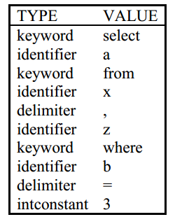
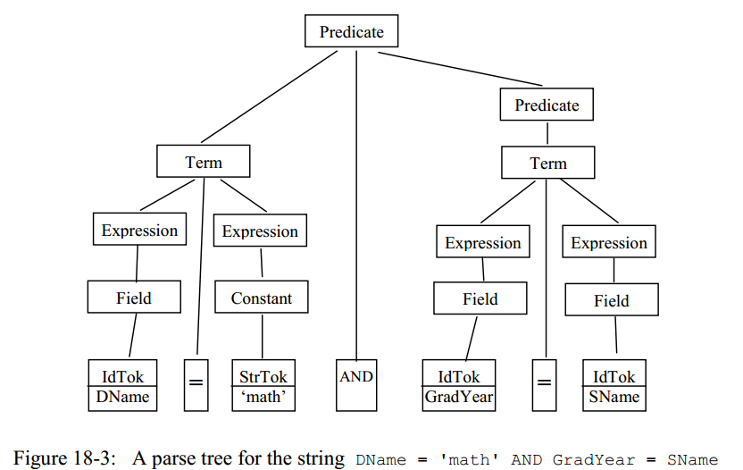

# 第18章 SQL解析和包`simpledb.parse`

JDBC客户端将SQL语句作为字符串提交给服务器，数据库系统必须处理此字符串以创建可执行的scan。 这个过程分为两个阶段：
- 基于语法的阶段，我们称为`解析(parsing)`阶段； 
- 基于语义的阶段，即`计划(planning)`阶段。 

译者注：我认为planning翻译成计划不是很恰当，下文中直接用planning替代。

我们将在本章讨论解析过程，而在下一章讨论planning。

## 18.1 语法 V.S. 语义
> 语言的`语法(syntax)`是一组描述字符串的规则，这些字符串可能是有意义的语句。

例如，考虑下面这样一个字符串：
```
select 
from table T1 and T2 
where b-3
```
很明显，这肯定是一个非法的SQL语句，因为它不满足SQL的语法，原因是：
- select语句必须包含具体的东西；
- 在from语句中指定的表名前面并不需要加关键字`table`;
- 关键字`and`应该只是在谓词之间起连接作用，而不是在连接表的时候使用；
- 字符串`b-3`也不满足谓词的定义语法。

以上的这么多原因都充分地说明了这个SQL字符串注定不会是一个有意义的SQL语句，数据库也肯定没办法怎么处理这种“SQL”,就算你指定的T1，T2和b真的是表名和字段名。

> 语言的`语义(semantics)`指定了语法正确的字符串的实际含义。

现在，我们考虑一个语法正确的SQL语句，如下：
```
select a
from x,z
where b = 3
```
我们可以推断出，这个SQL语句是一个查询，其功能是从两张表的product结果中返回满足谓词b=3的所有a字段的记录，这个SQL语句因此是有意义的。

一条语句是否有具体还取决定于x，z，a和b的具体语义信息。其中，x和z必须是存在的表名，并且这两张表中至少有一个表存在字段a，并且存在一个int类型的字段b，这些语义信息倒是可以从数据库的元数据中获取到，解析器`parser`一点儿也不知道关于元数据的信息，因此也根本不知道也无法去估计一个SQL语句的具体含义；相反，检查具体元数据的工作是planner的责任，我们将会在第19章中讨论planner。

## 18.2 词法分析
parser为了解析一条SQL语句，首先要做的事情就是把输入的SQL字符串分割成一块一块的`字符(token)`，注意，这里说的字符并不是指单个ASCII码的字符，而是一个单词，例如 I love computer science中包含4个token，即I、love、computer和science。parser中负责将字符串分成token流的部分被称为`词法分析器(lexical analyzer)`。

每个token都有一个类型(type)和一个值(value), SimpleDB中的词法分析器支持5种类型的token，分别为：
- 单字符分隔符，例如，逗号;
- 整形常量，例如123;
- 字符串型常量，例如“joe”;
- 关键字，例如select、from、where等;
- 标识符，例如STUDENT,x, glop34a等。

空格字符（包括空格，制表符和换行符）通常不属于token；唯一的例外是在字符串常量内部的空格字符。空格的作用是用于增强SQL的可读性并使token之间彼此分离。

继续考虑之前的那个例子：
```
select a
from x,z
where b = 3
```
词法分析器会得到下面的10个token，如图18-1所示：



当parser需要知道token流的适合，会调用词法分析器中的相应方法来得到token。词法分析器中可供parser调用的方法包含两类：
- 第一类是判断当前token是何种类型的方法；
- 第二类是获得当前token的值，并且移动到下一个token的方法，你可以看作好像是词法分析器在不断地“吃”token。

每种类型的token都会在词法分析器中有一对相应的方法，SimpleDB中的词法分析器的API如下所示，包含10个方法：
```Java
public class Lexer {
    public boolean matchDelim(char ch);
    public boolean matchIntConstant();
    public boolean matchStringConstant();
    public boolean matchKeyword(String w);
    public boolean matchIdentifier();

    public void eatDelim(char ch);
    public int eatIntConstant();
    public String eatStringConstant();
    public void eatKeyword(String w);
    public String eatIdentifier();
}
```
前5个方法返回的是当前token的信息，如果当前token和指定的分隔符相等，则方法`matchDelim()`会返回true；类似地，如果当前token和指定的关键字相等，则方法`matchKeyword()`会返回true；其他3个方法则会在当前token满足相关类型时返回true。

后5个方法则会不断地“吃掉”当前token，并移动到下一个token（如果有的话）。每个方法中会调用相应的`matchXXX()`方法，如果match方法返回false，于是抛出一个异常；否则的话，下一个token变长当前的token；此外，`eatIntConstant()`、`eatStringConstant()`和`eatIdentifier()`这3个方法还会返回当前token的具体取值。

## 18.3 实现词法分析器
概念上来说，词法分析器的实现倒是可以很简单粗暴——每次从字符串中读一个字符（注意，这里说的字符真的是一个字符），直到遇到了token之间的分隔符（也就是空格了）则停止，然后判断这个token是什么类型，具体token取值又是什么。因此，词法分析器的复杂度实际上是直接正比于token类型的数量的，token类型越多，这个实现越复杂。（译者注，举个例子，考虑一个SQL字符串`select a from student`，词法分析器一直读读读，'s','e','l','e','c','t',噢，到了一个空格，那前面的就是一个token了，再判断一下，哦这是select，于是知道这是一个关键字token；后续分析类似，因此试想一下，如果token的类型很多，那就会有很多的if判断，真是噩梦）。

好在Java语言中提供了两种不同的自带的`token解析器(tokenizer)`，tokenizer这是Java中的术语，无关紧要了，反正知道是用来解析token的就好了。这两种实现分别是`StringTokenizer`和`StreamTokenizer`。
- `StringTokenizer`用法很简单，但是它只支持两种类型的token：分隔符和单词(也就是两个分隔符之前的内容),稍加分析我们便可以知道，这个实际上不适合SQL，因为这个tokenizer到时候会不理解数值和带引号的字符串；
- 相反，`StreamTokenizer`则支持广泛的token类型，包括SimpleDB中的5种token类型，因此SimpleDB中的`Lexer`类基于Java的stream tokenizer来实现，具体代码如下所示：
```Java
public class Lexer {
    private Collection<String> keywords;
    private StreamTokenizer tokenizer;

    public Lexer(String s) {
        // 初始化关键字
        initKeywords();
        tokenizer = new StreamTokenizer(new StringReader(s));
        // 把'.'也视为一个字符，主要是为了到时候SQL中形如 stuTable.name的字段时，
        // 识别成stuTable,','和name三个token，而不是视stuTable.name为一整个token
        tokenizer.ordinaryChar('.');
        // 使得关键字和标识符大小写不敏感
        tokenizer.lowerCaseMode(true);
        nextToken();
    }

    // =============判断token类型的相关方法==============

    /**
     * 判断当前token是否是指定的分隔符。
     * <p>
     * 在StreamTokenizer中，单字符token的ttype就是字符对应的ASCII码。
     *
     * @param ch
     * @return
     */
    public boolean matchDelim(char ch) {
        return ch == (char) tokenizer.ttype;
    }

    public boolean matchIntConstant() {
        return tokenizer.ttype == StreamTokenizer.TT_NUMBER;
    }

    /**
     * 匹配String的单引号。
     * <p>
     * 注意，在SimpleDB中，字符串常量用单引号包围。
     *
     * @return
     */
    public boolean matchStringConstant() {
        return '\'' == (char) tokenizer.ttype;
    }

    public boolean matchKeyword(String w) {
        return tokenizer.ttype == StreamTokenizer.TT_WORD &&
                tokenizer.sval.equals(w);
    }

    /**
     * 判断是否是标识符
     * <p>
     * 除了关键字以外的word都视为标识符。
     *
     * @return
     */
    public boolean matchIdentifier() {
        return tokenizer.ttype == StreamTokenizer.TT_WORD &&
                !keywords.contains(tokenizer.sval);
    }

    // =============词法分析器不断“吃掉”当前token的相关方法==============
    public void eatDelim(char ch) {
        if (!matchDelim(ch))
            throw new BadSyntaxException();
        nextToken();
    }

    public int eatIntConstant() {
        if (!matchIntConstant())
            throw new BadSyntaxException();
        int i = (int) tokenizer.nval;
        nextToken();
        return i;
    }

    public String eatStringConstant() {
        if (!matchIntConstant())
            throw new BadSyntaxException();
        String str = tokenizer.sval;
        nextToken();
        return str;
    }

    public void eatKeyword(String w) {
        if (!matchKeyword(w))
            throw new BadSyntaxException();
        nextToken();
    }

    public String eatIdentifier() {
        if (!matchIdentifier())
            throw new BadSyntaxException();
        String str = tokenizer.sval;
        nextToken();
        return str;
    }

    /**
     * 得到下一个token
     */
    private void nextToken() {
        try {
            tokenizer.nextToken();
        } catch (IOException e) {
            throw new BadSyntaxException();
        }
    }

    private void initKeywords() {
        keywords = Arrays.asList("select", "from", "where", "and",
                "insert", "into", "values", "delete",
                "update", "set", "create", "table",
                "varchar", "int", "view", "as", "index", "on");
    }
}
```
`Lexer`类的构造函数会创建一个stream tokenizer，其中对`tokenizer.ordinaryChar()`方法的调用作用是告诉tokenize 把'.'也看做是一个token，这样是为了到时候处理SQL中形如 stuTable.name的字段时，识别成stuTable,','和name三个token，而不是视stuTable.name为一整个token（虽然说，在SimpleDB中，我们实际并不会用到点这个符号，但是在真正的SQL语句中必须把这个考虑到）；而方法调用`tokenizer.lowerCaseMode(true)`则会告诉tokenizer将字符串中所有的token全部转为小写的（但是被引号括起来的字符串不会），这样一来，SQL对于关键字和标识符大小写不敏感了。

在StreamTokenizer类中维护了一个public的实例变量，名为`ttype`，表示的是当前token的类型；词法分析器简单地通过这个实例变量的值来判断token的类型，有一个看上去不太好理解的方法就是`matchStringConstant()`，该方法判断的是一个字符串前的单引号字符。

这个只要你稍微看下StreamTokenizer类的文档你就知道是什么意思了，为了方便大家看，我只截出了关于ttype的文档描述，如下：
```java
/**
 * After a call to the {@code nextToken} method, this field
 * contains the type of the token just read. For a single character
 * token, its value is the single character, converted to an integer.
 * For a quoted string token, its value is the quote character.
 * Otherwise, its value is one of the following:
 * <ul>
 * <li>{@code TT_WORD} indicates that the token is a word.
 * <li>{@code TT_NUMBER} indicates that the token is a number.
 * <li>{@code TT_EOL} indicates that the end of line has been read.
 *     The field can only have this value if the
 *     {@code eolIsSignificant} method has been called with the
 *     argument {@code true}.
 * <li>{@code TT_EOF} indicates that the end of the input stream
 *     has been reached.
 * </ul>
 * <p>
 * The initial value of this field is -4.
 *
 * @see     java.io.StreamTokenizer#eolIsSignificant(boolean)
 * @see     java.io.StreamTokenizer#nextToken()
 * @see     java.io.StreamTokenizer#quoteChar(int)
 * @see     java.io.StreamTokenizer#TT_EOF
 * @see     java.io.StreamTokenizer#TT_EOL
 * @see     java.io.StreamTokenizer#TT_NUMBER
 * @see     java.io.StreamTokenizer#TT_WORD
 */
public int ttype = TT_NOTHING;
```
StreamTokenizer类中的`.nextToken()`方法可能会排除一个IOException,我们的`Lexer`类中的私有方法`nextToken()`其实就是对上述方法的一个调用，并且把这个IOException转化为一个BadSyntaxException，到时候这个BadSyntaxException可以传给客户端代码(最终又会边成一个SQLException,我们将会在第20章中看到)。

方法`initKeywords()`则就是完成了初始化SimpleDB中SQL关键字的工作。

## 18.4 语法
译者注：本节中会出现一些编译原理中的术语，如果你有一点基础知识会帮助你更好的理解。

> 一个`语法(Grammar)`指的是一组规则，这些规则定义了token之间合法的组合形式。

下面就是语法中的一条规则的示例：
```
<Field> := IdTok
```
一条语法规则的左边指明了`句法类别(syntactic category)`，句法类别指的是一种语言中的某个概念。（译者注：这里我举个例子，比如说一句话 This apple is a banana,这个句子，在词法上（syntax）的确没错，但是在语义上（semantic），是错的。那句法类别又是什么呢?是的，就是一个句子中的成分，主、谓、宾这些。）于是在上面的例子中，`<Field>`就是一个句法类别，表示的是一个表的字段名。

句法类别的具体格式是在一条语法规则的右边定义的，这个叫`模式(pattern)`.同样，在上述的例子中，`<Field>`这个句法类别是所有标识符字符串的集合。每一个句法类别都可以看成是一个mini语言，如果一个字符串符合某个句法类别的模式，那么这个字符串就是这个语言的一个句子。（译者注：说了这么多，一条语法规则其实就是编译原理中的一条产生式，语法规则的左边是非终结符，右边可以是终结符，也可以是非终结符）。

例如，下面的两个字符串就满足`<Field>`这个句法类别的模式。
```
SName
Glop
```
记住，一个标识符没有谁规定了必须是有意义的字符串——它们只要是字符串就行了，因此Glop可以是一个标识符，但是select不是，因为它是关键字。

一条语法规则的右边可以是具体的token或者其他的句法类别（也就是我们说的，可以是终结符，也可以是非终结符，也可以是二者的组合）。那些具有众所周知取值的token（即关键字和定界符），可以被直接写入语法规则中。其他类型的token（标识符，整数常量和字符串常量）分别被记作为`IdTok`，`IntTok`和`StrTok`。我们还使用三个元字符（`[`，`]`和`|`）作为标点符号；这些字符并不是语言中的分隔符，我们只是用它们来帮助表达一条语法规则的模式。为了示例，请考虑以下这个包含了四条语法规则的一个mini语言：
```
<Constant>      := StrTok | IntTok
<Expression>    := <Field> | <Constant>
<Term>          := <Expression> = <Expression>
<Predicate>     := <Term> [ AND <Predicate> ]
```
- 第一条规则定义了句法类别`<Constant>`,它可以用来标识任何的常量——字符串常量和整形常量，元字符`|`表示或的意思，也就是说，`<Constant>`可以匹配整形常量或者字符串常量；
- 第二条语法规则定义了句法类别`<Expression>`，它表示的是一个谓词项中的一侧，该规则指明，一个表达式可以是一个字段名或者常量；
- 第三条语法规则定义了句法类别`<Term>`，它表示的是两个表达式组成的项（和SimpleDB中的`Term`类是一个意思），下面的这4个字符串`DeptId = DId`,`'math' = DName`,`SName = 123`和`65 = 'abc'`都属于句法类别`<Term>`。这里你尤其要注意一下最后两个字符串，你看，SName明显是个字符串类型，可是右边指明的缺是一个整形常量，同理， 65=‘abc’也肯定是无厘头的，但是，但是，语法检查可不管这么多具体的语义信息，这两个字符串仍然是属于句法类别`<Term>`的；
- 第四条语法规则电话已了句法类别`<Predicate>`，它表示的是一个或多个term的布尔组合，和SimpleDB中的`Predicate`类差不多，`[]`则是用来表示这是一个可选项，程序员都懂，这条语法规则就是说，一个`<Predicate>`是一个或多个`<Term>`的组合，并且只支持用AND组合起来，例如，下面的这3个字符串就都是属于`<Predicate>`的：
```
DName = 'math'
Id = 3 AND DName = 'math'
MajorId = DId AND Id = 3 AND DName = 'math'
```

如果一个字符串属于某个句法类别，我们可以画出一个对应的`解析树(parse tree)`,一个解析树中的中间结点就是一个句法类别，解析树中的叶子结点肯定是token。考虑图18-3所示的例子，它对应的是`DName = 'math' AND GradYear = SName`的解析树。



上图就不多作解释了，根据上述的4条语法规则显然可以很容易推断得到。

下面我们给出SimpleDB中支持的部分SQL语句的整个语法，整个语法规则被分为9组，分别表示谓词、查询以及各种更新语句：
```
// SimpleDB支持的部分SQL语法
<Field>         := IdTok
<Constant>      := StrTok | IntTok
<Expression>    := <Field> | <Constant>
<Term>          := <Expression> = <Expression>
<Predicate>     := <Term> [ AND <Predicate> ]

<Query>         := SELECT <SelectList> FROM <TableList> [ WHERE <Predicate> ]
<SelectList>    := <Field> [ , <SelectList> ]
<TableList>     := IdTok [ , <TableList> ]

<UpdateCmd>     := <Insert> | <Delete> | <Modify> | <Create>
<Create>        := <CreateTable> | <CreateView> | <CreateIndex>

<Insert>        := INSERT INTO IdTok ( <FieldList> ) VALUES ( <ConstList> )
<FieldList>     := <Field> [ , <FieldList> ]
<ConstList>     := <Constant> [ , <Constant> ]

<Delete>        := DELETE FROM IdTok [ WHERE <Predicate> ]

<Modify>        := UPDATE IdTok SET <Field> = <Expression> [ WHERE <Predicate> ]

<CreateTable>   := CREATE TABLE IdTok ( <FieldDefs> )
<FieldDefs>     := <FieldDef> [ , <FieldDefs> ]
<FieldDef>      := IdTok <TypeDef>
<TypeDef>       := INT | VARCHAR ( IntTok )

<CreateView>    := CREATE VIEW IdTok AS <Query>

<CreateIndex>   := CREATE INDEX IdTok ON IdTok ( <Field> )

```
在前面的小节中，我们已经知道了parser只是解析token的，并没有做类型的兼容性约束，也没有对那些列表项做的大小做约束。例如，一个insert SQL语句必须使得指定的字段名数量和具体字段取值数量保持相等，但是在上述的语法规则中，我们只定义了`<FieldList>`和`<ConstList>`,而没有对二者具体的数量做约束。实际上，这个工作也不应该交给parser来完成，到时候planner会负责确保这些列表项的长度相等，因此，我们称这个SQL是类型兼容的。

## 18.5 递归下降解析器
一个解析树可以被看做是某个字符串词法合法的证明，但是，数据库系统怎么判断一个字符串是词法合法的呢？或者说，数据库系统怎么生成一个解析树并且做相应的合法判断呢？

编程语言的研究者已经提出了很多解析算法来完成这些工作，这些解析算法的复杂度也直接正比于语法的复杂程度（其实和词法分析器中是类似的）。幸运的是，SimpleDB中支持的SQL语法相对来说还是比较简单的，所以我们将使用最简单的解析算法，被称为`递归下降法(recursive descent)`。（译者注：其实在真正的编程语言（例如C语言）编译器中，用的是自底向上的解析算法，并且需要精心设计语法规则，如满足LR(1)文法等，这都是编译原理中很重要的概念）。

在一个最基本的递归下降解析孙发中，每个句法类别都会用一个void类型的方法来实现，每次调用该方法，都会“吃掉”当前的token并且构建相应的解析树，当这个token无法组成一个合法的解析树时，就会抛出一个异常。而这个递归下降解析器显然是会调用词法分析器中的相关方法的。

为了说明情况，我们先举一个只包含谓词部分的5条语法规则，这组成了SQL中的谓词，对应解析该语法的Java代码如下：
```Java
public class PredParser {
    private Lexer lexer;

    public PredParser(Lexer lexer) {
        this.lexer = lexer;
    }

    public void field() {
        lexer.eatIdentifier();
    }

    public void constant() {
        if (lexer.matchIntConstant())
            lexer.eatIntConstant();
        else
            lexer.eatStringConstant();
    }

    public void expression() {
        if (lexer.matchIdentifier())
            field();
        else
            constant();
    }

    public void term() {
        expression();
        lexer.eatDelim('=');
        expression();
    }

    public void predicate() {
        term();
        if (lexer.matchKeyword("and")) {
            lexer.eatKeyword("and");
            predicate();
        }
    }
}
```
> 递归下降解析法对于每条语法规则都有一个方法，并且每个方法都会调用语法规则右边词法类别的相应方法。

我们稍微分析一下上面的代码，考虑一下方法`field()`，它会相应地调用词法分析器中的方法（在这里我们没有管返回值）。如果当前token是标识符，那么这个调用成功，并且“吃掉”这个token；如果当前token不是标识符的话，那调用`lexer.eatIdentifier();`方法自然会抛出一个BadSyntaxException异常。相似地，其他方法也可以同样地分析。

文法规则的解析器其实也可以不用这种递归下降的方法，你可以直接用很多很多的if判断来完成，在这种实现策略下，我们必须根据if的条件来判断当前token是什么，并且决定下一步怎么做。我们也同样举个例子，考虑下`constant()`方法，如果当前token是一个整形的token话，那么就调用lexer.eatIntConstant()方法；否则的话，则调用lexer.eatStringConstant()方法；当然，如果既不是整形token也不是字符串型token的话，抛出一个异常就好了。其实constant()方法还是很简单的情况，我们现在考虑一下expression()方法，如果当前token是标识符，那么它必须找一个field，否则又必须找一个常量，这种情况下，显然会造成很多判断冗余！而且，你想下，代码里面全是if，真实噩梦！其实，还有更严重的问题，如果某两条规则的第一个token是一样的，那你怎么办呢？好，就算1个token相同你处理好了，2个、3个...甚至10个的相同token前缀的时候，你又怎么办呢？

`predicate()`方法演示了一个递归的规则可以怎样实现。首先，调用`term()`方法“吃掉”一个term，然后判断当前token是不是AND关键字，如果是的话就递归调用；如果不是AND关键字，方法很自然地停止。

递归下降解析法的有趣之处在于，方法调用的顺序刚好和字符串的解析树构造顺序是一样的。练习18.4中会要求你修改每种方法中的代码以打印其名称（添加适当缩进）；结果将类似于分析树。

## 18.6 为解析器添加动作
上述递归下降法的最基础实现实际上并没有做任何事情，知识会在字符串语法合法时正常退出，但也不会返回具体的什么值。虽然说，上面的实现方式的确有点意思，可以构造想要的解析树，但是如果我们真的项执行一个SQL语句的话，这种实现其实没有很大作用。于是，我们必须对代码作出一定修改，并且为planner返回一些信息，即为解析器parser添加一些动作(action)。

通常来说，SQL解析器需要提取出例如表名、字段名、谓词和常量部分，具体提取出什么信息也取决于具体的SQL语句：
- 对于一个query，字段名(select语句)、表名(from语句)和谓词(where语句)，这都是肯定要提取的信息；
- 对于一条插入语句，需要提取表名、所有字段名和各字段的取值；
- 对于一条删除语句，需要提取表名和谓词；
- 对于一条修改语句，需要提取表名、修改的字段名、一个包含修改后的字段取值的表达式和一个谓词；
- 对于一个创建表语句，需要提取表名和schema信息；
- 对于一个创建视图语句，需要提取表名和定义；
- 对于一个创建索引语句，需要提取索引名，表名，以及被索引的字段名。

所有的上述这些信息都会从token流中提取得到，这是通过调用`Lexer`类中的相关方法来完成的。话都说到了这里，想必怎么修改parser肯定是很简单了吧？

下面给出`Parser`类的具体代码，这个类实现了SimpleDB中支持的所有SQL语法。
```Java
// 语法解析器类
public class Parser {
    private Lexer lexer;

    public Parser(Lexer lexer) {
        this.lexer = lexer;
    }

    //===============解析谓词、项、表达式相关的方法==============
    public String field() {
        return lexer.eatIdentifier();
    }

    public Constant constant() {
        if (lexer.matchIntConstant()) {
            int intVal = lexer.eatIntConstant();
            return new IntConstant(intVal);
        } else {
            String strVal = lexer.eatStringConstant();
            return new StringConstant(strVal);
        }
    }

    public Expression expression() {
        if (lexer.matchIdentifier()) {
            String fieldExtracted = field();
            return new FieldNameExpression(fieldExtracted);
        } else {
            Constant constExtracted = constant();
            return new ConstantExpression(constExtracted);
        }
    }

    public Term term() {
        Expression lhs = expression();
        lexer.eatDelim('=');
        Expression rhs = expression();
        return new Term(lhs, rhs);
    }

    public Predicate predicate() {
        Term t = term();
        Predicate pred = new Predicate(t);

        if (lexer.matchKeyword("and")) {
            lexer.eatKeyword("and");
            pred.conjoinWith(predicate());
        }
        return pred;
    }

    //===============解析Query相关的方法==============
    private Collection<String> tableList() {
        Collection<String> list = new ArrayList<>();
        // 最少有一个表名
        list.add(lexer.eatIdentifier());
        if (lexer.matchDelim(',')) {
            lexer.eatDelim(',');
            list.addAll(tableList()); // 递归调用
        }
        return list;
    }

    private Collection<String> selectList() {
        Collection<String> list = new ArrayList<>();
        // 最少有一个字段名
        list.add(lexer.eatIdentifier());
        if (lexer.matchDelim(',')) {
            lexer.eatDelim(',');
            list.addAll(selectList()); // 递归调用
        }
        return list;
    }

    public QueryData query() {
        lexer.eatKeyword("select");
        Collection<String> fields = selectList();
        lexer.eatKeyword("from");
        Collection<String> tables = tableList();
        // 如果有谓词
        Predicate pred = new Predicate();
        if (lexer.matchKeyword("where")) {
            lexer.eatKeyword("where");
            pred = predicate();
        }

        return new QueryData(fields, tables, pred);
    }

    //===============解析各种update命令相关的方法==============
    public Object updateCmd() {
        if (lexer.matchKeyword("insert"))
            return insert();
        else if (lexer.matchKeyword("delete"))
            return delete();
        else if (lexer.matchKeyword("update"))
            return modify();
        else
            return create();
    }

    private Object create() {
        lexer.eatKeyword("create");
        if (lexer.matchKeyword("table"))
            return createTable();
        else if (lexer.matchKeyword("view"))
            return createView();
        else
            return createIndex();
    }

    //===============解析insert相关的方法==============
    public InsertData insert() {
        lexer.eatKeyword("insert");
        lexer.eatKeyword("into");

        String tblName = lexer.eatIdentifier();
        lexer.eatDelim('(');
        Collection<String> fields = fieldList();
        lexer.eatDelim(')');

        lexer.eatKeyword("values");
        lexer.eatDelim('(');
        Collection<Constant> vals = constList();
        lexer.eatDelim(')');

        return new InsertData(tblName, fields, vals);
    }

    private Collection<String> fieldList() {
        Collection<String> list = new ArrayList<>();
        list.add(lexer.eatIdentifier());
        if (lexer.matchDelim(',')) {
            lexer.eatDelim(',');
            list.addAll(fieldList());

        }
        return list;
    }

    private Collection<Constant> constList() {
        Collection<Constant> list = new ArrayList<>();
        list.add(constant());
        if (lexer.matchDelim(',')) {
            lexer.eatDelim(',');
            list.addAll(constList());
        }
        return list;
    }

    //===============解析delete相关的方法==============
    public DeleteData delete() {
        lexer.eatKeyword("delete");
        lexer.eatKeyword("from");
        String tblName = lexer.eatIdentifier();
        Predicate pred = new Predicate();
        // 如果存在where语句
        if (lexer.matchKeyword("where")) {
            lexer.eatKeyword("where");
            pred = predicate();
        }
        return new DeleteData(tblName, pred);
    }

    //===============解析modify相关的方法==============
    public ModifyData modify() {
        lexer.eatKeyword("update");
        String tblName = lexer.eatIdentifier();

        lexer.eatKeyword("set");
        String fldName = field();

        lexer.eatDelim('=');
        Expression newVal = expression();

        Predicate pred = new Predicate();
        // 如果存在where语句
        if (lexer.matchKeyword("where")) {
            lexer.eatKeyword("where");
            pred = predicate();
        }
        return new ModifyData(tblName, fldName, newVal, pred);
    }

    //===============解析CreateTable相关的方法==============
    public CreateTableData createTable() {
        lexer.eatKeyword("table");
        String tblName = lexer.eatIdentifier();
        lexer.eatDelim('(');
        Schema schema = fieldDefs();
        lexer.eatDelim(')');

        return new CreateTableData(tblName, schema);
    }

    private Schema fieldDefs() {
        Schema schema = fieldDef();
        if (lexer.matchDelim(',')) {
            lexer.eatDelim(',');
            schema.addAll(fieldDefs());
        }
        return schema;
    }

    private Schema fieldDef() {
        String fldName = lexer.eatIdentifier();
        return typeDef(fldName);
    }

    private Schema typeDef(String fldName) {
        Schema schema = new Schema();
        if (lexer.matchKeyword("int")) {
            lexer.eatKeyword("int");
            schema.addIntField(fldName);
        } else {
            lexer.eatKeyword("varchar");
            lexer.eatDelim('(');
            int strLen = lexer.eatIntConstant();
            lexer.eatDelim(')');
            schema.addStringField(fldName, strLen);
        }
        return schema;
    }

    //===============解析CreateView相关的方法==============
    public CreateViewData createView() {
        lexer.eatKeyword("view");
        String viewName = lexer.eatIdentifier();
        lexer.eatKeyword("as");
        QueryData qd = query();

        return new CreateViewData(viewName, qd);
    }

    //===============解析CreateIndex相关的方法==============
    public CreateIndexData createIndex() {
        lexer.eatKeyword("index");
        String indexName = lexer.eatIdentifier();
        lexer.eatKeyword("on");
        String tblName = lexer.eatIdentifier();
        lexer.eatDelim('(');
        String fldName = field();
        lexer.eatDelim(')');

        return new CreateIndexData(indexName, tblName, fldName);
    }
}
```
### 18.6.1 解析谓词和表达式
解析器会处理定义谓词和表达式的五条语法规则，因为它们用于解析几种不同类型的SQL语句。解析器中方法其实与之前的示例类`PredParser`很相似，不同点在于它们现在包含动作和返回值。特别是，方法`field()`会从当前token中提取字段名称，然后将其返回。方法`constant()`，`expression()`，`term()`和`predicate()`的实现都几乎相似，各自返回的是Constant对象，Expression对象，Term对象和Predicate对象。

### 18.6.2 解析query
方法`query()`实现的是句法类别<Query>的内容，正如解析一个query的过程一样，该方法会继续获取到planner所需的三个信息——字段名称，表名称和谓词——并将它们保存在`QueryData`对象中,这些信息都可以通过`QueryData`类的`getXXX()`方法的访问到。`QueryData`类类还具有`toString()`方法，该方法可重建这条SQL字符串，这个方法十分重要，因为在处理视图定义时，我们会需要此方法。具体的实现代码如下：
```Java
public class QueryData {

    private Collection<String> fields;
    private Collection<String> tables;
    private Predicate pred;

    public QueryData(Collection<String> fields,
                     Collection<String> tables,
                     Predicate pred) {
        this.fields = fields;
        this.tables = tables;
        this.pred = pred;
    }

    public Collection<String> getFields() {
        return fields;
    }

    public Collection<String> getTables() {
        return tables;
    }

    public Predicate getPred() {
        return pred;
    }

    /**
     * 重新构造形如 Select XXX from XXX where XXX的SQL字符串。
     *
     * @return
     */
    @Override
    public String toString() {
        StringBuilder result = new StringBuilder("select ");
        for (String f : fields)
            result.append(f).append(", ");
        // 移除循环最后添加的一个逗号
        result.substring(0, result.length() - 2);

        result.append(" from ");

        for (String tblName : tables)
            result.append(tblName).append(", ");
        // 再次移除循环最后添加的一个逗号
        result.substring(0, result.length() - 2);

        String predStr = pred.toString();
        if (!predStr.equals(""))
            result.append(" where ").append(predStr);

        return result.toString();
    }
}
```
## 18.6.3 解析更新命令
方法`updateCmd()`实现了句法类别<UpdateCmd>，该类别表示各种SQL更新语句的并集。在JDBC方法`executeUpdate()`执行期间，为了确定命令指示的具体更新类型，解析器调用`updateCmd()`方法。该方法会识别字符串的起始token从而识别具体的命令，然后将其分派到该命令相关的特定解析器方法。每种更新方法都有不同的返回类型，因为每种更新方法都需要从字符串中提取出不同种类的信息。因此，方法`updateCmd()`的返回类型是Object。

### 18.6.4 解析插入
方法`insert()`实现的是句法类别<Insert>。此方法提取三种信息：表名称，字段列表和值列表。`InsertData`类对象保存这些值，并通过get方法访问实例参数。代码如下: 
```java
public class InsertData {

    private String tblName;
    private Collection<String> fields;
    private Collection<Constant> vals;

    public InsertData(String tblName,
                      Collection<String> fields,
                      Collection<Constant> vals) {
        this.tblName = tblName;
        this.fields = fields;
        this.vals = vals;
    }

    public String getTblName() {
        return tblName;
    }

    public Collection<String> getFields() {
        return fields;
    }

    public Collection<Constant> getVals() {
        return vals;
    }
}
```
### 18.6.5 解析删除
删除语句的解析则是通过`delete()`方法来实现的，并且返回一个`DeleteData`类对象，`DeleteData`类的实现如下：
```java
public class DeleteData {
    private String tblName;
    private Predicate pred;

    public DeleteData(String tblName, Predicate pred) {
        this.tblName = tblName;
        this.pred = pred;
    }

    public String getTblName() {
        return tblName;
    }

    public Predicate getPred() {
        return pred;
    }
}
```
### 18.6.6 解析修改
删除语句的解析则是通过`modify()`方法来实现的，并且返回一个`ModifyData`类对象，这个类的实现和`DeleteData`很相似，区别在于`ModifyData`类包含了具体修改的字段和修改后字段的取值，实现如下：
```Java
public class ModifyData {
    private String tblName;
    private String fldName;
    private Expression newVal;
    private Predicate pred;

    public ModifyData(String tblName, String fldName, 
                      Expression newVal, Predicate pred) {
        this.tblName = tblName;
        this.fldName = fldName;
        this.newVal = newVal;
        this.pred = pred;
    }

    public String getTblName() {
        return tblName;
    }

    public String getFldName() {
        return fldName;
    }

    public Expression getNewVal() {
        return newVal;
    }

    public Predicate getPred() {
        return pred;
    }
}
```
### 18.6.7 解析表创建、视图创建和索引创建
句法类型`<Create>`表明这个SQL是创建语句，而具体是创建表还是创建视图或者是创建索引则会有更加细节的句法类型，例如，创建表对应的是`<CreateTable>`这个句法类型，通过`createTable()`方法来实现，并且返回一个`CreateTableData`类d对象；其他的实现则类似，下面依次给出XXXData类的代码：
```java
// CreateTableData.java

public class CreateTableData {
    private String tblName;
    private Schema schema;
    public CreateTableData(String tblName, Schema schema) {
        this.tblName=tblName;
        this.schema=schema;
    }

    public String getTblName() {
        return tblName;
    }

    public Schema getSchema() {
        return schema;
    }
}

// CreateViewData.java
public class CreateViewData {
    private String viewName;
    private QueryData qd;

    public CreateViewData(String viewName, QueryData qd) {
        this.viewName = viewName;
        this.qd = qd;
    }

    public String getViewName() {
        return viewName;
    }

    public String getViewDef() {
        return qd.toString();
    }
}

// CreateIndexData.java
public class CreateIndexData {
    private String indexName;
    private String tblName;
    private String fldName;

    public CreateIndexData(String indexName, String tblName,
                           String fldName) {
        this.indexName = indexName;
        this.tblName = tblName;
        this.fldName = fldName;
    }

    public String getIndexName() {
        return indexName;
    }

    public String getTblName() {
        return tblName;
    }

    public String getFldName() {
        return fldName;
    }
}
```
索引是为了增加查询效率而引入的概念，我们将会在第21章具体介绍其实现。

## 18.7 章末总结

- 一个语言的`语法(syntax)`描述的是可能有意义的字符串语句的规则；
- `解析器(parser)`是负责确保某个字符串是语法正确的组件；
- `词法分析器(lexical analyzer)`其实也是解析器的一部分，它负责的是将输入字符串分成一系列的token流；
- 每各token都有一个类型和对应的值，SimpleDB的词法分析器支持五种类型的token：
    1. 单字符分隔符，例如，逗号;
    2. 整形常量，例如123;
    3. 字符串型常量，例如“joe”;
    4. 关键字，例如select、from、where等;
    5. 标识符，例如STUDENT,x, glop34a等。
- 每种token都有两个方法，一个判断当前token是否满足指定的类型，另一个则用来让词法分析器“吃掉”当前的token，并移动到下一个token；
- 一个语言的`语法(grammar)`描述的是一组各种token之间可以怎样合法组合的规则集：
    1. 一条语法规则的左边指明了`句法类型(syntactic category)`,这只是一个语言中的一个概念而已，类似主谓宾这些。
    2. 一条语法规则的右边指明了句法类型的字符串`模式(patterns)`。
- 某个字符串对应的`解析树(parsing tree)`中，中间结点对应的是句法类型，而叶子节点对应的是token。
- `解析算法(parsing algorithm)`为语法上合法的字符串构造一棵解析树。解析算法的复杂度与它支持的语法的复杂度成比例， 一种简单的解析算法称为`递归下降解析法(recursive descent)`。
- 递归下降解析法中，每条语法规则都对应有一个方法，每个方法又会调用语法规则右边的相应句法类型的方法。
- 递归下降解析器中的每个方法都会提取其读取的token的值，然后将其返回。一个SQL解析器应从SQL语句中提取必要的信息，例如表名，字段名，谓词和常量等，而具体提取什么内容取还是决于它是哪种SQL语句：
    1. 对于一条插入语句，需要提取表名、所有字段名和各字段的取值；
    2. 对于一条删除语句，需要提取表名和谓词；
    3. 对于一条修改语句，需要提取表名、修改的字段名、一个包含修改后的字段取值的表达式和一个谓词；
    4. 对于一个创建表语句，需要提取表名和schema信息；
    5. 对于一个创建视图语句，需要提取表名和定义；
    6. 对于一个创建索引语句，需要提取索引名，表名，以及被索引的字段名。
    
## 18.8 建议阅读
## 18.9 练习