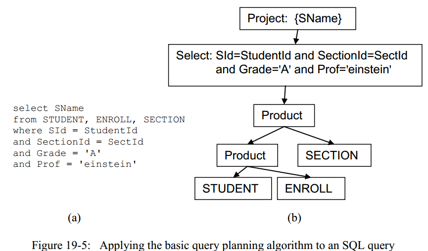
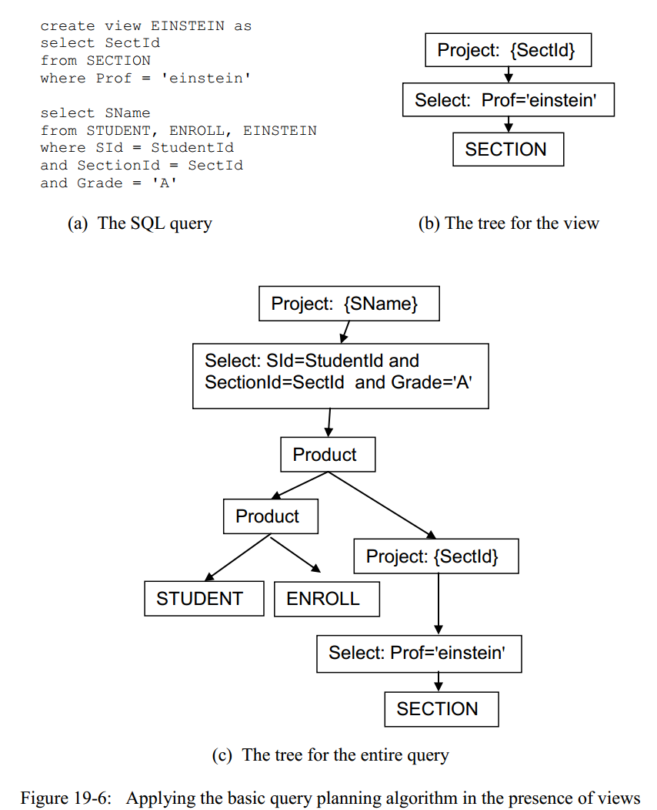
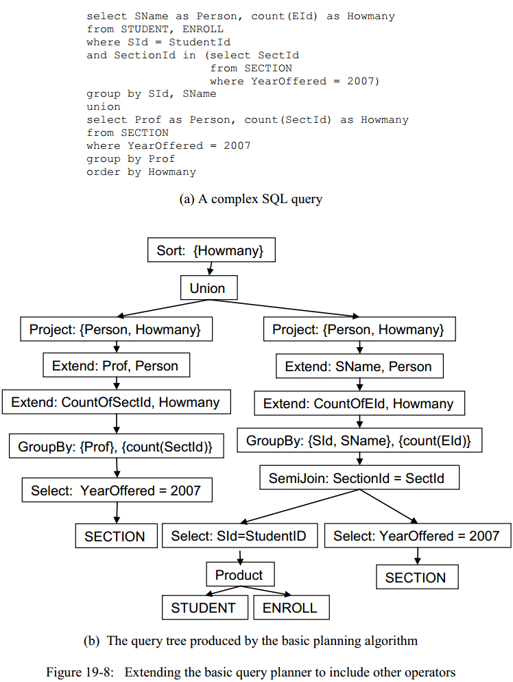

# 第19章 planning和包`simpledb.planner`

在上一章中，我们知道了解析器会解析一条SQL语句，解析完SQL语句后，我们需要做的下一步就是把SQL转化成一个关系代数查询树，这一步被称为`planning`。在本章中，我们将研究一下基本的planning过程，尤其是，我们将重点考虑一下，为了验证一条SQL语句是否有意义，planner需要做的事情，并学习一些基本的构造plan的算法，并且看下update plan是怎么执行的。

在前面我们就曾说过，一条SQL语句可能有多条对应等效的查询树，并且这些查询树的查询代价往往都是不一样的。一个好的planning算法是一个数据库系统能否商业应用的关键，在大多数的商业数据库系统中，planning算法往往都很复杂，并且是精心fine-tune好的，为的就是能够创建出最高效的plan。在本章在，我们先暂时忽略掉高效这个问题，集中考虑一下planner是怎么工作的，而在第24章中，我们再捡起效率这个话题来，那时候再讨论搞笑的planning算法。

## 19.1 SimpleDB的planner
> planner是一个数据库系统中负责将一条SQL语句转化为一个plan的组件。

为了更好地学习planning这个过程，我们将从SimpleDB的planner开始入手。

### 19.1.1 使用planner

SimpleDB的planner是通过类`Planner`来实现的，它的API如下所示：
```Java
public class Planner {
    public Plan createQueryPlan(String query, Transaction tx);
    public int executeUpdate(String cmd, Transaction tx);
}
```
上述两个方法的第一个参数就是字符串类型的SQL语句，方法`createQueryPlan()`会创建一个plan并且将这个plan返回，而方法`executeUpdate()`执行的是一条命令SQL，返回的结果是受影响的记录条数（和JDBC中的`executeUpdate()`是一样的）。

一个客户端可以通过调用`simpledb.server.SimpleDB`类中的静态方法来持有一个`Planner`对象，下面的代码演示了如何使用Planner对象：
```Java
public class PlannerTest {

    public static void main(String[] args) throws IOException {
        SimpleDB.init("studentdb");
        Planner planner = SimpleDB.planner();
        Transaction tx = new Transaction();

        // 处理一个query
        String query = "select sname,gradyear from student";
        Plan queryPlan = planner.createQueryPlan(query, tx);
        Scan scan = queryPlan.open();
        while (scan.next()) {
            System.out.println(scan.getString("sname") + " " +
                    scan.getString("gradyear"));
        }
        scan.close();

        // 处理一个update query
        String cmd = "delete from STUDENT where MajorId=30";  // 大小写不敏感
        int numAffected = planner.executeUpdate(cmd, tx);
        System.out.println(numAffected + " records was affected!");
    }
}
```
上述代码中的第一部分展示了一个SQL query语句是怎么被处理的，其中SQL语句被传入到`createQueryPlan()`方法，然后该方法返回一个对应的Plan对象，打开这个Plan对象则会创建一个具体的Scan,随后遍历这个Scan对象即可；代码中的第二部分展示了一个update query是怎处理的，同样是先将SQL语句传入`executeUpdate()`函数，该函数中会执行相应的update动作，并且返回受影响的记录条数。

## 19.2 planner具体怎么做？
SimpleDB中的planner有两个方法：一个来处理query，一个来处理update。这两个方法其实都会对输入做类似的处理，下面列出了它们具体的执行步骤：

1. 解析SQL语句。在这一步会调用`解析器(parser)`中的方法，解析器会执行解析SQL语句的相关方法，并返回一个包含具体数据的对象(`QueryData`,`DeleteData`等)。例如，对于一条query类型的SQL语句，则会返回一个`QueryData`对象；而对于插入SQL语句，则会返回一个`InsertData`对象。

2. 验证SQL语句。这一步则会检查上一步中得到的`XXXData`对象,从而判断这个SQL语句是否是有意义的。
3. 创建一个对应的plan。这一步中会执行相应的planning算法来生成一个对应的查询树，并且创建一个对应的Plan对象。
4a. 返回Plan对象(对于`createQueryPlan()`方法而言)
4b. 执行plan(对于`executeUpdate()`方法而言)。这一步则会调用plan的`open()`方法得到一个scan，随后遍历这个scan，对遍历过程中的记录作出对应的修改，并且返回受影响的记录条数。

两个方法都会执行上述的1-3步骤，而不同点就在于它们各自创建的plan了，方法`createQueryPlan()`简单地将这个plan对象返回，而`executeUpdate()`方法则会打开并且执行这个plan。

方法1涉及了解析SQL的内容，这是我们上一章中讨论的东西，现在我们开始讨论一下剩下的几步。

## 19.2 验证SQL
planner的第一个职责就是判断一条SQL语句是否是有意义的,具体来说，需要考虑下面的这些信息：
- SQL语句中的表和字段名是否已经存在于catalog中；
- SQL语句中的字段是否有歧义；
- SQL语句中涉及字段的操作是否是类型匹配；
- SQL语句中涉及的常量是否和对应字段的类型及大小匹配。

上述所有的信息都可以通过检查表的schema信息来验证。例如，如果不存在相应的schema信息，则说明该表不存在，自然这个SQL语句也就是没意义的了；再如果一个表的schema信息中不存在SQL语句中涉及的字段名，则说明该字段不存在；再甚至。如果两张表的shcema信息中都存在相同的字段名，而某条SQL语句中同时涉及了这两张表和相应的字段名，这就是有歧义（译者注：在SimpleDB中，暂不支持tblName.filedName的格式，而在实际数据库中这是支持的）；此外，planner还会检查schema中的具体类型和长度来做字段类型匹配。

类型匹配这个工作需要在谓词、修改赋值和插入SQL语句中完成。对于谓词，一个表达式中的每个操作符都必须是类型兼容的，并且每个项左右两边的表达式也必须是类型兼容的；对于一个修改SQL语句，表达式的实际取值也必须和字段的类型兼容；插入SQL语句也类似。

SimpleDB中的planner可以从元数据管理器中获取到表的schema信息，通过调用`etTableInfo()`方法。然而，SimpleDB当前的实现中并没有执行任何的验证，练习19.4-19.8则会要求你完成这些验证。

## 19.3 Query Planning
我们现在来考虑一下这个问题，在得到了parser返回的`XXXData`对象后，怎么构造一个对应的plan呢？也就是之前提到的planning算法问题。这一小节中，我们先考虑一下对于query，怎么创建对应的plan；而在下一小节再考虑update query 的情况。

### 19.3.1 SimpleDB的query planning算法
SimpleDB只支持SQL语句中的一部分，具体来说，SimpleDB不支持包含具体计算的SQL，不支持sort，不支持group by，不支持子查询，也不支持重命名。于是，除去上述的不支持的特性后，SimpleDB支持的SQL语句则可以只用`select`,`project`和`product`三种关系运算来构建一棵查询树，具体的算法如下：
```
SimpleDB的query planning算法

1. 为from语句中的每个表T创建一个plan；
    a) 如果T是一个实际存储的表，则为该表创建一个的Table plan；
    b) 如果T是一个视图，那么该视图对应的plan对象则是，递归调用定义该视图的SQL语句所对应的plan对象。
2. 按照from语句中给定表名的顺序，依次求product操作后的结果；
3. 按照where语句中给定的谓词，选择满足谓词的记录；
4. 按照select语句中给定的字段名，project出结果。
```
图19-5和图19-6中给出了两个对应上述query planning算法的图示，每个图中的query的功能都是检索出那些上过Einstein教授的课并且成绩为'A'的同学的名字。

图19-5（a）中对应的SQL语句并没有使用视图，因此，它对应的查询树如图19-5（b）中所示，注意一下这个查询树中product操作的顺序，然后再执行相应的select和project操作。



图19-6（a）中对应的SQL语句使用了视图，图19-6（b）中展示的是递归调用该query planning算法对应视图的查询树，而图19-6（c）中展示了最终的查询树。注意一下，这种情况下，会先对前两张表作product操作，然后再将product的结果和view再次product，随后再执行相应的select和project操作。也请注意一下图19-5(c)和图19-6（c）中的不同之处，其实也就是，之前的select中的一部分谓词的操作被“下降了”，并且图19-6（c）中的查询树多了一个project操作。诸如此类的等效条件对于查询优化非常重要，我们将在第24章中讨论这些细节。



这种最基本的planning算法相对来说十分朴素，也就是简单地按照`QueryData.tables`中的表来执行product操作，并且在这里的product操作的顺序是无关紧要的（译者注：其实还是有一点影响的，具体可以参考17.5.4小节中的讨论），但是结果肯定是等效的。目前来说，这种朴素的planning算法效率并不是很高，因为我们并没有做出优化，创建最低代价的plan。商业数据库系统中的planning算法远远比我们这里的算法复杂得多，这些复杂的算法中不仅会分析各个等效的plan的代价，而且也实现了其他的关系代数操作，并且这些内容往往就是一个商业数据库系统能否超越同类型产品的关键所在，具体的优化技术将在本书的Part 4讨论。

SimpleDB中的类`BasicQueryPlanner`实现了当前这种朴素的query planning算法，代码中4个步骤都对应我们之前讨论的4步，代码如下：
```Java
// QueryPlanner.java 

public interface QueryPlanner {
    public Plan createPlan(QueryData queryData, Transaction tx) throws IOException;
}

// BasicQueryPlanner.java 
public class BasicQueryPlanner implements QueryPlanner {

    @Override
    public Plan createPlan(QueryData queryData, Transaction tx) throws IOException {
        // 步骤1: 对每个表或视图，创建一个plan
        List<Plan> plans = new ArrayList<>();
        for (String tblName : queryData.getTables()) {
            String viewDef = SimpleDB.metadataMgr().getViewDef(tblName, tx);
            if (null != viewDef)
                plans.add(SimpleDB.planner().createQueryPlan(viewDef, tx));
            else
                plans.add(new TablePlan(tblName, tx));
        }

        // 步骤2: 依次做product操作
        Plan p = plans.remove(0);
        for (Plan nextPlan : plans) {
            p = new ProductPlan(p, nextPlan);
        }

        // 步骤3: 根据where部分的谓词筛选
        p=new SelectPlan(p,queryData.getPred());
        
        // 步骤4: 根据select部分做project操作
        p=new ProjectPlan(p,queryData.getFields());
        
        return p;
    }
}
```
### 19.3.2 标准SQL query的planning算法
SimpleDB中支持的SQL语句可以用一棵只包含3种关系代数操作的查询树来表示，但是在标准的SQL语句中，则包含更多的特性，自然也就包含更多的关系代数操作：
- 子查询需要使用`semijoin`和`antijoin`操作；
- 聚集(aggregations)操作需要使用`groupby`操作；
- 重命名和计算值需要使用`extend`操作；
- 外联结需要`outerjoin`操作；
- 求并集需要`union`操作；
- 排序需要`sort`操作；

SQL查询的语义要求运算符以特定顺序出现在查询树中（暂不考虑视图创建的子树）。对于SimpleDB查询，我们看到product操作位于查询树的底部，然后是单个select操作，最后是project操作。在标准SQL中，各操作的顺序如下，自底向上依次是：
- product操作；
- outerjoin操作；
- select，semijoin和antijoin操作；
- extend操作；
- project操作；
- union操作；
- sort操作；

例如，考虑下面图19-8（a）中的SQL查询，其功能是返回所有在2007年教过课或者上过课的人的信息。union的第一部分返回的是所有在2007年上过课的学生，第二部分返回的是所有在2007年授过课的教授，并且union的结果会按照课程的编号排序。图19-8（b）中展示了这个复杂的SQL对应的查询树，这时还没有考虑任何有关效率的操作。



为了使SimpleDB能够生成这样的查询树，需要扩展SimpleDB中的解析器，以便从SQL中提取出必要的其他信息。其中一些附加信息来自SQL语句中的其他部分，例如order by和group by子句。在这种情况下，将需要修改<Query>的句法规则从而包括附加语法类别。相应地，也要修改`Lexer`类中的内容。

SimpleDB中的planner也将需要作出相应的扩展以使用parser提取的新信息。planning算法通过首先生成product节点，然后生成outerjoin节点等等，从而自底向上地构建一棵查询树。但是，在这种复杂的情况下，planner需要主动去搜索parser解析出来的信息。例如，select子句可以适用于groupby子句包含的信息，planner必须主动去判断是否存在groupby信息，以确定其中的哪一部分适用于哪个操作。

## 19.4 Update Planning
我们现在考虑一下对于update query，planner又应该怎么做。SimpleDB中的`BasicUpdatePlanner`类也提供了一个最简单直接的实现，对于每种update操作（增、删、改），都包含一个相应的方法，具体的代码如下：
```Java
// UpdatePlanner.java
public interface UpdatePlanner {
    public int executeInsert(InsertData insertData, Transaction tx) throws IOException;
    public int executeDelete(DeleteData deleteData,Transaction tx) throws IOException;
    public int executeModify(ModifyData modifyData,Transaction tx) throws IOException;

    public int executeCreateTable(CreateTableData data,Transaction tx) throws IOException;
    public int executeCreateView(CreateViewData data, Transaction tx) throws IOException;
    public int executeCreateIndex(CreateIndexData data,Transaction tx) throws IOException;
}


// BasicUpdatePlanner.java
public class BasicUpdatePlanner implements UpdatePlanner {
    @Override
    public int executeInsert(InsertData insertData, Transaction tx) throws IOException {
        Plan p = new TablePlan(insertData.getTblName(), tx);
        UpdateScan scan = (UpdateScan) p.open();
        scan.insert();
        // 插入的新记录各字段的取值
        Iterator<Constant> iter = insertData.getVals().iterator();
        for (String fieldName : insertData.getFields()) {
            Constant val = iter.next();
            scan.setVal(fieldName, val);
        }
        scan.close();
        return 1;
    }

    @Override
    public int executeDelete(DeleteData deleteData, Transaction tx) throws IOException {
        Plan p = new TablePlan(deleteData.getTblName(), tx);
        p = new SelectPlan(p, deleteData.getPred());
        UpdateScan scan = (UpdateScan) p.open();
        int cnt = 0;
        while (scan.next()) {
            scan.delete();
            cnt++;
        }
        scan.close();
        return cnt;

    }

    @Override
    public int executeModify(ModifyData modifyData, Transaction tx) throws IOException {
        Plan p = new TablePlan(modifyData.getTblName(), tx);
        p = new SelectPlan(p, modifyData.getPred());
        UpdateScan scan = (UpdateScan) p.open();
        int cnt = 0;
        while (scan.next()) {
            scan.setVal(modifyData.getFldName(),
                    modifyData.getNewVal().asConstant());
            cnt++;
        }
        scan.close();
        return cnt;
    }

    @Override
    public int executeCreateTable(CreateTableData data, Transaction tx) throws IOException {
        SimpleDB.metadataMgr().createTable(data.getTblName(),
                data.getSchema(),
                tx);
        return 0;
    }

    @Override
    public int executeCreateView(CreateViewData data, Transaction tx) throws IOException {
        SimpleDB.metadataMgr().createView(data.getViewName(),
                data.getViewDef(),
                tx);
        return 0;
    }

    @Override
    public int executeCreateIndex(CreateIndexData data, Transaction tx) throws IOException {
        SimpleDB.metadataMgr().createIndex(data.getIndexName(),
                data.getTblName(),
                data.getFldName(),
                tx);
        return 0;
    }
}

```
### 19.4.1 delete & modify planning
对于删除和修改SQL语句，它们对应的scan对象是select scan，它们会先检索到满足谓词的记录，然后再做出相应的删除或修改操作，例如：
```
update STUDENT
set MajorId = 20
where MajorId = 30 and GradYear = 2008
```
和
```
delete from STUDENT
where MajorId = 30 and GradYear = 2008
```
这两条SQL语句对应的scan对象其实是一样的，即都会找到那些专业ID为30并且在2008年毕业的学生，`BasicUpdatePlanner.executeDelete()`和`BasicUpdatePlanner.executeModify()`方法会相应地遍历scan对象，在遍历的过程中，可以执行对应的删除或修改操作。

仔细看下代码，我们会发现这两个方法都会创建相同的plan，两种方法也都会open这个scan并以类似的方式遍历scan。`executeDelete()`方法对scan中的每个记录调用delete，而`executeModify()`对scan中的每条记录的目标字段执行`setVal()`操作，当然，因为这个scan对象是select scan，所以在遍历的时候实际上是在遍历满足谓词的记录。这两种方法还会返回受影响记录的条数。

### 19.4.2 Insert planning
插入SQL语句对应的scan对象其实就是一个简单的table scan，`executeInsert()`方法最开始会调用`insert()`方法来找到一个合适的插入位置，注意，调用完这个方法后是还没有实际插入任何数据的。随后会遍历inserData的各个字段和对应的取值，真正将数据插入进去，最后返回1，表示插入了1条数据。

### 19.4.3 创建表、视图和索引的planning
方法`executeCreateTable()`，`executeCreateView()`和`executeCreateIndex()`的代码很简单，因为它们不需要访问任何数据记录，因此不需要一个scan。他们使用parser得到的信息，简单地调用元数据管理器的方法`createTable()`，`createView()`和`createIndex()`来完成工作，它们的返回值为0，表示没有记录受到影响。

## 19.5 实现SimpleDB的planner
回顾一下19.1.1小节中类`Planner`的API，其实也就是两个方法`createQueryPlan()`和`executeUpdate()`方法，我们现在来考虑一下他们的实现，代码如下：
```java
public class Planner {
    private QueryPlanner queryPlanner;
    private UpdatePlanner updatePlanner;

    public Planner(QueryPlanner queryPlanner, UpdatePlanner updatePlanner) {
        this.queryPlanner = queryPlanner;
        this.updatePlanner = updatePlanner;
    }

    public Plan createQueryPlan(String query, Transaction tx) throws IOException {
        Parser parser=new Parser(new Lexer(query));
        QueryData queryData=parser.query();
        //================ TODO ==================
        // 验证SQL语句语义正确性的代码
        //================ TODO ==================
        return queryPlanner.createPlan(queryData,tx);
    }
    public int executeUpdate(String cmd, Transaction tx) throws IOException {
        Parser parser=new Parser(new Lexer(cmd));
        Object obj=parser.updateCmd();
        //================ TODO ==================
        // 验证update SQL语句语义正确性的代码
        //================ TODO ==================
        if(obj instanceof InsertData)
            return  updatePlanner.executeInsert((InsertData) obj,tx);
        else if(obj instanceof DeleteData)
            return updatePlanner.executeDelete((DeleteData)obj,tx);
        else if(obj instanceof ModifyData)
            return updatePlanner.executeModify((ModifyData)obj,tx);
        else if(obj instanceof CreateTableData)
            return updatePlanner.executeCreateTable((CreateTableData)obj,tx);
        else if(obj instanceof CreateViewData)
            return updatePlanner.executeCreateView((CreateViewData)obj,tx);
        else if(obj instanceof CreateIndexData)
            return updatePlanner.executeCreateIndex((CreateIndexData)obj,tx);
        else 
            return 0;
    }
}
```
这些方法的实现也都很简单直接，执行的流程为，先将输入的字符串类型的SQL语句用Parser解析得到相应的`XXXData`对象（当然，parser也会相应地调用Lexer类中的方法），然后再调用QueryPlanner或者UpdatePlanner对象的相关方法即可。稍微注意一下`executeUpdate()`方法，因为Update类型的SQL包括增删改语句，所以parser解析的的对象可能是多种类型的，需要将各个情况都分别处理一下。

译者注：还有一个地方需要注意一下，这也正是面向对象编程的一个最大的优势，设计时只要设计出接口，具体的实现可以多种多样，我想这也是为什么`面向接口编程`的思想大行其道的原因。我们现在的planning算法（包括query planning和update planning）是最基本的朴素的实现，我们现在实际上没有作SQL语义验证和等效plan的代价分析，以后我们要加上这些特性的话，只要新建具体的实现了`QueryPlanner`接口和`UpdatePlanner`接口的类即可，而`Planner`类的代码无需做任何改变。（在第24章中，将实现一个`HeuristicQueryPlanner`类），接口的功能就是为了实现代码的`可拔插性(plug-and-play capability)`。

## 19.6 章末总结
- `planner`是数据库系统中负责将一个字符串类型的SQL语句转化为具体的plan的组件。
- planner需要通过检查下面的信息，来验证SQL语句的语义：
    1. SQL语句中的表和字段名是否已经存在于catalog中；
    2. SQL语句中的字段是否有歧义；
    3. SQL语句中涉及字段的操作是否是类型匹配；
    4. SQL语句中涉及的常量是否和对应字段的类型及大小匹配。

- 最朴素的query planning算法的流程如下：

```
1. 为from语句中的每个表$$T$$创建一个plan；
    a) 如果$$T$$是一个实际存储的表，则为该表创建一个的Table plan；
    b) 如果$$T$$是一个视图，那么该视图对应的plan对象则是，递归调用定义该视图的SQL语句所对应的plan对象。
2. 按照from语句中给定表名的顺序，依次求product操作后的结果；
3. 按照where语句中给定的谓词，选择满足谓词的记录；
4. 按照select语句中给定的字段名，project出结果。
```
- 商业数据库系统中都存在分析各种等效plan执行代价的组件，这往往也是一个商业数据库系统的竞争力所在，我们将在第24章中讨论这些细节。

- SimpleDB中只支持SQL语句中的一小部分，不支持包含具体计算表达式的SQL，不支持sort，不支持group by，不支持子查询，也不支持重命名。于是，除去上述的不支持的特性后，SimpleDB支持的SQL语句则可以只用`select`,`project`和`product`三种关系运算来构建一棵查询树。
- 对应删除和修改记录方法的实现很类似，planner都会先创建一个select scan，然后遍历所有满足谓词的记录，并对遍历过程中的所有记录执行相应的删除或修改字段操作。
- 插入SQL语句的实现相对来说比较简答，planner只要创建一个underlying表的TableScan对象，找到一个插入位置，然后把各字段的值插入即可。
- 创建表、视图和索引时不需要访问任何记录（这里值的是非catalog表的记录），因此不需要一个scan。只要使用parser解析得到的信息，然后简单地调用元数据管理器的方法`createTable()`，`createView()`和`createIndex()`来完成工作，它们的返回值为0，表示没有记录受到影响。

## 19.7 建议阅读
## 19.8 练习

