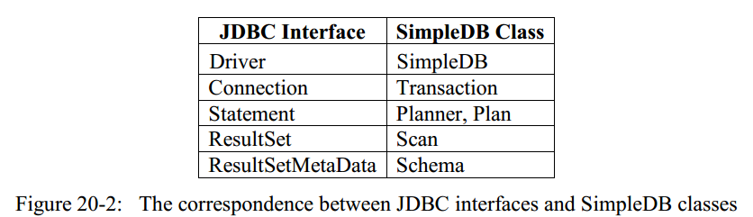

# 第20章 数据库服务器和包`simpledb.remote`

在本章中，我们将会研究一下客户端程序访问数据库系统的两种不同的方式：
- 数据库系统可以被嵌入在客户端中；
- 可以作为一个服务端独立运行，并接受客户端的请求。

嵌入式的数据库策略不需要再写太多的新的代码，但是应用能力有限（译者注： 可以试想一下，如果真的是这种嵌在一起的策略，为什么要当初要写并发的代码呢？）；然而，基于C/S架构的策略允许多个用户并发地共享数据库，但是这样就要求开发者去实现数据库服务端的代码，并且处理JDBC请求。我们接下来将会看到如何用Java 的RMI来构建一个数据库服务端，并且实现一个JDBC driver。

## 20.1 服务型数据库 VS 嵌入型数据库
一个应用程序访问数据库的方式有两种：
- 简介访问数据库，通过服务端；
- 直接访问数据库。

本书的第2部分主要关注的正是上述第一种方式。这种思路是说，应用程序首先调用drive中的相关方法来和数据库服务器来建立连接；然后发送一条或多条SQL语句给服务端从而访问数据库中的数据。

然而上述第二种方式，应用程序会直接调用数据库的方法，这种方法只适合于数据库系统暴露了API的情况。在这种情况下，我们说这个应用程序把一个数据库系统嵌入了其中。

一个嵌入型的数据库的例子如下所示，代码中创建了一个新的事务，调用planner的相关方法来为一个SQL查询创建一个plan对象，获得plan对象后，我们可以调用这个对象的`open()`方法来获得一个scan对象，再迭代这个scan对象，我们可以得到每条具体的数据，最后提交这个事务即可。
```Java
SimpleDB.init("studentdb");
Transaction tx = new Transaction();

Planner planner = SimpleDB.planner();
String qry = "select sname, gradyear from student";
Plan p = planner.createQueryPlan(qry, tx);
Scan s = p.open();

while (s.next())
    System.out.println(s.getString("sname") + " " +
                        s.getInt("gradyear"));

s.close();
tx.commit();
```

相反，一个服务型的数据库的示例代码则如下所示。
```Java
Driver d = new SimpleDriver();
String url = "jdbc:simpledb://localhost";
Connection conn = d.connect(url, null);

Statement stmt = conn.createStatement();
String qry = "select sname, gradyear from student";
ResultSet rs = stmt.executeQuery(qry);

while (rs.next())
    System.out.println(s.getString("sname") + " " +
                        s.getInt("gradyear"));

                        rs.close();
conn.commit();
```
我们可以看到，嵌入型的数据库代码中使用了SimpleDB中的5个类:`SimpleDB`,`Transaction`,`Planner`,`Plan`和`Scan`；而服务型的数据库代码中则使用了接口`Driver`,`Connection`,`Statement`和`ResultSet`。其实这些类和接口是存在着一种如图20-2所示的对应关系的，表中也展示了`ResultSetMetaData`接口和`Schema`类之间的对应关系。



上图表中的每一行都表示二者之间有一种共同的目的。例如，`Connection`和`Transaction`都是用来管理事务的；而`Statement`和`Planner`,`Plan`都是来处理SQL语句的；而`ResultSet`和`Scan`都是来迭代查询结果的。通过这种对应关系，任何一个JDBC程序都可以被重构成等效的嵌入数据库的程序（当然，我们并不会这么做）。

使用嵌入型的数据库系统的程序不会（也不能）与其他程序共享其数据库。嵌入了数据库的应用程序对数据库是私有的。应用程序中没有其他用户，也没有其他线程（除非程序自己创建线程，如图14-30所示）。实际上，如果两个程序共享同一个嵌入式数据库，则没有什么方法可以阻止数据库损坏——这些程序无法控制对方做出的修改，因为每个程序都管理着自己的`锁表(Lock Table)`。

所以，这种嵌入型的数据库系统只对一些特定的应用有意义，这种系统一般是：
- 无法轻易地连接到数据库服务器，或者；
- 排斥其他用户访问数据(即只希望自己拥有数据)

对应上述第一条的最好的例子就是汽车的GPS导航系统了，一个GPS应用程序会访问数据库中的道路信息和位置信息。对于移动的汽车来说，连接到数据库服务器是很慢并且不稳定的，因此，一个嵌入型的数据库系统才更有可能运行应用程序顺利地操作并且可靠地访问数据。

而对应上述第二条的一个例子就是传感器控制系统，例如核反应堆中的程序。这种系统周期地从多个传感器中得到数据，并且将这些数据保存到数据库中，并进行相应的数据分析。这些传感器数据往往都是与其他的控制系统分离的，因此不需要设计一种服务型的数据库。

使用嵌入型数据库系统的一个后果是，应用程序必须在本地运行数据库代码，运行速度可能比服务型数据库慢得多。然而，嵌入型数据库系统可以进行自定义，从而允许用户关闭不需要的功能。例如，再次考虑GPS导航系统，该系统是只读的，不会运行并发线程，因此，它不需要恢复管理(revovery manager)，并发控制器(concurrency control)或update planner组件。通过从嵌入型数据库中删除这些功能，GPS系统变得更苗条，更快，甚至比在高端计算机上使用功能齐全的共享数据库服务器时还要快。

## 20.2 客户端-服务端通信
我们现在着重考虑如何实现服务型数据库，要实现数据库服务器，必须解决两个问题：
- 客户端和服务端之间怎样通信？
- 怎样实现JDBC接口？

在这个小节中，我们将解决第一个问题；而第二个问题将在20.3小节中讨论。

### 20.2.1 远程方法调用
SimpleDB中通过Java中的远程方法调用(Remote Method Invocation,RMI)来实现C/S间通信。为了使用RMI，系统必须定义一些接口，这些接口继承了JavaRMI中的接口`Remote`，这些接口被称为远程接口(remote interface)。对于每个远程接口，都会对应有两个实现类：客户端上的`存根(stub)`类和服务端上的实现类。放客户端调用一个存根对象的相关方法时，这个方法调用会通过网络传递给服务端，从服务端上的对应的实现类对象会执行相关方法，然后服务端会将执行方法返回的对象送回给客户端上的存根对象。关于更多Java RMI相关的知识，可以去网上查找相关资料，总而言之，一个远程方法是被客户端上的存根对象调用的，而实际是在服务端中的实现类对象完成的。

SimpleDB中定义了5个远程接口，分别是`RemoteDriver`, `RemoteConnection`,`RemoteStatement`, `RemoteResultSet`和`RemoteMetaData`，定义这些接口的代码如下所示。这些远程接口反应的是其对应的JDBC接口，但是有两个区别：
- 只实现了基本的JDBC方法；
- 抛出的异常是RemoteException（这是RMI要求的），而不是抛出SQLException（这是JDBC的要求）
```Java
public interface RemoteDriver extends Remote {
    public RemoteConnection connect() throws RemoteException;
}

public interface RemoteConnection extends Remote {
    public RemoteStatement createStatement() throws RemoteException;
    public void close() throws RemoteException;
}

public interface RemoteStatement extends Remote {
    public RemoteResultSet executeQuery(String qry) throws RemoteException;
    public int executeUpdateCmd(String cmd) throws RemoteException;
}

public interface RemoteResultSet extends Remote {
    public boolean next() throws RemoteException;
    public int getInt(String fieldName) throws RemoteException;
    public String getString(String fieldName) throws RemoteException;
    public RemoteMetaData getMetaData() throws RemoteException;
    public void close() throws RemoteException;
}

public interface RemoteMetaData extends Remote {
    public int getColumnCount() throws RemoteException;
    public  String getColumnName(int column) throws RemoteException;
    public int getColumnType(int column) throws RemoteException;
    public int getColumnDisplaySize(int column) throws RemoteException;
}
```
为了对RMI是如果工作的有个大概的了解，请考虑下面这样一段客户端的代码片段:
```Java
RemoteDriver rdvr = ...
RemoteConnection rconn = rdvr.connect();
RemoteStatement rstmt = rconn.createStatement();
```
上述代码片段中的每个变量都表示一个接口。但是，由于代码片段是运行在客户端上的，因此我们知道这些变量持有的实际对象来自存根类。请注意，该代码片段中未显示变量`rdvr`是如何获得其存根的。我们在这里先暂时搁置一下这个问题，直到后续讨论RMI注册时，我们再来讨论这个问题。

我们考虑一下`rdvr.connect()`这条语句，存根通过将请求经过网络发送到服务器上相应的RemoteDriver实现对象来实现此方法。远程实现类对象会在服务器端执行它自己的`connect()`方法，相应地，执行`connect()`方法会返回一个新的`RemoteConnection`实现类对象，而此远程对象的存根则被发送回客户端，客户端将其存储为变量`conn`的值。

再考虑一下`rconn.createStatement()`这条语句。存根对象会将请求发送给服务器上与该存根对象对应的`RemoteConnection`实现对象。该远程对象执行其`createStatement()`方法,并在服务器上创建一个·RemoteStatement·实现对象，并再次将其存根返回给客户端。

### 20.2.2 RMI注册
客户端上的每个存根对象都包含了一个对应服务端远程实现对象的引用。一个客户端，一旦有了一个存根对象，就可以挺过该存根对象来和服务端进行交互，交互的过程中有可能还会创建新的存根对象，以供客户端使用。但是，问题是，第一个存根对象是怎么获取到的呢？RMI中通过一个叫做RMI注册的程序来解决这个问题。
> 服务端通过RMI注册表来发布存根对象，客户端可以在RMI注册表中检索得到存根对象。

SimpleDB中的服务端只发布一个对象，这个对象是`RemoteDriver`类型的。通过执行`simpledb.server.Startup`中的下面两行代码，服务器发布了一个存根对象:
```Java
RemoteDriver d = new RemoteDriverImpl();
Naming.rebind("simpledb",d);
```
`Naming.rebind()`方法会为远程实现对象`d`创建一个存根，并把这个存根保存在RMI注册表中，并且绑定的名称为simpledb。

一个客户端可以通过`Naming.lookup()`方法来请求获得注册表中的存根，在SimpleDB中，这个请求是通过`SimpleDriver`类中下面两行代码来完成的：
```Java
String newUrl = url.replace("jdbc:simpledb","rmi")+"/simpledb";
RemoteDriver rdvr = (RemoteDriver) Naming.lookup(newurl);
```
举例来说，如果变量`url`的值为`jdbc:simpledb://localhost`,随后，`newUrl`的值将会变为`rmi://localhost/simpledb`，这个新的字符串是为了符合RMI注册表的要求。紧接着，调用`Naming.lookup()`方法会根据指定的host(这里是localhost)去RMI注册表中寻找相应名为`simpledb`的存根对象，在找到后把这个对象返回给调用者。

### 20.2.3 线程问题
在构建一个相对来说比较大型的Java程序的时候，如果我们能对程序中线程的执行情况有个清楚的了解，那肯定是再好不过了。在基于C/S架构的SimpleDB中，程序中会存在两类的线程：在客户端上的线程和在服务端上的线程。

每个客户端在其计算机上都有自己的线程。该线程在客户端执行期间持续存在，该线程调用所有客户端的存根对象。另一方面，服务器上的每个远程对象都在其自己的单独线程中执行。可以将服务器端远程对象视为“微型服务器”，它会一直等待其存根建立连接。建立连接后，远程对象将执行请求的工作，将返回值发送回客户端，并耐心等待另一个连接。在`simpledb.server.Startup`中创建的`RemoteDriver`对象在一个线程中运行，该线程可以被视为“数据库服务”线程。

每当客户端进行远程方法调用时，客户端线程将会在服务器线程运行期间等待，并在服务器线程返回值时恢复运行。同样，服务器端线程将处于休眠状态，直到服务端的某个方法被请求调用，服务端也会在该方法执行完成后恢复休眠状态。因此，在任何给定时间，这些客户端和服务器线程中只有一个线程实际在做一些事情。打个不太准确地比喻，请求了远程方法调用后，客户端线程似乎是在客户端和服务器之间来回移动。尽管这种想象可以帮助你更好地理解客户端-服务器应用程序中的控制流，但了解真正的实际情况也更重要。

区别客户端和服务端线程的一个办法就是打印一些东西，你可以用`System.out.println`来得知当前是哪个线程在执行。

## 20.3 实现远程接口
对于每个远程接口，都需要实现两个类：存根类和远程实现类。习惯上，远程实现类的类名为接口名加上`Impl`后缀，而存根类的类名则为接口名再加上`Impl_Stub`后缀。

幸运的是，对于所有的远程接口来说，客户端和服务器端对象之间的通信都是以一种相同的方式，这意味着所有通信代码都可以由RMI库类提供。应用程序员只需要提供每个接口的相关代码即可。换句话说，程序员根本不需要编写存根类的代码，而只需编写远程实现类的代码，也就是明确服务器在每个方法被调用时所执行的操作。在本节中，我们将描述SimpleDB中每个远程接口的实现。

### 20.3.1 `RemoteDriverImpl`类
`RemoteDriverImpl`类是服务端的入口点，其代码如下所示，只有一个`RemoteDriverImpl`类的对象会被创建，而创建的过程是在`simpledb.server.Startup`这个启动类中完成的，并且该远程实现对象对应的存根会被发布在RMI注册表中，这个存根对象也是唯一的。每次该远程实现对象的`connect()`方法被调用时（通过存根对象），将会在服务端创建一个新的`RemoteConnection`远程对象，并且这个新的对象会在一个新的线程中执行。RMI会透明地创建对应的`RemoteConnection`存根对象，并返回给客户端。
```Java
public class RemoteDriverImpl extends UnicastRemoteObject
        implements RemoteDriver {

    public RemoteDriverImpl() throws RemoteException {

    }

    @Override
    public RemoteConnection connect() throws RemoteException {
        return new RemoteConnectionImpl();
    }
}
```
注意一下，代码十分简单，我们只需要关注服务端的对象创建即可，特别是，代码中不包括任何网络相关或者存根对象相关的代码，并且当需要创建新的远程对象时，服务端只要负责创建好远程实现对象就可以了，根本不需要管存根对象是怎么创建的。RMI中的`UnicastRemoteObject`类包含了其他有关连接和存根相关的所有代码。

### 20.3.2 `RemoteConnectionImpl`类
`RemoteConnectionImpl`类维护了客户端和服务端的连接，代码如下所示。对于每个客户端连接，都会有一个相关的`RemoteConnectionImpl`对象运行在服务器上，并且是在一个独立的线程中运行的。这个对象负责管理事务，也会负责为客户端创建查询语句，这个对象的大多数工作都是通过`Transaction`类的对象来完成的。
```Java
public class RemoteConnectionImpl extends UnicastRemoteObject
        implements RemoteConnection {
    private Transaction tx;

    public RemoteConnectionImpl() throws RemoteException {
        this.tx = new Transaction();
    }

    @Override
    public RemoteStatement createStatement() throws RemoteException {
        return new RemoteStatementImpl(this);
    }

    @Override
    public void close() throws RemoteException{
        tx.commit();
    }

    //=============以下方法都是在服务端中调用的================
    Transaction getTrasnaction()
    {
        return tx;
    }
    void commit()
    {
        tx.commit();
        tx=new Transaction();
    }
    void rollback()
    {
        tx.rollback();
        tx=new Transaction();
    }
}
```
上面代码中包含了一些package-private的方法，即`getTransaction()`,`commit()`,`rollback()`方法，这些方法并不是远程接口中的方法，因此也不可能被客户端调用。这些方法是被服务端中的`RemoteStatementImpl`和`RemoteResultSetImpl`类来使用的。

### 20.3.3 `RemoteStatementImpl`类
`RemoteStatementImpl`类是负责执行SQL语句的，代码如下所示。方法`executeQuery()`会根据SQL语句从planner组件中获取到一个plan，并且把这个plan传递给`RemoteResultSet`对象去执行，`executeUpdate()`方法执行的动作类似。
```Java
public class RemoteStatementImpl extends UnicastRemoteObject
        implements RemoteStatement {
    private RemoteConnectionImpl rconn;

    public RemoteStatementImpl(RemoteConnectionImpl rconn) throws RemoteException {
        this.rconn = rconn;
    }

    @Override
    public RemoteResultSet executeQuery(String qry) throws RemoteException {
        try {
            Transaction tx = rconn.getTrasnaction();
            Plan plan = SimpleDB.planner().createQueryPlan(qry, tx);
            return new RemoteResultSetImpl(plan, rconn);
        } catch (IOException e) {
            rconn.rollback();
            System.out.println("Error in RemoteStatementImpl executeQuery() method!");
            return null;
        }
    }

    @Override
    public int executeUpdateCmd(String cmd) throws RemoteException {
        try {
            Transaction tx = rconn.getTrasnaction();
            int result = SimpleDB.planner().executeUpdate(cmd, tx);
            rconn.commit();
            return result;
        } catch (IOException e) {
            rconn.rollback();
            System.out.println("Error in RemoteStatementImpl executeUpdateCmd() method!");
            return -1;
        }
    }
        
}
```
以上两个方法还负责了JDBC的自动提交，如果SQL语句正确执行，则必须commit,一旦SQL语句完成后，方法`executeUpdate()`会执行当前的连接的`commit()`方法。另一方面，`executeQuery()`方法则无法立即commit，因为其结果集仍会被使用，因此，事务的commit动作会被延迟到结果集close的时候。

当然，一旦SQL执行的过程中发生错误，连接必然会立马rollback事务。

### 20.3.4 `RemoteResultSetImpl`类
`RemoteResultSetImpl`类包含了执行一个query plan的相关方法，代码如下所示。在构造函数中，会调用该query plan的`open()`方法并得到对应的scan对象。`RemoteResultSetImpl`中的`next()`,`getInt()`,`getString()`和`close()`方法都只是简单地调用了scan对象的相应方法。在`close()`方法中也会commit当前事务，从而满足JDBC中自动提交的要求。
```Java
public class RemoteResultSetImpl extends UnicastRemoteObject
        implements RemoteResultSet {
    private RemoteConnectionImpl rconn;
    private Scan s;
    private Schema sch;

    public RemoteResultSetImpl(Plan plan, RemoteConnectionImpl rconn)
            throws RemoteException {
        try {
            s = plan.open();
            sch = plan.schema();
            this.rconn = rconn;
        } catch (IOException e) {
            System.out.println("Error in RemoteResultSetImpl constructor!");
        }

    }

    @Override
    public boolean next() throws RemoteException {
        try {
            return s.next();
        } catch (IOException e) {
            rconn.rollback();
            System.out.println("Error in RemoteResultSetImpl next() method!");
        }
        return false;
    }

    @Override
    public int getInt(String fieldName) throws RemoteException {
        // 大小写不敏感
        fieldName=fieldName.toLowerCase();
        return s.getInt(fieldName);
    }

    @Override
    public String getString(String fieldName) throws RemoteException {
        // 大小写不敏感
        fieldName=fieldName.toLowerCase();
        return s.getString(fieldName);
    }

    @Override
    public RemoteMetaData getMetaData() throws RemoteException {
        return new RemoteMetaDataImpl(sch);
    }

    @Override
    public void close() throws RemoteException {
        try {
            s.close();
            rconn.commit();
        } catch (IOException e) {
            rconn.rollback();
            System.out.println("Error in RemoteResultSetImpl close() method!");
        }

    }
}
```
`RemoteResultSetImpl`类中还包含了一个与当前plan对象对应的`Schma`对象，这个`Schma`对象存在的意义主要就是，为了供方法`getMetaData()`使用，从而可以创建一个`RemoteMetaDataImpl`对象。

### 20.3.5 `RemoteMetaDataImpl`类
`RemoteMetaDataImpl`类中包含了一个`Schema`类对象，这个对象在构造函数中被传进来，代码如下所示。`RemoteMetaDataImpl`类中的方法其实和`Schema`类很类似，区别在于，前者是通过列号来获取列的信息，而后者是通过列名来检索的。
```Java
public class RemoteMetaDataImpl extends UnicastRemoteObject
        implements RemoteMetaData {
    private Schema schema;
    private Object[] fieldNames;

    public RemoteMetaDataImpl(Schema schema) throws RemoteException {
        this.schema = schema;
        fieldNames = schema.fields().toArray();
    }

    @Override
    public int getColumnCount() throws RemoteException {
        return fieldNames.length;
    }

    @Override
    public String getColumnName(int column) throws RemoteException {
        return (String) fieldNames[column];
    }

    @Override
    public int getColumnType(int column) throws RemoteException {
        String fieldName = getColumnName(column);
        return schema.type(fieldName);
    }

    @Override
    public int getColumnDisplaySize(int column) throws RemoteException {
        String fieldName = getColumnName(column);
        int fieldType = schema.type(fieldName);
        // 字符串长度
        if (fieldType == VARCHAR)
            return schema.length(fieldName);
        else
            return 6;  // 6位数来显示一个整数（可以不一样）
    }
}
```

## 20.4 实现JDBC接口