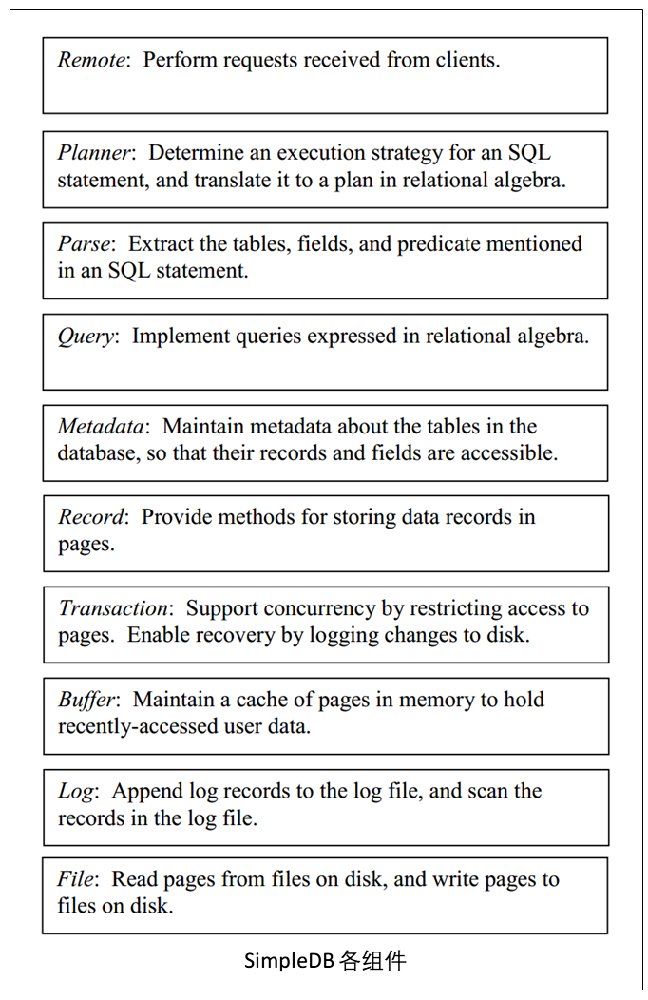

# Part 3 - 数据库服务器内部实现

现在我们已经学习了如何使用一个数据库系统，我们现在将移步至如何构建一个数据库系统的问题。理解现代数据库系统是如何工作的一个很好的方式就是学习一个真正的数据库系统的内部实现。这个`SimpleDB`数据库系统就是为了这个目的而构建的，我们将在本书的第3部分完成，它总共包含了大约3500行Java源代码，由12个packages中的85个类组织而成；并且在本书随后的第4部分——效率优化部分，代码量将缩小至大约一半，这虽然看起来有很多代码，但随后我们将会知道`SimpleDB`是一个单纯的系统骨架，其实现的采用了尽可能简单的算法，也只保留了一些最基本、也是必要的功能。商业化的数据库系统拥有和这一样的架构，但是使用了更复杂的算法、拥有鲁棒性更高的的错误检查机制以及大量的警告（原文为bells and whistles），这样一来，系统明显会变得庞大。例如Derby(一个数据库系统)，代码量大概是`SimpleDB`的100倍以上（20万行以上），Oracle就更大了。

在本书中，我们将数据库服务器分解成拥有10层组件的系统，每个组件只知道它下层的组件细节，并为它上层的组件提供服务，下图展示了该系统中每个组件的功能。

说明该系统中各个组件功能的一个较好方法就是按照一条SQL语句的执行去解析。例如，假设现在有一个JDBC的客户端通过`executeUpdate`方法，提交了一条删除SQL语句到数据库服务器，以下的动作将会发生：
- remote组件实现了`executeUpdate`方法，该方法为当前statement创建一个事务，并将string类型的SQL语句传递给planner
- planner组件发送string类型的SQL语句传递给parser组件，parser组件会解析SQL语句，并返回一个`DeleteData`对象，该对象包含当前statement涉及的数据库表明和删除谓词（即删除成功or失败）。planner组件会使用paerser组件的数据去决定为当前statement创建一个计划（plan），该计划表示了一个为了找到待删除记录而创建的关系代数查询（relational algebra query）。最后planner组件将创建的计划送给查询处理器（query processor）。
- 查询处理器（query processor）为这个plan创建一个扫描（scan），这个扫描包含了执行该计划时需要的运行时信息。为了创建这个扫描，查询处理器包含了从源数据管理器（metadata manager）获得的相关表模式（schema）。查询处理器随后创建一个对应该模式的记录管理器（record manager）
- 查询处理器随后在刚创建的扫描上进行迭代，迭代过程中，它会检测数据库表中的每一条记录并且判断是否满足我们定义的删除谓词。每次需要获得一个记录（record）时，它都显式地向记录管理器发出请求。如果一条记录需要被删除，查询处理器会告诉记录管理器相应的执行。
- 记录管理器知道记录是怎样保存在文件中的，当查询处理器请求一个记录的值时，它会知道文件中的哪一块（block）包含了所需的记录，并且计算相应的偏移量从而获得记录中的某个项具体的值（value）。它随后会向事务管理器发出通知，去检索（retrieve）指定块指定位置的值。
- 事务管理器检查它的表锁（注：事务管理器为每个表维护一个锁，所有表的锁信息也由一个lock table维护 ），从而确保其它事务不会使用当前块。如果还没有没有上锁，则事务管理器则为当前块上锁，并调用缓冲区管理器（buffer manager）的相关方法，从而获得需要的值。
- 缓冲管理器的目的是将很多块的内容缓存在内存中，如果被请求的块没有被缓存，则缓冲管理器从缓存区中选取一个页，并调用文件管理器（file  manager）的相关方法，将相关的块读入当前页，亦可将当前页的内容写到磁盘中。（注：page是内存中的概念，而块是文件中的概念）
- 文件管理器将某个块的内如读/写入内存中的相应页中。

如上的这种架构的相应变种就是当前大多数商业关系数据库系统的变种。该架构严重受到磁盘I/O特性的影响，因此在本书的这部分中，我们从最底层——**磁盘**——开始，一步步向上实现该数据库软件。

面向对象的开发者通常将一个对象对另一个类的某个方法调用称为`客户端（clinet）`，`客户端`这个术语其实和本书第二部分所提及的客户端-服务端很类似，无论是哪种说法，客户端对象都会通过另一个类对象的某个方法执行一次请求。要说区别，那就是在`C-S`例子中，请求是通过网络实现的（注：即客户端和服务端通过网络进行交互），而一般意义上的client就没有这种限定。在本书的剩余部分，我们提到的客户端都代表这面向对象层面一般术语的意思，而`JDBC 客户端`则更倾向于`C-S`层面的意思。

