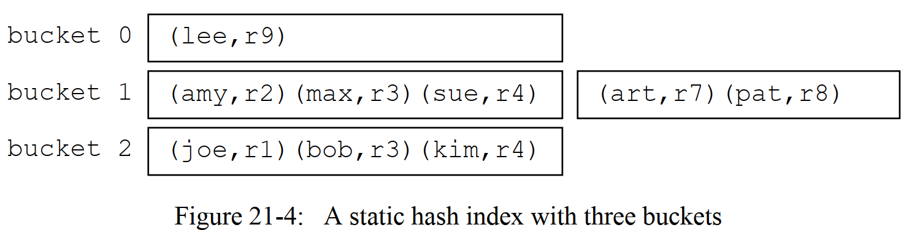
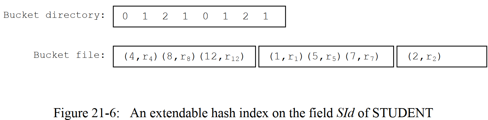
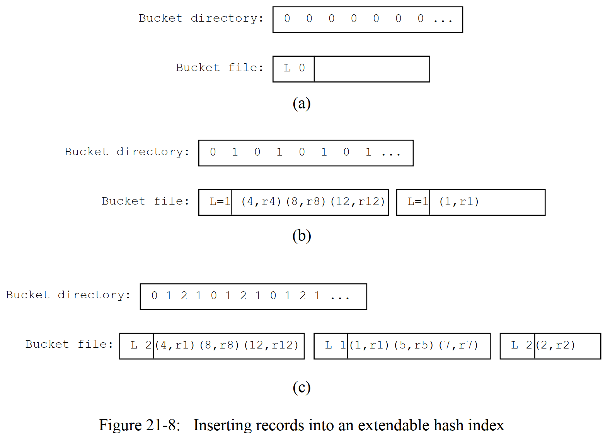
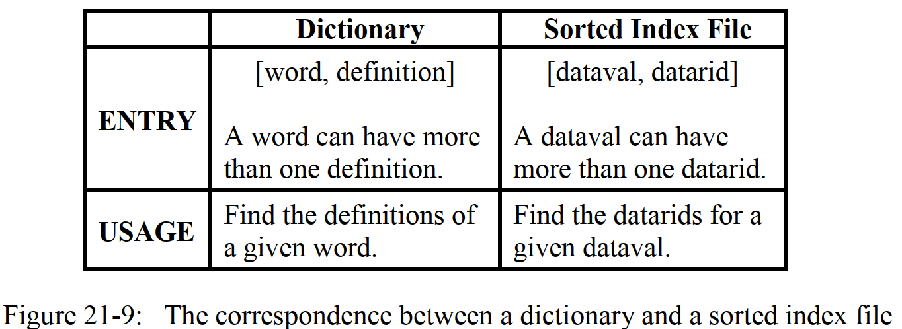
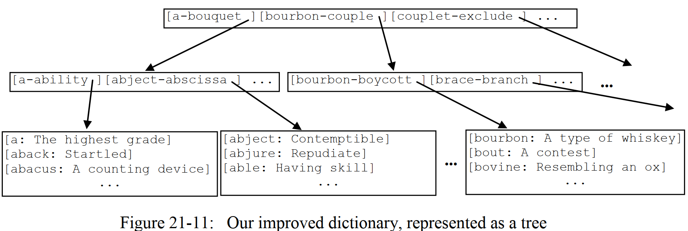
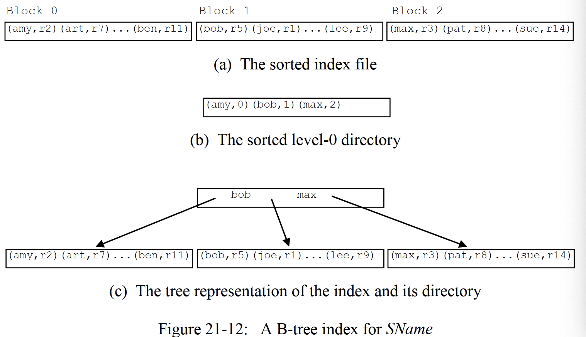
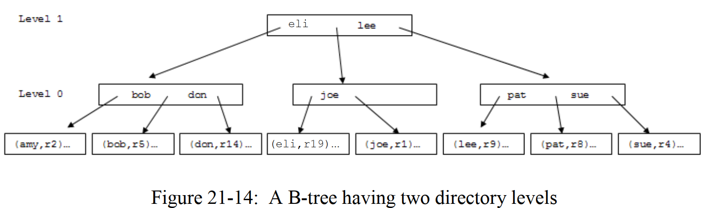

# 第21章—索引及包`simpledb.index`

当我们写下某条SQL语句时，我们可能只对某张表（或某几张表）中的某些特定的记录感兴趣，即那些满足了select谓词逻辑的记录。索引（`index`）存在的目的就是为了允许数据库系统无需遍历搜索整个表记录文件就可以定位到某些特定的记录。在本章中，我们将考虑3种不同的索引实现方式：静态hash索引、可扩展hash索引、以及B-tree（注意，不是叫B减树，就是B树），基于索引带来的优点，随后我们将实现关系代数操作中的`select`和`join`操作。

## 21.1 索引的接口

在第6章中，我们介绍了索引的基本原则，可以归纳为如下：

- 一个索引其实就是一个文件，这个文件中按照一定规则对某个表中的某个（或多个字段）进行了记录；
- 每条索引记录对应一条数据记录；
- 每条索引记录包含了被索引字段的取值，以及这条数据记录的标识符（或者是`rid`）。

当数据库系统想要获取到被索引字段指定取值的那些数据记录时，数据库系统可以通过查看索引，从而得到这些具体的数据记录的标识符，从而快速地在数据记录文件中移动，这将大大地提高查询效率，因为我们可以避免对整个表记录进行遍历。

在本章中，我们将考虑一个数据库系统是如何实现并且实用索引的。在SimpleDB中，我们对索引进行了简化（但这完全不影响功能），即一个索引只能索引一个字段，也就是说，在一条索记录中，只包含2个字段（被索引的字段、以及`rId`）,我们不妨称这两个字段为`dataval`和`datarid`。

> SimpleDB中的每条索引记录包含一个`dataval`字段和一个`datarid`字段：
>
> - `dataval`字段记录的说被索引字段的具体取值；
> - `datarid`字段记录的说对应数据记录的标识符，即`rid`。

在SimpleDB中，一个索引就是一个实现了`Index`接口的对象，`Index`接口如下所示：

```java
public interface Index {
    public void beforeFirst(Constant searchKey) throws IOException;
    public boolean next() throws IOException;
    public RID getDataRid();
    public void insert(Constant dataval,RID datarid) throws IOException;
    public void delete(Constant dataval,RID datarid) throws IOException;
    public void close();
}
```

`Index`接口的大部分方法都和`RecortFile`中的类似，客户端可以在索引文件中的任何位置移动，可以检索到当前位置处的索引记录，也可以插入或者删除索引记录。然而，因为索引都是按照某些明确的方式进行使用，所以`Index`接口中的一些方法相对来说更加明确。

一个SimpleDB的客户端在搜索索引时，总是会提供一个值（我们称这个值为搜索健），并且检索得到那些匹配`dataval`的索引记录。方法`beforeFirst()`正好需要这个搜索键作为参数。后续不断调用`next()`方法，将不断移动索引文件中的“指针”，直到下一条匹配`dataval`的索引记录，如果不存在下一条匹配的索引记录的话，那就返回false。

索引不需要诸如`getInt()`或`getString()`这样的方法，因为所有的索引记录都只含有两个相同的字段，此外，客户端也从不需要检索得到索引记录的`dataval`字段，因为这个字段本身就是客户端给定的参数！因此，唯一需要的检索方法就是`getDataRid()`了，这个方法会返回当前索引记录的`datarid`。

下面的代码片段展示了一个使用索引的例子，代码的功能是搜索所有专业id为10的学生，并且打印出这些学生的姓名。注意，代码使用了一个table scan来检索学生记录，虽然说这个table并不会真正被“scan“；相反，代码调用了table scan对象的`moveToRid()`方法来定位到指定的数据记录处。

```java
SimpleDB.init("studentDB");
Transaction tx = new Transaction();

// open a scan to table
Plan stuPlan = new TablePlan("student", tx);
TableScan stuScan = (TableScan) stuPlan.open();

// open the index on majorid
MetadataMgr mdMgr = SimpleDB.metadataMgr();
Map<String, IndexInfo> indexes = mdMgr.getIndexInfo("student", tx);
IndexInfo ii = indexes.get("majorid");
Index idx = ii.open();

// retrieve all index records which have a dataval of 10
idx.beforeFirst(new IntConstant(10));
while (idx.next()) {
  // use the datarid to go to the corresponding record in table STUDENT
  RID dataRid = idx.getDataRid();
  stuScan.moveToRId(dataRid);
  System.out.println(stuScan.getString("sname"));
}

// close the idx, the table scan, and the transaction
idx.close();
stuScan.close();
tx.commit();
```

索引除了可以查询以外，同样也可以更新或删除。下面的代码片段演示了数据库系统如何处理表的更新，代码主要完成了两个工作：

- 第一个工作就是插入了一条新的数据记录到STUDENT表中；
- 第二个工作则是从STUDENT表中删除一条记录。

注意，在插入新的数据记录的同时，也必须对应插入一条（如果某张表有n个索引，那么是n条）索引记录；当然，删除数据记录的同时也必须删除对应的索引记录。首先，代码会用一个字典获取到STUDENT表的所有索引；在后续每次对索引进行某项操作的过程中，代码都会遍历这个字典。

```java
// suppose the STUDENT(sname varchar(5), majorid int) table already exists
SimpleDB.init("studentDB");
Transaction tx = new Transaction();

// create a table STUDENT(sname, majorid) and a index on STUDENT(majorid)
Planner planner = SimpleDB.planner();
String str = "create table student (sname varchar(5), majorid int)";
planner.executeUpdate(str, tx);
String createIndexStr = "create index stuMajorIdIndex on student(majorid)";
planner.executeUpdate(createIndexStr, tx);

// open a scan to table
Plan stuPlan = new TablePlan("student", tx);
TableScan stuScan = (TableScan) stuPlan.open();

// open the index on MajorId
MetadataMgr mdMgr = SimpleDB.metadataMgr();
Map<String, IndexInfo> indexInfos = mdMgr.getIndexInfo("student", tx);
Map<String, Index> indexes = new HashMap<>();
for (String fldName : indexInfos.keySet()) {
  Index idx = indexInfos.get(fldName).open();
  indexes.put(fldName, idx);
}

// Task 1: insert a two STUDENT record
// insert the data record first
stuScan.insert();
stuScan.setString("sname", "Sam");
stuScan.setInt("majorid", 10);
// then insert a corresponding index record
RID datarid = stuScan.getRID();
for (String fldName : indexes.keySet()) {
  Constant dataval = stuScan.getVal(fldName);
  Index idx = indexes.get(fldName);
  idx.insert(dataval, datarid);
}

// insert the data record first
stuScan.insert();
stuScan.setString("sname", "Andy");
stuScan.setInt("majorid", 10);
// then insert a corresponding index record
for (String fldName : indexes.keySet()) {
  Constant dataval = stuScan.getVal(fldName);
  Index idx = indexes.get(fldName);
  idx.insert(dataval, stuScan.getRID());
}

// Task 2: find and delete Sam's record
stuScan.beforeFirst();
while (stuScan.next()) {
  if (stuScan.getString("sname").equals("Sam")) {
    // delete the corresponding index record(s) first
    RID rid = stuScan.getRID();
    for (String idxFldName : indexes.keySet()) {
      Constant dataval = stuScan.getVal(idxFldName);
      Index idx = indexes.get(idxFldName);
      idx.delete(dataval, rid);
    }

    // then delete the data record
    stuScan.delete();
    break; // todo why break here???
  }
}

// close the resources
stuScan.close();
for (Index idx : indexes.values()) {
  idx.close();
}
tx.commit();
```

上述的两个测试代码实际上根本不知道索引是怎么实现的，唯一的需求就是知道`Index`接口。本章的后续部分将按下述安排展开：

- 21.2—21.4小节将展示3种不同的索引实现——其中前两种基于hash实现，第三种则是基于排序树实现；
- 21.5—21.6小节将考虑数据库中的查询处理器和planner组件如何利用索引使得查询更高效。

## 21.2 静态hash索引

我们从静态hash索引开始讨论起，这应该是实现索引的最简单的方式之一。虽然说这种方式不是最高效的策略，但是它相对来说更好理解并且将相关的概念揭示得更加清晰，因此从静态哈希索引介绍起比较合理。

### 21.2.1 静态hash

静态哈希索引使用一个固定大小为N的容器，容器中的每个元素我们称之为桶（`bucket`），从0到N-1计数。静态哈希索引同样拥有一个哈希函数，这个函数可以将任意一个值（也就是dataval）映射到某个桶中，而对应的索引记录则被放置在这个桶中。虽然说拥有索引记录之间不同的datavals可能会被映射到同一个桶中，但哈希函数总是尽可能地将索引记录相对均匀地分布在各个桶中。

> 静态hash索引将索引记录存放在桶中；拥有相同hash值的索引记录会被存放在同一个桶中。

一个静态hash索引如下工作：

- 为了存储一条索引记录，需要先根据这条索引记录的dataval得到对应的hash值，再将这条索引记录放在对应的桶中；
- 为了找到某条索引记录，我们先得到serach key的hash值，再从对应的桶中查找索引记录；
- 为了删除某条索引记录，我们先找到这条索引记录（按照规则2），再从这个桶中删除这条索引记录。

查找一个静态hash索引的代价与桶的数量N息息相关。如果一个索引有B个块及N个桶，那么每个桶将大概有B/N个块的长度，因此查找一个桶大概需要B/N次块访问（如果不用索引的话就需要B次块访问）。

举例来说，假设我们有一个STUDENT表中关于`sname`的索引，且桶的大小N=3，并且假设hash函数的计算方式为，对于一个字符串s，其对应的hash值为s中排在字母m前的所有字母数量模N（比方说，s=“andy”，排在字母m之前的字母有a、d两个，那么andy对应的hash值为2(mod)3=2）,并假设1个块中刚好可以存放下3条索引记录。图21-4演示了这样的3个索引桶中的情况，在图中，我们用$r_i$来表示第i条学生数据记录的rid。



假设现在我们想要得到所有名叫`sue`的学生的datarid。

- 首先，我们根据上述的hash函数规则，得知`sue`对应的hash值为1（即被放在第1个桶中）；
- 随后，我们需要对第1个桶进行搜索，这需要花费2个块访问。

再假设我们想要得到名叫`ron`的学生的datarid，和上述过程类似，先得到hash值为0，搜索第1个桶只需要1个块访问，最终发现不存在名为`ron`的索引记录，也即不存在名为`ron`的数据记录。

图21-4的这个例子，我们都假设块的大小和桶的数量都很少，这在实际的数据库中不可能是这样的，桶的数量为1024是一个比较合乎实际的取值，这意味着索引记录会相对均匀地分布在1024个桶中，也就意味着：

- 一个大小为1024块的索引文件，大致可以在1个块访问内，搜索到指定的索引记录；
- 一个大小为2048块的索引文件，大致可以在2个块访问内，搜索到指定的索引记录；
- 以此类推...

为了对上述的值有个大致的概念，我们注意到，`SName`表的一条索引记录需要22个字节，假设是纯ascii码，则`varchar(10)`需要14个字节，而`datarid`部分需要8个字节（块号+块上的记录号）。再加上，如果我们用1个字节来表示索引记录的EMPTY / INUSE标记的话，那么1个大小为4K的块内可以存放178条索引记录（4096/23=178），于是1个包含2048个块的索引（约为8MB大小的文件）可以存放356K条索引记录，在2个块访问就可以完成对所有数据记录的搜索！（比原来的1/1000倍的访问时间还要短）

### 21.2.2 实现静态hash

在SimpleDB中，静态hash算法的实现包含在累`HashIndex`中，其代码如下：

```java
public class HashIndex implements Index {
    private static final int NUM_BUCKETS = 100;
    private Constant searchKey;
    private String idxName;  // 索引名
    private Schema schema;   // 索引表对应的schema信息
    private Transaction tx;
    private TableScan tableScan;   // 每个桶对应的tableScan对象

    public HashIndex(String idxName, Schema schema, Transaction tx) {
        this.idxName = idxName;
        this.schema = schema;
        this.tx = tx;
    }

    @Override
    public void beforeFirst(Constant searchKey) throws IOException {
        close();  // 如果有的话，先关闭之前的桶
        this.searchKey = searchKey;
        int bucket = searchKey.hashCode() % NUM_BUCKETS;  // 简单的求模作为hash函数
        String specificBucketTableName = idxName + bucket;
        TableInfo tableInfo = new TableInfo(specificBucketTableName, schema);
        tableScan = new TableScan(tableInfo, tx);
    }

    @Override
    public boolean next() throws IOException {
        while (tableScan.next()) {
            if (tableScan.getVal("dataval").equals(searchKey))
                return true;
        }
        return false;
    }

    @Override
    public RID getDataRid() {
        // 当前索引记录对应的数据记录的RID
        int blockNum = tableScan.getInt("block");
        int recordId = tableScan.getInt("id");
        return new RID(blockNum, recordId);
    }

    @Override
    public void insert(Constant dataval, RID datarid) throws IOException {
        beforeFirst(dataval);
        tableScan.insert();  // 找到索引桶文件的插入位置
        // 填写索引记录中的dataval 和 datarid 部分取值
        tableScan.setVal("dataval", dataval);
        tableScan.setInt("block", datarid.blockNumber());
        tableScan.setInt("id", datarid.id());

    }

    @Override
    public void delete(Constant dataval, RID datarid) throws IOException {
        beforeFirst(dataval);
        while (next()) {
            if (getDataRid().equals(datarid)) {
                tableScan.delete();
                return;
            }
        }
    }

    @Override
    public void close() {
        if (tableScan != null) {
            tableScan.close();
        }
    }

     /**
     * @description: 返回遍历索引的搜索代价
     * @param num_blocks: 索引的总块数
     * @param rbp: 一个块中可以存放多少条索引记录
     * @return: int
     * @author: liuzhian
     * @date: 2020/9/9
     */
    public static int searchCost(int num_blocks,int rbp) {
        return num_blocks / NUM_BUCKETS;
    }
}
```

在上述的实现中，我们将每个桶都保存在一个独立的表中，该表的名词为索引名+桶号，例如，索引`SID_INDEX`的第35个桶对应的表名为`SID_INDEX35`。方法`beforeFirst()`会首先根据searchKey得到对应的hash值，并且打开对应的桶文件。方法`next()`会从当前打开的桶文件的当前位置开始遍历，直到遇到dataval部分为searchKey的索引记录，如果遍历完还没找到满足条件的索引记录，则返回false。其中，每条索引记录的`datarid`字段由2个整型字段组成，即`block`和`id`，表示的是该索引记录对应的数据记录所处在哪个块，以及该块的第几个记录。方法`getDataRid()`会将上述两个整型数包转，返回一个`RID`类型的对象。`Insert()`和`delete()`和普通的`TableScan`中的插入和删除没有什么不同。

除了实现`Index`接口中的方法除外，我们也实现了一个静态方法`searchCost()`，这个方法会被`IndexInfo.blocksAccessed()`调用。在`IndexInfo.blocksAccessed()`方法中，会传递 2个参数给`searchCost()`方法，分别是索引的总块数，以及每个索引块可以存放多少条索引记录（即rbp，record per block）。虽然说，在静态hash的实现中，我们并不需要rbp这个参数，可是客户端可不知道我们是怎么实现索引的，所以这个参数仍需给定。

## 21.3 扩展hash索引

静态索引的搜索代价跟桶的数量是成反比的，如果我们使用更多的桶，那么在一个桶中，对应的索引记录块就会更少，最理想的情况就是拥有足够多的桶，从而使得每个桶中只有一个块。

如果索引始终保持同样的大小，那么计算出这个理想的桶的数量将是一个很简单的事情，可问题就是，在插入新的数据记录的同时，我们也需要插入相应的索引记录，因此，索引的大小不可能保持不变，所以，怎么决定需要用多少个桶呢？假设基于某个索引现有的大小，我们选取了一个桶的数量N，随着数据不断插入到数据库中，每个桶中的块数量将逐渐变得很大；相反，如果最开始选取了一个很大的数值N，那么，当前那些空的桶或者几乎是空的桶会浪费很多磁盘空间。

一个名为**扩展hash索引**的算法可以用来解决这个问题，算法会使用一个很大的桶数量，从而确保每个桶中块的数量不会超过1。扩展hash通过允许多个桶共享一个块来解决磁盘浪费的问题。该算法的想法就是说，即使有很多的索引桶，但是它们可以共享文件块，而这些文件块的数量又是很少的，因此磁盘浪费的情况就可以被解决，这个一个非常聪明的想法。

其实上面谈到的***每个桶中块的数量不会超过1***也不是绝对成立。例如，我们插入了一些数据记录，而这些记录所对应的索引字段取值都是相同的，因此，其对应的hash值也必定是相同的。这也就是说，它们到时候会被放在同一个桶内，因而，随着这样相同dataval的记录逐渐增加，桶中块的数量还是会超过1的。（译者注：但是，但是，但是，请别忘了我们引入索引的初衷，我们就是希望用一个字段来帮助我们更好的定位到数据记录，如果这个字段存在大量的重复值，那我们为什么要选这个字段来创建索引呢？所以上述的问题，好像也不是什么大问题。）

好的，让我们来领略一下扩展hash索引是怎么工作的吧！桶共享块的操作是通过两个文件来实现的：**桶文件**和**桶目录**。桶文件包含了索引记录，而桶目录则负责将桶映射到文件块。桶目录可以视作为一个整型数组Dir，每个位置对应一个桶。如果一条索引记录对应的hash值为b，于是这条索引记录会被存储在这个桶文件的第Dir[b]块中。

举例来说，图21-6展示了STUDENT表在SId字段的扩展hash索引示例，为了更好的可读性，我们假设：

- 一个块中能存放3条索引记录；
- 只用了8个桶；
- hash函数为h(x)=x mod 8；
- STUDENT表包含7条数据记录，各自的ID分别为1，2，4，5，7，8，12



和之前一样，我们用$$r_i$$来表示第i条数据记录。

请注意桶目录Dir是怎样工作的，尤其是，Dir[0]=0以及Dir[4]=0的意思是那些hash值为0（例如$$r_8$$）或者4（例如$$r_4$$或$$r_12$$）的索引记录将被放置在第0块中。类似地，hash值为1，3，5，7的索引记录将被存放在第1个块中，hash值为2和6的索引记录将被存放在第2个块中。因此，由于桶目录的存在，使得我们可以用3个桶来存放8个不同hash值的索引记录，如果是用静态hash算法的话，我们需要使用8个桶。

当然，可以有很多种方式来构建上述的桶目录，使得桶之间可以共享文件块，图21-6中只是展示了一种特殊的实现逻辑，我们将在后面继续讨论。

### 21.3.1 共享索引文件块

在扩展hash算法中，桶目录的长度总是为$$2^M$$，其中整数M被称为**索引的最大深度**，一个长度为$$2^M$$的桶目录可以支持M位长的hash值。在图21-6的例子中，我们使用了M=3，在实际中，M=32是一个比较合理的选择，因为一个integer占32个bit（在Java中）。

最初，一个空的桶文件将只包含1个文件块，并且索引的目录entries都将指向这个文件块。换句话说，这个文件块是被所有的桶共享的，任何新的索引记录都会被插入到这个块中。

桶文件中的每个文件块也有一个**局部深度（local depth）**，一个大小为L的局部深度的意思是说，这个文件块中的所有索引记录，它们对应hash值的最右边L位是相同的。在最初时，第一个文件块的局部深度为0，因为这个块中的索引记录对应的hash值是任意的。

假设一条索引记录正准备被插入，但是由于大小的问题，无法被放置在给定的文件块中，于是必须新开辟一个文件块来存放这条索引记录。在开辟了新的文件块后，之前那些文件块中的所有索引记录和新插入的索引记录将被重新分布，分布的地方就是原来的文件块和新开辟的文件块。由于在原来的文件块中，局部深度为L，那么在重新分布时，我们可以这样做：我们考虑hash值的第（L+1）位，如果索引记录对应hash值的第（L+1）位为0，那就让它们待在原来的块上不动；而那些对应hash值的第（L+1）位为1的索引记录，我们将它们移动到新开辟的块中去。注意，在上述redistribution工作完成后，每个块的局部深度将自增1。

当新开辟了文件块后，桶目录也必须作出相应的调整。假设一条新插入的索引记录对应的hash值为b，也就是说，b是即将插入的桶号。假设b的最右边L位为$$b_L,...,b_2,b_1$$，可以证明，那些最右边L+1位为$$0,b_L,...,b_2,b_1$$的桶，它们对应的索引记录将继续存储在原来的文件块中；而那些最右边L+1位为$$1,b_L,...,b_2,b_1$$的桶，它们对应的索引记录将存储在新开辟的文件块中。

举例来说，假设桶17所对应的文件块B的局部深度为2，因为17的二进制为10001，最右边两位为01，因此，我们知道，桶1，5，9，13，17，21对应的文件块也是B，因为它们的最右边两位也为01。现在假设文件块B满了无法再容纳下一条索引记录了，于是我们开辟一个新的文件块B'，并且将B和B‘的局部深度自增1，即3。随后，我们开始调整桶目录，那些桶号最右边3位为001的桶，它们的索引记录将继续被放置在B中（因此，它们的目录entries保持不变），但是那些桶号最右边3位为101的桶，它们的索引记录将被放在B‘中。因此，桶1，9，17，25...将继续对应存储在块B中，而桶5，13，21，29...将对应存储在B‘中。

下面给出了使用扩展hash索引算法时，插入一条索引记录的算法流程：

```java
【使用扩展hash索引时，插入一条索引记录的算法】
  
1. 得到待插入索引记录datava的hash值b
2. 从桶目录中得到第b个entry的值B=Dir[b],记录第B块的局部深度L
3a. 如果块B可以容纳下当前索引记录，那直接插入到第B块中，插入完成后返回
3b. 如果块B容纳不下当前索引记录：
  - 在桶文件中，开辟一个新的文件块B'
  - 将块B和B‘的局部深度都置为L+1
  - 调整桶目录，让最右边L+1位为1,b_L,...,b_2,b_1的桶号指向第B'块
  - 重新分布块B中的索引记录，对于原来块B中每条索引记录对应的hash值b_i，如果Dir[b_i]=B,那么当前索引记录仍然放在块B中；如果Dir[b_i]!=B,那么将当前索引记录重新分布到块Dir[b_i]上去.
```

再次用示例来说明，考虑一个关于SId字段的可扩展hash索引，和图21-6中不一样，这里，我们使用一个更加真实的假设——桶目录中有2^10个entries（也就是说，索引的最大深度为10），并且hash函数为h(x)=x mod 1024。初始状态下，桶文件只有1个块，并且桶目录中的所有entries都指向这个块，如图21-8（a）所示：

 

假设现在我们要插入student 4，8，1，12，这4个学生记录对应的索引记录。最开始，前3条索引记录都插入到block 0中，在插入第4条索引记录时，需要扩容，怎么扩呢？

- 首先，我们先开辟一个新的块block 1，并且让block 0和block 1的局部深度都自增1；
- 其次，调整桶目录，将桶号最右边二进制位为1对应的entry指向block 1，而将桶号最右边二进制位为0对应的entry指向block 0。结果就是，奇数桶号对应新开辟的块，偶数桶号对应原来的块；
- 随后，对block 0中的索引记录进行重新分布，当前在block 0中的索引记录对应的hash值为4（0100），8（1000），1（0001）。于是，我们查询调整后的桶目录，Dir[4]=0,于是（4，r4）不需要移动，Dir[8]=0,于是（8，r8）也不需要移动，而Dir[1]=1,于是（1，r1）需要移动到block 1上去。这样一来，r4和r8仍然待在block 0 中，而r1分布到了block 1中；
- 最后，再将r12进行插入，其对应的hash值为12，而Dir[12]=0，所以将（12，r12）插入在block 0中。

操作后的情况正如图21-8（b）所示。

继续，如果我们先插入student 5，7，2。前两条记录都可以被插入到block 1 中，而第三条记录将再次引发扩容。具体的操作和上述情况类似，图21-8（c）中展示了操作后的索引记录分布情况。

不管是静态hash算法也好，亦或是扩展hasj算法也罢，都存在一个问题——算法无法保证索引记录被均匀地分布在各个文件块中。当引发一次扩容时，某个块上的所有记录可能被重新分布到同一个块上；如果一个新的记录也刚好对应于这个块，那么将导致这个块继续被扩容。如果一个块的局部深度等于索引的最大深度，那么将无法继续扩容，因此，必须要有一个溢出块（overflow block）来容纳这些索引记录。

### 21.3.2 压缩桶目录

正如上面所说，扩展hash索引算法的问题就在与桶目录的大小。一个最大深度为10的索引将需要一个有2^10个entries的桶目录，如果我们假设一个块的大小为4K的话，那么这个桶目录刚好可以用1个块来存放。然而，如果索引的最大深度为20，那么桶目录就需要1K个块来存放，也就是说，无论索引中具体存放了多少条索引记录，光桶目录就需要占用4MB的磁盘空间，因此我们需要想办法压缩桶目录。

在图21-8中，有一个特别值得关注的点，那就是，如果一个块的局部深度为1，那么每隔1个桶，就会指向这个块。如果一个块的局部深度为2，那么每4个桶就会指向这个块1次。总括起来，如果一个块的局部深度为L，那么每2^L个桶就会指向这个块1次。其中的规律就是，最大的块局部深度决定了桶目录的“周期”。举例来说，因为图21-8（c）中的块局部深度最大为2，索引桶目录中，每2^2=4个桶就会重复一次。

既然存在周期，我们就可以发现，根部不需要把桶目录全部存起来，而只需存储“周期”的那部分Dir就好了。如果块的最大局部深度为d，我们只需要存储2^d个entries。我们称d为**索引的全局深度(global depth)**。

> 桶目录只需要存储2^d个entries，其中d是所以索引文件块中的最大局部深度，也称为索引的全局深度。

桶目录进行压缩后，我们查找索引记录的算法也需要做一定的改变。在得到了待索引字段取值的hash值后，我们只需要拿到这个hash值的最右边b位，用这b位组成的二进制x去，得到Dir[x]，Dir[x]即为这条索引记录所在的文件块号。随后在这个块中找到具体的索引记录即可。

桶目录进行压缩后，插入索引记录的算法流程也要做一定的修改。和搜索时一样，我们也要先获取hash值的最右边b位，然后准备插入这条索引记录到Dir[x]中，如果需要扩容的话，也是一样的进行扩容。只不过，扩容后，索引的全局深度d必须作出相应的修改（自增），也要相应地更新桶目录。

自增索引的全局深度后，桶目录的大小也将翻倍。不过桶目录翻倍的操作就很简单了，因为桶目录是周期性的，我们只要将原来的桶目录copy一遍再和原来的桶目录concat起来，最后和以往一样更新桶目录就ok了。

为了演示算法是如何工作的，我们再次考虑一下图21-8。初始情况下，索引的全局深度为0，也就是说，桶目录就只有一个entry，并指向block 0。插入索引记录4，8，1不会导致全局深度d发生变化。

当插入索引记录12时，我们需要扩容，于是全局深度自增1，并且将桶目录翻倍，此时，桶目录中的entries还是都指向blcok 0。随后，最右边第1位二进制为1的桶将被映射到新开辟的block 1中，也即更新后的桶目录为Dir[0]=0,Dir[1]=1。然后再将记录12插入到block 0中去，因为记录12对应的hash值的最右边1位为0。

后续插入索引记录5，7，2的操作类似，就不再赘述了，读者可以自行验证。

扩展hash索引在一种情况下不是很合适使用——即相同dataval的索引记录存在多条，且这些相同dataval的索引记录无法被放在一个block中。在这种情况下，再怎样扩容也没有用。为例避免这个问题，插入算法必须创建一系列的溢出块来容纳这样的索引记录。

## 21.4 B-树

注意，B-树读作B树或者balanced tree，不是B减树，也不是B杠树！

前两种索引策略是基于hash的，我们现在考虑一种使用排序的策略，基本的想法就是：

> 一个有序的索引，会将所有的索引记录，按照dataval进行排序。

### 21.4.1 如何改进一个字典

如果你考虑一下，排序后的索引文件很像一个字典。 索引文件就是一系列的索引记录，每个索引记录包含一个dataval和一个datarid。 字典是一系列条目，每个条目包含一个单词和一个定义。 使用字典时，我们希望尽快找到单词的定义。 当使用索引文件时，我们希望尽快找到我们的数据值的数据位置。 图21-9总结了这种对应关系。



字典与排序索引之间的紧密对应关系，意味着我们应该能够将对字典的理解应用于实现排序索引的问题，让我们一起来看看。

我桌上的字典大约有1000页。每个页面都有一个标题，列出该页面上的第一个和最后一个单词。当我寻找一个单词时，标题可以帮助我找到正确的页面——我只需要查看标题，而不是页面的内容。找到正确的页面后，便进行搜索以查找单词。

词典中还有一个目录，列出了以每个字母开头的单词所在的页面。但是，我从不使用目录，因为它的信息不是特别有用。我真正想要的是，目录的每一页标题都包含一行，如图21-10（a）所示。该目录是真正的改进，因为我不再需要翻阅所有页面。所有标头信息都放在一个位置。


一千页的词典将具有1,000个标题。 如果我们假设一个页面上可以容纳100个标题，那么目录的长度将为10页。 搜索10个页面比搜索1000个页面要好得多，但是仍然繁琐。 我需要的是可以帮助我搜索目录的内容，如图21-10（b）所示。 “目录指南”列出了目录中每页的标题信息。 因此，该指南将包含10个标题，并且很容易放在单个页面上。

通过此设置，我可以通过只看三页就能在字典中找到任何单词：

- 指南页告诉我目录中要使用的页面；
- 目录页面告诉我要使用哪个单词内容页面；
- 然后我搜索该单词内容页面以查找我的单词。

如果我们使用非常大的词典（例如，超过10,000页）尝试这种策略，那么其目录将超过100页，而指南将超过一页。在这种情况下，我们可以构建“关于指南的指南”页面（二级索引），这将使我们不必搜索指南。在这种情况下，找到一个单词需要查看四个页面。

如果比较图21-10的两个部分，我们会看到目录及其指南具有完全相同的结构。让我们将这些页面称为词典目录。目录是0级目录，指南是1级目录，指南的指南是2级目录，依此类推。

因此，我们改进后的字典具有以下结构：

- 有许多按顺序排列的单词内容页面；
- 每个0级目录页面都包含一些单词内容页面的标题；
- 每个（N + 1）级目录页都包含一些N级目录页的标题；
- 在最高级别只有一个目录页面；

这种结构我们可以描述为一种页面树的结构，最高级别的目录页面作为其根，单词内容页面作为其叶。图21-11描绘了此树。



### 21.4.2 B-树的目录

树型结构字典中的概念同样可以被运用到有序索引中。索引记录将被有序地排列在索引文件中，在第0级的目录中，对于索引文件中的每个块，都会有一条对应的目录记录。这些目录记得的格式为`[dataval,block#]`，其中`dataval`为这个索引文件块中第一条索引记录的dataval，`block#`则是这个索引文件块的块号了。

例如，图21-12（a）展示了STUDENT表关于SName字段的排序索引文件情况。这个索引文件包含3个块，每个块有未知数量的索引记录。图图21-12（b）展示了这个索引文件的第0即目录，目录中包含了3条记录，每条记录对应一个索引文件块。



如果目录中的记录时按照dataval排序的，则可以通过比较相邻目录条目来确定每个索引文件块中值的范围。 例如，图21-12（b）目录中的三个记录表示以下信息：

- 索引文件第0块包含的索引记录，其dataval范围从“ amy”到“ bob”（但不包括）；
- 第1块包含的索引记录，范围从“ bob”到“ max”（但不包括）；
- 第2块包含从“max”到末尾的索引记录。

通常，第一个目录中所记录的dataval并没有很大的用处，通常用特殊值（例如null）代替，表示“从头开始的所有内容”。

目录及索引块通常以树形图来表示，如图21-12（c）所示， 该树是一个关于B树的示例。 请着重注意我们是如何通过将每个箭头与其前面的dataval配对，从而获取实际目录记录的。 在树的表示中，我们省略了与最左箭头相对应的dataval，因为它不需要。

给定一个dataval v，目录可以被用来定位到datava为v的索引记录，或者是插入一个dataval为v的新索引记录，算法如下所示：

```java
【算法 21-13】: 在树中 查找/插入 索引记录算法流程：

a)查找索引记录
1. 搜索目录文件块，找到这样的一条目录记录，满足v在该目录记录的范围内
2. 对于在步骤1中找到的目录记录，读取其指向的索引文件块中的内容
3. 遍历索引文件块中的内容，找到待搜索的索引记录
  
b)插入索引记录
1. 搜索目录文件块，找到这样的一条目录记录，满足v在该目录记录的范围内
2. 对于在步骤1中找到的目录记录，读取其指向的索引文件块中的内容
3. 在上述索引文件块中插入一条新的索引记录
```

图21-12的B树非常简单，因为索引很小。但 随着它变大，我们将需要处理以下三个复杂问题：

- 目录可能占好几个块；
-  新插入的索引记录可能在待插入的块中无法容纳；
- 可能有许多索引记录具有相同的dataval。

 在以下小节中将我们将来解决这些问题。

### 21.4.3 目录树

假设我们的数据库中已经有许多职员记录了，并且我们创建了关于职员的索引，且索引文件包含8个块。为了说明情况，我们假设一个块中最多可以放下3条目录记录，于是，我们的B树目录将至少需要3个块（为什么？因为每个索引文件块都会对应有一个目录记录，因此有8个目录记录，而每个块可以放3条目录记录，因此就是3个块）。

一种想法可能是将这些目录块放入文件中并顺序扫描。 但是，这样的扫描不是很有效。 一个更好的主意与改进版词典中的处理方式相对应：我们需要一个关于第0级目录的“指南”，也就是第1级目录。

也就是说，我们现在有2级目录块，第0级包含了指向索引块的目录块，而第1集包含了指向第0级目录块的文件块。如图所示，B树可能看起来和图21-14中一样。 我们可以从第1级块开始搜索此索引。 例如，假设搜索关键字为“ jim”。 搜索键位于“ eli”和“ lee”之间，因此我们跟随中间的箭头，并搜索包含“ joe”的0级块。 搜索键小于“ joe”，因此我们跟随左箭头，并查看包含“ eli”的索引块。 “ jim”（如果存在的话）的所有索引记录都将在此块中。



通常，只要一个级别包含多个目录块，我们就可以创建一个更高级别的目录块，这些块指向它的低一级目录块。最终，最高级别将只包含一个块，该块称为B树的**根**。

读到这里，您应该停下来手动检查一下，以确保自己能手动地遍历B树。使用图21-14中的例子，选择几个名称，并确保你可以找到包含每个名称的索引块。你不会也不应该遇到歧义—即给定一个数据值，有且只有一个索引块能包含该dataval的索引记录。

也请注意一下B树中，目录记录的名称分布。例如，第1级节点中的值“ eli”表示“ eli”是中间箭头所指向的子树中第一条索引记录的dataval，且描述的是关于索引块的信息。因此，即使“ eli”没有显式地出现在第0级目录块中，但是它在第1级目录块中有出现。实际上，事实证明，每个索引块的第一个dataval（第一个数据块除外）只会在B树某个级别的某个目录块中仅出现一次。

搜索B树需要在每个级别上访问一个目录块，以及一个索引块。因此，搜索成本等于目录级别数加1。如果你对要了解此公式的实际影响，请回看一下第21.2.1节末尾的示例，其中我们计算了SName字段，使用静态hash索引的搜索成本，当时我们假设一个文件块的大小为4K字节。和之前一样，我门假设每条索引记录将是22个字节，一个块可以存放178条索引记录。每个目录记录为18个字节（dataval为14个字节，块号为4个字节），因此一个块中可以存放227条目录记录。从而：

- 通过2次磁盘访问来搜索的0级B树，最多可以容纳227 * 178 = 40,406个索引记录；
- 通过3次磁盘访问来搜索的1级B树，最多可以容纳227 * 227 * 178 = 9,172,162个索引记录；
- 通过4次磁盘访问来搜索的2级B树，最多可以容纳227 * 227 * 227 * 178 = 2,082,080,774个索引记录。

换句话说，B树索引非常有效。除非表特别特别大，否则任意所需的数据记录都可以通过不超过5次磁盘访问来检索到。如果商业数据库系统仅实现一种索引策略，则几乎可以肯定，它们使用的是B树。

### 21.4.4 插入记录

如果我们想要插入一条新的索引记录，按照算法21-13（b）中的流程，只有1个索引块可供我们来插入索引记录。可问题是，如果这个索引块已经满了，再也无法插入新的索引记录时，该怎么办呢？和扩展hash索引算法中一样，我们可以对着干文件块进行拆分（或者说扩充）。

拆分一个索引块需要有以下的流程：

- 

