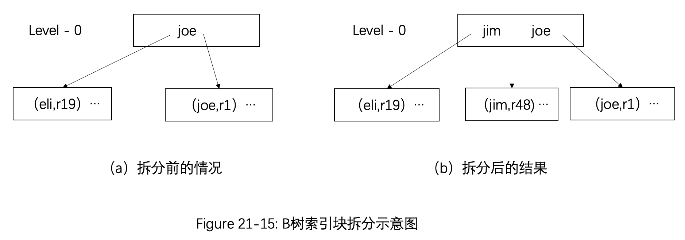
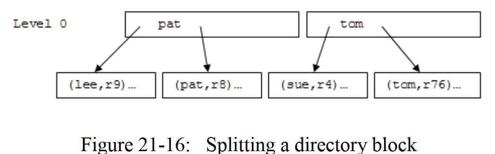
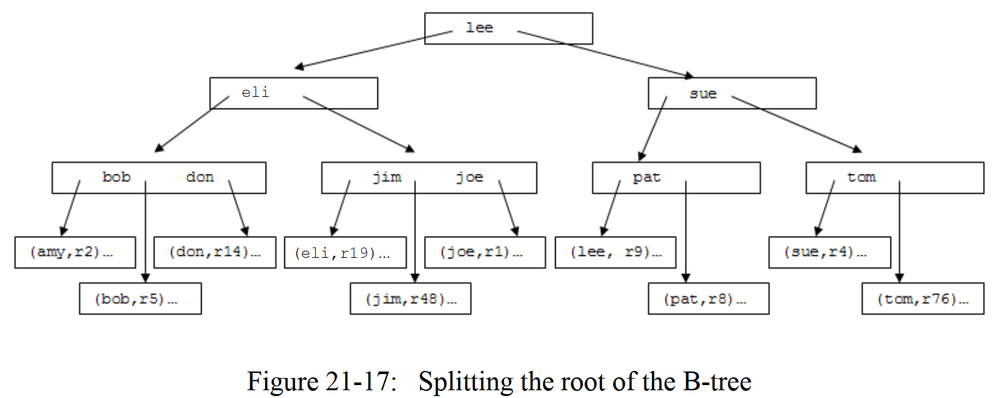
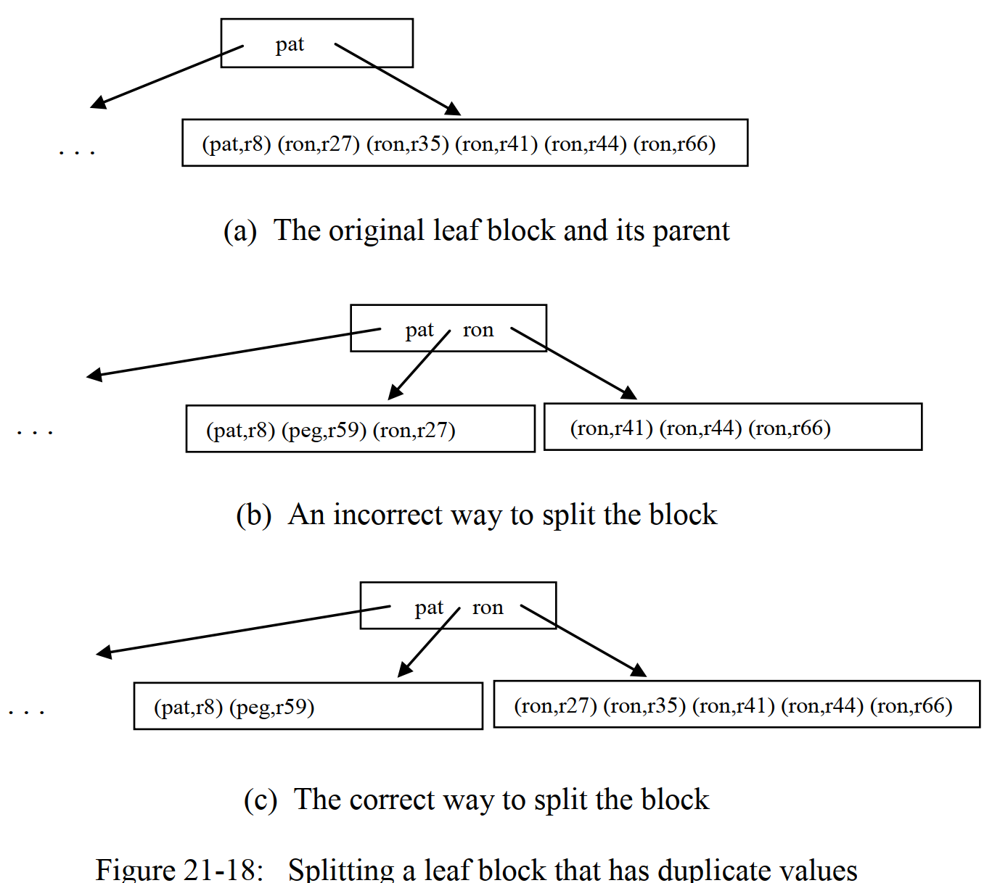

# 第21章—索引及包`simpledb.index`

当我们写下某条SQL语句时，我们可能只对某张表（或某几张表）中的某些特定的记录感兴趣，即那些满足了select谓词逻辑的记录。索引（`index`）存在的目的就是为了允许数据库系统无需遍历搜索整个表记录文件就可以定位到某些特定的记录。在本章中，我们将考虑3种不同的索引实现方式：静态hash索引、可扩展hash索引、以及B-tree（注意，不是叫B减树，就是B树），基于索引带来的优点，随后我们将实现关系代数操作中的`select`和`join`操作。

## 21.1 索引的接口

在第6章中，我们介绍了索引的基本原则，可以归纳为如下：

- 一个索引其实就是一个文件，这个文件中按照一定规则对某个表中的某个（或多个字段）进行了记录；
- 每条索引记录对应一条数据记录；
- 每条索引记录包含了被索引字段的取值，以及这条数据记录的标识符（或者是`rid`）。

当数据库系统想要获取到被索引字段指定取值的那些数据记录时，数据库系统可以通过查看索引，从而得到这些具体的数据记录的标识符，从而快速地在数据记录文件中移动，这将大大地提高查询效率，因为我们可以避免对整个表记录进行遍历。

在本章中，我们将考虑一个数据库系统是如何实现并且实用索引的。在SimpleDB中，我们对索引进行了简化（但这完全不影响功能），即一个索引只能索引一个字段，也就是说，在一条索记录中，只包含2个字段（被索引的字段、以及`rId`）,我们不妨称这两个字段为`dataval`和`datarid`。

> SimpleDB中的每条索引记录包含一个`dataval`字段和一个`datarid`字段：
>
> - `dataval`字段记录的说被索引字段的具体取值；
> - `datarid`字段记录的说对应数据记录的标识符，即`rid`。

在SimpleDB中，一个索引就是一个实现了`Index`接口的对象，`Index`接口如下所示：

```java
public interface Index {
    public void beforeFirst(Constant searchKey) throws IOException;
    public boolean next() throws IOException;
    public RID getDataRid();
    public void insert(Constant dataval,RID datarid) throws IOException;
    public void delete(Constant dataval,RID datarid) throws IOException;
    public void close();
}
```

`Index`接口的大部分方法都和`RecortFile`中的类似，客户端可以在索引文件中的任何位置移动，可以检索到当前位置处的索引记录，也可以插入或者删除索引记录。然而，因为索引都是按照某些明确的方式进行使用，所以`Index`接口中的一些方法相对来说更加明确。

一个SimpleDB的客户端在搜索索引时，总是会提供一个值（我们称这个值为搜索健），并且检索得到那些匹配`dataval`的索引记录。方法`beforeFirst()`正好需要这个搜索键作为参数。后续不断调用`next()`方法，将不断移动索引文件中的“指针”，直到下一条匹配`dataval`的索引记录，如果不存在下一条匹配的索引记录的话，那就返回false。

索引不需要诸如`getInt()`或`getString()`这样的方法，因为所有的索引记录都只含有两个相同的字段，此外，客户端也从不需要检索得到索引记录的`dataval`字段，因为这个字段本身就是客户端给定的参数！因此，唯一需要的检索方法就是`getDataRid()`了，这个方法会返回当前索引记录的`datarid`。

下面的代码片段展示了一个使用索引的例子，代码的功能是搜索所有专业id为10的学生，并且打印出这些学生的姓名。注意，代码使用了一个table scan来检索学生记录，虽然说这个table并不会真正被“scan“；相反，代码调用了table scan对象的`moveToRid()`方法来定位到指定的数据记录处。

```java
SimpleDB.init("studentDB");
Transaction tx = new Transaction();

// open a scan to table
Plan stuPlan = new TablePlan("student", tx);
TableScan stuScan = (TableScan) stuPlan.open();

// open the index on majorid
MetadataMgr mdMgr = SimpleDB.metadataMgr();
Map<String, IndexInfo> indexes = mdMgr.getIndexInfo("student", tx);
IndexInfo ii = indexes.get("majorid");
Index idx = ii.open();

// retrieve all index records which have a dataval of 10
idx.beforeFirst(new IntConstant(10));
while (idx.next()) {
  // use the datarid to go to the corresponding record in table STUDENT
  RID dataRid = idx.getDataRid();
  stuScan.moveToRId(dataRid);
  System.out.println(stuScan.getString("sname"));
}

// close the idx, the table scan, and the transaction
idx.close();
stuScan.close();
tx.commit();
```

索引除了可以查询以外，同样也可以更新或删除。下面的代码片段演示了数据库系统如何处理表的更新，代码主要完成了两个工作：

- 第一个工作就是插入了一条新的数据记录到STUDENT表中；
- 第二个工作则是从STUDENT表中删除一条记录。

注意，在插入新的数据记录的同时，也必须对应插入一条（如果某张表有n个索引，那么是n条）索引记录；当然，删除数据记录的同时也必须删除对应的索引记录。首先，代码会用一个字典获取到STUDENT表的所有索引；在后续每次对索引进行某项操作的过程中，代码都会遍历这个字典。

```java
// suppose the STUDENT(sname varchar(5), majorid int) table already exists
SimpleDB.init("studentDB");
Transaction tx = new Transaction();

// create a table STUDENT(sname, majorid) and a index on STUDENT(majorid)
Planner planner = SimpleDB.planner();
String str = "create table student (sname varchar(5), majorid int)";
planner.executeUpdate(str, tx);
String createIndexStr = "create index stuMajorIdIndex on student(majorid)";
planner.executeUpdate(createIndexStr, tx);

// open a scan to table
Plan stuPlan = new TablePlan("student", tx);
TableScan stuScan = (TableScan) stuPlan.open();

// open the index on MajorId
MetadataMgr mdMgr = SimpleDB.metadataMgr();
Map<String, IndexInfo> indexInfos = mdMgr.getIndexInfo("student", tx);
Map<String, Index> indexes = new HashMap<>();
for (String fldName : indexInfos.keySet()) {
  Index idx = indexInfos.get(fldName).open();
  indexes.put(fldName, idx);
}

// Task 1: insert a two STUDENT record
// insert the data record first
stuScan.insert();
stuScan.setString("sname", "Sam");
stuScan.setInt("majorid", 10);
// then insert a corresponding index record
RID datarid = stuScan.getRID();
for (String fldName : indexes.keySet()) {
  Constant dataval = stuScan.getVal(fldName);
  Index idx = indexes.get(fldName);
  idx.insert(dataval, datarid);
}

// insert the data record first
stuScan.insert();
stuScan.setString("sname", "Andy");
stuScan.setInt("majorid", 10);
// then insert a corresponding index record
for (String fldName : indexes.keySet()) {
  Constant dataval = stuScan.getVal(fldName);
  Index idx = indexes.get(fldName);
  idx.insert(dataval, stuScan.getRID());
}

// Task 2: find and delete Sam's record
stuScan.beforeFirst();
while (stuScan.next()) {
  if (stuScan.getString("sname").equals("Sam")) {
    // delete the corresponding index record(s) first
    RID rid = stuScan.getRID();
    for (String idxFldName : indexes.keySet()) {
      Constant dataval = stuScan.getVal(idxFldName);
      Index idx = indexes.get(idxFldName);
      idx.delete(dataval, rid);
    }

    // then delete the data record
    stuScan.delete();
    break; // todo why break here???
  }
}

// close the resources
stuScan.close();
for (Index idx : indexes.values()) {
  idx.close();
}
tx.commit();
```

上述的两个测试代码实际上根本不知道索引是怎么实现的，唯一的需求就是知道`Index`接口。本章的后续部分将按下述安排展开：

- 21.2—21.4小节将展示3种不同的索引实现——其中前两种基于hash实现，第三种则是基于排序树实现；
- 21.5—21.6小节将考虑数据库中的查询处理器和planner组件如何利用索引使得查询更高效。

## 21.2 静态hash索引

我们从静态hash索引开始讨论起，这应该是实现索引的最简单的方式之一。虽然说这种方式不是最高效的策略，但是它相对来说更好理解并且将相关的概念揭示得更加清晰，因此从静态哈希索引介绍起比较合理。

### 21.2.1 静态hash

静态哈希索引使用一个固定大小为N的容器，容器中的每个元素我们称之为桶（`bucket`），从0到N-1计数。静态哈希索引同样拥有一个哈希函数，这个函数可以将任意一个值（也就是dataval）映射到某个桶中，而对应的索引记录则被放置在这个桶中。虽然说拥有索引记录之间不同的datavals可能会被映射到同一个桶中，但哈希函数总是尽可能地将索引记录相对均匀地分布在各个桶中。

> 静态hash索引将索引记录存放在桶中；拥有相同hash值的索引记录会被存放在同一个桶中。

一个静态hash索引如下工作：

- 为了存储一条索引记录，需要先根据这条索引记录的dataval得到对应的hash值，再将这条索引记录放在对应的桶中；
- 为了找到某条索引记录，我们先得到serach key的hash值，再从对应的桶中查找索引记录；
- 为了删除某条索引记录，我们先找到这条索引记录（按照规则2），再从这个桶中删除这条索引记录。

查找一个静态hash索引的代价与桶的数量N息息相关。如果一个索引有B个块及N个桶，那么每个桶将大概有B/N个块的长度，因此查找一个桶大概需要B/N次块访问（如果不用索引的话就需要B次块访问）。

举例来说，假设我们有一个STUDENT表中关于`sname`的索引，且桶的大小N=3，并且假设hash函数的计算方式为，对于一个字符串s，其对应的hash值为s中排在字母m前的所有字母数量模N（比方说，s=“andy”，排在字母m之前的字母有a、d两个，那么andy对应的hash值为2(mod)3=2）,并假设1个块中刚好可以存放下3条索引记录。图21-4演示了这样的3个索引桶中的情况，在图中，我们用$r_i$来表示第i条学生数据记录的rid。


假设现在我们想要得到所有名叫`sue`的学生的datarid。

- 首先，我们根据上述的hash函数规则，得知`sue`对应的hash值为1（即被放在第1个桶中）；
- 随后，我们需要对第1个桶进行搜索，这需要花费2个块访问。

再假设我们想要得到名叫`ron`的学生的datarid，和上述过程类似，先得到hash值为0，搜索第1个桶只需要1个块访问，最终发现不存在名为`ron`的索引记录，也即不存在名为`ron`的数据记录。

图21-4的这个例子，我们都假设块的大小和桶的数量都很少，这在实际的数据库中不可能是这样的，桶的数量为1024是一个比较合乎实际的取值，这意味着索引记录会相对均匀地分布在1024个桶中，也就意味着：

- 一个大小为1024块的索引文件，大致可以在1个块访问内，搜索到指定的索引记录；
- 一个大小为2048块的索引文件，大致可以在2个块访问内，搜索到指定的索引记录；
- 以此类推...

为了对上述的值有个大致的概念，我们注意到，`SName`表的一条索引记录需要22个字节，假设是纯ascii码，则`varchar(10)`需要14个字节，而`datarid`部分需要8个字节（块号+块上的记录号）。再加上，如果我们用1个字节来表示索引记录的EMPTY / INUSE标记的话，那么1个大小为4K的块内可以存放178条索引记录（4096/23=178），于是1个包含2048个块的索引（约为8MB大小的文件）可以存放356K条索引记录，在2个块访问就可以完成对所有数据记录的搜索！（比原来的1/1000倍的访问时间还要短）

### 21.2.2 实现静态hash

在SimpleDB中，静态hash算法的实现包含在累`HashIndex`中，其代码如下：

```java
public class HashIndex implements Index {
    private static final int NUM_BUCKETS = 100;
    private Constant searchKey;
    private String idxName;  // 索引名
    private Schema schema;   // 索引表对应的schema信息
    private Transaction tx;
    private TableScan tableScan;   // 每个桶对应的tableScan对象

    public HashIndex(String idxName, Schema schema, Transaction tx) {
        this.idxName = idxName;
        this.schema = schema;
        this.tx = tx;
    }

    @Override
    public void beforeFirst(Constant searchKey) throws IOException {
        close();  // 如果有的话，先关闭之前的桶
        this.searchKey = searchKey;
        int bucket = searchKey.hashCode() % NUM_BUCKETS;  // 简单的求模作为hash函数
        String specificBucketTableName = idxName + bucket;
        TableInfo tableInfo = new TableInfo(specificBucketTableName, schema);
        tableScan = new TableScan(tableInfo, tx);
    }

    @Override
    public boolean next() throws IOException {
        while (tableScan.next()) {
            if (tableScan.getVal("dataval").equals(searchKey))
                return true;
        }
        return false;
    }

    @Override
    public RID getDataRid() {
        // 当前索引记录对应的数据记录的RID
        int blockNum = tableScan.getInt("block");
        int recordId = tableScan.getInt("id");
        return new RID(blockNum, recordId);
    }

    @Override
    public void insert(Constant dataval, RID datarid) throws IOException {
        beforeFirst(dataval);
        tableScan.insert();  // 找到索引桶文件的插入位置
        // 填写索引记录中的dataval 和 datarid 部分取值
        tableScan.setVal("dataval", dataval);
        tableScan.setInt("block", datarid.blockNumber());
        tableScan.setInt("id", datarid.id());

    }

    @Override
    public void delete(Constant dataval, RID datarid) throws IOException {
        beforeFirst(dataval);
        while (next()) {
            if (getDataRid().equals(datarid)) {
                tableScan.delete();
                return;
            }
        }
    }

    @Override
    public void close() {
        if (tableScan != null) {
            tableScan.close();
        }
    }

     /**
     * @description: 返回遍历索引的搜索代价
     * @param num_blocks: 索引的总块数
     * @param rbp: 一个块中可以存放多少条索引记录
     * @return: int
     * @author: liuzhian
     * @date: 2020/9/9
     */
    public static int searchCost(int num_blocks,int rbp) {
        return num_blocks / NUM_BUCKETS;
    }
}
```

在上述的实现中，我们将每个桶都保存在一个独立的表中，该表的名词为索引名+桶号，例如，索引`SID_INDEX`的第35个桶对应的表名为`SID_INDEX35`。方法`beforeFirst()`会首先根据searchKey得到对应的hash值，并且打开对应的桶文件。方法`next()`会从当前打开的桶文件的当前位置开始遍历，直到遇到dataval部分为searchKey的索引记录，如果遍历完还没找到满足条件的索引记录，则返回false。其中，每条索引记录的`datarid`字段由2个整型字段组成，即`block`和`id`，表示的是该索引记录对应的数据记录所处在哪个块，以及该块的第几个记录。方法`getDataRid()`会将上述两个整型数包转，返回一个`RID`类型的对象。`Insert()`和`delete()`和普通的`TableScan`中的插入和删除没有什么不同。

除了实现`Index`接口中的方法除外，我们也实现了一个静态方法`searchCost()`，这个方法会被`IndexInfo.blocksAccessed()`调用。在`IndexInfo.blocksAccessed()`方法中，会传递 2个参数给`searchCost()`方法，分别是索引的总块数，以及每个索引块可以存放多少条索引记录（即rbp，record per block）。虽然说，在静态hash的实现中，我们并不需要rbp这个参数，可是客户端可不知道我们是怎么实现索引的，所以这个参数仍需给定。

## 21.3 扩展hash索引

静态索引的搜索代价跟桶的数量是成反比的，如果我们使用更多的桶，那么在一个桶中，对应的索引记录块就会更少，最理想的情况就是拥有足够多的桶，从而使得每个桶中只有一个块。

如果索引始终保持同样的大小，那么计算出这个理想的桶的数量将是一个很简单的事情，可问题就是，在插入新的数据记录的同时，我们也需要插入相应的索引记录，因此，索引的大小不可能保持不变，所以，怎么决定需要用多少个桶呢？假设基于某个索引现有的大小，我们选取了一个桶的数量N，随着数据不断插入到数据库中，每个桶中的块数量将逐渐变得很大；相反，如果最开始选取了一个很大的数值N，那么，当前那些空的桶或者几乎是空的桶会浪费很多磁盘空间。

一个名为**扩展hash索引**的算法可以用来解决这个问题，算法会使用一个很大的桶数量，从而确保每个桶中块的数量不会超过1。扩展hash通过允许多个桶共享一个块来解决磁盘浪费的问题。该算法的想法就是说，即使有很多的索引桶，但是它们可以共享文件块，而这些文件块的数量又是很少的，因此磁盘浪费的情况就可以被解决，这个一个非常聪明的想法。

其实上面谈到的***每个桶中块的数量不会超过1***也不是绝对成立。例如，我们插入了一些数据记录，而这些记录所对应的索引字段取值都是相同的，因此，其对应的hash值也必定是相同的。这也就是说，它们到时候会被放在同一个桶内，因而，随着这样相同dataval的记录逐渐增加，桶中块的数量还是会超过1的。（译者注：但是，但是，但是，请别忘了我们引入索引的初衷，我们就是希望用一个字段来帮助我们更好的定位到数据记录，如果这个字段存在大量的重复值，那我们为什么要选这个字段来创建索引呢？所以上述的问题，好像也不是什么大问题。）

好的，让我们来领略一下扩展hash索引是怎么工作的吧！桶共享块的操作是通过两个文件来实现的：**桶文件**和**桶目录**。桶文件包含了索引记录，而桶目录则负责将桶映射到文件块。桶目录可以视作为一个整型数组Dir，每个位置对应一个桶。如果一条索引记录对应的hash值为b，于是这条索引记录会被存储在这个桶文件的第Dir[b]块中。

举例来说，图21-6展示了STUDENT表在SId字段的扩展hash索引示例，为了更好的可读性，我们假设：

- 一个块中能存放3条索引记录；
- 只用了8个桶；
- hash函数为h(x)=x mod 8；
- STUDENT表包含7条数据记录，各自的ID分别为1，2，4，5，7，8，12


和之前一样，我们用$$r_i$$来表示第i条数据记录。

请注意桶目录Dir是怎样工作的，尤其是，Dir[0]=0以及Dir[4]=0的意思是那些hash值为0（例如$$r_8$$）或者4（例如$$r_4$$或$$r_12$$）的索引记录将被放置在第0块中。类似地，hash值为1，3，5，7的索引记录将被存放在第1个块中，hash值为2和6的索引记录将被存放在第2个块中。因此，由于桶目录的存在，使得我们可以用3个桶来存放8个不同hash值的索引记录，如果是用静态hash算法的话，我们需要使用8个桶。

当然，可以有很多种方式来构建上述的桶目录，使得桶之间可以共享文件块，图21-6中只是展示了一种特殊的实现逻辑，我们将在后面继续讨论。

### 21.3.1 共享索引文件块

在扩展hash算法中，桶目录的长度总是为$$2^M$$，其中整数M被称为**索引的最大深度**，一个长度为$$2^M$$的桶目录可以支持M位长的hash值。在图21-6的例子中，我们使用了M=3，在实际中，M=32是一个比较合理的选择，因为一个integer占32个bit（在Java中）。

最初，一个空的桶文件将只包含1个文件块，并且索引的目录entries都将指向这个文件块。换句话说，这个文件块是被所有的桶共享的，任何新的索引记录都会被插入到这个块中。

桶文件中的每个文件块也有一个**局部深度（local depth）**，一个大小为L的局部深度的意思是说，这个文件块中的所有索引记录，它们对应hash值的最右边L位是相同的。在最初时，第一个文件块的局部深度为0，因为这个块中的索引记录对应的hash值是任意的。

假设一条索引记录正准备被插入，但是由于大小的问题，无法被放置在给定的文件块中，于是必须新开辟一个文件块来存放这条索引记录。在开辟了新的文件块后，之前那些文件块中的所有索引记录和新插入的索引记录将被重新分布，分布的地方就是原来的文件块和新开辟的文件块。由于在原来的文件块中，局部深度为L，那么在重新分布时，我们可以这样做：我们考虑hash值的第（L+1）位，如果索引记录对应hash值的第（L+1）位为0，那就让它们待在原来的块上不动；而那些对应hash值的第（L+1）位为1的索引记录，我们将它们移动到新开辟的块中去。注意，在上述redistribution工作完成后，每个块的局部深度将自增1。

当新开辟了文件块后，桶目录也必须作出相应的调整。假设一条新插入的索引记录对应的hash值为b，也就是说，b是即将插入的桶号。假设b的最右边L位为$$b_L,...,b_2,b_1$$，可以证明，那些最右边L+1位为$$0,b_L,...,b_2,b_1$$的桶，它们对应的索引记录将继续存储在原来的文件块中；而那些最右边L+1位为$$1,b_L,...,b_2,b_1$$的桶，它们对应的索引记录将存储在新开辟的文件块中。

举例来说，假设桶17所对应的文件块B的局部深度为2，因为17的二进制为10001，最右边两位为01，因此，我们知道，桶1，5，9，13，17，21对应的文件块也是B，因为它们的最右边两位也为01。现在假设文件块B满了无法再容纳下一条索引记录了，于是我们开辟一个新的文件块B'，并且将B和B‘的局部深度自增1，即3。随后，我们开始调整桶目录，那些桶号最右边3位为001的桶，它们的索引记录将继续被放置在B中（因此，它们的目录entries保持不变），但是那些桶号最右边3位为101的桶，它们的索引记录将被放在B‘中。因此，桶1，9，17，25...将继续对应存储在块B中，而桶5，13，21，29...将对应存储在B‘中。

下面给出了使用扩展hash索引算法时，插入一条索引记录的算法流程：

```java
【使用扩展hash索引时，插入一条索引记录的算法】
  
1. 得到待插入索引记录datava的hash值b
2. 从桶目录中得到第b个entry的值B=Dir[b],记录第B块的局部深度L
3a. 如果块B可以容纳下当前索引记录，那直接插入到第B块中，插入完成后返回
3b. 如果块B容纳不下当前索引记录：
  - 在桶文件中，开辟一个新的文件块B'
  - 将块B和B‘的局部深度都置为L+1
  - 调整桶目录，让最右边L+1位为1,b_L,...,b_2,b_1的桶号指向第B'块
  - 重新分布块B中的索引记录，对于原来块B中每条索引记录对应的hash值b_i，如果Dir[b_i]=B,那么当前索引记录仍然放在块B中；如果Dir[b_i]!=B,那么将当前索引记录重新分布到块Dir[b_i]上去.
```

再次用示例来说明，考虑一个关于SId字段的可扩展hash索引，和图21-6中不一样，这里，我们使用一个更加真实的假设——桶目录中有2^10个entries（也就是说，索引的最大深度为10），并且hash函数为h(x)=x mod 1024。初始状态下，桶文件只有1个块，并且桶目录中的所有entries都指向这个块，如图21-8（a）所示：

 

假设现在我们要插入student 4，8，1，12，这4个学生记录对应的索引记录。最开始，前3条索引记录都插入到block 0中，在插入第4条索引记录时，需要扩容，怎么扩呢？

- 首先，我们先开辟一个新的块block 1，并且让block 0和block 1的局部深度都自增1；
- 其次，调整桶目录，将桶号最右边二进制位为1对应的entry指向block 1，而将桶号最右边二进制位为0对应的entry指向block 0。结果就是，奇数桶号对应新开辟的块，偶数桶号对应原来的块；
- 随后，对block 0中的索引记录进行重新分布，当前在block 0中的索引记录对应的hash值为4（0100），8（1000），1（0001）。于是，我们查询调整后的桶目录，Dir[4]=0,于是（4，r4）不需要移动，Dir[8]=0,于是（8，r8）也不需要移动，而Dir[1]=1,于是（1，r1）需要移动到block 1上去。这样一来，r4和r8仍然待在block 0 中，而r1分布到了block 1中；
- 最后，再将r12进行插入，其对应的hash值为12，而Dir[12]=0，所以将（12，r12）插入在block 0中。

操作后的情况正如图21-8（b）所示。

继续，如果我们先插入student 5，7，2。前两条记录都可以被插入到block 1 中，而第三条记录将再次引发扩容。具体的操作和上述情况类似，图21-8（c）中展示了操作后的索引记录分布情况。

不管是静态hash算法也好，亦或是扩展hasj算法也罢，都存在一个问题——算法无法保证索引记录被均匀地分布在各个文件块中。当引发一次扩容时，某个块上的所有记录可能被重新分布到同一个块上；如果一个新的记录也刚好对应于这个块，那么将导致这个块继续被扩容。如果一个块的局部深度等于索引的最大深度，那么将无法继续扩容，因此，必须要有一个溢出块（overflow block）来容纳这些索引记录。

### 21.3.2 压缩桶目录

正如上面所说，扩展hash索引算法的问题就在与桶目录的大小。一个最大深度为10的索引将需要一个有2^10个entries的桶目录，如果我们假设一个块的大小为4K的话，那么这个桶目录刚好可以用1个块来存放。然而，如果索引的最大深度为20，那么桶目录就需要1K个块来存放，也就是说，无论索引中具体存放了多少条索引记录，光桶目录就需要占用4MB的磁盘空间，因此我们需要想办法压缩桶目录。

在图21-8中，有一个特别值得关注的点，那就是，如果一个块的局部深度为1，那么每隔1个桶，就会指向这个块。如果一个块的局部深度为2，那么每4个桶就会指向这个块1次。总括起来，如果一个块的局部深度为L，那么每2^L个桶就会指向这个块1次。其中的规律就是，最大的块局部深度决定了桶目录的“周期”。举例来说，因为图21-8（c）中的块局部深度最大为2，索引桶目录中，每2^2=4个桶就会重复一次。

既然存在周期，我们就可以发现，根部不需要把桶目录全部存起来，而只需存储“周期”的那部分Dir就好了。如果块的最大局部深度为d，我们只需要存储2^d个entries。我们称d为**索引的全局深度(global depth)**。

> 桶目录只需要存储2^d个entries，其中d是所以索引文件块中的最大局部深度，也称为索引的全局深度。

桶目录进行压缩后，我们查找索引记录的算法也需要做一定的改变。在得到了待索引字段取值的hash值后，我们只需要拿到这个hash值的最右边b位，用这b位组成的二进制x去，得到Dir[x]，Dir[x]即为这条索引记录所在的文件块号。随后在这个块中找到具体的索引记录即可。

桶目录进行压缩后，插入索引记录的算法流程也要做一定的修改。和搜索时一样，我们也要先获取hash值的最右边b位，然后准备插入这条索引记录到Dir[x]中，如果需要扩容的话，也是一样的进行扩容。只不过，扩容后，索引的全局深度d必须作出相应的修改（自增），也要相应地更新桶目录。

自增索引的全局深度后，桶目录的大小也将翻倍。不过桶目录翻倍的操作就很简单了，因为桶目录是周期性的，我们只要将原来的桶目录copy一遍再和原来的桶目录concat起来，最后和以往一样更新桶目录就ok了。

为了演示算法是如何工作的，我们再次考虑一下图21-8。初始情况下，索引的全局深度为0，也就是说，桶目录就只有一个entry，并指向block 0。插入索引记录4，8，1不会导致全局深度d发生变化。

当插入索引记录12时，我们需要扩容，于是全局深度自增1，并且将桶目录翻倍，此时，桶目录中的entries还是都指向blcok 0。随后，最右边第1位二进制为1的桶将被映射到新开辟的block 1中，也即更新后的桶目录为Dir[0]=0,Dir[1]=1。然后再将记录12插入到block 0中去，因为记录12对应的hash值的最右边1位为0。

后续插入索引记录5，7，2的操作类似，就不再赘述了，读者可以自行验证。

扩展hash索引在一种情况下不是很合适使用——即相同dataval的索引记录存在多条，且这些相同dataval的索引记录无法被放在一个block中。在这种情况下，再怎样扩容也没有用。为例避免这个问题，插入算法必须创建一系列的溢出块来容纳这样的索引记录。

## 21.4 B-树

注意，B-树读作B树或者balanced tree，不是B减树，也不是B杠树！

前两种索引策略是基于hash的，我们现在考虑一种使用排序的策略，基本的想法就是：

> 一个有序的索引，会将所有的索引记录，按照dataval进行排序。

### 21.4.1 如何改进一个字典

如果你考虑一下，排序后的索引文件很像一个字典。 索引文件就是一系列的索引记录，每个索引记录包含一个dataval和一个datarid。 字典是一系列条目，每个条目包含一个单词和一个定义。 使用字典时，我们希望尽快找到单词的定义。 当使用索引文件时，我们希望尽快找到我们的数据值的数据位置。 图21-9总结了这种对应关系。


字典与排序索引之间的紧密对应关系，意味着我们应该能够将对字典的理解应用于实现排序索引的问题，让我们一起来看看。

我桌上的字典大约有1000页。每个页面都有一个标题，列出该页面上的第一个和最后一个单词。当我寻找一个单词时，标题可以帮助我找到正确的页面——我只需要查看标题，而不是页面的内容。找到正确的页面后，便进行搜索以查找单词。

词典中还有一个目录，列出了以每个字母开头的单词所在的页面。但是，我从不使用目录，因为它的信息不是特别有用。我真正想要的是，目录的每一页标题都包含一行，如图21-10（a）所示。该目录是真正的改进，因为我不再需要翻阅所有页面。所有标头信息都放在一个位置。


一千页的词典将具有1,000个标题。 如果我们假设一个页面上可以容纳100个标题，那么目录的长度将为10页。 搜索10个页面比搜索1000个页面要好得多，但是仍然繁琐。 我需要的是可以帮助我搜索目录的内容，如图21-10（b）所示。 “目录指南”列出了目录中每页的标题信息。 因此，该指南将包含10个标题，并且很容易放在单个页面上。

通过此设置，我可以通过只看三页就能在字典中找到任何单词：

- 指南页告诉我目录中要使用的页面；
- 目录页面告诉我要使用哪个单词内容页面；
- 然后我搜索该单词内容页面以查找我的单词。

如果我们使用非常大的词典（例如，超过10,000页）尝试这种策略，那么其目录将超过100页，而指南将超过一页。在这种情况下，我们可以构建“关于指南的指南”页面（二级索引），这将使我们不必搜索指南。在这种情况下，找到一个单词需要查看四个页面。

如果比较图21-10的两个部分，我们会看到目录及其指南具有完全相同的结构。让我们将这些页面称为词典目录。目录是0级目录，指南是1级目录，指南的指南是2级目录，依此类推。

因此，我们改进后的字典具有以下结构：

- 有许多按顺序排列的单词内容页面；
- 每个0级目录页面都包含一些单词内容页面的标题；
- 每个（N + 1）级目录页都包含一些N级目录页的标题；
- 在最高级别只有一个目录页面；

这种结构我们可以描述为一种页面树的结构，最高级别的目录页面作为其根，单词内容页面作为其叶。图21-11描绘了此树。


### 21.4.2 B-树的目录

树型结构字典中的概念同样可以被运用到有序索引中。索引记录将被有序地排列在索引文件中，在第0级的目录中，对于索引文件中的每个块，都会有一条对应的目录记录。这些目录记得的格式为`[dataval,block#]`，其中`dataval`为这个索引文件块中第一条索引记录的dataval，`block#`则是这个索引文件块的块号了。

例如，图21-12（a）展示了STUDENT表关于SName字段的排序索引文件情况。这个索引文件包含3个块，每个块有未知数量的索引记录。图图21-12（b）展示了这个索引文件的第0即目录，目录中包含了3条记录，每条记录对应一个索引文件块。


如果目录中的记录时按照dataval排序的，则可以通过比较相邻目录条目来确定每个索引文件块中值的范围。 例如，图21-12（b）目录中的三个记录表示以下信息：

- 索引文件第0块包含的索引记录，其dataval范围从“ amy”到“ bob”（但不包括）；
- 第1块包含的索引记录，范围从“ bob”到“ max”（但不包括）；
- 第2块包含从“max”到末尾的索引记录。

通常，第一个目录中所记录的dataval并没有很大的用处，通常用特殊值（例如null）代替，表示“从头开始的所有内容”。

目录及索引块通常以树形图来表示，如图21-12（c）所示， 该树是一个关于B树的示例。 请着重注意我们是如何将每个箭头与其前面的dataval配对，从而获取实际目录记录的。 在树的表示中，我们省略了与最左箭头相对应的dataval，因为它不需要。

给定一个dataval v，目录可以被用来定位到datava为v的索引记录，或者是插入一个dataval为v的新索引记录，算法如下所示：

```java
【算法 21-13】: 在树中 查找/插入 索引记录算法流程：

a)查找索引记录
1. 搜索目录文件块，找到这样的一条目录记录，满足v在该目录记录的范围内
2. 对于在步骤1中找到的目录记录，读取其指向的索引文件块中的内容
3. 遍历索引文件块中的内容，找到待搜索的索引记录
  
b)插入索引记录
1. 搜索目录文件块，找到这样的一条目录记录，满足v在该目录记录的范围内
2. 对于在步骤1中找到的目录记录，读取其指向的索引文件块中的内容
3. 在上述索引文件块中插入一条新的索引记录
```

图21-12的B树非常简单，因为索引很小。但 随着它变大，我们将需要处理以下三个复杂问题：

- 目录可能占好几个块；
-  新插入的索引记录可能在待插入的块中无法容纳；
- 可能有许多索引记录具有相同的dataval。

 在以下小节中将我们将来解决这些问题。

### 21.4.3 目录树

假设我们的数据库中已经有许多职员记录了，并且我们创建了关于职员的索引，且索引文件包含8个块。为了说明情况，我们假设一个块中最多可以放下3条目录记录，于是，我们的B树目录将至少需要3个块（为什么？因为每个索引文件块都会对应有一个目录记录，因此有8个目录记录，而每个块可以放3条目录记录，因此就是3个块）。

一种想法可能是将这些目录块放入文件中并顺序扫描。 但是，这样的扫描不是很有效。 一个更好的主意与改进版词典中的处理方式相对应：我们需要一个关于第0级目录的“指南”，也就是第1级目录。

也就是说，我们现在有2级目录块，第0级包含了指向索引块的目录块，而第1级包含了指向第0级目录块的文件块。如图所示，B树可能看起来和图21-14中一样。 我们可以从第1级块开始搜索此索引。 例如，假设搜索关键字为“ jim”。 搜索键位于“ eli”和“ lee”之间，因此我们跟随中间的箭头，并搜索包含“ joe”的0级块。 搜索键小于“ joe”，因此我们跟随左箭头，并查看包含“ eli”的索引块。 “ jim”（如果存在的话）的所有索引记录都将在此块中。


通常，只要一个级别包含多个目录块，我们就可以创建一个更高级别的目录块，这些块指向它的低一级目录块。最终，最高级别将只包含一个块，该块称为B树的**根**。

读到这里，您应该停下来手动检查一下，以确保自己能手动地遍历B树。使用图21-14中的例子，选择几个名称，并确保你可以找到包含每个名称的索引块。你不会也不应该遇到歧义—即给定一个数据值，有且只有一个索引块能包含该dataval的索引记录。

也请注意一下B树中，目录记录的名称分布。例如，第1级节点中的值“ eli”表示“ eli”是中间箭头所指向的子树中第一条索引记录的dataval，且描述的是关于索引块的信息。因此，即使“ eli”没有显式地出现在第0级目录块中，但是它在第1级目录块中有出现。实际上，事实证明，每个索引块的第一个dataval（第一个数据块除外）只会在B树某个级别的某个目录块中仅出现一次。

搜索B树需要在每个级别上访问一个目录块，以及一个索引块。因此，搜索成本等于目录级别数加1。如果你对要了解此公式的实际影响，请回看一下第21.2.1节末尾的示例，其中我们计算了SName字段，使用静态hash索引的搜索成本，当时我们假设一个文件块的大小为4K字节。和之前一样，我门假设每条索引记录将是22个字节，一个块可以存放178条索引记录。每个目录记录为18个字节（dataval为14个字节，块号为4个字节），因此一个块中可以存放227条目录记录。从而：

- 通过2次磁盘访问来搜索的0级B树，最多可以容纳227 * 178 = 40,406个索引记录；
- 通过3次磁盘访问来搜索的1级B树，最多可以容纳227 * 227 * 178 = 9,172,162个索引记录；
- 通过4次磁盘访问来搜索的2级B树，最多可以容纳227 * 227 * 227 * 178 = 2,082,080,774个索引记录。

换句话说，B树索引非常有效。除非表特别特别大，否则任意所需的数据记录都可以通过不超过5次磁盘访问来检索到。如果商业数据库系统仅实现一种索引策略，则几乎可以肯定，它们使用的是B树。

### 21.4.4 插入记录

如果我们想要插入一条新的索引记录，按照算法21-13（b）中的流程，只有1个索引块可供我们来插入索引记录。可问题是，如果这个索引块已经满了，再也无法插入新的索引记录时，该怎么办呢？和扩展hash索引算法中一样，我们可以对这个文件块进行拆分（或者说扩充）。

拆分一个索引块需要有以下的流程：

- 我们先在索引文件中分配一个新的块；
- 我们把dataval比较大的那一半索引记录（译者注：什么叫比较大？对于数值型数据，就是数字的大小；对于字符型的数据，可以是它们之间的字典序），放到新的块中去；
- 我们为新分配的索引块创建一个新的目录记录；
- 我们将这个新的目录记录插入到第0级别的目录块中，这个目录块其实就是指向原来索引块的那个块。

可能上面的概括比较难以理解，我们举例说明，假设在当前，我们所有的所有块都满了，如图21-15（a）所示。为了插入一条新的索引记录`(hal,r_55)`，我们先从B树的第0级别开始访问，可以发现，我们原本想要插入的索引块就是图中的第0块，这个索引块的第一条索引记录是`(eli,r_19)`。



随后，我们对这个块进行拆分，怎么拆分呢？按照上述流程：

- 我们先需要在索引文件中分配一个新的块，我们不妨假设这个新分配到的块为索引文件的block 8;
- 我们随后把block 0中dataval比较大的那一半索引记录，放到block 8中去，我们假设放完后block的第一条记录为`(jim,r48)`；
- 然后我们为新分配的索引块，创建一条新的目录记录`(jim,8)`；
- 最后，我们将这条新的目录记录插入到第0级的目录块中，具体放到哪一块里呢？这个目录块就是指向原来索引块的那个块，也就是`joe`了，注意，插入后，目录块仍然保持有序；

拆分之后的结果如图21-15（b）所示。

在上述情况中，第0级别的目录块尚且还能插入新的目录记录，如果目录块空间不足的话，也是需要拆分的。例如，回到图21-14中的情况，假设我们要插入一条索引记录`(zoe,r56)`，并且将导致最右边的索引块拆分——假设拆分后新分配的块为block 9并且新块的第一条记录的dataval为tom，于是，`(tom,9)`被插入到了第0级目录块的最右边，然而，这将导致目录块也进行拆分，拆分后的结果如图21-16所示。



请注意，目录记录`sue`仍然存在，只是在当前这个级别无法看到，因为它记录的是块上第一条记录的dataval。

事情还没完，新的第0级别的块需要插入一条第1级别的目录记录，因此和之前的插入操作类似，我们要继续往上层的块中插入目录记录，如果需要拆分块的话，也是同样的操作，一直递归到树根。注意，在第1级别中插入的目录记录恰好是`sue`，为什么呢？别忘了，因为目录记录的定义就是，**在该目录记录的子树中，最小的`dataval`**。恰好在level-1中也会需要拆分块，最终插入的结果如图21-17所示。



值得注意的是，拆分一个块将导致原来满的块变为两个half-full的块，通常来说，B树的容量的范围大概为50%到100%。

### 21.4.5 重复的datavals

关于索引，我们知道，只有当索引的字段具有代表性时，它才能发挥应有的作用。什么是具有代表性呢？或者说，怎样的情况是没有代表性的呢？别忘了，我们说，如果索引中存在大量相同dataval的索引记录，那么这个索引的意义可能就不是很大。在某种极端情况下，我们不如直接去遍历数据记录文件；甚至在B树中，如果处理不当，还会引发错误！

请看下面的这个例子，我们再次考虑一下图21-17中的情况，假设存在一些索引记录，它们有相同的dataval，即`ron`。注意到，这些索引记录肯定是在B树的同一个叶子结点中的——即图中所示，第一条索引记录为`pat`的那个block，假设这个block当前的情况如图21-18（a）所示。假设现在我们要插入一条新的索引记录peg，这将引发一次块拆分，图21-18（b）中展示了拆分后的情况：有些dataval为ron的索引记录被分到了一个块中，而另一些同样dataval为ron的索引记录被分到了另外一个块中！



如图21-18（b）所示的B树是显然有问题的，因为`(ron,r27)`这条索引记录绝对不应该存在于以`(pat,r8)`开头的块中。于是我们有下面的规则：

> 当拆分一个块时，我们必须使得dataval相同的索引记录存储在同一个块中。

这个规则其实也很顺其自然，当我们用B树来查找某个具体dataval取值的索引记录时，我们最终总是会被带到一个叶子结点上去，也只会被带到一个叶子结点。因此，如果dataval取值相同的index records被分布在不同的块上，那对不起，有些块上的索引记录就无法被找到。

上述规则其实又启发我们去思考另一个问题——如果拥有相同dataval的索引记录真的就是有那么多，并且又无法全部放在一个block中，那怎么办？像图21-18（c）中的例子是比较理想的情况，5条dataval为ron的索引记录恰好可以存放在一个dataval中。

其实上面指出的问题和下面将要谈的问题本质上是一样的。我们知道，如果一个index block中所有的index records，如果至少有2个不同的dataval取值，那这个index block肯定可以被拆分。问题是，如果这个block中的所有records都有相同的dataval，那怎么办？在这种情况下，再怎么拆分块都是没用的，何况我们根本就拆分不了！对了，借鉴在数据存储时的思路，我们可以用一个（或多个）overflow block来辅助。

举个例子，假设我们从图21-18（c）中的例子开始，准备再插入几个dataval为ron的index records。此时，原来的index block是满的，于是我们创建一个新的index block，并把原来block中除了第一条以外的所有index records都移动到新的block上去，然后把新的block视为overflow block，并将old block指向overflow block。以后插入新的index records时，只往old block中插入。

注意到，以上操作完之后，old block几乎是空的，于是允许我们以后插入新的索引记录（dataval可以是ron，也可以不是ron），如果这个block某天再次被充满了，有2种可能：

- 这个block中存在两个（或两个以上）不同dataval取值的index records，那正常拆分即可；
- 这个block中只存在关于ron的index records，那要再次创建一个新的overflow块，也和之前的操作一样。

一般来说，处于B树中叶子结点的文件块，可以拥有一个链表，这个链表就是由overflow blocks组成的，链表上的每个块一定是满的，而且链表上每个块的每个索引记录一定是有相同的dataval，这个dataval和non-overflow block上第一条index record的dataval也肯定是一样的。

假设我们要搜索一个指定取值的索引记录，我们从B树开始，找到这个特定的叶子结点。如果定位到的叶子结点包含一个溢出块链表，那么我们也要记录链表中所有blocks的所有index records。

虽然说B树中的叶子结点可能包含重复的索引记录，但是，***目录块中是绝对不会出现重复的！目录块中是绝对不会出现重复的！目录块中是绝对不会出现重复的！***如果你看到这不知道为什么，请把这一节重新看几遍，直到你想通了为止。

### 21.4.6 实现B树页

在SimpleDB的代码中，B树相关的代码在包`simpledb.index.btree`中，这个包中包含了4个主要的类:`BTreeIndex, BTreeDir, BTreeLeaf`和`BTreePage`,其中 `BTreeDir`和`BTreeLeaf`分别对应实现了B树中的目录块和索引块，虽然说二者存储的内容不同，但是基本的功能是类似的，比如需要按顺序插入记录、需要被拆分等。`BTreePage`包含了通用的代码，类`BTreeIndex`实现了B树相关的逻辑操作，也即实现了`Index`接口中的方法。

我们从`BTreePage`开始，B树中的页需要满足下面的需求：

- 块中的记录必须是有序的；
- 块中的记录和数据记录不一样，不需要一个永久的id，这也意味着，这些距离可以在页中移动；
- 一个页需要可以将记录拆分到另外一个页上去；
- 每个页需要有个标志flag，目录页用这个flag来标识自身的level，叶子结点用这个flag来指向它的溢出块。

也就是说，你可以将B树页视为保存记录的一个有序列表（与数量记录页不同，后者在概念上保存未排序的记录数组）。 当一条新的记录插入页中时，我们需要确定其在有序列表中的位置，并将其后的记录向右移一个位置以腾出空间。 同样，当删除一条记录时，其后的记录也会向前移动一个位置。 为了实现这种类似于列表的行为，页还必须存储一个整数，这个整数保存了页中当前的记录数。（译者注：实际上，完全可以用链表来避免排序时需要前后移动已有记录问题。）

下面给出`BTreePage`的代码：

```java
public class BTreePage {

  private Block currentBlk;
  private TableInfo tableInfo;
  private Transaction tx;
  private int slotSize;

  public BTreePage(Block currentBlk, TableInfo tableInfo, Transaction tx) {
    this.currentBlk = currentBlk;
    this.tableInfo = tableInfo;
    this.tx = tx;
    this.slotSize = tableInfo.recordLength();
    tx.pin(this.currentBlk);  // 固定块
  }

  public void close() {
    if (currentBlk != null)
      tx.unpin(currentBlk);
    currentBlk = null;
  }

  /**
     * 在当前页中, 找到所有 >= searchKey的records中的第一个。
     * 于是，再调用nextInt()或nextString()就可以得到和searchKey相同的record 的具体取值
     * <p>
     * 和方法 beforeFirst()类似
     *
     * @param searchKey
     * @return
     */
  public int findSlotBefore(Constant searchKey) {
    int slot = 0;
    while (slot < getNumRecords() && getDataVal(slot).compareTo(searchKey) < 0)
      slot++;
    return slot - 1;
  }

  /**
     * 当前块能否再插入一条record
     *
     * @return
     */
  public boolean isFull() {
    return INT_SIZE + INT_SIZE + (getNumRecords() + 1) * slotSize >= BLOCK_SIZE;
  }

  /**
     * 块拆分
     *
     * @param splitPos
     * @param flag
     * @return
     */
  public Block split(int splitPos, int flag) {
    Block newBlk = appendNew(flag);
    BTreePage newPage = new BTreePage(newBlk, tableInfo, tx);
    // 从第splitPos条record开始，把原来block上的内容转移到newBlock上去
    transferRecords(splitPos, newPage);
    newPage.setFlag(flag);  // 标志位保持一致
    newPage.close();
    return newBlk;
  }

  public Block appendNew(int flag) {
    return tx.append(tableInfo.fileName(), new BTreePageFormatter(tableInfo, flag));
  }

  public Constant getDataVal(int slot) {
    return getVal(slot, "dataval"); // 所有索引的字段名就是"dataval"
  }

  /**
     * 获取当前页上的记录数
     *
     * @return
     */
  public int getNumRecords() {
    return tx.getInt(currentBlk, INT_SIZE);
  }

  /**
     * 获取当前页的标志位
     *
     * @return
     */
  public int getFlag() {
    return tx.getInt(currentBlk, 0);
  }

  /**
     * 修改当前页的标志位
     *
     * @return
     */
  public void setFlag(int newValue) {
    tx.setInt(currentBlk, 0, newValue);
  }

  // ===============只被BTreeDir调用的方法===================
  public int getChild(int slot) {
    return getInt(slot, "block");
  }

  public void insertDir(int slot, Constant val, int blkNum) {
    insert(slot);
    setVal(slot, "dataval", val);
    setInt(slot, "block", blkNum);
  }

  // ===============只被BTreeLeaf调用的方法===================
  public RID getDataRID(int slot) {
    return new RID(getInt(slot, "block"),
                   getInt(slot, "id"));
  }

  public void insertLeaf(int slot, Constant val, RID rid) {
    insert(slot);
    setVal(slot, "dataval", val);
    setInt(slot, "block", rid.blockNumber());
    setInt(slot, "id", rid.id());
  }

  /**
     * 删除第slot个record
     * 把slot后面的所有record向前移动1个位置
     *
     * @param slot
     */
  public void delete(int slot) {
    for (int i = slot + 1; i < getNumRecords(); i++) {
      copyRecord(i, i - 1);  // 把第i个record 复制到第i-1个位置
    }
    setNumRecords(getNumRecords() - 1);
  }

  // ===============私有方法===================
  private Constant getVal(int slot, String fieldName) {
    int type = tableInfo.schema().type(fieldName);
    if (type == INTEGER)
      return new IntConstant(getInt(slot, fieldName));
    else
      return new StringConstant(getString(slot, fieldName));
  }

  private void setVal(int slot, String fieldName, Constant newValue) {
    int type = tableInfo.schema().type(fieldName);
    if (type == INTEGER)
      setInt(slot, fieldName, (Integer) newValue.asJavaVal());
    else
      setString(slot, fieldName, (String) newValue.asJavaVal());
  }

  /**
     * 读取第slot个records中，字段fieldName的取值
     *
     * @param slot
     * @param fieldName
     * @return
     */
  private int getInt(int slot, String fieldName) {
    int fldPos = fldPos(slot, fieldName);
    return tx.getInt(currentBlk, fldPos);
  }

  /**
     * 更新 第slot个records中字段fieldName的取值为newValue
     *
     * @param slot
     * @param fieldName
     * @param newValue
     */
  private void setInt(int slot, String fieldName, int newValue) {
    int fldPos = fldPos(slot, fieldName);
    tx.setInt(currentBlk, fldPos, newValue);
  }

  /**
     * 读取第slot个records中，字段fieldName的取值
     *
     * @param slot
     * @param fieldName
     * @return
     */
  private String getString(int slot, String fieldName) {
    int fldPos = fldPos(slot, fieldName);
    return tx.getString(currentBlk, fldPos);
  }

  /**
     * 更新 第slot个records中字段fieldName的取值为newValue
     *
     * @param slot
     * @param fieldName
     * @param newValue
     */
  private void setString(int slot, String fieldName, String newValue) {
    int fldPos = fldPos(slot, fieldName);
    tx.setString(currentBlk, fldPos, newValue);
  }

  /**
     * 得到当前页中，第slot个records中，fieldName字段的position
     *
     * @param slot
     * @param fieldName
     * @return
     */
  private int fldPos(int slot, String fieldName) {
    int fieldOffsetInASingleSlot = tableInfo.offset(fieldName);
    // 第一个INT_SIZE表示当前页中的flag
    // 第二个INT_SIZE表示当前页中的records数
    return INT_SIZE + INT_SIZE + slotSize * slot + fieldOffsetInASingleSlot;
  }

  private void setNumRecords(int num) {
    tx.setInt(currentBlk, INT_SIZE, num);
  }

  /**
     * 将新的记录放置在原来第slot条的位置上
     * <p>
     * 需要将slot后的每条记录都后移一个单位
     * <p>
     * 操作完后，其实还没有具体更新第slot条record的具体取值，需要用户显式地给定
     *
     * @param slot
     */
  private void insert(int slot) {
    for (int i = getNumRecords(); i > slot; i--) {
      copyRecord(i - 1, i);
    }
    setNumRecords(getNumRecords() + 1);
  }

  /**
     * 将第from条record的内容copy到第to条record上去
     *
     * @param from
     * @param to
     */
  private void copyRecord(int from, int to) {
    Schema schema = tableInfo.schema();
    for (String fieldName : schema.fields())
      setVal(to, fieldName, getVal(from, fieldName));
  }

  private void transferRecords(int slot, BTreePage desPage) {
    int destSlot = 0;
    while (slot < getNumRecords()) {
      desPage.insert(destSlot);
      Schema schema = tableInfo.schema();
      for (String fieldName : schema.fields()) {
        desPage.setVal(destSlot, fieldName, getVal(slot, fieldName));
      }
      delete(slot);

      destSlot++;
      slot++;// todo 需要这一句吗
    }
  }
}
```

在上述方法中，最需要值得注意的就是`findSlotBefore()`的防范，这个方法的目的是去找到最小的记录x，使得x<=dataval(x)，注意，在返回的时候，返回的是这条记录的上一条，这和之前的`beforeFirst()`操作有点类似。

现在我们来看下B树中的叶子结点类`BTreeLeaf`是怎么实现的吧：

```java
public class BTreeLeaf {

  private TableInfo tableInfo;
  private String fileName;
  private Constant searchKey;
  private BTreePage contents;
  private int currentSlot;
  private Transaction tx;

  public BTreeLeaf(Block block, TableInfo tableInfo, Constant searchKey, Transaction tx) {
    this.tableInfo = tableInfo;
    this.contents = new BTreePage(block, tableInfo, tx);
    this.fileName = block.filename();
    this.searchKey = searchKey;
    this.currentSlot = this.contents.findSlotBefore(searchKey);
    this.tx = tx;
  }

  public void close() {
    this.contents.close();
  }

  public boolean next() {
    currentSlot++;  // todo: important here
    if (currentSlot >= contents.getNumRecords())
      return tryOverflow();
    else if (contents.getDataVal(currentSlot).equals(searchKey))
      return true;
    else
      return tryOverflow();
  }

  public RID getDataRID() {
    return this.contents.getDataRID(currentSlot);
  }

  public void delete(RID datarid) {
    while (next()) {
      if (getDataRID().equals(datarid)){
      	contents.delete(currentSlot);
	      return;
      }
    }
  }

  public DirEntry insert(RID datarid) {
    currentSlot++;
    contents.insertLeaf(currentSlot, searchKey, datarid);
    if (!contents.isFull()) {
      return null;
    }
    // 如果满了，需要拆分
    Constant firstKey = contents.getDataVal(0);
    Constant lastKey = contents.getDataVal(contents.getNumRecords() - 1);

    if (firstKey.equals(lastKey))  // 如果都是同样dataval的记录
    {
      Block newBlock = contents.split(1, contents.getFlag());
      contents.setFlag(newBlock.number());  // flag标志位设置为新分配块的块号
      return null;
    } else {
      int splitPos = contents.getNumRecords() / 2;  // 从中间位置开始拆分
      Constant splitKey = contents.getDataVal(splitPos);
      if (splitKey.equals(firstKey)) {
        // 中间往右搜索，直到遇到下一个和splitKey不同的dataval
        while (contents.getDataVal(splitPos).equals(splitKey))
          splitPos++;
        splitKey = contents.getDataVal(splitPos);
      } else {
        // 中间往左搜素，直到遇到下一个和splitKey不同的dataval
        while (contents.getDataVal(splitPos - 1).equals(splitKey))
          splitPos--;
      }
      Block newBlock = contents.split(splitPos, -1);  // todo: flag设置为-1,
      return new DirEntry(splitKey, newBlock.number());  // splitKey 和 块号组成一条 目录记录
    }
  }

  private boolean tryOverflow() {
    Constant firstKey = contents.getDataVal(0);
    int flag = contents.getFlag();
    if (!searchKey.equals(firstKey) || flag < 0)
      return false;
    contents.close();
    Block nextBlock = new Block(fileName, flag);  // 下一块
    contents = new BTreePage(nextBlock, tableInfo, tx);
    currentSlot = 0;
    return true;
  }
}
```

构造函数首先会根据指定的块，创建一个B树叶子结点，然后调用`findSlotBefore()`立马定位到第一条记录包含待搜索可以的前面。`next()`方法则会移动到下一条记录，根据是否包含待搜索的key而返回true或false。`tryOverflow()`方法则处理的是我们之前谈到的溢出块问题。

`delete()`和`insert()`方法都假设当前的slot号已经是调用`findSlotBefore()`之后的结果。`delete()`方法会不断地调用`netx()`方法，直到遇到指定的datarid的记录，并把这条记录删除掉。`insert()`方法则会先移动到下一条记录，也就是说，当前位置对应的记录就是dataval大于或等于serach key的第一条。新的记录就插入在这个位置，这也意味着，如果当前的页中包含一条（或多条）dataval为serach key的记录，那新插入的记录将被插入在记录列表的最前面，也即，头插法。`insert()`方法会返回一个`DirEntry`类型的对象（即一个目录记录），如果插入新记录没引发块拆分，那返回的对象肯定是null了；而如果块拆分发生了的话，那么返回一个由`(dataval，块号)`组成的对象，对应下一个新的索引块。

类`BTreeDir`实现了目录块中的一些功能，其代码如下：

```java
public class BTreeDir {
  private TableInfo tableInfo;
  private Transaction tx;
  private String fileName;
  private BTreePage contents;

  public BTreeDir(Block block, TableInfo tableInfo, Transaction tx) {
    this.tableInfo = tableInfo;
    this.tx = tx;
    this.fileName = block.filename();
    this.contents = new BTreePage(block, tableInfo, tx);
  }

  public void close() {
    this.contents.close();
  }

  /**
     * 搜索dataval为searchKey所在索引块的块号
     *
     * @param searchKey
     * @return
     */
  public int search(Constant searchKey) {
    Block childBlock = findChildBlock(searchKey);
    // flag只要不是0，即level-0目录块，则递归搜索
    while (contents.getFlag() > 0) {
      contents.close();
      contents = new BTreePage(childBlock, tableInfo, tx);
      childBlock = findChildBlock(searchKey);
    }
    return childBlock.number();
  }

  /**
     * 创建新的树根
     *
     * @param entry 在树根目录块中插入目录记录时引发的分块
     */
  public void makeNewRoot(DirEntry entry) {
    Constant firstVal = contents.getDataVal(0);
    int level = contents.getFlag();
    Block newBlock = contents.split(0, level);
    DirEntry oldRoot = new DirEntry(firstVal, newBlock.number());
    insertEntry(oldRoot);
    insertEntry(entry);
    contents.setFlag(level + 1);
  }

  /**
     * 插入一条目录记录，如果引发了目录块拆分，则返回一条指向该目录块的目录记录
     * @param entry
     * @return
     */
  public DirEntry insert(DirEntry entry) {
    if (contents.getFlag() == 0)
      return insertEntry(entry);
    Block childBlock = findChildBlock(entry.getDataval());
    BTreeDir child = new BTreeDir(childBlock, tableInfo, tx);
    DirEntry myEntry = child.insert(entry); // 递归
    child.close();
    // 如果子目录块产生了分块，则当前目录需要添加一个对应的目录记录
    return (myEntry != null) ? insertEntry(myEntry) : null;
  }

  // ===============私有方法==================

  /**
     * 插入一条新的目录记录
     *
     * @param entry
     * @return 如果引发了目录块拆分，则返回一个新目录块对应的目录记录
     */
  private DirEntry insertEntry(DirEntry entry) {
    int newSlot = 1 + contents.findSlotBefore(entry.getDataval());
    contents.insertDir(newSlot, entry.getDataval(), entry.getBlockNum());
    if (!contents.isFull())
      return null;
    int level = contents.getFlag();
    int splitPos = contents.getNumRecords() / 2;
    Constant splitDataval = contents.getDataVal(splitPos);
    Block newBlock = contents.split(splitPos, level);
    return new DirEntry(splitDataval, newBlock.number());
  }

  private Block findChildBlock(Constant searchKey) {
    int slotNum = contents.findSlotBefore(searchKey);

    // slotNum有两种情况：
    // 1. 找到了对应searchKey的目录记录
    // 2. 到了第一个大于等于searchKey的目录记录，但还没找到待搜索的目录记录，那肯定要往下搜索
    // 当前slotNum为匹配记录的上一条/第一个大于等于searchKey的目录记录的上一条
    if (contents.getDataVal(slotNum + 1).equals(searchKey))
      slotNum++;
    int blockNum = contents.getChild(slotNum);
    return new Block(fileName, blockNum);
  }
}
```

方法`search()`和`insert()`都会从树根开始，不断搜索search key是否满足，一直访问到level-0目录块。`search()`方法中使用了一个while循环，从树根开始，当level-0级别的块找到时，随后遍历这个页，并找到指定dataval所在索引块的块号。`insert()`方法使用递归的方式在树中操作，该方法的返回值表明了插入是否会引起一个目录块被拆分，页就是说，在递归的途中，如果`child.insert()`的返回值不是null，那么就是产生了目录块拆分，于是应该在当前level添加一条与之对应的目录记录。

当在最高级别的目录块上调用`insert()`方法并返回一个非空的值时，方法`makeNewRoot()`会被调用。由于树根所在的块必定是目录文件的block 0，因此，`makeNewRoot()`中会开辟一个新块，并且将block初始化为新的树根。新的树根里面只有2条目录记录：第1条指向旧的树根块，第2条则是`makeNewRoot()`入参的那个目录记录。注意，别忘记了在所有操作的最后，把树根的level加1。

### 21.4.7 实现B树

现在我们已经知道了B树中的页是如何实现的，页知道了目录页和索引页中操作的不同之处，现在到了发挥它们用处的时候了。类`BTreeIndex`必须实现`Index`接口中的方法，其中构造函数完成了大部分繁重的工作，这部分用文字表述起来简直让人无法理解，所以直接看代码是如何实现的吧，如下：

```java
public class BTreeIndex implements Index {
  private Transaction tx;
  private TableInfo leafTableInfo, dirTableInfo;
  private BTreeLeaf leaf = null;
  private Block rootBlock;

  public BTreeIndex(String idxName, Schema leafSchema, Transaction tx) throws IOException {
    this.tx = tx;

    String leafTableName = idxName + "leaf";
    leafTableInfo = new TableInfo(leafTableName, leafSchema);
    if (tx.size(leafTableInfo.fileName()) == 0) {
      // -1 表示叶子结点
      tx.append(leafTableInfo.fileName(), new BTreePageFormatter(leafTableInfo, -1));
    }

    // 构建目录相关对象
    Schema dirSchema = new Schema();
    // 只用到了leafSchema中的dataval和block字段
    dirSchema.add("block", leafSchema);
    dirSchema.add("dataval", leafSchema);
    String dirTableName = idxName + "dir";
    dirTableInfo = new TableInfo(dirTableName, dirSchema);
    rootBlock = new Block(dirTableInfo.fileName(), 0);  // 树根块
    if (tx.size(dirTableInfo.fileName()) == 0) {
      // 最开始，目录块的level为0
      tx.append(dirTableInfo.fileName(), new BTreePageFormatter(dirTableInfo, 0));
      BTreePage page = new BTreePage(rootBlock, dirTableInfo, tx);
      // 插入一条目录记录，指向leafTable的block 0
      int fieldType = dirSchema.type("dataval");
      Constant minVal = null;
      if (fieldType == INTEGER)
        minVal = new IntConstant(Integer.MIN_VALUE);
      else
        minVal = new StringConstant("");
      page.insertDir(0, minVal, 0);
      page.close();
    }
  }

  @Override
  public void beforeFirst(Constant searchKey) throws IOException {
    close();
    BTreeDir root = new BTreeDir(rootBlock, dirTableInfo, tx);  // 树根
    int leafBlockNum = root.search(searchKey);
    root.close();
    Block leafBlock = new Block(leafTableInfo.fileName(), leafBlockNum);
    leaf = new BTreeLeaf(leafBlock, leafTableInfo, searchKey, tx);
  }

  @Override
  public boolean next() throws IOException {
    return leaf.next();
  }

  @Override
  public RID getDataRid() {
    return leaf.getDataRID();
  }

  @Override
  public void insert(Constant dataval, RID datarid) throws IOException {
    beforeFirst(dataval);
    DirEntry entry = leaf.insert(datarid);
    leaf.close();
    // 如果entry不为null，说明有索引块拆分，从而引发了这条新的目录记录
    if (entry == null)
      return;
    BTreeDir root = new BTreeDir(rootBlock, dirTableInfo, tx);
    // 如果entry2不为null，说明有目录块拆分，从而引发了这条新的目录记录
    // 由于当前的目录块为root，如果有拆分，那需要重新创建树根
    DirEntry entry2 = root.insert(entry);
    if(entry2!=null)
      root.makeNewRoot(entry2);
    root.close();
  }

  @Override
  public void delete(Constant dataval, RID datarid) throws IOException {
    beforeFirst(dataval);
    leaf.delete(datarid);
    leaf.close();
  }

  @Override
  public void close() {
    if (leaf != null)
      leaf.close();
  }

  public static int searchCost(int numblocks, int rpb) {
    return 1 + (int)(Math.log(numblocks) / Math.log(rpb));
  }
}
```

每个`BTreeIndex`对象持有一个`BTreeLeaf`对象，这个`BTreeLeaf`对象会一直跟踪当前的索引记录：这个对象在每次调用`beforeFirst()`的时候都会被重新初始化，具体操作是调用树根目录块的`search()`来初始化此叶子结点对象。请注意，一旦找到了第一条索引记录所在的页面，就不再需要该目录块，因此可以将其关闭。而在后续每次调用`next()`方法之后，`BTreeLeaf`对象都会向后移一个索引记录。

`insert()`方法有两个部分。第一部分是找到合适的插入位置并将索引记录插入其中。如果这次插入引发了一次索引块拆分，则需要插入一条新的目录记录到目录块中，而目录块同样有可能引发块拆分，一直递归到树根，如果树根结点也需要拆分，那就调用`makeNewRoot()`来创建一个新的树根。

`delete()`方法会从叶子中删除索引记录，但不会修改目录。另一个策略是，和在`insert()`方法中类似，也去删除目录中的目录记录，这样的策略将允许目录块在特定的情况下合并。但是，合并块的算法十分复杂，容易出错，并且很少实现。原因是数据库很少变小——即删除操作通常会伴随其他插入操作。因此，我们通常假设记录将很快再次被插入，将暂时为空的目录记录保留在原处也是很有意义的。

## 21.5 index-aware关系代数实现

现在我们已经了解了如何实现一个索引，我们将注意力转向query planner是如何利用索引这个问题。给定一个SQL查询，planner要执行两个任务：1）必须确定适当的查询树，2）必须为树中的每个运算符选择一个plan。对于第19章我们实现的基本planner而言，第二个任务的实现是十分trivial的，因为对于每种关系代数操作，它只知道一个实现。例如，它总是使用SelectPlan来实现select操作，而不管索引是否可用。

为了使query planner能够构建使用索引下的plan，因此，需要有使用索引情况下对应的的关系代数实现。在本节中，我们为select和join运算符开发此类实现。给定一个query后，planner便可以自由地将这些实现合并到plan中。

当然，当一个关系代数运算符有多个对应的实现时，planning的过程将变得更加复杂。query planner必须考虑一个查询对应的多个plan，有些plan使用索引，有些则不使用索引。然后，它必须决定哪个plan是最有效的。此功能称为查询优化，是第24章的主题。

### 21.5.1 基于索引的select实现

SimpleDB中的`IndexSelectPlan`类实现了select操作，该类的构造函数需要接受3个输入参数：

- plan for underlying table，我们在这里假设它就是一个`Plan`对象；
- 描述索引信息的`IndexInfo`类对象；
- 索引字段的取值，是一个`Constant`类对象。

`open()`方法会打开具体的索引文件，并把打开的索引对象和索引字段的取值一并传给`IndexSelectScan`对象，该对象的`blocksAccessed()`, `recordsOutput()`,`distinctValues()` 方法则直接调用的是`IndexInfo`类中相应的方法。`IndexSelectPlan`的代码如下：

```java
public class IndexSelectPlan implements Plan {
    private Plan plan;
    private IndexInfo indexInfo;
    private Constant constantVal;

    public IndexSelectPlan(Plan plan, IndexInfo indexInfo, Constant constantVal) {
        this.plan = plan;
        this.indexInfo = indexInfo;
        this.constantVal = constantVal;
    }

    @Override
    public Scan open() throws IOException {
        TableScan tableScan= (TableScan) plan.open();
        Index idx=indexInfo.open();  // 打开索引
        return new IndexSelectScan(tableScan,idx,constantVal);
    }

    @Override
    public int blockAccessed() {
        return indexInfo.blocksAccessed();
    }

    @Override
    public int recordsOutput() {
        return indexInfo.recordsOutput();
    }

    @Override
    public int distinctValues(String fldName) {
        return indexInfo.distinctValues(fldName);
    }

    @Override
    public Schema schema() {
        return plan.schema();
    }
}
```

`IndexSelectScan`类中做的事情就相对多一些，它接受一个tableScan对象，在没有索引之前，我们查找的操作很简单粗暴，直接遍历所有的数据记录，返回那些和指定字段取值相同的记录就好类。现在，我们还接受一个打开的索引对象和索引字段的取值作为构造函数的参数，在调用`IndexSelectScan`的`next()`方法时，我们会先用索引对象的`next()`方法快速定位到下一条满足条件的数据记录的rid，然后直接将tableScan对象直接移动到数据记录所在的位置。（译者注：打个通俗的比方就是，在没有索引时，就好比你有一本旧字典，这个字典很傻瓜，字典中的词条全是乱序的，你想查找一个词，只能一页一页翻字典，找到你想要查找的词条；有了索引后，就好比这个字典的出版社更新了一个目录，这个目录中的词条信息都是有序的，而且标定了这个词条的具体解释信息在第几页，所以你现在查字典只要稍微遍历一下目录，就可以很快定位到词条的位置了。这里说的目录就好比数据库中的索引，而词条的具体解释就是数据库表中的各个行。）

说了这么多，`IndexSelectScan`的实现如下：

```java
public class IndexSelectScan implements Scan {
    private TableScan tableScan;
    private Index index;
    private Constant constantVal;

    public IndexSelectScan(TableScan tableScan, Index index, Constant constantVal) {
        this.tableScan = tableScan;
        this.index = index;
        this.constantVal = constantVal;
	      beforeFirst();
    }

    @Override
    public void beforeFirst() throws IOException {
        index.beforeFirst(constantVal);
    }

    @Override
    public boolean next() throws IOException {
        boolean exist = index.next();
        if (exist) {
            RID rid = index.getDataRid();
            tableScan.moveToRId(rid);  // 底层表文件直接定位到rid位置的记录
        }
        return exist;
    }

    @Override
    public void close() throws IOException {
        index.close();
        tableScan.close();
    }

    @Override
    public Constant getVal(String fieldName) {
        return tableScan.getVal(fieldName);
    }

    @Override
    public int getInt(String fieldName) {
        return tableScan.getInt(fieldName);
    }

    @Override
    public String getString(String fieldName) {
        return tableScan.getString(fieldName);
    }

    @Override
    public boolean hasField(String fieldName) {
        return tableScan.hasField(fieldName);
    }
}
```

### 21.5.2 基于索引的join实现

索引联结指的是一种特殊的联结实现，这个实现中使用到了索引而言。考虑下面这样一个join操作：

```sql
join(T1, T2, p)
```

这个join的意思是说，返回表T1和表T2满足联结谓词P的所有记录。

我们假设，只有下面的几个条件都满足时，我们才使用基于索引的join：

- the underlying table T2 必须是一个被物理存储的表；
- 谓词p必须是形如A=B的格式，其中A是来自表T1的某个字段名，B是来自表T2的某个字段名（即，谓词必须是一个等值联结）；
- 表T2必须存在一个关于字段B的索引。

在上述的情况下，我们可以先遍历表T1，对于T1中的每个记录，我们得到A字段的取值，并用这个取值来检索B字段索引，并用索引记录对应的rid来直接定位到表T2中的数据记录。

类`IndexJoinPlan`和`IndexJoinScan`的实现分别如下：

```java
public class IndexJoinPlan implements Plan {
    private Plan plan1;
    private Plan plan2;
    private IndexInfo indexInfo;
    private Schema schema;
    private String joinField;

    public IndexJoinPlan(Plan plan1, Plan plan2, IndexInfo indexInfo, Schema schema, String joinField) {
        this.plan1 = plan1;
        this.plan2 = plan2;
        this.indexInfo = indexInfo;
        this.schema = new Schema();
        schema.addAll(plan1.schema());
        schema.addAll(plan2.schema());
        this.joinField = joinField;
    }

    @Override
    public Scan open() throws IOException {
        Scan scan1 = plan1.open();
        // 如果table2不是一张物理存储的表，抛出异常
        TableScan tableScan2 = (TableScan) plan2.open();
        Index idx = indexInfo.open();
        return new IndexJoinScan(scan1, tableScan2, idx, joinField);
    }

    @Override
    public int blockAccessed() {
        // 遍历plan1的块访问次数
        return plan1.blockAccessed() +
                // 对应plan1中的每个块，都需要检索一次索引
                plan1.recordsOutput() * indexInfo.blocksAccessed() +
                recordsOutput() ;  // todo: why here?
    }

    @Override
    public int recordsOutput() {
        return plan1.recordsOutput() * indexInfo.recordsOutput();
    }

    @Override
    public int distinctValues(String fldName) {
        if(plan1.schema().hasFiled(fldName))
            return plan1.distinctValues(fldName);
        else
            return plan2.distinctValues(fldName);
    }

    @Override
    public Schema schema() {
        return schema;
    }
}
```

```java
public class IndexJoinScan implements Scan {
    private Scan scan1;
    private TableScan tableScan2;
    private Index index;
    private String joinedField;

    public IndexJoinScan(Scan scan1, TableScan tableScan2, Index index, String joinedField) throws IOException {
        this.scan1 = scan1;
        this.tableScan2 = tableScan2;
        this.index = index;
        this.joinedField = joinedField;
        beforeFirst();
    }

    @Override
    public void beforeFirst() throws IOException {
        scan1.beforeFirst();
        scan1.next();
        resetIndex();  // 重置table2的索引
    }

    @Override
    public boolean next() throws IOException {
        while (true) {
            if (index.next()) {
                RID rid = index.getDataRid();
                tableScan2.moveToRId(rid);
                return true;
            }
            // scan1中也没有下一条记录了
            if (!scan1.next())
                return false;
            // 如果scan1还有下一条记录，那么将那条记录的索引字段取值，去重置table2的索引
            resetIndex();
        }
    }

    @Override
    public void close() throws IOException {
        scan1.close();
        tableScan2.close();
        index.close();
    }

    @Override
    public Constant getVal(String fieldName) {
        if(tableScan2.hasField(fieldName))
            return tableScan2.getVal(fieldName);
        else
            return scan1.getVal(fieldName);
    }

    @Override
    public int getInt(String fieldName) {
        if(tableScan2.hasField(fieldName))
            return tableScan2.getInt(fieldName);
        else
            return scan1.getInt(fieldName);
    }

    @Override
    public String getString(String fieldName) {
        if(tableScan2.hasField(fieldName))
            return tableScan2.getString(fieldName);
        else
            return scan1.getString(fieldName);
    }

    @Override
    public boolean hasField(String fieldName) {
        return scan1.hasField(fieldName) || tableScan2.hasField(fieldName);
    }

    /**
     * 重置table2的索引。
     * <p>
     * 先获取索引字段在scan1上的当前取值，并用该取值作为索引的取值
     */
    private void resetIndex() throws IOException {
        Constant searchKey = scan1.getVal(joinedField);
        index.beforeFirst(searchKey);
    }
}
```

## 21.6 索引更新

如果一个数据库系统支持索引的话，那么planner必须确保任何时候当一条数据记录发生改变时，其对应的索引记录也必须作出相应的修改。我们直接通过代码来看下planner是怎么完成这个工作的。

包`simpledb.index.planner`中包含了`IndexUpdatePlanner`类，该类实现了`simpledb.planner`包中的`UpdatePlanner`接口。

```java
public class IndexUpdatePlanner implements UpdatePlanner {
    @Override
    public int executeInsert(InsertData insertData, Transaction tx) throws IOException {
        Plan plan = new TablePlan(insertData.getTblName(), tx);
        UpdateScan scan = (UpdateScan) plan.open();
        scan.insert();
        // 先获得当前记录（即待插入记录）的rid
        RID rid = scan.getRID();

        // 先获取到待插入表的所有索引信息
        Map<String, IndexInfo> indexInfoMap =
                SimpleDB.metadataMgr().getIndexInfo(insertData.getTblName(), tx);
        Iterator<Constant> valsIter = insertData.getVals().iterator();
        for (String fieldName : insertData.getFields()) {
            // 插入的新记录各字段的取值
            Constant val = valsIter.next();
            scan.setVal(fieldName, val);

            // 如果存在该字段的索引，则也许作出相应的修改
            IndexInfo indexInfo = indexInfoMap.get(fieldName);
            if (indexInfo != null) {
                Index idx = indexInfo.open();
                idx.insert(val, rid);  // 在索引中插入一条新的索引记录，格式为<dataval,datarid>
                idx.close();
            }
        }
        scan.close();
        return 1;
    }

    @Override
    public int executeDelete(DeleteData deleteData, Transaction tx) throws IOException {
        Plan p = new TablePlan(deleteData.getTblName(), tx);
        p = new SelectPlan(p, deleteData.getPred());
        UpdateScan scan = (UpdateScan) p.open();

        // 先获取到待插入表的所有索引信息
        Map<String, IndexInfo> indexInfoMap =
                SimpleDB.metadataMgr().getIndexInfo(deleteData.getTblName(), tx);
        int cnt = 0;
        while (scan.next()) {
            // 先从该表的所有索引中，删除掉当前rid的索引记录
            RID rid = scan.getRID();
            for (String fieldName : indexInfoMap.keySet()) {
                // 得到当前记录的dataval
                Constant dataval = scan.getVal(fieldName);
                Index idx = indexInfoMap.get(fieldName).open();
                idx.delete(dataval, rid);  // 删除掉索引记录
                idx.close();
            }
            // 再删除掉当前数据记录
            scan.delete();
            cnt++;
        }
        scan.close();
        return cnt;
    }

    @Override
    public int executeModify(ModifyData modifyData, Transaction tx) throws IOException {
        Plan p = new TablePlan(modifyData.getTblName(), tx);
        p = new SelectPlan(p, modifyData.getPred());
        UpdateScan scan = (UpdateScan) p.open();

        // 先获取到待插入表的所有索引信息
        Map<String, IndexInfo> indexInfoMap =
                SimpleDB.metadataMgr().getIndexInfo(modifyData.getTblName(), tx);
        // 目前只支持单字段modify
        IndexInfo indexInfo = indexInfoMap.get(modifyData.getFldName());
        Index index = (indexInfo == null) ? null : indexInfo.open();

        int cnt = 0;
        while (scan.next()) {
            // 首先，更新数据记录
            Constant newVal = modifyData.getNewVal().evaluate(scan);
            Constant oldVal = scan.getVal(modifyData.getFldName());
            scan.setVal(modifyData.getFldName(), newVal);

            // 再更新对应的索引字段
            if (index != null) {
                RID rid = scan.getRID();
                index.delete(oldVal, rid);  // 先删除旧的索引记录，再插入新的索引记录
                index.insert(newVal, rid);
            }
            cnt++;
        }
        if (index != null)
            index.close();
        scan.close();
        return cnt;
    }

    @Override
    public int executeCreateTable(CreateTableData data, Transaction tx) throws IOException {
        SimpleDB.metadataMgr().createTable(data.getTblName(),
                data.getSchema(),
                tx);
        return 0;
    }

    @Override
    public int executeCreateView(CreateViewData data, Transaction tx) throws IOException {
        SimpleDB.metadataMgr().createView(data.getViewName(),
                data.getViewDef(),
                tx);
        return 0;
    }

    @Override
    public int executeCreateIndex(CreateIndexData data, Transaction tx) throws IOException {
        SimpleDB.metadataMgr().createIndex(data.getIndexName(),
                data.getTblName(),
                data.getFldName(),
                tx);
        return 0;
    }
}
```

上述代码中的操作和包`simpledb.planner.BasicUpdatePlaner`中的操作非常类似，只不过在前面3个方法中，添加了对索引的相关操作，这里就不再详细赘述，读者可以参考第19章中的内容进行回顾。

## 21.7 章末总结

- 给定一个表的某个字段A，关于字段A的索引说白了也就是一些记录而已，只不过每一条索引记录都和表T中的一条数据记录对应。每条索引记录包含2个字段：`dataval`和`datarid`，前者是表中某条记录字段A的取值，而后者则是表中某条记录在底层文件中的具体存储位置（文件块号+记录数）；

- 索引可以用来改善select和join操作的效率。在建立好所以之后，我们不再需要对整个数据记录文件进行全盘扫描，而是：

  - 先根据给定的字段取值去扫描索引文件，从而找到每条数据记录的datarid；
  - 再根据数据记录的datarid直接定位到数据记录在文件中的位置。

  通过这种方式，数据库系统可以直接访问到匹配的数据记录，节省了大量的搜索时间；

- 索引的存在使得我们可以只通过较少的磁盘访问就能定位到待匹配的记录。我们讨论了3种不同的实现策略：`静态hash索引`，`可扩展hash索引`和`B树索引`；

- 静态hash索引将索引记录存储在固定数量的桶中，每个桶对应一个文件。hash函数可以将每条索引记录匹配到对应的桶中，为了搜索某条索引记录，我们首先根据dataval经过hash函数得到对应的桶，再在桶中进行遍历，找到所有满足的索引记录。如果一个索引包含B个文件块和N个桶，那么每个桶大概为B/N个块，因此访问一次索引需要大概B/N此块访问；

- 可扩展hash索引允许桶之间共享文件块。 这是对静态哈希的改进，因为它允许很多桶存在，却又无需特别大的索引文件。 块共享通过桶目录(`bucket directory`)来实现的。 可以将桶目录视为一个整型数组Dir； 如果索引记录对应的hash值为b，即储在桶b中，则该记录将存储在桶文件的块Dir [b]中。 当新的索引记录无法容纳在某个块中时，那么这个块将被拆分，并且桶目录会更新，块中的记录也会重新hash。

- B树将索引记录存储在按dataval排序的文件中， B树还具有目录记录文件。 每个索引块都有一个对应的目录记录，这个目录记录包含该块中第一个索引记录的dataval和一个指向该块的指针， 这些目录记录是B树中的第0级目录。 同样地，每个目录块也有自己的目录记录，即B树的下一级目录。 顶层目录由单个块组成，称为B树的根。 给定一个dataval，我们可以通过检查目录树每一级上的一个块来搜索目录； 通过此搜索，我们可以找到包含所需索引记录的索引块。

- B树索引非常有效。 除非其表非常大，否则任何所需的数据记录都可以通过不超过5个磁盘访问来检索。 如果商业数据库系统仅实现一种索引策略，则几乎可以肯定，里面使用了B树。

## 21.8 建议阅读

